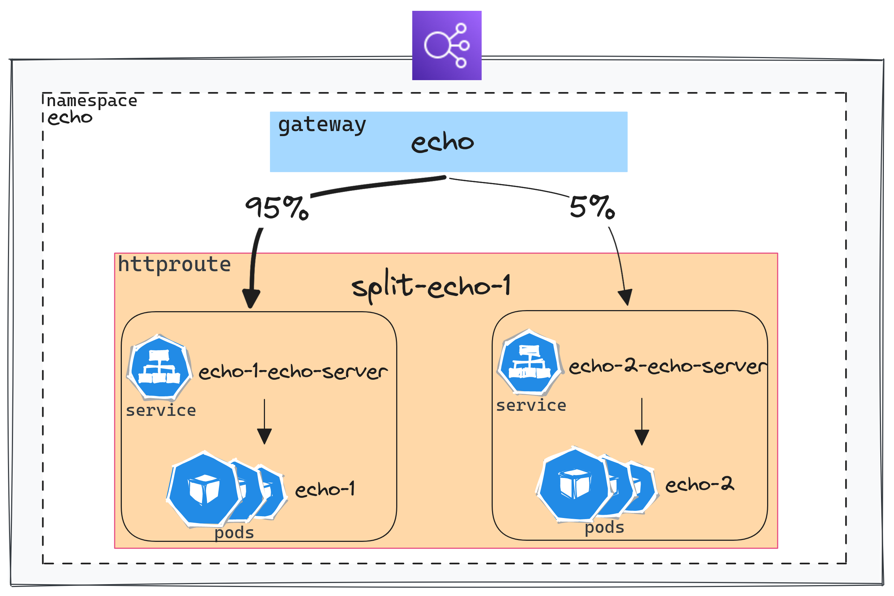

+++
author = "Smaine Kahlouch"
title = "`Gateway API`: Can I replace my Ingress Controller with `Cilium`?"
date = "2023-09-17"
summary = "Cilium supports features typically provided by Ingress controllers through the implementation of the Gateway API standard. An introduction and a practical implementation."
codeMaxLines = 21
usePageBundles = true
toc = true
tags = [
    "kubernetes",
    "infrastructure",
    "network"
]
thumbnail= "thumbnail.png"
+++

When deploying an application on Kubernetes, the next step usually involves making it accessible to users. We commonly use [**Ingress controllers**](https://kubernetes.io/docs/concepts/services-networking/ingress-controllers/), such as Nginx, Haproxy, Traefik, or those from Cloud providers, to direct incoming traffic to the application, manage load balancing, TLS termination, and more.

Then we have to choose from the plethora of [available options](https://kubernetes.io/docs/concepts/services-networking/ingress-controllers/) 🤯. Cilium is, relatively recently, one of them and aims to handle all these networking aspects.

[**Cilium**](https://cilium.io/) is an Open-Source networking and security solution based on eBPF whose adoption is growing rapidly. It's probably the network plugin that provides the most features. We won't cover all of them, but one such feature involves managing incoming traffic using the [**Gateway API**](https://gateway-api.sigs.k8s.io/) (`GAPI`).

## 🎯 Our target

* Understand exactly what the **Gateway API** is and how it represents an evolution from the `Ingress` API.
* Demonstrations of real-world scenarios deployed the GitOps way.
* Current limitations and upcoming developments.

{}
All the steps carried out in this article come from this [**git repository**](https://github.com/Smana/cilium-gateway-api).

I encourage you to explore it, as it goes far beyond the context of this article:

* Installation of an **EKS** cluster with `Cilium` configured with the kube-proxy replacement enbled and a dedicated Daemonset for `Envoy`.
* Proposal of a `Flux` structure with dependency management and a DRY code I think is efficient.
* `Crossplane` and [IRSA](https://docs.aws.amazon.com/eks/latest/userguide/iam-roles-for-service-accounts.html) composition which simplifies the management of IAM permissions for platform components.
* Automated domain names and certificates management with `External-DNS` and `Let's Encrypt`.

The idea being to have everything set up in just a few minutes, with a single command line 🤩.
{}

## ☸ Introduction to Gateway API

As mentioned previously, there are many **Ingress Controllers** options, and each has its own specificities and particular features, sometimes making their use complex. Furthermore, the traditionnal `Ingress` API in Kubernetes has very limited parameters. Some solutions have even created their own [CRDs](https://kubernetes.io/docs/concepts/extend-kubernetes/api-extension/custom-resources/) (Kubernetes Custom Resources) while others use `annotations` to overcome these limitations.

Here comes the **Gateway API**! This is actually a **standard** that allows declaring advanced networking features without requiring specific extensions to the underlying controller. Moreover, since all controllers use the same API, it is possible to switch from one solution to another **without changing the configuration** (The Kubenetes manifests which describe how the incoming traffic should be routed).

Among the concepts that we will explore, GAPI brings a granular authorization model which defines **explicit roles with distinct permissions**. (More information on the GAPI security model [here](https://gateway-api.sigs.k8s.io/concepts/security-model/#roles-and-personas)).

This is worth noting that this project is driven by the [sig-network-kubernetes](https://github.com/kubernetes/community/tree/master/sig-network) working group, and there's a slack [channel](https://kubernetes.slack.com/archives/CR0H13KGA) where you can reach out to them if needed.

Let's see how GAPI is used in practice with Cilium 🚀!

## :ballot_box_with_check: Prerequisites

For the remainder of this article, we assume an EKS cluster has been deployed. If you're not using the [method suggested in the demo repo](https://github.com/Smana/cilium-gateway-api/tree/main/terraform/eks) as the basis for this article, there are a few **points to check** for GAPI to be usable.

ℹ️ The installation method described here is based on `Helm`, all the `values` can be viewed [here](https://github.com/Smana/cilium-gateway-api/blob/main/terraform/eks/helm_values/cilium.yaml).

* **Install** the `CRDs` available in the [Gateway API](https://github.com/kubernetes-sigs/gateway-api/tree/main/config/crd) repository.
{}
If Cilium is set up with `GAPI` support (see below) and the CRDs are missing, it won't start.
In the [demo repo](https://github.com/Smana/cilium-gateway-api), the **GAPI CRDs** are installed once during the cluster creation so that Cilium can start, and then they are managed by Flux.
{}

* **Replace** `kube-proxy` with the network forwarding features provided by Cilium and `eBPF`.

```yaml
kubeProxyReplacement: true
```


* **Enable** Gateway API support.

```yaml
gatewayAPI:
  enabled: true
```

* **Check** the installation
  For that you need to install the command line tool `cilium`. I personnaly use [asdf](https://blog.ogenki.io/post/asdf/asdf/):

  ```console
  asdf plugin-add cilium-cli
  asdf install cilium-cli 0.15.7
  asdf global cilium 0.15.7
  ```

  The following command allows to ensure that all the components are up and running:
  ```console
  cilium status --wait
     /¯¯\
  /¯¯\__/¯¯\    Cilium:             OK
  \__/¯¯\__/    Operator:           OK
  /¯¯\__/¯¯\    Envoy DaemonSet:    OK
  \__/¯¯\__/    Hubble Relay:       disabled
     \__/       ClusterMesh:        disabled

  Deployment             cilium-operator    Desired: 2, Ready: 2/2, Available: 2/2
  DaemonSet              cilium             Desired: 2, Ready: 2/2, Available: 2/2
  DaemonSet              cilium-envoy       Desired: 2, Ready: 2/2, Available: 2/2
  Containers:            cilium             Running: 2
                        cilium-operator    Running: 2
                        cilium-envoy       Running: 2
  Cluster Pods:          33/33 managed by Cilium
  Helm chart version:    1.14.2
  Image versions         cilium             quay.io/cilium/cilium:v1.14.2@sha256:6263f3a3d5d63b267b538298dbeb5ae87da3efacf09a2c620446c873ba807d35: 2
                        cilium-operator    quay.io/cilium/operator-aws:v1.14.2@sha256:8d514a9eaa06b7a704d1ccead8c7e663334975e6584a815efe2b8c15244493f1: 2
                        cilium-envoy       quay.io/cilium/cilium-envoy:v1.25.9-e198a2824d309024cb91fb6a984445e73033291d@sha256:52541e1726041b050c5d475b3c527ca4b8da487a0bbb0309f72247e8127af0ec: 2

  ```

  Finally you can check that the Gateway API support is enabled by running

  ```console
  cilium config view | grep -w "enable-gateway-api"
  enable-gateway-api                                true
  enable-gateway-api-secrets-sync                   true
  ```

  You could also run end to end tests as follows
  ```console
  cilium connectivity test
  ```

  ⚠️ However this command (`connectivity test`) currently throws errors with Envoy as a DaemonSet enabled. ([Github Issue](https://github.com/cilium/cilium/issues/28057)).

  {}
   **as DaemonSet**

  By default, the Cilium agent also runs `Envoy` within the same pod and delegates to it level 7 network operations.
  Since the version `v1.14`, it is possible to deploy Envoy separately, which brings several benefits:

  * If one modifies/restarts a component (whether it's Cilium or Envoy), it doesn't affect the other.
  * Better allocate resources to each component to optimize performance.
  * Limits the attack surface in case of compromise of one of the pods.
  * Envoy logs and Cilium agent logs are not mixed.

  You can use the following command to check that this feature is indeed active:

```console {hl_lines=[5]}
cilium status
    /¯¯\
 /¯¯\__/¯¯\    Cilium:             OK
 \__/¯¯\__/    Operator:           OK
 /¯¯\__/¯¯\    Envoy DaemonSet:    OK
 \__/¯¯\__/    Hubble Relay:       disabled
    \__/       ClusterMesh:        disabled
```

[More info](https://isovalent.com/blog/post/cilium-release-114/#h-envoy-daemonset).

{}

## 🚪 The Entry Point: GatewayClass and Gateway

<center></center>

Once [the conditions](#☑️-prerequisites) are met, we have access to several elements. We can make use of the custom resources defined by the Gateway API CRDs. Moreover, right after installing Cilium, a `GatewayClass` is immediately available.

```console
kubectl get gatewayclasses.gateway.networking.k8s.io
NAME     CONTROLLER                     ACCEPTED   AGE
cilium   io.cilium/gateway-controller   True       7m59s
```

On a Kubernetes cluster, you could configure multiple `GatewayClasses`, thus having the ability to use different implementations. For instance, we can use `Linkerd` by referencing the GatewayClass in the `Gateway` configuration.

The `Gateway` is the resource that allows **triggering** the creation of load balancing components in the Cloud provider.

Here's a simple example:
[apps/base/echo/gateway.yaml](https://github.com/Smana/cilium-gateway-api/blob/main/apps/base/echo/gateway.yaml)

```yaml {hl_lines=[7]}
apiVersion: gateway.networking.k8s.io/v1beta1
kind: Gateway
metadata:
  name: echo-gateway
  namespace: echo
spec:
  gatewayClassName: cilium
  listeners:
    - protocol: HTTP
      port: 80
      name: echo-1-echo-server
      allowedRoutes:
        namespaces:
          from: Same
```

On AWS (EKS), when configuring a `Gateway`, Cilium creates a `Service` of type `LoadBalancer`. Then another controller (The [AWS Load Balancer Controller](https://kubernetes-sigs.github.io/aws-load-balancer-controller)) handles the creation of the Cloud load balancer ([NLB](https://docs.aws.amazon.com/elasticloadbalancing/latest/network/introduction.html))

```console
kubectl get svc -n echo cilium-gateway-echo
NAME                  TYPE           CLUSTER-IP     EXTERNAL-IP                                                                 PORT(S)        AGE
cilium-gateway-echo   LoadBalancer   172.20.19.82   k8s-echo-ciliumga-64708ec85c-fcb7661f1ae4e4a4.elb.eu-west-3.amazonaws.com   80:30395/TCP   2m58s
```

This is worth noting that the load balancer address is also linked to the `Gateway`.

```console
kubectl get gateway -n echo echo
NAME   CLASS    ADDRESS                                                                     PROGRAMMED   AGE
echo   cilium   k8s-echo-ciliumga-64708ec85c-fcb7661f1ae4e4a4.elb.eu-west-3.amazonaws.com   True         16m
```

## :arrow_right_hook: Routing rules: HTTPRoute

### A basic rule
<center></center>

To summarize the above diagram in a few words: </br>
An `HTTPRoute` allows configuring the routing to the service by referencing the Gateway and defining the desired routing parameters.

{}
 **workaround**

As of now, it is not possible to configure the annotations of services generated by the `Gateways` ([Github Issue](https://github.com/cilium/cilium/issues/25357)). A workaround has been proposed to modify the service generated by the `Gateway` as soon as it is created.

Kyverno is a tool that ensures configuration compliance with best practices and security requirements. We are using it here solely for its ability to easily describe a [mutation](https://kyverno.io/docs/writing-policies/mutate/) rule.

[security/mycluster-0/echo-gw-clusterpolicy.yaml](https://github.com/Smana/cilium-gateway-api/blob/main/security/mycluster-0/echo-gw-clusterpolicy.yaml)

```yaml
spec:
  rules:
    - name: mutate-svc-annotations
      match:
        any:
          - resources:
              kinds:
                - Service
              namespaces:
                - echo
              name: cilium-gateway-echo
      mutate:
        patchStrategicMerge:
          metadata:
            annotations:
              external-dns.alpha.kubernetes.io/hostname: echo.${domain_name}
              service.beta.kubernetes.io/aws-load-balancer-scheme: "internet-facing"
              service.beta.kubernetes.io/aws-load-balancer-backend-protocol: tcp
          spec:
            loadBalancerClass: service.k8s.aws/nlb
```

The service `cilium-gateway-echo` will therefore have the AWS controller's annotations added, as well as an annotation allowing for automatic DNS record configuration.

{}


[apps/base/echo/httproute.yaml](https://github.com/Smana/cilium-gateway-api/blob/main/apps/base/echo/httproute.yaml)
```yaml {hl_lines=["7-10"]}
apiVersion: gateway.networking.k8s.io/v1beta1
kind: HTTPRoute
metadata:
  name: echo-1
  namespace: echo
spec:
  parentRefs:
    - name: echo
      namespace: echo
  rules:
    - matches:
        - path:
            type: PathPrefix
            value: /
      backendRefs:
        - name: echo-1-echo-server
          port: 80
```

The example used above is very simple: all requests are forwarded to the `echo-1-echo-server` service.<br>
`parentRefs` indicates which `Gateway` to use and then the routing rules are defined under the `rules` section.

The routing rules could also be based on the `path`.

```yaml
...
spec:
  hostnames:
  - foo.bar.com
  rules:
  - matches:
    - path:
        type: PathPrefix
        value: /login
```

Or based on an HTTP Header

```yaml
...
spec:
  rules:
  - matches:
      headers:
      - name: "version"
        value: "2"
...
```

Let's check if the service is reachable.:

```console
curl -s http://echo.cloud.ogenki.io | jq -rc '.environment.HOSTNAME'
echo-1-echo-server-fd88497d-w6sgn
```

As you can see, the service is exposed in HTTP without a certificate. Let's try to fix that 😉

### Configure a TLS certificate

There are several methods to configure TLS with GAPI. Here, we will use the most common case: HTTPS protocol and TLS termination at the Gateway.

Let's assume we want to configure the domain name `echo.cloud.ogenki.io` used earlier. The configuration is mainly done by configuring the `Gateway`.

[apps/base/echo/tls-gateway.yaml](https://github.com/Smana/cilium-gateway-api/blob/main/apps/base/echo/tls-gateway.yaml)

```yaml {hl_lines=[7,"12-14","18-21"]}
apiVersion: gateway.networking.k8s.io/v1beta1
kind: Gateway
metadata:
  name: echo
  namespace: echo
  annotations:
    cert-manager.io/cluster-issuer: letsencrypt-prod
spec:
  gatewayClassName: cilium
  listeners:
    - name: http
      hostname: "echo.${domain_name}"
      port: 443
      protocol: HTTPS
      allowedRoutes:
        namespaces:
          from: Same
      tls:
        mode: Terminate
        certificateRefs:
          - name: echo-tls
```

The essential point here is the reference to a secret containing the certificate named `echo-tls`. This certificate can be created manually, but for this article, I chose to automate this with **Let's Encrypt** and `cert-manager`.

{}
 **cert-manager**

With `cert-manager`, it's pretty straightforward to automate the creation and update of certificates exposed by the `Gateway`. For this, you need to allow the controller to access [route53](https://aws.amazon.com/route53/) in order to solve a DNS01 challenge (A mechanism that ensures that clients can only request certificates for domains they own).

A [ClusterIssuer](https://github.com/Smana/cilium-gateway-api/blob/main/security/base/cert-manager/cluster-issuer-staging.yaml) resource describes the required configuration to generate certificates with cert-manager.

Next, we just need to add an annotation `cert-manager.io/cluster-issuer` and set the Kubernetes secret where the certificate will be stored.

[More information](https://cert-manager.io/docs/usage/gateway/)

ℹ️ In the demo repo, permissions are assigned using `Crossplane`, which takes care of configuring these IAM perms in AWS.
{}

For routing to work correctly, you also need to attach the `HTTPRoute` to the right Gateway and specify the domain name.

```yaml {hl_lines=["8-11"]}
apiVersion: gateway.networking.k8s.io/v1beta1
kind: HTTPRoute
metadata:
  name: echo-1
  namespace: echo
spec:
  parentRefs:
    - name: echo
      namespace: echo
  hostnames:
    - "echo.${domain_name}"
...
```

After a few seconds the certificate will be created.

```console
kubectl get cert -n echo
NAME       READY   SECRET     AGE
echo-tls   True    echo-tls   43m
```

Finally, we can check that the certificate indeed comes from Let's Encrypt as follows:

```console {hl_lines=[7]}
curl https://echo.cloud.ogenki.io -v 2>&1 | grep -A 6 'Server certificate'
* Server certificate:
*  subject: CN=echo.cloud.ogenki.io
*  start date: Sep 15 14:43:00 2023 GMT
*  expire date: Dec 14 14:42:59 2023 GMT
*  subjectAltName: host "echo.cloud.ogenki.io" matched cert's "echo.cloud.ogenki.io"
*  issuer: C=US; O=Let's Encrypt; CN=R3
*  SSL certificate verify ok.
```

{}
GAPI also allows you to configure **end-to-end TLS**, all the way to the container.
This is done by configuring the Gateway in `Passthrough` mode and using a `TLSRoute` resource.
The certificate must also be carried by the pod that performs the TLS termination.
{}

### Sharing a Gateway accross multiple namespaces

<center></center>

With `GAPI`, you can route traffic across `Namespaces`. This is made possible thanks to distinct resources for each function: A `Gateway` that allows configuring the infrastructure, and the `*Routes`. These routes can be attached to a Gateway located in another namespace. It is thus possible for different teams/projects to share the same infrastructure components.

However, this requires to specify which route is allowed to reference the Gateway. Here we assume that we have a Gateway dedicated to internal tools called `platform`.
By using the `allowedRoutes` parameter, we explicitly specify which namespaces are allowed to be attached to this Gateway.

[infrastructure/base/gapi/platform-gateway.yaml](https://github.com/Smana/cilium-gateway-api/blob/main/infrastructure/base/gapi/platform-gateway.yaml)
```yaml
...
      allowedRoutes:
        namespaces:
          from: Selector
          selector:
            matchExpressions:
              - key: kubernetes.io/metadata.name
                operator: In
                values:
                  - observability
                  - flux-system
      tls:
        mode: Terminate
        certificateRefs:
          - name: platform-tls
```

The `HTTPRoutes` configured in the namespaces `observability` and `flux-system` are attached to this unique `Gateway`.

```yaml
...
spec:
  parentRefs:
    - name: platform
      namespace: infrastructure
```

And therefore, use the same load balancer from the Cloud provider.

```console
NLB_DOMAIN=$(kubectl get svc -n infrastructure cilium-gateway-platform -o jsonpath={.status.loadBalancer.ingress[0].hostname})

dig +short ${NLB_DOMAIN}
13.36.89.108

dig +short grafana-mycluster-0.cloud.ogenki.io
13.36.89.108

dig +short gitops-mycluster-0.cloud.ogenki.io
13.36.89.108
```

{}
🔒 These internal tools shouldn't be exposed on the Internet, but you know: this is just a demo 🙏.
For instance, we could use an internal Gateway (private IP) by playing with the annotations and make use of a private connection system (VPN, tunnels...).
{}

### Traffic splitting

<center></center>

One feature that is commonly brought by Service Meshes is the ability to test an application on a portion of the traffic when a new version is available (A/B testing or Canary deployment).
`GAPI` makes this quite simple by using weights.

Here's an example that forwards 5% of the traffic to the service `echo-2-echo-server`:

[apps/base/echo/httproute-split.yaml](https://github.com/Smana/cilium-gateway-api/blob/main/apps/base/echo/httproute-split.yaml)

```yaml
...
  hostnames:
    - "split-echo.${domain_name}"
  rules:
    - matches:
        - path:
            type: PathPrefix
            value: /
      backendRefs:
        - name: echo-1-echo-server
          port: 80
          weight: 95
        - name: echo-2-echo-server
          port: 80
          weight: 5
```

Let's check that the distribution happens as expected:

[scripts/check-split.sh](https://github.com/Smana/cilium-gateway-api/blob/main/scripts/check-split.sh)

```console
./scripts/check-split.sh https://split-echo.cloud.ogenki.io
Number of requests for echo-1: 95
Number of requests for echo-2: 5
```

### Headers modifications

It is also possible to change HTTP **Headers**: to add, modify, or delete them. These modifications can be applied to either request or response headers through the use of [filters](https://gateway-api.sigs.k8s.io/api-types/httproute#filters-optional) in the `HTTPRoute` manifest.

For instance, we will add a Header to the **request**.

```yaml
apiVersion: gateway.networking.k8s.io/v1beta1
kind: HTTPRoute
metadata:
  name: echo-1
  namespace: echo
spec:
...
  rules:
    - matches:
        - path:
            type: PathPrefix
            value: /req-header-add
      filters:
        - type: RequestHeaderModifier
          requestHeaderModifier:
            add:
              - name: foo
                value: bar
      backendRefs:
        - name: echo-1-echo-server
          port: 80
...
```

This command allows to that the header is indeed added:

```console {hl_lines=[10]}
curl -s https://echo.cloud.ogenki.io/req-header-add | jq '.request.headers'
{
  "host": "echo.cloud.ogenki.io",
  "user-agent": "curl/8.2.1",
  "accept": "*/*",
  "x-forwarded-for": "81.220.234.254",
  "x-forwarded-proto": "https",
  "x-envoy-external-address": "81.220.234.254",
  "x-request-id": "320ba4d2-3bd6-4c2f-8a97-74296a9f3f26",
  "foo": "bar"
}
```

## 🔒 Assign the proper permissions

`GAPI` offers a clear permission-sharing model between the traffic routing infrastructure (managed by cluster administrators) and the applications (managed by developers).

The availability of multiple custom resources allows to use Kubernete's **RBAC** configuration to assign permissions in a declarative way.
I've added [a few examples](https://github.com/Smana/cilium-gateway-api/tree/main/security/base/rbac) which have no effect in my demo cluster but might give you an idea.

The configuration below grants members of the `developers` group the ability to manage `HTTPRoutes` within the echo namespace, while only providing them read access to the `Gateways`.

```yaml
---
apiVersion: rbac.authorization.k8s.io/v1
kind: Role
metadata:
  namespace: echo
  name: gapi-developer
rules:
  - apiGroups: ["gateway.networking.k8s.io"]
    resources: ["httproutes"]
    verbs: ["*"]
  - apiGroups: ["gateway.networking.k8s.io"]
    resources: ["gateways"]
    verbs: ["get", "list"]
---
apiVersion: rbac.authorization.k8s.io/v1
kind: RoleBinding
metadata:
  name: gapi-developer
  namespace: echo
subjects:
  - kind: Group
    name: "developers"
    apiGroup: rbac.authorization.k8s.io
roleRef:
  kind: Role
  name: gapi-developer
  apiGroup: rbac.authorization.k8s.io
```

## 🤔 A somewhat unclear scope at first glance

One could be confused with what's commonly referred to as an `API Gateway`. A section of the [FAQ](https://gateway-api.sigs.k8s.io/faq/) has been created to clarify its difference with the `Gateway API`. Although GAPI offers features typically found in an API Gateway, it primarily serves as a specific implementation for Kubernetes. However, the choice of this name can indeed cause **confusion**.

Moreover please note that this article focuses solely on inbound traffic, termed [north-south](https://gateway-api.sigs.k8s.io/concepts/glossary/#northsouth-traffic), traditionally managed by _Ingress Controllers_. This traffic is actually GAPI's initial scope. A recent initiative named [**GAMMA**](https://gateway-api.sigs.k8s.io/concepts/gamma/) aims to also handle [east-west](https://gateway-api.sigs.k8s.io/concepts/glossary/#eastwest-traffic) routing, which will standardize certain features commonly provided by `Service Meshes` solutions in the future. (See [this article](https://kubernetes.io/blog/2023/08/29/gateway-api-v0-8/) for more details).

## 💭 Final thoughts

To be honest, I've known about the **Gateway API** for some time. Although I've read a few articles, I hadn't truly dived deep. I'd think, "Why bother? My _Ingress Controller_ works, and there's a learning curve with this."

GAPI is on the rise and nearing its GA release. Several [projects](https://gateway-api.sigs.k8s.io/implementations/) have embraced it, and this API for managing traffic within Kubernetes will quickly become the standard.

I must say, configuring GAPI felt intuitive and explicit ❤️. Its security model strikes a balance, empowering developers without compromising security. And the seamless infrastructure management? You can switch between implementations without touching the `*Routes`.

Would I swap my Ingress Controller for `Cilium` today? **Not yet, but it's on the horizon**.

It's worth highlighting Cilium's broad range of capabilities: With Kubernetes surrounded by a plethora of tools, Cilium stands out, promising features like metrics, tracing, service-mesh, security, and, yes, _Ingress Controller_ with GAPI.

However, there are a few challenges to note:

* [TCP and UDP support](https://github.com/cilium/cilium/issues/21929)
* [GRPC support](https://github.com/cilium/cilium/issues/21928)
* The need to use a mutation rule to configure cloud components ([Github Issue](https://github.com/cilium/cilium/issues/25357)).
* Many of the features discussed in this blog are still in the experimental stage. For instance, the [extended functions](https://github.com/cilium/cilium/pull/27472), which have been supported since the most recent release at the time of my writing (`v1.14.2`). I attempted to set up a straightforward HTTP>HTTPS redirect but ran into [this issue](https://github.com/kubernetes-sigs/gateway-api/issues/1185). Consequently, I expect some modifications to the API in the near future.


While I've only scratched the surface of what Cilium's GAPI can offer (honestly, this post is already quite long 😜), I am hopeful that we can consider its use in production soon. But considering the points mentioned earlier, I would advise waiting a bit longer. That said if you want to prepare the future, now's the time 😉!

## 🔖 References

* <https://gateway-api.sigs.k8s.io/>
* <https://docs.cilium.io/en/latest/network/servicemesh/gateway-api/gateway-api/#gs-gateway-api>
* <https://isovalent.com/blog/post/cilium-gateway-api/>
* <https://isovalent.com/blog/post/tutorial-getting-started-with-the-cilium-gateway-api/>
* Isovalent's [labs](https://isovalent.com/resource-library/labs/) are great to start playing with Gateway API and you'll get new badges to add to your collection 😄 