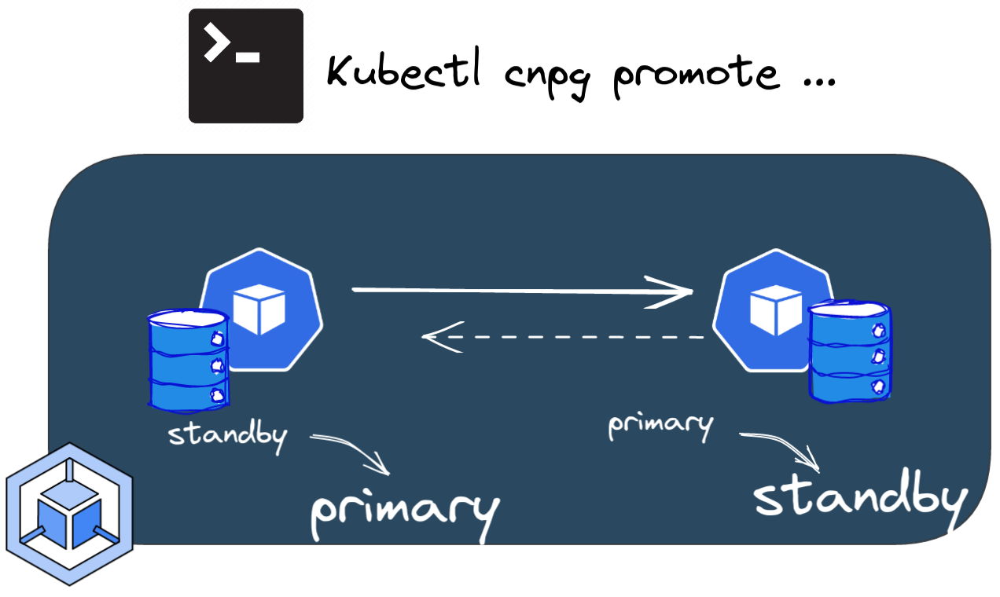
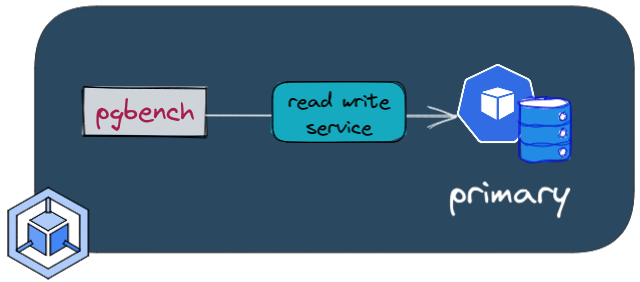
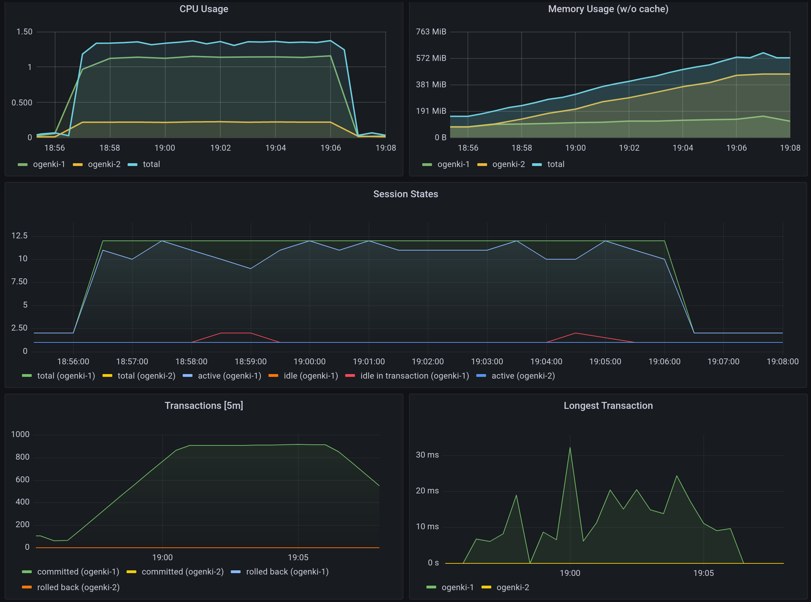

+++
author = "Smaine Kahlouch"
title = '`CloudNativePG`: An easy way to run PostgreSQL on Kubernetes'
date = "2022-10-23"
summary = "**CloudNativePG** is a Kubernetes operator that helps running and operating PostgreSQL databases. Here I'll demonstrate how to create a server, perform backups and recoveries, monitoring and a few tips."
featureImage = "cnpg.png"
codeMaxLines = 20
usePageBundles = true
toc = true
tags = [
    "data"
]
thumbnail= "cloudnativepg.png"
+++

Kubernetes is now the de facto platform for orchestrating stateless applications. Containers that don't store data can be destroyed and easily recreated elsewhere. On the other hand, running persistent applications in an ephemeral environment can be **quite challenging**. There is an increasing number of mature cloud-native database solutions (like CockroachDB, TiDB, K8ssandra, Strimzi...) and there are a lot of **things to consider** when evaluating them:

* How mature is the operator?
* What do the CRDs look like, which options, settings, and status do they expose?
* Which Kubernetes storage APIs does it leverage? (PV/PVC, CSI, snapshots...)
* Can it differentiate HDD and SSD, local/remote storage?
* What happens when something goes wrong: how resilient is the system?
* Backup and recovery: how easy is it to perform and schedule backups?
* What replication and scaling options are available?
* What about connection and concurrency limits, connection pooling, bouncers?
* Observability: what metrics are exposed and how?

I was looking for a solution to host a **PostgreSQL database**. This database is a requirement for a ticket reservation software named [Alf.io](https://alf.io/) that's being used for an upcoming event: [The Kubernetes Community Days France](https://kcdfrance.fr). (By the way you're welcome to submit a talk 👐, the [CFP](https://cfp.kcdfrance.fr) closes soon).

I was specifically looking for a cloud-agnostic solution, with emphasis on ease of use. I was already familiar with several Kubernetes operators, and I ended up evaluating a fairly new kid on the block: [**CloudNativePG**](https://cloudnative-pg.io/).

> CloudNativePG is the Kubernetes operator that covers the full lifecycle of a highly available PostgreSQL database cluster with a primary/standby architecture, using native streaming replication.

It has been created by the company [EnterpriseDB](https://www.enterprisedb.com/), who submitted it to the **CNCF** in order to join the _Sandbox_ projects.

## :bullseye: Our target

I'm going to give you an **introduction** to the main CloudNativePG features.
The plan is to:
- create a PostgreSQL database on a GKE cluster,
- add a standby instance,
- run a few resiliency tests.

We will also see how it behaves in terms of performances and what are the observability tools available.
Finally we'll have a look to the backup/restore methods.


{}
In this article, we will create and update everything manually; but in production, we probably should use a **GitOps** engine, for instance Flux (which has been covered in a [previous article](/post/devflux/)).

If you want to see a complete end-to-end **example**, you can look at the [KCD France infrastructure repository](https://github.com/cncfparis/kcdfrance-gitops).

All the manifests shown in this article can be found in [this repository](https://github.com/Smana/smana.github.io/tree/main/content/resources/cnpg).
{}


## :ballot_box_with_check: Requirements

### :inbox_tray: Tooling

* **gcloud SDK:** we're going to deploy on Google Cloud (specifically, on GKE) and we will need to create a few resources in our GCP project; so we'll need the Google Cloud SDK and CLI. If needed, you can install and configure it using [this documentation](https://cloud.google.com/sdk/docs/install-sdk).

* **kubectl plugin:** to facilitate cluster management, CloudNativePG comes with a handy `kubectl` plugin that gives insights of your PostgreSQL instance and allows to perform some operations.
It can be installed using [krew](https://krew.sigs.k8s.io/) as follows:

```console
kubectl krew install cnpg
```

### ☁️ Create the Google cloud requirements

Before creating our PostgreSQL instance, we need to configure a few things:

* We need a Kubernetes cluster. This article assumes that you have already taken care of provisioning a **GKE** cluster.
* We'll create a bucket to store the backups and [WAL files](https://www.postgresql.org/docs/15/wal-intro.html).
* We'll grant **permissions** to our pods so that they can write to that bucket.

Create the bucket using `gcloud` CLI

```console
gcloud storage buckets create --location=eu --default-storage-class=coldline gs://cnpg-ogenki
Creating gs://cnpg-ogenki/...

gcloud storage buckets describe gs://cnpg-ogenki
[...]
name: cnpg-ogenki
owner:
  entity: project-owners-xxxx0008
projectNumber: 'xxx00008'
rpo: DEFAULT
selfLink: https://www.googleapis.com/storage/v1/b/cnpg-ogenki
storageClass: STANDARD
timeCreated: '2022-10-15T19:27:54.364000+00:00'
updated: '2022-10-15T19:27:54.364000+00:00'
```

Now, we're going to give the permissions to the pods (PostgreSQL server) to write/read from the bucket using [**Workload Identity**](https://cloud.google.com/kubernetes-engine/docs/how-to/workload-identity).

{}
The GKE cluster should be configured with _Workload Identity_ enabled.
Check your cluster configuration, you should get something with this command:

```console
gcloud container clusters describe <cluster_name> --format json --zone <zone> | jq .workloadIdentityConfig
{
  "workloadPool": "{{ gcp_project }}.svc.id.goog"
}
```
{}


Create a Google Cloud service account

```console
gcloud iam service-accounts create cloudnative-pg --project={{ gcp_project }}
Created service account [cloudnative-pg].
```

Assign the `storage.admin` permission to the serviceaccount

```console
gcloud projects add-iam-policy-binding {{ gcp_project }} \
--member "serviceAccount:cloudnative-pg@{{ gcp_project }}.iam.gserviceaccount.com" \
--role "roles/storage.admin"
[...]
- members:
  - serviceAccount:cloudnative-pg@{{ gcp_project }}.iam.gserviceaccount.com
  role: roles/storage.admin
etag: BwXrGA_VRd4=
version: 1
```

Allow the Kubernetes service account to **impersonate the IAM service account**. <br>
:information_source: ensure you use the proper format `serviceAccount:{{ gcp_project }}.svc.id.goog[{{ kubernetes_namespace }}/{{ kubernetes_serviceaccount }}]`

```console
gcloud iam service-accounts add-iam-policy-binding cloudnative-pg@{{ gcp_project }}.iam.gserviceaccount.com \
--role roles/iam.workloadIdentityUser --member "serviceAccount:{{ gcp_project }}.svc.id.goog[demo/ogenki]"
Updated IAM policy for serviceAccount [cloudnative-pg@{{ gcp_project }}.iam.gserviceaccount.com].
bindings:
- members:
  - serviceAccount:{{ gcp_project }}.svc.id.goog[demo/ogenki]
  role: roles/iam.workloadIdentityUser
etag: BwXrGBjt5kQ=
version: 1
```

We're ready to create the Kubernetes resources :muscle:

### :key: Create the users secrets

We need to create the users credentials that will be used during the bootstrap process (more info later on): The superuser and the newly created database owner.

```console
kubectl create secret generic cnpg-mydb-superuser --from-literal=username=postgres --from-literal=password=foobar --namespace demo
secret/cnpg-mydb-superuser created
```

```console
kubectl create secret generic cnpg-mydb-user --from-literal=username=smana --from-literal=password=barbaz --namespace demo
secret/cnpg-mydb-user created
```

## :hammer_and_wrench: Deploy the CloudNativePG operator using Helm

CloudNativePG is basically a Kubernetes operator which comes with some CRDs. We'll use the Helm chart as follows

```console
helm repo add cnpg https://cloudnative-pg.github.io/charts

helm upgrade --install cnpg --namespace cnpg-system \
--create-namespace charts/cloudnative-pg

kubectl get po -n cnpg-system
NAME                    READY   STATUS      RESTARTS   AGE
cnpg-74488f5849-8lhjr   1/1     Running     0          6h17m
```

Here are the _Custom Resource Definitions_ installed along with the operator.

```console
kubectl get crds | grep cnpg.io
backups.postgresql.cnpg.io                       2022-10-08T16:15:14Z
clusters.postgresql.cnpg.io                      2022-10-08T16:15:14Z
poolers.postgresql.cnpg.io                       2022-10-08T16:15:14Z
scheduledbackups.postgresql.cnpg.io              2022-10-08T16:15:14Z
```

For a full list of the available parameters for these CRDs please refer to the [API reference](https://cloudnative-pg.io/documentation/1.18/api_reference/).

<br>

## :rocket: Create a PostgreSQL server

<center></center>

Now we can create our first instance using a **custom resource** `Cluster`. The following definition is pretty simple: we want to start a PostgreSQL server, automatically create a database named `mydb`  and configure the credentials based on the [secrets created previously](#key-create-the-users-secrets).

```yaml
apiVersion: postgresql.cnpg.io/v1
kind: Cluster
metadata:
  name: ogenki
  namespace: demo
spec:
  description: "PostgreSQL Demo Ogenki"
  imageName: ghcr.io/cloudnative-pg/postgresql:14.5
  instances: 1

  bootstrap:
    initdb:
      database: mydb
      owner: smana
      secret:
        name: cnpg-mydb-user

  serviceAccountTemplate:
    metadata:
      annotations:
        iam.gke.io/gcp-service-account: cloudnative-pg@{{ gcp_project }}.iam.gserviceaccount.com

  superuserSecret:
    name: cnpg-mydb-superuser

  storage:
    storageClass: standard
    size: 10Gi

  backup:
    barmanObjectStore:
      destinationPath: "gs://cnpg-ogenki"
      googleCredentials:
        gkeEnvironment: true
    retentionPolicy: "30d"

  resources:
    requests:
      memory: "1Gi"
      cpu: "500m"
    limits:
      memory: "1Gi"
```

Create the namespace where our PostgreSQL instance will be deployed

```console
kubectl create ns demo
namespace/demo created
```

Change the above cluster manifest to fit your needs and apply it.

```console
kubectl apply -f cluster.yaml
cluster.postgresql.cnpg.io/ogenki created
```

You'll notice that the cluster will be in _initializing_ phase. Let's use the **cnpg plugin** for the first time, it will become our best friend to display a neat view of the cluster's status.

```console
kubectl cnpg status ogenki -n demo
Cluster Summary
Primary server is initializing
Name:              ogenki
Namespace:         demo
PostgreSQL Image:  ghcr.io/cloudnative-pg/postgresql:14.5
Primary instance:   (switching to ogenki-1)
Status:            Setting up primary Creating primary instance ogenki-1
Instances:         1
Ready instances:   0

Certificates Status
Certificate Name    Expiration Date                Days Left Until Expiration
----------------    ---------------                --------------------------
ogenki-ca           2023-01-13 20:02:40 +0000 UTC  90.00
ogenki-replication  2023-01-13 20:02:40 +0000 UTC  90.00
ogenki-server       2023-01-13 20:02:40 +0000 UTC  90.00

Continuous Backup status
First Point of Recoverability:  Not Available
No Primary instance found
Streaming Replication status
Not configured

Instances status
Name  Database Size  Current LSN  Replication role  Status  QoS  Manager Version  Node
----  -------------  -----------  ----------------  ------  ---  ---------------  ----
```

The first thing that runs under the hood is the **bootstrap** process. In our example we create a brand new database named `mydb` with an owner `smana` and credentials are retrieved from the secret we created previously.

```yaml
[...]
  bootstrap:
    initdb:
      database: mydb
      owner: smana
      secret:
        name: cnpg-mydb-user
[...]
```

```console
kubectl get po -n demo
NAME                    READY   STATUS      RESTARTS   AGE
ogenki-1                0/1     Running     0          55s
ogenki-1-initdb-q75cz   0/1     Completed   0          2m32s
```

After a few seconds the cluster becomes ready :clap:

```console
kubectl cnpg status ogenki -n demo
Cluster Summary
Name:               ogenki
Namespace:          demo
System ID:          7154833472216277012
PostgreSQL Image:   ghcr.io/cloudnative-pg/postgresql:14.5
Primary instance:   ogenki-1
Status:             Cluster in healthy state
Instances:          1
Ready instances:    1

[...]

Instances status
Name      Database Size  Current LSN  Replication role  Status  QoS        Manager Version  Node
----      -------------  -----------  ----------------  ------  ---        ---------------  ----
ogenki-1  33 MB          0/17079F8    Primary           OK      Burstable  1.18.0           gke-kcdfrance-main-np-0e87115b-xczh
```

{}
There are many ways of bootstrapping your cluster. For instance, restoring a backup into a brand new instance, running SQL scripts...
more info [here](https://cloudnative-pg.io/documentation/1.18/bootstrap/).
{}

## 🩹 Standby instance and resiliency

{}
In traditional PostgreSQL architectures we usually find an additional component to handle high availability (e.g. [Patroni](https://patroni.readthedocs.io/en/latest/)). A specific aspect of the CloudNativePG operator is that it leverages built-in Kubernetes features and relies on a component named [_Postgres instance manager_](https://cloudnative-pg.io/documentation/1.18/instance_manager/).
{}

Add a standby instance by setting the number of replicas to 2.

<center></center>

```console
kubectl edit cluster -n demo ogenki
cluster.postgresql.cnpg.io/ogenki edited
```

```yaml
apiVersion: postgresql.cnpg.io/v1
kind: Cluster
[...]
spec:
  instances: 2
[...]
```

The operator immediately notices the change, adds a standby instance, and starts the replication process.

```console
kubectl cnpg status -n demo ogenki
Cluster Summary
Name:               ogenki
Namespace:          demo
System ID:          7155095145869606932
PostgreSQL Image:   ghcr.io/cloudnative-pg/postgresql:14.5
Primary instance:   ogenki-1
Status:             Creating a new replica Creating replica ogenki-2-join
Instances:          2
Ready instances:    1
Current Write LSN:  0/1707A30 (Timeline: 1 - WAL File: 000000010000000000000001)
```

```console
kubectl get po -n demo
NAME                  READY   STATUS    RESTARTS   AGE
ogenki-1              1/1     Running   0          3m16s
ogenki-2-join-xxrwx   0/1     Pending   0          82s
```

After a while (depending on the amount of data to replicate), the standby instance will be up and running and we can see the replication statistics.

```console
kubectl cnpg status -n demo ogenki
Cluster Summary
Name:               ogenki
Namespace:          demo
System ID:          7155095145869606932
PostgreSQL Image:   ghcr.io/cloudnative-pg/postgresql:14.5
Primary instance:   ogenki-1
Status:             Cluster in healthy state
Instances:          2
Ready instances:    2
Current Write LSN:  0/3000060 (Timeline: 1 - WAL File: 000000010000000000000003)

[...]

Streaming Replication status
Name      Sent LSN   Write LSN  Flush LSN  Replay LSN  Write Lag  Flush Lag  Replay Lag  State      Sync State  Sync Priority
----      --------   ---------  ---------  ----------  ---------  ---------  ----------  -----      ----------  -------------
ogenki-2  0/3000060  0/3000060  0/3000060  0/3000060   00:00:00   00:00:00   00:00:00    streaming  async       0

Instances status
Name      Database Size  Current LSN  Replication role  Status  QoS        Manager Version  Node
----      -------------  -----------  ----------------  ------  ---        ---------------  ----
ogenki-1  33 MB          0/3000060    Primary           OK      Burstable  1.18.0           gke-kcdfrance-main-np-0e87115b-76k7
ogenki-2  33 MB          0/3000060    Standby (async)   OK      Burstable  1.18.0           gke-kcdfrance-main-np-0e87115b-xszc
```


Let's promote the standby instance to primary (perform a **_Switchover_**).

<center></center>

The `cnpg` plugin allows to do this imperatively by running this command

```console
kubectl cnpg promote ogenki ogenki-2 -n demo
Node ogenki-2 in cluster ogenki will be promoted
```

In my case the switchover was really fast. We can check that the instance `ogenki-2` is now the primary and that the replication is done the other way around.

```console
kubectl cnpg status -n demo ogenki
[...]
Status:             Switchover in progress Switching over to ogenki-2
Instances:          2
Ready instances:    1
[...]
Streaming Replication status
Name      Sent LSN   Write LSN  Flush LSN  Replay LSN  Write Lag  Flush Lag  Replay Lag  State      Sync State  Sync Priority
----      --------   ---------  ---------  ----------  ---------  ---------  ----------  -----      ----------  -------------
ogenki-1  0/4004CA0  0/4004CA0  0/4004CA0  0/4004CA0   00:00:00   00:00:00   00:00:00    streaming  async       0

Instances status
Name      Database Size  Current LSN  Replication role  Status  QoS        Manager Version  Node
----      -------------  -----------  ----------------  ------  ---        ---------------  ----
ogenki-2  33 MB          0/4004CA0    Primary           OK      Burstable  1.18.0           gke-kcdfrance-main-np-0e87115b-xszc
ogenki-1  33 MB          0/4004CA0    Standby (async)   OK      Burstable  1.18.0           gke-kcdfrance-main-np-0e87115b-76k7
```

Now let's simulate a **_Failover_** by deleting the primary pod

<center></center>

```console
kubectl delete po -n demo --grace-period 0 --force ogenki-2
Warning: Immediate deletion does not wait for confirmation that the running resource has been terminated. The resource may continue to run on the cluster indefinitely.
pod "ogenki-2" force deleted
```

```console
Cluster Summary
Name:               ogenki
Namespace:          demo
System ID:          7155095145869606932
PostgreSQL Image:   ghcr.io/cloudnative-pg/postgresql:14.5
Primary instance:   ogenki-1
Status:             Failing over Failing over from ogenki-2 to ogenki-1
Instances:          2
Ready instances:    1
Current Write LSN:  0/4005D98 (Timeline: 3 - WAL File: 000000030000000000000004)

[...]
Instances status
Name      Database Size  Current LSN  Replication role  Status             QoS        Manager Version  Node
----      -------------  -----------  ----------------  ------             ---        ---------------  ----
ogenki-1  33 MB          0/40078D8    Primary           OK                 Burstable  1.18.0           gke-kcdfrance-main-np-0e87115b-76k7
ogenki-2  -              -            -                 pod not available  Burstable  -                gke-kcdfrance-main-np-0e87115b-xszc
```

After a few seconds, the cluster becomes healthy again

```console
kubectl get cluster -n demo
NAME     AGE   INSTANCES   READY   STATUS                     PRIMARY
ogenki   13m   2           2       Cluster in healthy state   ogenki-1
```

So far so good, we've been able to test the high availability and the experience is pretty smooth 😎.

## 👁️ Monitoring

We're going to use [Prometheus Stack](https://github.com/prometheus-operator/kube-prometheus). We won't cover its installation in this article. If you want to see how to install it "the GitOps way" you can check [this example](https://github.com/Smana/kcdfrance-gitops/tree/main/observability).

To scrape our instance's metrics, we need to create a _PodMonitor_.
```yaml
apiVersion: monitoring.coreos.com/v1
kind: PodMonitor
metadata:
  labels:
    prometheus-instance: main
  name: cnpg-ogenki
  namespace: demo
spec:
  namespaceSelector:
    matchNames:
    - demo
  podMetricsEndpoints:
  - port: metrics
  selector:
    matchLabels:
      postgresql: ogenki
```

We can then add the Grafana dashboard available [here](https://github.com/EnterpriseDB/cnp-sandbox/blob/main/charts/cnp-sandbox/dashboard.json).


Finally, you may want to configure alerts and you can create a _PrometheusRule_ using [these rules](https://github.com/EnterpriseDB/cnp-sandbox/blob/main/charts/cnp-sandbox/alerts.yaml).

## :fire: Performances and benchmark

{}
**Update**: It is now possible to use the [cnpg plugin](https://cloudnative-pg.io/documentation/1.18/benchmarking/#pgbench). The following method is deprecated, I'll update it asap.
{}

This is worth running a **performance test** in order to know the limits of your current server and keep a baseline for further improvements.

{}
When it comes to performance there are many improvement areas we can work on. It mostly depends on the **target** we want to achieve. Indeed we don't want to waste time and money for performance we'll likely never need.

Here are the main things to look at:

* PostgreSQL [configuration tuning](https://wiki.postgresql.org/wiki/Tuning_Your_PostgreSQL_Server)
* **Compute** resources (cpu and memory)
* **Disk** type IOPS, local storage ([local-volume-provisioner](https://docs.pingcap.com/tidb-in-kubernetes/stable/deploy-on-gcp-gke#use-local-storage)),
* Dedicated disks for **WAL** and **PG_DATA**
* Connection **pooling** [PGBouncer](https://cloudnative-pg.io/documentation/1.18/connection_pooling/#connection-pooling). The CloudNativePG comes with a CRD `Pooler` to handle that.
* Database optimization, analyzing the query plans using [**explain**](https://www.postgresql.org/docs/current/performance-tips.html), use the extension `pg_stat_statement` ...
{}

<center></center>


First of all we'll add labels to the nodes in order to run the `pgbench` command on different machines than the ones hosting the database.

```console
PG_NODE=$(kubectl get po -n demo -l postgresql=ogenki,role=primary -o jsonpath={.items[0].spec.nodeName})
kubectl label node ${PG_NODE} workload=postgresql
node/gke-kcdfrance-main-np-0e87115b-vlzm labeled


# Choose any other node different than the ${PG_NODE}
kubectl label node gke-kcdfrance-main-np-0e87115b-p5d7 workload=pgbench
node/gke-kcdfrance-main-np-0e87115b-p5d7 labeled
```

And we'll deploy the Helm chart as follows

```console
git clone git@github.com:EnterpriseDB/cnp-bench.git
cd cnp-bench

cat > pgbench-benchmark/myvalues.yaml <<EOF
cnp:
  existingCluster: true
  existingHost:  ogenki-rw
  existingCredentials: cnpg-mydb-superuser
  existingDatabase: mydb

pgbench:
  # Node where to run pgbench
  nodeSelector:
    workload: pgbench
  initialize: true
  scaleFactor: 1
  time: 600
  clients: 10
  jobs: 1
  skipVacuum: false
  reportLatencies: false
EOF

helm upgrade --install -n demo pgbench -f pgbench-benchmark/myvalues.yaml  pgbench-benchmark/
```
{}
There are different services depending on wether you want to read and **write** or **read only**.

```console
kubectl get ep -n demo
NAME        ENDPOINTS                          AGE
ogenki-any   10.64.1.136:5432,10.64.1.3:5432    15d
ogenki-r     10.64.1.136:5432,10.64.1.3:5432    15d
ogenki-ro    10.64.1.136:5432                   15d
ogenki-rw    10.64.1.3:5432                     15d
```

{}



```console
kubectl logs -n demo job/pgbench-pgbench-benchmark -f
Defaulted container "pgbench" out of: pgbench, wait-for-cnp (init), pgbench-init (init)
pgbench (14.1, server 14.5 (Debian 14.5-2.pgdg110+2))
starting vacuum...end.
transaction type: <builtin: TPC-B (sort of)>
scaling factor: 1
query mode: simple
number of clients: 10
number of threads: 1
duration: 600 s
number of transactions actually processed: 545187
latency average = 11.004 ms
initial connection time = 111.585 ms
tps = 908.782896 (without initial connection time)
```

## 💽 Backup and Restore

{}
Writing backups and WAL files to the GCP bucket is possible because we gave the permissions using an annotation in the pod's serviceaccount

```yaml
  serviceAccountTemplate:
    metadata:
      annotations:
        iam.gke.io/gcp-service-account: cloudnative-pg@{{ gcp_project }}.iam.gserviceaccount.com
```
{}

We can first trigger an **on-demand** backup using the custom resource `Backup`

```yaml
apiVersion: postgresql.cnpg.io/v1
kind: Backup
metadata:
  name: ogenki-now
  namespace: demo
spec:
  cluster:
    name: ogenki
```

```console
kubectl apply -f backup.yaml
backup.postgresql.cnpg.io/ogenki-now created

kubectl get backup -n demo
NAME                      AGE   CLUSTER   PHASE       ERROR
ogenki-now                36s   ogenki    completed
```

If you take a look at the Google Cloud Storage content you'll see an new directory that stores the **base backups**

```console
gcloud storage ls gs://cnpg-ogenki/ogenki/base
gs://cnpg-ogenki/ogenki/base/20221023T130327/
```

But most of the time we would want to have a **scheduled backup**. So let's configure a daily schedule.

```yaml
apiVersion: postgresql.cnpg.io/v1
kind: ScheduledBackup
metadata:
  name: ogenki-daily
  namespace: demo
spec:
  backupOwnerReference: self
  cluster:
    name: ogenki
  schedule: 0 0 0 * * *
```

Recoveries can only be done on new instances. Here we'll use the backup we've created previously to bootstrap a new instance with it.

```console
gcloud iam service-accounts add-iam-policy-binding cloudnative-pg@{{ gcp_project }}.iam.gserviceaccount.com \
--role roles/iam.workloadIdentityUser --member "serviceAccount:{{ gcp_project }}.svc.id.goog[demo/ogenki-restore]"
Updated IAM policy for serviceAccount [cloudnative-pg@{{ gcp_project }}.iam.gserviceaccount.com].
bindings:
- members:
  - serviceAccount:{{ gcp_project }}.svc.id.goog[demo/ogenki-restore]
  - serviceAccount:{{ gcp_project }}.svc.id.goog[demo/ogenki]
  role: roles/iam.workloadIdentityUser
etag: BwXrs755FPA=
version: 1
```

```yaml
apiVersion: postgresql.cnpg.io/v1
kind: Cluster
metadata:
  name: ogenki-restore
  namespace: demo
spec:
  instances: 1

  serviceAccountTemplate:
    metadata:
      annotations:
        iam.gke.io/gcp-service-account: cloudnative-pg@{{ gcp_project }}.iam.gserviceaccount.com

  storage:
    storageClass: standard
    size: 10Gi

  resources:
    requests:
      memory: "1Gi"
      cpu: "500m"
    limits:
      memory: "1Gi"

  superuserSecret:
    name: cnpg-mydb-superuser

  bootstrap:
    recovery:
      backup:
        name: ogenki-now
```

We can notice a first pod that performs the full recovery from the backup.

```console
kubectl get po -n demo
NAME                                   READY   STATUS      RESTARTS      AGE
ogenki-1                               1/1     Running     1 (18h ago)   18h
ogenki-2                               1/1     Running     0             18h
ogenki-restore-1                       0/1     Init:0/1    0             0s
ogenki-restore-1-full-recovery-5p4ct   0/1     Completed   0             51s
```

Then the new cluster becomes ready.

```console
kubectl get cluster -n demo
NAME             AGE   INSTANCES   READY   STATUS                     PRIMARY
ogenki           18h   2           2       Cluster in healthy state   ogenki-1
ogenki-restore   80s   1           1       Cluster in healthy state   ogenki-restore-1
```

## :broom: Cleanup

Delete the cluster

```console
kubectl delete cluster -n demo ogenki ogenki-restore
cluster.postgresql.cnpg.io "ogenki" deleted
cluster.postgresql.cnpg.io "ogenki-restore" deleted
```

Cleanup the IAM serviceaccount

```console
gcloud iam service-accounts delete cloudnative-pg@{{ gcp_project }}.iam.gserviceaccount.com
You are about to delete service account [cloudnative-pg@{{ gcp_project }}.iam.gserviceaccount.com].

Do you want to continue (Y/n)?  y

deleted service account [cloudnative-pg@{{ gcp_project }}.iam.gserviceaccount.com]
```

## 💭 final thoughts

I just discovered CloudNativePG and I only scratched the surface but one thing for sure is that managing PostgreSQL is really made **easy**.
However choosing a database solution is a **tough decision**. Depending on the use case, the company constraints, the criticity of the application and the ops teams skills, there are plenty of options: Cloud managed databases, traditional bare metal installations, building the architecture with an Infrastructure As Code tool...

We may also consider using Crossplane and composition to give an opinionated way of declaring managed databases in cloud providers but that requires more configuration.

CloudNativePG shines by its simplicity: it is easy to run and easy to understand. Furthermore the **documentation** is excellent (one of the best I ever seen!), especially for such a young open source project (Hopefuly this will help in the CNCF Sandbox acceptance process 🤞).

If you want to learn more about it, there was a presentation on about it at [KubeCon NA 2022](https://kccncna2022.sched.com/event/182GB/data-on-kubernetes-deploying-and-running-postgresql-and-patterns-for-databases-in-a-kubernetes-cluster-chris-milsted-ondat-gabriele-bartolini-edb).
