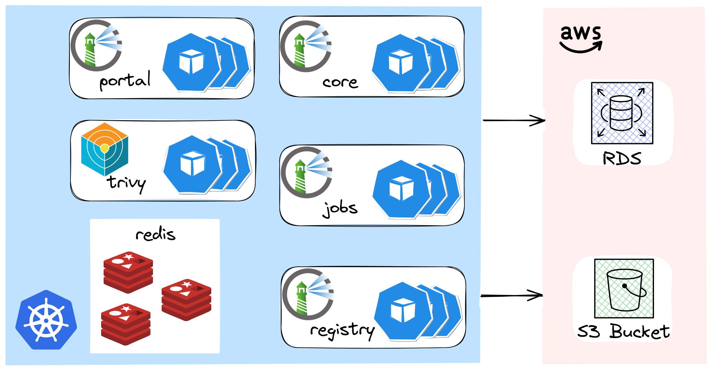
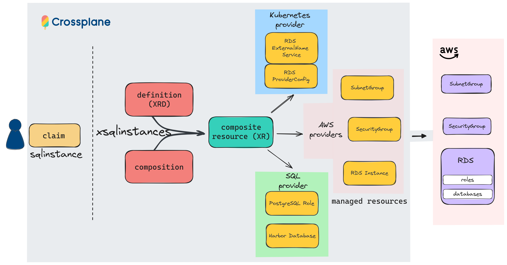
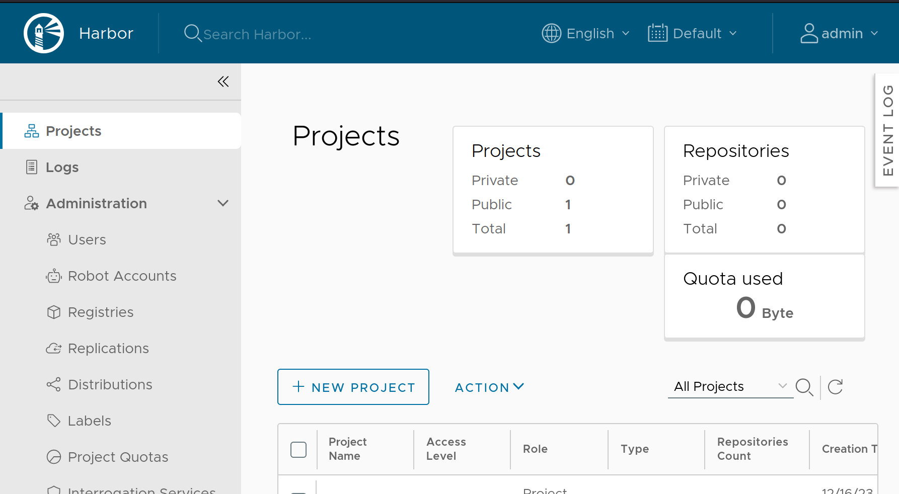

+++
author = "Smaine Kahlouch"
title = "Going Further with Crossplane: Compositions and Functions"
date = "2023-10-23"
summary = "Applying advanced Crossplane concepts in a practical example, particularly through the use of 'Composition functions', which might be the missing piece we've been waiting for..."
featured = true
codeMaxLines = 21
usePageBundles = true
toc = true
tags = [
    "infrastructure",
    "devxp",
    "gitops"
]
thumbnail= "thumbnail.png"
+++

With the emergence of _[Platform Engineering](https://thenewstack.io/how-is-platform-engineering-different-from-devops-and-sre/)_, we are witnessing a shift towards the creation of **self-service** solutions for developers. This approach facilitates the standardization of DevOps practices, enhances the developer experience, and reduces the cognitive load associated with managing tools.

`Crossplane`, an "Incubating" project under the [Cloud Native Computing Foundation (CNCF)](https://www.cncf.io/projects/crossplane/), aims to become the leading framework for creating Cloud Native platforms. In my [first article about Crossplane](https://blog.ogenki.io/post/crossplane_k3d/), I introduced this tool and explained how it leverages **GitOPs** principles for infrastructure, enabling the creation of a `GKE` cluster.

Now celebrating its 5th anniversary 🎂🎉, the project has matured and expanded its features over time.

In this post, we will explore some of Crossplane's key features, with a particular focus on the **Composition Functions** that are generating significant interest within the community. Are we about to witness a pivotal moment for the project?

## 🎯 Our target

The [Crossplane documentation](https://docs.crossplane.io/) is comprehensive, so we'll quickly review the basic concepts to focus on a specific use case: Deploying [**Harbor**](https://goharbor.io/) on an EKS cluster, adhering to **high availability** best practices.

{}
**Harbor**, also from the CNCF, is a security-focused container artifact management solution.

Its primary role is to store, sign, and scan for vulnerabilities **container images**. Harbor features fine-grained access control, an API, and a web interface, allowing dev teams to access and manage their own images easily.
{}

Harbor's availability mainly depends on its **stateful components**. Users are responsible for their implementation, which should be tailored to the target infrastructure. This blog post presents the options I selected for optimal availability.


<center></center>


* **Redis** deployed using the [Bitnami Helm chart](https://github.com/bitnami/charts/tree/main/bitnami/redis) in "master/slave" mode.
* Artifacts are stored in an AWS **S3** bucket.
* A PostgreSQL [**RDS**](https://aws.amazon.com/rds/) instance for the database.

We will now explore how Crossplane simplifies the provisioning of this RDS instance by providing a level of abstraction that exposes only an opinionated set of options. 🚀

## 🏗️ Prerequisites

Before we can build our Compositions, some groundwork is necessary as several preliminary operations need to be carried out.
These steps are performed in a specific order:

<center></center>

1. Deployment of Crossplane's core controller using the [Helm chart](https://docs.crossplane.io/latest/software/install/).
2. Installation of the `providers` and their configurations.
3. Deployment of various configurations using the previously installed providers, especially the **`Compositions`** and **`Composition Functions`**.
4. Declarations of _Claims_ to consume the Compositions.

These steps are described through [Flux](https://fluxcd.io/)'s dependencies and can be viewed [here](https://github.com/Smana/demo-cloud-native-ref/tree/main/infrastructure/base/crossplane).

{}
All the actions carried out in this article come from this [**git repository**](https://github.com/Smana/demo-cloud-native-ref).

There you can find numerous sources that help me construct my blog posts. 🎄 🎁 Feedback is a gift 🙏
{}

## 📦 The Compositions

Put simply, a `Composition` in Crossplane is a way to aggregate and automatically manage multiple resources whose configuration can sometimes be **complex**.

It leverages the Kubernetes API to define and orchestrate not just infrastructure elements like storage and networking, but also various other components (refer to the list of [providers](https://marketplace.upbound.io/providers)). This method provides developers with a **simplified interface**, representing an abstraction layer that hides the more complex technical details of the underlying infrastructure.

To achieve my goal of creating Harbor's database, I first looked for a relevant example. For this purpose, I used the [Upbound marketplace](https://marketplace.upbound.io/), where a few _Compositions_ can be found that can be used as starting points.

<center></center>

Based on the [configuration-rds](https://github.com/upbound/configuration-rds) composition, I wanted to add the following elements:

* 🔑 Allow pods to access the instance.
* ▶️ Creation of a [**ExternalName**](https://kubernetes.io/docs/concepts/services-networking/service/#externalname) Kubernetes service with a predictable name that will be used in Harbor's configuration.
* 💾 Creation of databases and the roles that will own them.

❓ How would this _Composition_ then be used if, for example, a developer wishes to have a database?
They is simply done by declaring a _**Claim**_ which represents the level of abstraction exposed to the users. Let's get a closer look 🔍

[tooling/base/harbor/sqlinstance.yaml](https://github.com/Smana/demo-cloud-native-ref/blob/main/tooling/base/harbor/sqlinstance.yaml)

```yaml
apiVersion: cloud.ogenki.io/v1alpha1
kind: SQLInstance
metadata:
  name: xplane-harbor
  namespace: tooling
spec:
  parameters:
    engine: postgres
    engineVersion: "15"
    size: small
    storageGB: 20
    databases:
      - owner: harbor
        name: registry
    passwordSecretRef:
      namespace: tooling
      name: harbor-pg-masterpassword
      key: password
  compositionRef:
    name: xsqlinstances.cloud.ogenki.io
  writeConnectionSecretToRef:
    name: xplane-harbor-rds
```

Here we observe that it boils down to a **simple** resource with few parameters to express our needs:

* A **PostgreSQL** instance version 15 will be created.
* The **instance type** is at the discretion of the platform team (the maintainers of the composition). In the above `Claim`, we ask for a small instance, which is interpreted by the composition as `db.t3.small`.
[infrastructure/base/crossplane/configuration/sql-instance-composition.yaml](https://github.com/Smana/demo-cloud-native-ref/blob/main/infrastructure/base/crossplane/configuration/sql-instance-composition.yaml#L150C18-L150C18)
```yaml
transforms:
  - type: map
    map:
      large: db.t3.large
      medium: db.t3.medium
      small: db.t3.small
```

* The `master` user's password is retrieved from a `harbor-pg-masterpassword` secret, retrieved from an [External Secret](https://github.com/Smana/demo-cloud-native-ref/blob/main/tooling/base/harbor/externalsecret-sqlinstance-password.yaml).
* Once the instance is created, the connection details are stored in a **secret** `xplane-harbor-rds`.

This is where we can fully appreciate the **power of Crossplane Compositions**! Indeed, **many resources** are provisionned under the hood, as illustrated by the following diagram:

<center></center>

After a few minutes, all the resources are ready.
ℹ️ The [Crossplane CLI](https://docs.crossplane.io/latest/cli/) now enables many operations, including visualizing the resources of a Composition.

```console
kubectl get xsqlinstances
NAME                  SYNCED   READY   COMPOSITION                     AGE
xplane-harbor-jmdhp   True     True    xsqlinstances.cloud.ogenki.io   8m32s

crank beta trace xsqlinstances.cloud.ogenki.io xplane-harbor-jmdhp
NAME                                                    SYNCED   READY   STATUS
XSQLInstance/xplane-harbor-jmdhp                        True     True    Available
├─ SecurityGroupIngressRule/xplane-harbor-jmdhp-n785k   True     True    Available
├─ SecurityGroup/xplane-harbor-jmdhp-8jnhc              True     True    Available
├─ Object/external-service-xplane-harbor                True     True    Available
├─ Object/providersql-xplane-harbor                     True     True    Available
├─ Database/registry                                    True     True    Available
├─ Role/harbor                                          True     True    Available
├─ Instance/xplane-harbor-jmdhp-whv4g                   True     True    Available
└─ SubnetGroup/xplane-harbor-jmdhp-fjfth                True     True    Available
```


Et Voilà! Harbor becomes accessible thanks to Cilium and Gateway API (You can take a look at a [previous post](https://blog.ogenki.io/post/cilium-gateway-api/) on the topic 😉)

<center></center>

{}
The [**EnvironmentConfigs**](https://docs.crossplane.io/latest/concepts/environment-configs/) enable the use of **cluster-specific variables**. These configuration elements are loaded into memory and can then be used within the composition.

Since the EKS cluster is created with [Opentofu](https://opentofu.org/), we store its properties using Flux variables. (more info on Flux's variables substitution [here](https://blog.ogenki.io/post/terraform-controller/#substition-de-variables))

[infrastructure/base/crossplane/configuration/environmentconfig.yaml](https://github.com/Smana/demo-cloud-native-ref/blob/main/infrastructure/base/crossplane/configuration/environmentconfig.yaml)

```yaml
apiVersion: apiextensions.crossplane.io/v1alpha1
kind: EnvironmentConfig
metadata:
  name: eks-environment
data:
  clusterName: ${cluster_name}
  oidcUrl: ${oidc_issuer_url}
  oidcHost: ${oidc_issuer_host}
  oidcArn: ${oidc_provider_arn}
  accountId: ${aws_account_id}
  region: ${region}
  vpcId: ${vpc_id}
  CIDRBlock: ${vpc_cidr_block}
  privateSubnetIds: ${private_subnet_ids}
```

These variables can then be used in _Compositions_ via the **`FromEnvironmentFieldPath`** directive. For instance, to allow pods to access our RDS instance, we allow the VPC's CIDR as follows:

[infrastructure/base/crossplane/configuration/irsa-composition.yaml](https://github.com/Smana/demo-cloud-native-ref/blob/main/infrastructure/base/crossplane/configuration/irsa-composition.yaml)

```yaml
- name: SecurityGroupIngressRule
  base:
    apiVersion: ec2.aws.upbound.io/v1beta1
    kind: SecurityGroupIngressRule
    spec:
      forProvider:
        cidrIpv4: ""
  patches:
...
    - fromFieldPath: CIDRBlock
      toFieldPath: spec.forProvider.cidrIpv4
      type: FromEnvironmentFieldPath
```

⚠️ As of the time of writing this post, the feature is still in _alpha_.
{}


## 🛠️ Composition Functions

**`Composition Functions`** represent a significant evolution in the development of Compositions. The traditional way of doing [patch and transforms](https://docs.crossplane.io/latest/concepts/patch-and-transform/) within a composition had certain **limitations**, such as the inability to use conditions, loops in the code, or to execute advanced functions (e.g., subnet calculations, checking the status of external resources).

_Composition Functions_ overcome these limitations and are essentially programs that extend the templating capabilities of resources within Crossplane. They can be written in **any programming language**, thus offering huge flexibility and power in defining compositions. This allows for complex tasks such as conditional transformations, iterations, and dynamic operations.

These functions are executed in a **sequential** manner (in `Pipeline` mode), with each function manipulating and transforming the resources and then passing the result to the next function, opening the door to powerful combinations.

But **let's get back to our RDS composition 🔍!** It indeed uses this new way of defining `Compositions` and consists of three steps:

[infrastructure/base/crossplane/configuration/sql-instance-composition.yaml](https://github.com/Smana/demo-cloud-native-ref/blob/main/infrastructure/base/crossplane/configuration/sql-instance-composition.yaml)

```yaml
apiVersion: apiextensions.crossplane.io/v1
kind: Composition
metadata:
  name: xsqlinstances.cloud.ogenki.io
...
spec:
  mode: Pipeline
...
  pipeline:
    - step: patch-and-transform
      functionRef:
        name: function-patch-and-transform
...
    - step: sql-go-templating
      functionRef:
        name: function-go-templating
...
    - step: ready
      functionRef:
        name: function-auto-ready
```

1. The syntax of the first step, `patch-and-transform`, might look familiar 😉. It is indeed the traditional **patching** method of Crossplane, but this time executed as a function in the Pipeline.
2. The second step involves calling the [**function-go-templating**](https://github.com/crossplane-contrib/function-go-templating) function, which we will discuss in more detail shortly.
3. Finally, the last step uses the [function-auto-ready](https://github.com/crossplane-contrib/function-auto-ready) function, which checks whether the composite resource (`XR`) is ready. This means that all the resources composing it have reached the `Ready` state.

{}

If you already have Compositions in the previous format ([Patch & Transforms](https://docs.crossplane.io/latest/concepts/patch-and-transform/)), there is a great tool available for **migrating** to the `Pipeline` mode: [crossplane-migrator](https://github.com/crossplane-contrib/crossplane-migrator)

* Install crossplane-migrator
```console
go install github.com/crossplane-contrib/crossplane-migrator@latest
```

* Then execute the following command, which will generate the correct format in `composition-pipeline.yaml`
```console
crossplane-migrator new-pipeline-composition --function-name crossplane-contrib-function-patch-and-transform -i composition.yaml -o composition-pipeline.yaml
```

ℹ️ This capabilitiy should be added to the Crossplane CLI in the next release (1.5)

{}

## 🐹 Go templating in Compositions

As mentioned earlier, the power of _Composition Functions_ lies primarily in the fact that any programming language can be used. For instance, it's possible to generate resources from Go templates with the [function-go-templating](https://github.com/crossplane-contrib/function-go-templating). Creating Composition with it is not so different from **writing [Helm](https://helm.sh/) Charts**.

All you need to do is call the function and provide it with a template as `input` to generate Kubernetes resources. In the SQLInstance composition, the YAMLs are generated directly inline, but it's also possible to load local files (`source: Filesystem`).

```yaml
    - step: sql-go-templating
      functionRef:
        name: function-go-templating
      input:
        apiVersion: gotemplating.fn.crossplane.io/v1beta1
        kind: GoTemplate
        source: Inline
        inline:
          template: |
          ...
```

Then it's your turn to play! For example, there is slight difference in generating a MariaDB or PostgreSQL database, so we can formulate conditions as follows:

```go
{{- $apiVersion := "" }}
{{- if eq $parameters.engine "postgres" }}
  {{- $apiVersion = "postgresql.sql.crossplane.io/v1alpha1" }}
{{- else }}
  {{- $apiVersion = "mysql.sql.crossplane.io/v1alpha1" }}
{{- end -}}
```

This also allowed me to define a list of databases along with their owner.

```yaml
apiVersion: cloud.ogenki.io/v1alpha1
kind: SQLInstance
metadata:
...
spec:
  parameters:
...
    databases:
      - owner: owner1
        name: db1
      - owner: owner2
        name: db2
```

Then, I used Golang loops to create them using the [SQL provider](https://github.com/crossplane-contrib/provider-sql).

```go
{{- range $parameters.databases }}
---
apiVersion: {{ $apiVersion }}
kind: Database
metadata:
  name: {{ .name | replace "_" "-" }}
  annotations:
    {{ setResourceNameAnnotation (print "db-" (replace "_" "-" .name)) }}
spec:
...
{{- end }}
```

It is even possible to develop more complex logic in go template functions using the usual `define` and `include` directives. Here is an excerpt from the examples available in the [function's repository](https://github.com/crossplane-contrib/function-go-templating/tree/main/example).

```go
{{- define "labels" -}}
some-text: {{.val1}}
other-text: {{.val2}}
{{- end }}
...
labels:
  {{- include "labels" $vals | nindent 4}}
...
```

Finally, we can test the Composition and display the **rendering of the template** with the following command:

```console
crank beta render tooling/base/harbor/sqlinstance.yaml infrastructure/base/crossplane/configuration/sql-instance-composition.yaml infrastructure/base/crossplane/configuration/function-go-templating.yaml
```

As we can see, the possibilities are greatly expanded thanks to the ability to construct resources using a programming language. However, it is also necessary to ensure that the composition remains **readable** and maintainable in the long term. We will likely witness the emergence of best practices as we gain more experience with the use of these functions.

## 💭 Final Thoughts

When we talk about Infrastructure As Code, Terraform often comes to mind first. This tool, supported by a vast community, with a mature ecosystem, remains a top choice. However, it's interesting to ponder how Terraform has evolved in response to the new paradigms introduced by Kubernetes. We touched on this in our article on [terraform controller](https://blog.ogenki.io/post/terraform-controller/). Since then,  you may have noticed Hashicorp's controversial decision to adopt the [Business Source License](https://www.hashicorp.com/blog/hashicorp-adopts-business-source-license). This switch sparked many reactions and might have influenced the strategy and roadmap of other solutions...

Without saying that this is a direct reaction, recently, `Crossplane` updated its [charter](https://blog.crossplane.io/charter-expansion-upjet-donation/) to expand its scope to the entire ecosystem (providers, functions), notably by integrating the [**Upjet**](https://github.com/crossplane/upjet) project under the CNCF umbrella. The goal of this move is to strengthen the governance of associated projects and ultimately improve the **developer experience**.

Personally, I've been using `Crossplane` for a while for specific use cases. I even deployed it in **production** at a company, using a composition to define specific permissions for pods on EKS (IRSA). We also restricted the types of resources a developer could declare.

❓ So, what to think of this new experience with Crossplane?

It is obvious that _**Composition Functions**_ promise exciting horizons, and we can expect to see many functions emerge in 2024 🚀

However, imho, it is crucial that **development and operation tools** continue to improve to foster adoption of the project. For instance, a web interface or a [k9s](https://k9scli.io/) plugin would be useful.

Furthermore, for a beginner looking to develop a composition or a function, the **first step might seem daunting**. Validating a composition is not straightforward, and there aren't many examples to follow. We hope the [marketplace](https://marketplace.upbound.io/) will grow over time.

That said, these concerns are being **addressed by the Crossplane community**, especially by the SIG Dev XP, whose efforts deserve applause and who are currently doing significant work. 👏

I encourage you to closely follow the project's evolution in the coming months 👀, and to try out Crossplane for yourself to form your own opinion.

## 🔖 References

* Crossplane blog: [Improve Crossplane Compositions Authoring with go-templating-function](https://blog.upbound.io/go-templating-function)
* [Dev XP Roadmap](https://github.com/crossplane/crossplane/issues/4654)
* Video (Kubecon NA 2023): [Crossplane Intro and Deep Dive - the Cloud Native Control Plane Framework](https://www.youtube.com/watch?v=I5Rd0X7AROw)
* Video (DevOps Toolkit): [Crossplane Composition Functions: Unleashing the Full Potential](https://www.youtube.com/watch?v=jjtpEhvwgMw)