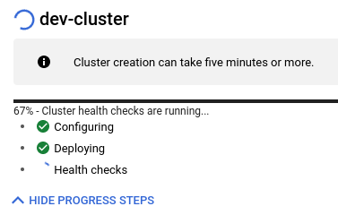

+++
author = "Smaine Kahlouch"
title = "My Kubernetes cluster in GKE with `Crossplane`"
date = "2022-07-03"
summary = "Use a local **k3d** cluster in order to create and manage a **GKE** cluster"
featureImage = "crossplane_k3d.png"
featured = true
codeMaxLines = 20
usePageBundles = true
toc = true
tags = [
    "kubernetes",
    "infrastructure"
]
thumbnail= "crossplane_k3d.jpg"
+++

The target of this documentation is to be able to create and manage a GKE cluster using [**Crossplane**](https://crossplane.io/).
Here are the steps we'll follow in order to get a Kubernetes cluster for development and experimentations use cases.

### :whale: Create the local k3d cluster for Crossplane's control plane

[**k3d**](https://k3d.io) is a lightweight kubernetes cluster that leverages k3s that runs in our local laptop.
There are several deployment models for Crossplane, we could for instance deploy the control plane on a management cluster on Kubernetes or a control plane per Kubernetes cluster.<br>
Here I chose a simple method which is fine for a personal use case: A **local Kubernetes instance** in which I'll deploy Crossplane.

Let's install k3d using [asdf](/post/asdf/).

```console
asdf plugin-add k3d

asdf install k3d $(asdf latest k3d)
* Downloading k3d release 5.4.1...
k3d 5.4.1 installation was successful!
```

Create a single node Kubernetes cluster.

```console
k3d cluster create crossplane
...
INFO[0043] You can now use it like this:
kubectl cluster-info

k3d cluster list
crossplane   1/1       0/0      true
```

Check that the cluster is reachable using the `kubectl` CLI.

```console
kubectl cluster-info
Kubernetes control plane is running at https://0.0.0.0:40643
CoreDNS is running at https://0.0.0.0:40643/api/v1/namespaces/kube-system/services/kube-dns:dns/proxy
Metrics-server is running at https://0.0.0.0:40643/api/v1/namespaces/kube-system/services/https:metrics-server:https/proxy
```

We only need a single node for our Crossplane use case.

```console
kubectl get nodes
NAME                      STATUS   ROLES                  AGE   VERSION
k3d-crossplane-server-0   Ready    control-plane,master   26h   v1.22.7+k3s1
```
<br>

### :cloud: Generate the Google Cloud service account

{}
Store the downloaded `crossplane.json` credentials file in a safe place.
{}

Create a service account
```console
GCP_PROJECT=<your_project>
gcloud iam service-accounts create crossplane --display-name "Crossplane" --project=${GCP_PROJECT}
Created service account [crossplane].
```

Assign the proper permissions to the service account.
* *Compute Network Admin*
* *Kubernetes Engine Admin*
* *Service Account User*

```console
SA_EMAIL=$(gcloud iam service-accounts list --filter="email ~ ^crossplane" --format='value(email)')

gcloud projects add-iam-policy-binding "${GCP_PROJECT}" --member=serviceAccount:"${SA_EMAIL}" \
--role=roles/container.admin --role=roles/compute.networkAdmin --role=roles/iam.serviceAccountUser
Updated IAM policy for project [<project>].
bindings:
- members:
  - serviceAccount:crossplane@<project>.iam.gserviceaccount.com
  role: roles/compute.networkAdmin
- members:
  - serviceAccount:crossplane@<project>.iam.gserviceaccount.com
...
version: 1

```

Download the service account key (json format)

```console
gcloud iam service-accounts keys create crossplane.json --iam-account ${SA_EMAIL}
created key [ea2eb9ce2939127xxxxxxxxxx] of type [json] as [crossplane.json] for [crossplane@<project>.iam.gserviceaccount.com]
```
<br>

### :construction: Deploy and configure Crossplane

Now that we have a credentials file for Google Cloud, we can deploy the [**Crossplane**](https://crossplane.io/) operator and configure the `provider-gcp` provider.

{}
Most of the following steps are issued from the [official documentation](https://crossplane.io/docs/v1.8/getting-started/install-configure.html)
{}


We'll first use Helm in order to install the **operator**
```console
helm repo add crossplane-master https://charts.crossplane.io/master/
"crossplane-master" has been added to your repositories

helm repo update
...Successfully got an update from the "crossplane-master" chart repository

helm install crossplane --namespace crossplane-system --create-namespace \
--version 1.18.1 crossplane-stable/crossplane

NAME: crossplane
LAST DEPLOYED: Mon Jun  6 22:00:02 2022
NAMESPACE: crossplane-system
STATUS: deployed
REVISION: 1
TEST SUITE: None
NOTES:
Release: crossplane
...
```

Check that the operator is running properly.

```console
kubectl get po -n crossplane-system
NAME                                       READY   STATUS    RESTARTS   AGE
crossplane-rbac-manager-54d96cd559-222hc   1/1     Running   0          3m37s
crossplane-688c575476-lgklq                1/1     Running   0          3m37s
```

{}
All the files used for the upcoming steps are stored within this blog repository.
So you should clone and change the current directory:

```console
git clone https://github.com/Smana/smana.github.io.git

cd smana.github.io/content/resources/crossplane_k3d
```
{}

Now we'll configure Crossplane so that it will be able to create and manage GCP resources. This is done by configuring the **provider** `provider-gcp` as follows.

<span style="color:green">provider.yaml</span>
```yaml
apiVersion: pkg.crossplane.io/v1
kind: Provider
metadata:
  name: crossplane-provider-gcp
spec:
  package: crossplane/provider-gcp:v0.21.0
```

```console
kubectl apply -f provider.yaml
provider.pkg.crossplane.io/crossplane-provider-gcp created

kubectl get providers
NAME                      INSTALLED   HEALTHY   PACKAGE                           AGE
crossplane-provider-gcp   True        True      crossplane/provider-gcp:v0.21.0   10s
```

Create the Kubernetes secret that holds the GCP credentials file created [above](#cloud-generate-the-google-cloud-service-account)

```console
kubectl create secret generic gcp-creds -n crossplane-system --from-file=creds=./crossplane.json
secret/gcp-creds created
```

Then we need to create a resource named `ProviderConfig` and reference the newly created secret.

<span style="color:green">provider-config.yaml</span>
```yaml
apiVersion: gcp.crossplane.io/v1beta1
kind: ProviderConfig
metadata:
  name: default
spec:
  projectID: ${GCP_PROJECT}
  credentials:
    source: Secret
    secretRef:
      namespace: crossplane-system
      name: gcp-creds
      key: creds
```

```console
kubectl apply -f provider-config.yaml
providerconfig.gcp.crossplane.io/default created
```
{}
If the serviceaccount has the proper permissions we can create resources in GCP. In order to learn about all the available resources and **parameters** we can have a look to the `provider`'s [API reference](https://doc.crds.dev/github.com/crossplane/provider-gcp).
{}

The first resource we'll create is the network that will host our Kubernetes cluster.

<span style="color:green">network.yaml</span>
```yaml
apiVersion: compute.gcp.crossplane.io/v1beta1
kind: Network
metadata:
  name: dev-network
  labels:
    service: vpc
    creation: crossplane
spec:
  forProvider:
    autoCreateSubnetworks: false
    description: "Network used for experimentations and POCs"
    routingConfig:
      routingMode: REGIONAL
```

```console
kubectl get network
NAME          READY   SYNCED
dev-network   True    True
```
You can even get more details by describing this resource. For instance if **something fails** you would see the message returned by the Cloud provider in the events.
```console
kubectl describe network dev-network | grep -A 20 '^Status:'
Status:
  At Provider:
    Creation Timestamp:  2022-06-28T09:45:30.703-07:00
    Id:                  3005424280727359173
    Self Link:           https://www.googleapis.com/compute/v1/projects/${GCP_PROJECT}/global/networks/dev-network
  Conditions:
    Last Transition Time:  2022-06-28T16:45:31Z
    Reason:                Available
    Status:                True
    Type:                  Ready
    Last Transition Time:  2022-06-30T16:36:59Z
    Reason:                ReconcileSuccess
    Status:                True
    Type:                  Synced
```

<br>

### :rocket: Create a GKE cluster

Everything is ready so that we can create our GKE cluster. Applying the file <span style="color:green">cluster.yaml</span> will create a cluster and attach a node group to it.

<span style="color:green">cluster.yaml</span>
```yaml
---
apiVersion: container.gcp.crossplane.io/v1beta2
kind: Cluster
metadata:
  name: dev-cluster
spec:
  forProvider:
    description: "Kubernetes cluster for experimentations and POCs"
    initialClusterVersion: "1.24"
    releaseChannel:
      channel: "RAPID"
    location: europe-west9-a
    addonsConfig:
      gcePersistentDiskCsiDriverConfig:
        enabled: true
      networkPolicyConfig:
        disabled: false
    networkRef:
      name: dev-network
    ipAllocationPolicy:
      createSubnetwork: true
      useIpAliases: true
    defaultMaxPodsConstraint:
      maxPodsPerNode: 110
    networkPolicy:
      enabled: false
  writeConnectionSecretToRef:
    namespace: default
    name: gke-conn
---
apiVersion: container.gcp.crossplane.io/v1beta1
kind: NodePool
metadata:
  name: main-np
spec:
  forProvider:
    initialNodeCount: 1
    autoscaling:
      autoprovisioned: false
      enabled: true
      maxNodeCount: 4
      minNodeCount: 1
    clusterRef:
      name: dev-cluster
    config:
      machineType: n2-standard-2
      diskSizeGb: 120
      diskType: pd-standard
      imageType: cos_containerd
      preemptible: true
      labels:
        environment: dev
        managed-by: crossplane
      oauthScopes:
        - "https://www.googleapis.com/auth/devstorage.read_only"
        - "https://www.googleapis.com/auth/logging.write"
        - "https://www.googleapis.com/auth/monitoring"
        - "https://www.googleapis.com/auth/servicecontrol"
        - "https://www.googleapis.com/auth/service.management.readonly"
        - "https://www.googleapis.com/auth/trace.append"
      metadata:
        disable-legacy-endpoints: "true"
      shieldedInstanceConfig:
        enableIntegrityMonitoring: true
        enableSecureBoot: true
    management:
      autoRepair: true
      autoUpgrade: true
    maxPodsConstraint:
      maxPodsPerNode: 60
    locations:
      - "europe-west9-a"
```

```console
kubectl apply -f cluster.yaml
cluster.container.gcp.crossplane.io/dev-cluster created
nodepool.container.gcp.crossplane.io/main-np created

```

Note that it takes around 10 minutes for the Kubernetes API and the nodes to be available. The *STATE* will transition from `PROVISIONING` to `RUNNING` and when a change is being applied the cluster status is `RECONCILING`
```console
watch 'kubectl get cluster,nodepool'
NAME                                              READY   SYNCED   STATE          ENDPOINT       LOCATION         AGE
cluster.container.gcp.crossplane.io/dev-cluster   False   True     PROVISIONING   34.155.122.6   europe-west9-a   3m15s

NAME                                           READY   SYNCED   STATE   CLUSTER-REF   AGE
nodepool.container.gcp.crossplane.io/main-np   False   False            dev-cluster   3m15s
```


When the column READY switches to `True` you can download the cluster's credentials.
```console
kubectl get cluster
NAME          READY   SYNCED   STATE         ENDPOINT         LOCATION         AGE
dev-cluster   True    True     RECONCILING   34.42.42.42      europe-west9-a   6m23s

gcloud container clusters get-credentials dev-cluster --zone europe-west9-a --project ${GCP_PROJECT}
Fetching cluster endpoint and auth data.
kubeconfig entry generated for dev-cluster.
```

For better readability you may want to rename the context id for the newly created cluster
```console
kubectl config rename-context gke_${GCP_PROJECT}_europe-west9-a_dev-cluster dev-cluster
Context "gke_${GCP_PROJECT}_europe-west9-a_dev-cluster" renamed to "dev-cluster".

kubectl config get-contexts
CURRENT   NAME             CLUSTER                                                       AUTHINFO                                                      NAMESPACE
*         dev-cluster      gke_cloud-native-computing-paris_europe-west9-a_dev-cluster   gke_cloud-native-computing-paris_europe-west9-a_dev-cluster
          k3d-crossplane   k3d-crossplane                                                admin@k3d-crossplane
```

Check that you can call our brand new GKE API
```console
kubectl get nodes
NAME                                    STATUS   ROLES    AGE   VERSION
gke-dev-cluster-main-np-d0d978f9-5fc0   Ready    <none>   10m   v1.24.1-gke.1400
```

That's great :tada: we know have a GKE cluster up and running.

In our next article we'll see how to use a [**GitOps**](https://www.weave.works/technologies/gitops/) engine to run all the above steps.
