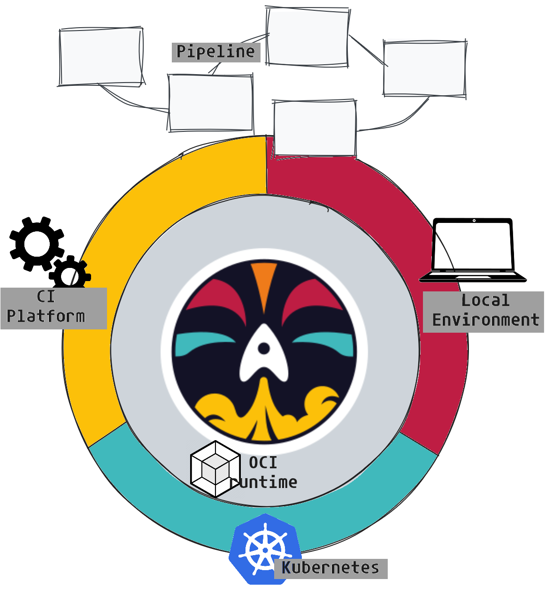
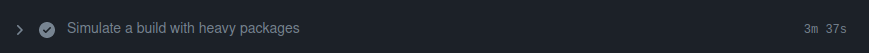

+++
author = "Smaine Kahlouch"
title = "`Dagger`: The missing piece of the developer experience?"
date = "2024-07-07"
summary = "Explore how Dagger can improve automation and streamline your development pipelines. Learn about an effective cache sharing proposal using Self-Hosted GitHub Actions and EKS."
featured = true
codeMaxLines = 21
usePageBundles = true
toc = true
tags = [
    "devxp"
]
thumbnail= "thumbnail.png"
+++

[Dagger](https://dagger.io/) is an open-source project that promises to revolutionize the way continuous integration (CI) pipelines are defined. It was created by the founders of Docker, based on a study of common challenges faced by companies. They identified a lack of effective tooling throughout the development cycle up to production deployment.

One significant issue is the **lack of consistency across execution environments**. You have probably heard a colleague complain with something like: "It worked fine on my machine! What is this error on the CI?" 😆

By offering a common and centralized method, Dagger could be THE solution to this problem. It aims to improve the local developer experience, enhance collaboration, and accelerate the development cycle.

<center></center>

Many of us have used bash scripts, Makefiles, and other traditional methods to automate some actions. However, these solutions can quickly become **complex and hard to maintain**. Dagger offers a modern and simplified alternative, allowing us to standardize and unify our pipelines regardless of the environment.

So, what are the main features of Dagger, and how can it be used effectively?

## 🎯 Our target

Here are the points we will cover in this article:

1. First, we will understand how `Dagger` works and take our get started with it.

2. Next, we will explore concrete use cases for its implementation. We will see how to transform an existing project, and I will also introduce a module that I now use on a daily basis.

3. Finally, we will describe an effective caching solution that will allow us to scale with Dagger.


## 🔎 First steps

Basically, `Dagger` is a tool that allows us to define tasks using our **preferred language** and make that code **portable**. In other words, what I run on my machine will be executed in the same way on the CI or on my colleague's computer.

There are two main components involved:

* The **Dagger CLI**: Our main access point for interacting with various functions and modules, downloading them, and displaying their execution results.
* The **Dagger engine**: All operations performed with the CLI go through a `GraphQL` API exposed by a Dagger engine. Each client establishes its own session with the Core API, which offers basic `functions`. These functions can be extended using additional modules (which will be explained later).

<center></center>

Let's start by **installing the CLI**. If you've read my previous articles, you know that I like to use [**asdf**](https://blog.ogenki.io/fr/post/asdf/asdf/).

```console
asdf plugin-add dagger

asdf install dagger 0.11.9
Downloading dagger from https://github.com/dagger/dagger/releases/download/v0.11.9/dagger_v0.11.9_linux_amd64.tar.gz

asdf global dagger 0.11.9
dagger version
dagger v0.11.9 (registry.dagger.io/engine) linux/amd64
```

Let's dive right in and immediately execute a module provided by the community. Suppose we want to scan a git repo and a Docker image with [trivy](https://aquasecurity.github.io/trivy/v0.53/).

{}
The [**Daggerverse**](https://daggerverse.dev/) is a platform that allows anyone to **share** modules. When you have a need, you should have a look at what is already available there. </br>
Try by yourself, searching for example `golangci`, `ruff`, `gptscript`, `wolfi`...
<center></center>
{}

A `module` is a **collection of functions** that takes input parameters and returns a response in various forms: output text, terminal execution, service launch, etc. Also, note that all functions are **executed in containers**.

We can check the **available functions** in the `module` using the `functions` argument.

```console
TRIVY_MODULE="github.com/purpleclay/daggerverse/trivy@c3f44e0c8a396b2adf024bb862714037ae4cc8e7"

dagger functions -m ${TRIVY_MODULE}
Name          Description
filesystem    Scan a filesystem for any vulnerabilities
image         Scan a published (or remote) image for any vulnerabilities
image-local   Scan a locally exported image for any vulnerabilities
```

The functions can also take various parameters.

```console
dagger call -m ${TRIVY_MODULE} filesystem --help
...
ARGUMENTS
      --dir Directory      the path to directory to scan [required]
      --exit-code int      the returned exit code when vulnerabilities are detected (0)
      --format string      the type of format to use when generating the compliance report (table)
      --ignore-unfixed     filter out any vulnerabilities without a known fix
      --scanners string    the types of scanner to execute (vuln,secret)
      --severity string    the severity of security issues to detect (UNKNOWN,LOW,MEDIUM,HIGH,CRITICAL)
      --template string    a custom go template to use when generating the compliance report
      --vuln-type string   the types of vulnerabilities to scan for (os,library)
```

Let's analyze the security level of my local repository 🕵️

```console
dagger call -m ${TRIVY_MODULE} filesystem --dir "."

scan/go.mod (gomod)
===================
Total: 1 (UNKNOWN: 0, LOW: 0, MEDIUM: 1, HIGH: 0, CRITICAL: 0)

┌────────────────────────────────┬────────────────┬──────────┬────────┬───────────────────┬───────────────┬───────────────────────────────────────────────────┐
│            Library             │ Vulnerability  │ Severity │ Status │ Installed Version │ Fixed Version │                       Title                       │
├────────────────────────────────┼────────────────┼──────────┼────────┼───────────────────┼───────────────┼───────────────────────────────────────────────────┤
│ github.com/vektah/gqlparser/v2 │ CVE-2023-49559 │ MEDIUM   │ fixed  │ 2.5.11            │ 2.5.14        │ gqlparser denial of service vulnerability via the │
│                                │                │          │        │                   │               │ parserDirectives function                         │
│                                │                │          │        │                   │               │ https://avd.aquasec.com/nvd/cve-2023-49559        │
└────────────────────────────────┴────────────────┴──────────┴────────┴───────────────────┴───────────────┴───────────────────────────────────────────────────┘
```

Oops! It seems there is a critical vulnerability in my image 😨.

```console
dagger call -m ${TRIVY_MODULE} image --ref smana/dagger-cli:v0.11.9 --severity CRITICAL

smana/dagger-cli:v0.11.9 (ubuntu 23.04)
=======================================
Total: 0 (CRITICAL: 0)


usr/local/bin/dagger (gobinary)
===============================
Total: 1 (CRITICAL: 1)

┌─────────┬────────────────┬──────────┬────────┬───────────────────┬─────────────────┬────────────────────────────────────────────────────────────┐
│ Library │ Vulnerability  │ Severity │ Status │ Installed Version │  Fixed Version  │                           Title                            │
├─────────┼────────────────┼──────────┼────────┼───────────────────┼─────────────────┼────────────────────────────────────────────────────────────┤
│ stdlib  │ CVE-2024-24790 │ CRITICAL │ fixed  │ 1.22.3            │ 1.21.11, 1.22.4 │ golang: net/netip: Unexpected behavior from Is methods for │
│         │                │          │        │                   │                 │ IPv4-mapped IPv6 addresses                                 │
│         │                │          │        │                   │                 │ https://avd.aquasec.com/nvd/cve-2024-24790                 │
└─────────┴────────────────┴──────────┴────────┴───────────────────┴─────────────────┴────────────────────────────────────────────────────────────┘
```

That's already super cool to benefit from numerous sources 🤩! These modules can be used directly or become a valuable source of inspiration for our future pipelines.

After this brief introduction, let's move on to real use cases by starting to add functions to an existing git repository.

## 🦋 Daggerize an existing project

<table>
  <tr>
    <td>
      
    </td>
    <td style="vertical-align:middle; padding-left:20px;" width="60%">
      Let's take an existing <strong><a href="https://github.com/Smana/golang-helloworld">demo project</a></strong>, a simple web server with a function that stores words in a database. We will gradually transform this project by <strong>injecting Dagger</strong> into it 💉. </br>
      This iterative, step-by-step approach can also be applied to larger projects to progressively integrate Dagger.
    </td>
  </tr>
</table>


### Our first function 👶

Our priority will be to **test** the code using the `go test` command.

Let's start by **initializing** the git repo to generate the required directory structure for executing Dagger functions.
```console
git clone https://github.com/Smana/golang-helloworld.git
cd golang-helloworld
dagger init --sdk=go
```

```console
ls -l dagger*
.rw-r--r-- 101 smana 28 Jun 21:54 dagger.json

dagger:
.rw-------  25k smana 28 Jun 21:54 dagger.gen.go
drwxr-xr-x    - smana 28 Jun 21:54 internal
.rw------- 1.4k smana 28 Jun 21:54 main.go
```

The `init` command generates a `main.go` file containing example functions that we will completely **replace** with the following code:

```golang
package main

import (
	"context"n mont
)

type GolangHelloworld struct{}

// Test runs the tests for the GolangHelloworld project
func (m *GolangHelloworld) Test(ctx context.Context, source *Directory) (string, error) {
	ctr := dag.Container().From("golang:1.22")
	return ctr.
		WithWorkdir("/src").
		WithMountedDirectory("/src", source).
		WithExec([]string{"go", "test", "./..."}).
		Stdout(ctx)
}
```

This is a very simple function:

* The function, called `Test`, takes a `source` directory as a parameter.
* We use a `golang:1.22` image.
* The code from the given directory is mounted in the `/src` folder of the container.
* Then, we run the `go test ./...` command on the source directory.
* Finally, we retrieve the test results (stdout).

{}
It is sometimes necessary to run the following command to update the Dagger files (dependencies, etc.).
```console
dagger develop
```
{}

Let's test our code!

```console
dagger call test --source "."
?       helloworld/cmd/helloworld       [no test files]
?       helloworld/dagger       [no test files]
?       helloworld/dagger/internal/dagger       [no test files]
?       helloworld/dagger/internal/querybuilder [no test files]
?       helloworld/dagger/internal/telemetry    [no test files]
ok      helloworld/internal/server      0.004s
```

:information_source: The first run takes time because it downloads the image and installs the Go dependencies, but subsequent runs are much faster. We will discuss about caching later in this article.

### What about my docker-compose? 🐳

In this demo repository we used to run [Docker Compose](https://docs.docker.com/compose/) in order to **test the application locally**.

The `docker-compose up --build` command performs several actions: </br>
it builds the Docker image using the local Dockerfile, then starts two containers: one for the application and one for the database. It also enables communication between these two containers.

```console
docker ps
CONTAINER ID   IMAGE                               COMMAND                  CREATED         STATUS         PORTS                                       NAMES
a1673d56f9c8   golang-helloworld-app               "/app/main"              3 seconds ago   Up 3 seconds   0.0.0.0:8080->8080/tcp, :::8080->8080/tcp   golang-helloworld-app-1
bb3dee1305dc   postgres:16                         "docker-entrypoint.s…"   3 seconds ago   Up 3 seconds   0.0.0.0:5432->5432/tcp, :::5432->5432/tcp   golang-helloworld-database-1
```

You can then access the application and store words in the database.

```console
curl -X POST -d '{"word":"foobar"}' -H "Content-Type: application/json" http://localhost:8080/store

curl http://localhost:8080/list
["foobar"]
```

**How to achieve the same with Dagger?**

First, we will build the image:

```golang
// Build the Docker container
func (m *GolangHelloworld) Build(ctx context.Context, source *Directory) *Container {
	// build the binary
	builder := dag.Container().
		From(golangImage).
		WithDirectory("/src", source).
		WithWorkdir("/src").
		WithEnvVariable("CGO_ENABLED", "0").
		WithExec([]string{"go", "build", "-o", "helloworld", "cmd/helloworld/main.go"})

	// Create the target image with the binary
	targetImage := dag.Container().
		From(alpineImage).
		WithFile("/bin/helloworld", builder.File("/src/helloworld"), ContainerWithFileOpts{Permissions: 0700, Owner: "nobody"}).
		WithUser("nobody:nobody").
		WithEntrypoint([]string{"/bin/helloworld"})

	return targetImage
}
```

This code demonstrates the use of **"multi-stage build"** to optimize the security and size of the image. This method allows us to include only what is necessary in the final image, thereby reducing the attack surface and the image size.

Next, we need a `PostgreSQL` instance. Fortunately, there is a [module](https://daggerverse.dev/mod/github.com/quartz-technology/daggerverse/postgres@627fc4df7de8ce3bd8710fa08ea2db6cf16712b3) for that ®!

We will install this dependency to use its functions directly in our code.

```console
dagger install github.com/quartz-technology/daggerverse/postgres@v0.0.3
```

The `Database()` function allows to run a Postrges container.

```golang
...
	opts := PostgresOpts{
		DbName:     dbName,
		Cache:      cache,
		Version:    "13",
		ConfigFile: nil,
		InitScript: initScriptDir,
	}

...
	pgCtr := dag.Postgres(pgUser, pgPass, pgPortInt, opts).Database()
```

Finally, we need to create a link between these two containers. Below, we retrieve the information from the `service` exposed by the Postgres container in order to use it in our application.

```golang
...
	pgSvc := pgCtr.AsService()

	pgHostname, err := pgSvc.Hostname(ctx)
	if err != nil {
		return nil, fmt.Errorf("could not get postgres hostname: %w", err)
	}

	return ctr.
		WithSecretVariable("PGPASSWORD", pgPass).
		WithSecretVariable("PGUSER", pgUser).
		WithEnvVariable("PGHOST", pgHostname).
		WithEnvVariable("PGDATABASE", opts.DbName).
		WithEnvVariable("PGPORT", pgPort).
		WithServiceBinding("database", pgSvc).
		WithExposedPort(8080), nil
...
```

{}
Sensitive information can be passed when calling Dagger functions in several ways: **environment variables**, reading the contents of **files**, or the output of a **command line**.
{}

`up` allows local calls to the services exposed by the container.

```console
export PGUSER="user"
export PGPASS="password"
dagger call serve --pg-user=env:PGUSER --pg-pass=env:PGPASS --source "."  as-service up

...
  ● start /bin/helloworld 30.7s
  ┃ 2024/06/30 08:27:50 Starting server on :8080
  ┃ 2024/06/30 08:27:50 Starting server on :8080
```

Et voilà! We can now test our application locally.

{}
I have intentionally truncated these last excerpts, but I invite you to check out the complete configuration [**here**](https://github.com/Smana/golang-helloworld/blob/daggerize/dagger/main.go). There you will find, among other things, the ability to publish the image to a registry.

Additionally, I recommend browsing the [**Cookbook**](https://docs.dagger.io/cookbook) in the Dagger documentation, where you will find many examples.
{}

## 🧩 The Kubeconform Module

The first module I wrote is based on a **real use case**: For several years, I have been using a [bash script](https://github.com/fluxcd/flux2-kustomize-helm-example/blob/main/scripts/validate.sh) to validate Kubernetes/Kustomize manifests and the [Flux](https://fluxcd.io/) configuration.
The idea is to achieve the same results but also go a bit further...

Initializing a module is done as follows:
```console
dagger init --name=kubeconform --sdk=go kubeconform
```

Next, we need to decide on the input parameters. For example, I want to be able to choose the version of the [Kubeconform](https://github.com/yannh/kubeconform) binary.
```golang
...
	// Kubeconform version to use for validation.
	// +optional
	// +default="v0.6.6"
	version string,
...
```

The above comments are important: The description will be displayed to the user, and we can make this parameter optional and set a default version.
```console
dagger call -m github.com/Smana/daggerverse/kubeconform@v0.0.4 validate --help
Validate the Kubernetes manifests in the provided directory and optional source CRDs directories
...
      --version string        Kubeconform version to use for validation. (default "v0.6.6")
```

While developing this module, I went through several iterations and received very useful information on Dagger's [Discord](https://discord.com/invite/ufnyBtc8uY). It's a great way to interact with the community.

Let's analyze this, for example:
```go
kubeconformBin := dag.Arc().
    Unarchive(dag.HTTP(fmt.Sprintf("https://github.com/yannh/kubeconform/releases/download/%s/kubeconform-linux-amd64.tar.gz", kubeconform_version)).
        WithName("kubeconform-linux-amd64.tar.gz")).File("kubeconform-linux-amd64/kubeconform")
```

I use the [Arc](https://daggerverse.dev/mod/github.com/sagikazarmark/daggerverse/arc@b45dbd7448bb967aca4a538af9ce7f042abf0316) module to extract an archive retrieved with the `HTTP` function, and I only take the binary included in this archive. Pretty efficient!

In this other example, I use the [Apko](https://daggerverse.dev/mod/github.com/vito/daggerverse/apko@09c1b5b172e58a8fd58ee790d81018cd478590fc) module to build
```go
ctr := dag.Apko().Wolfi([]string{"bash", "curl", "kustomize", "git", "python3", "py3-pip", "yq"}).
    WithExec([]string{"pip", "install", "pyyaml"})
```

At the time of writing this article, the Kubeconform module also includes a bit of bash script, primarily to efficiently traverse the directory structure and execute `kubeconform`.
```golang
	scriptContent := `#!/bin/bash
...
`

	// Add the manifests and the script to the container
	ctr = ctr.
		WithMountedDirectory("/work", manifests).
		WithNewFile("/work/run_kubeconform.sh", ContainerWithNewFileOpts{
			Permissions: 0750,
			Contents:    scriptContent,
		})

	// Execute the script
	kubeconform_command := []string{"bash", "/work/run_kubeconform.sh"}
...
```

To test and debug the module, we can run it locally on a repository that contains Kubernetes manifests.
```console
dagger call validate --manifests ~/Sources/demo-cloud-native-ref/clusters --catalog
...
Summary: 1 resource found in 1 file - Valid: 1, Invalid: 0, Errors: 0, Skipped: 0
Validation successful for ./mycluster-0/crds.yaml
Processing file: ./mycluster-0/flux-config.yaml
Summary: 1 resource found in 1 file - Valid: 1, Invalid: 0, Errors: 0, Skipped: 0
Validation successful for ./mycluster-0/flux-config.yaml
```

For debugging purposes, we can increase the verbosity level as follows. The highest level is `-vvv --debug`.
```console
dagger call validate --manifests ~/Sources/demo-cloud-native-ref/clusters --catalog -vvv --debug
...
09:32:07 DBG new end old="2024-07-06 09:32:07.436103097 +0200 CEST" new="2024-07-06 09:32:07.436103273 +0200 CEST"
09:32:07 DBG recording span span=telemetry.LogsSource/Subscribe id=b3fc48ec7900f581
09:32:07 DBG recording span child span=telemetry.LogsSource/Subscribe parent=ae535768bb2be9d7 child=b3fc48ec7900f581
09:32:07 DBG new end old="2024-07-06 09:32:07.436103273 +0200 CEST" new="2024-07-06 09:32:07.438699251 +0200 CEST"
09:32:07 DBG recording span span="/home/smana/.asdf/installs/dagger/0.11.9/bin/dagger call -m github.com/Smana/daggerverse/kubeconform@v0.0.4 validate --manifests /home/smana/Sources/demo-cloud-native-ref/clusters --catalog -vvv --debug" id=ae535768bb2be9d7
09:32:07 DBG frontend exporting logs logs=4
09:32:07 DBG exporting log span=0xf62760 body=""
09:32:07 DBG got EOF
09:32:07 DBG run finished err=<nil>

✔ 609fcdee60c94c07 connect 0.6s
  ✔ c873c2d69d2b7ce7 starting engine 0.5s
    ✔ 5f48c41bd0a948ca create 0.5s
      ✔ dbd62c92c3db105f exec docker start dagger-engine-ceb38152f96f1298 0.0s
      ┃ dagger-engine-ceb38152f96f1298
  ✔ 4db8303f1d7ec940 connecting to engine 0.1s
  ┃ 09:32:03 DBG connecting runner=docker-image://registry.dagger.io/engine:v0.11.9 client=5fa0kn1nc4qlku1erer3868nj
  ┃ 09:32:03 DBG subscribing to telemetry remote=docker-image://registry.dagger.io/engine:v0.11.9
  ┃ 09:32:03 DBG subscribed to telemetry elapsed=19.095µs
```

I also frequently add commands in the container, for example, to check the contents of a directory.
```golang
	stdout, err := ctr.
		WithExec([]string{"ls", "-l", "/work"}).
		Stdout(ctx)
```

With this module, I was also able to add some missing features that are quite useful:

* Convert all CRDs to JSONSchemas to validate 100% of Kubernetes manifests.
* Make it compatible with Flux variable substitutions.

Finally, I was able to share it in the [Daggerverse](https://daggerverse.dev/mod/github.com/Smana/daggerverse/kubeconform@3291d9cd86b8421fdff3bc7fafd9ca73be4c6060) and update my CI workflows on GitHub Actions.

<center></center>

## 🚀 Rapid Iteration and Collaboration with a shared cache

Using a cache allows you to avoid re-executing steps where the code hasn't changed. During the first run, all steps will be executed, but subsequent runs will only re-run the modified steps, saving a **significant amount of time**.

Dagger allows caching, at **each run**, of file manipulation operations, container builds, test executions, code compilation, and volumes that must be explicitly defined in the code.

By default, the Dagger engine is available locally and uses a local cache.

```console
docker ps
CONTAINER ID   IMAGE                               COMMAND                  CREATED      STATUS       PORTS     NAMES
3cec5bf51843   registry.dagger.io/engine:v0.11.9   "dagger-entrypoint.s…"   8 days ago   Up 2 hours             dagger-engine-ceb38152f96f1298
```

The following proposal aims to define a **shared and remote cache**, accessible to all collaborators as well as from the CI. The goal is to **speed up** subsequent executions, no matter where Dagger is run.

We will see how to put this into practice with:

* GitHub Runners executed privately on our platform (Self-Hosted)
* A centralized Dagger engine

{}
<table>
  <tr>
    <td>
      
    </td>
    <td style="vertical-align:middle; padding-left:80px;" width="70%">
This <strong>CI on EKS</strong> solution is deployed using the repository <strong><a href="https://github.com/Smana/demo-cloud-native-ref">Cloud Native Ref</a></strong>.</br>
I strongly encourage you to check it out, as I cover many topics related to Cloud Native technologies. The initial idea of this project is to be able to <strong>quickly start a platform</strong> from scratch that applies best practices in terms of automation, monitoring, security, etc.
Comments and contributions are welcome 🙏.
    </td>
  </tr>
</table>
{}

Here is how the CI components interact, with Dagger playing a **central role** thanks to the shared cache.

<center></center>


### 🤖 GitHub Actions and Self-Hosted Runners

Dagger integrates well with most CI platforms. Indeed we just need to run a `dagger` command. In this article, we use the [**Action**](https://github.com/dagger/dagger-for-github) for GitHub Actions.

```yaml
  kubernetes-validation:
    name: Kubernetes validation ☸
    runs-on: ubuntu-latest
    steps:
      - name: Checkout
        uses: actions/checkout@v4

      - name: Validate Flux clusters manifests
        uses: dagger/dagger-for-github@v5
        with:
          version: "latest"
          verb: call
          module: github.com/Smana/daggerverse/kubeconform@kubeconform/v0.0.4
          args: validate --manifests "./clusters" --catalog
```

This job downloads the source code from the git repo and runs the `kubeconform` module. While this works very well, it is important to note that this job runs on runners provided by GitHub on their infrastructure.

[GitHub self-hosted runners](https://docs.github.com/en/actions/hosting-your-own-runners/managing-self-hosted-runners/about-self-hosted-runners) are machines that you configure to run GitHub Actions workflows on **your own infrastructure**, rather than using runners hosted by GitHub. They offer more control and flexibility, allowing you to **customize the execution environment** according to your specific needs. This can lead to **improved performance** and allows secure access to **private resources**.

A `Scale set` is a group of GitHub runners that share a common configuration:
[.github/workflows/ci.yaml](https://github.com/Smana/demo-cloud-native-ref/blob/main/.github/workflows/ci.yaml)

```yaml {hl_lines=[10,11,15]}
apiVersion: helm.toolkit.fluxcd.io/v2
kind: HelmRelease
metadata:
  name: dagger-gha-runner-scale-set
spec:
  releaseName: dagger-gha-runner-scale-set
...
  values:
    runnerGroup: "default"
    githubConfigUrl: "https://github.com/Smana/demo-cloud-native-ref"
    githubConfigSecret: gha-runner-scale-set
    maxRunners: 5

    containerMode:
      type: "dind"
```

* This `scale set` is configured for the [Cloud Native Ref](https://github.com/Smana/demo-cloud-native-ref) repo.
* It requires a secret where the parameters of the `GitHub App` are configured.
* `dind` indicates the mode used to launch the containers. ⚠️ However, be cautious in terms of security: Dagger must run as a **root user** and have elevated privileges in order to control containers, volumes, networks, etc. (More information [here](https://github.com/dagger/dagger/blob/main/core/docs/d7yxc-operator_manual.md#can-i-run-the-dagger-engine-as-a-rootless-container)).


### ☸️ EKS Considerations

There are several approaches when it comes to cache optimization, each with its own pros and cons. There are really interesting discussions about running Dagger at scale [here](https://github.com/dagger/dagger/issues/6486).
I made some choices that I believe are a good compromise between availability and performance. Here are the main points:

* **The Dagger Engine**: A single pod exposes an HTTP service.

* **Specific Node Pool**: A node pool with constraints to obtain local NVME disks.
  ```yaml
        - key: karpenter.k8s.aws/instance-local-nvme
          operator: Gt
          values: ["100"]
        - key: karpenter.k8s.aws/instance-category
          operator: In
          values: ["c", "i", "m", "r"]
      taints:
        - key: ogenki/io
          value: "true"
          effect: NoSchedule
  ```

* **Container Mount Points**: When a node starts, it runs the `/usr/bin/setup-local-disks raid0` command. This command prepares the disks by creating a **raid0** array and mounts the container file systems on it. Thus, all this space is directly accessible from the pod!

⚠️ Note that this is an **ephemeral volume**: data is lost when the pod is stopped. We make use of this rapid storage for the Dagger **cache**.

```yaml
...
        - name: varlibdagger
          ephemeral:
            volumeClaimTemplate:
              spec:
                accessModes: ["ReadWriteOnce"]
                resources:
                  requests:
                    storage: 10Gi
        - name: varrundagger
          ephemeral:
            volumeClaimTemplate:
              spec:
                accessModes: ["ReadWriteOnce"]
                resources:
                  requests:
                    storage: 90Gi
...
```

```console
kubectl exec -ti -n tooling dagger-engine-c746bd8b8-b2x6z -- /bin/sh
/ # df -h | grep nvme
/dev/nvme3n1              9.7G    128.0K      9.7G   0% /var/lib/dagger
/dev/nvme2n1             88.0G     24.0K     88.0G   0% /run/buildkit
```

* **Best Practices with Karpenter**: To optimize the availability of the Dagger engine, we configured it with a [Pod Disruption Budget](https://kubernetes.io/docs/concepts/workloads/pods/disruptions/#pod-disruption-budgets) and the annotation `karpenter.sh/do-not-disrupt: "true"`. Additionally, it is preferable to use `On-demand` instances, which we could consider reserving from AWS to obtain a discount.

* **Network Policies**: Since the runners can execute any code, it is highly recommended to limit network traffic to the bare minimum, for both the self-hosted runners and the Dagger engine. Furthermore, this is worth noting that Dagger currently listens using plain HTTP.

To test this, we will run a job that creates a container and installs many relatively heavy packages. The idea is to simulate a build which takes a few minutes.

[.github/workflows/ci.yaml](https://github.com/Smana/demo-cloud-native-ref/blob/main/.github/workflows/ci.yaml)

```yaml
  test-cache:
    name: Testing in-cluster cache
    runs-on: dagger-gha-runner-scale-set
    container:
      image: smana/dagger-cli:v0.11.9
    env:
      _EXPERIMENTAL_DAGGER_RUNNER_HOST: "tcp://dagger-engine:8080"
      cloud-token: ${{ secrets.DAGGER_CLOUD_TOKEN }}

    steps:
      - name: Simulate a build with heavy packages
        uses: dagger/dagger-for-github@v5
        with:
          version: "latest"
          verb: call
          module: github.com/shykes/daggerverse.git/wolfi@dfb1f91fa463b779021d65011f0060f7decda0ba
          args: container --packages "python3,py3-pip,go,rust,clang"
```

ℹ️ Accessing the **remote** Dagger engine endpoint is controlled by the environment variable `_EXPERIMENTAL_DAGGER_RUNNER_HOST`

During the first run, the job takes **3min and 37secs**.
<center></center>

However, any subsequent execution will be **much faster** (10secs)! 🎉 🚀 🥳
<center></center>

Locally 💻, I can also benefit from this cache by configuring my environment like this:

```console
kubectl port-forward -n tooling svc/dagger-engine 8080
_EXPERIMENTAL_DAGGER_RUNNER_HOST="tcp://127.0.0.1:8080"
```
My local tests will also be accessible by the CI, and another developer taking over my work won't have to rebuild everything from scratch.

{}
➕ This solution has the huge advantage of ultra **fast** storage! Additionally, the architecture is very simple: a single Dagger engine with local storage that exposes a service.

➖ ⚠️ However, it's far from perfect: you have to accept that this cache is **ephemeral** despite the precautions taken to increase the level of availability. Also, you need to consider the **cost** of an instance that runs all the time; scaling can only be done by using a larger machine.
{}

{}
<table>
  <tr>
    <td style="vertical-align:middle; padding-left:80px;" width="60%">
      <strong>Dagger Cloud</strong> is an enterprise solution that provides a very neat visualization of pipelines execution, with the ability to browse all steps and quickly identify any issues (see below). It's free for individual use, and I encourage you to try it out. </br>
      This offering also provides an alternative to the solution proposed above: a distributed cache managed by Dagger. (More information <a href="https://dagger.io/cloud">here</a>)
    </td>
    <td>
      
    </td>
  </tr>
  <tr>
    <td colspan="2">
      <video controls style="width:100%;">
        <source src="dagger-cloud.webm" type="video/webm">
        Your browser does not support the video tag.
      </video>
    </td>
  </tr>
</table>
{}

## 💭 Final Thoughts

This article introduced you to Dagger and its main features that I have used. My experience was limited to the Golang SDK, but the experience should be similar with other languages. I learn new things every day. The initial learning curve can be steep, especially for non-developers like me, but the more I use Dagger in real scenarios, the more comfortable I become. In fact, I've successfully migrated 100% of my [CI](https://github.com/Smana/demo-cloud-native-ref/blob/main/.github/workflows/ci.yaml) to Dagger.

Dagger is a relatively new project that **evolves quickly**, supported by an ever-growing and active community. The scaling issues discussed in this article will likely be improved in the future.

Regarding the modules available in the Daggerverse, it can be challenging to judge their **quality**. There are no "validated" or "official" modules, so you often need to test several, analyze the code, and sometimes create your own.

I transitioned from Makefile to [Task](https://taskfile.dev/), and now I hope to go further with Dagger. I aim to build more complex pipelines, like restoring and [verifying a Vault backup](https://github.com/Smana/demo-cloud-native-ref/issues/217) or [creating and testing an EKS cluster before destroying it](https://github.com/Smana/demo-cloud-native-ref/issues/216). In any case, Dagger is now part of my toolkit, and you should try it out to form your own opinion! :white_check_mark:

## 🔖 References

* [Doc](https://docs.dagger.io)
* [Discord](https://discord.com/invite/ufnyBtc8uY)
* [Youtube](https://www.youtube.com/@dagger-io)
