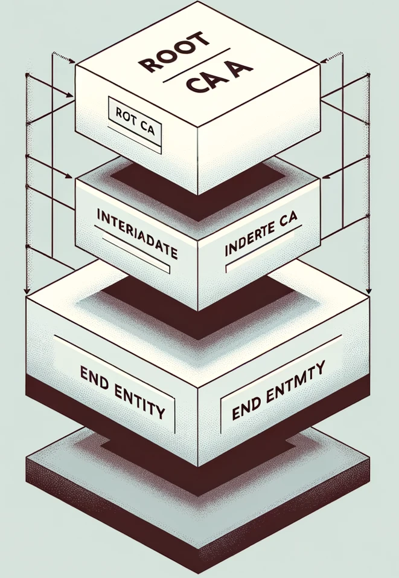
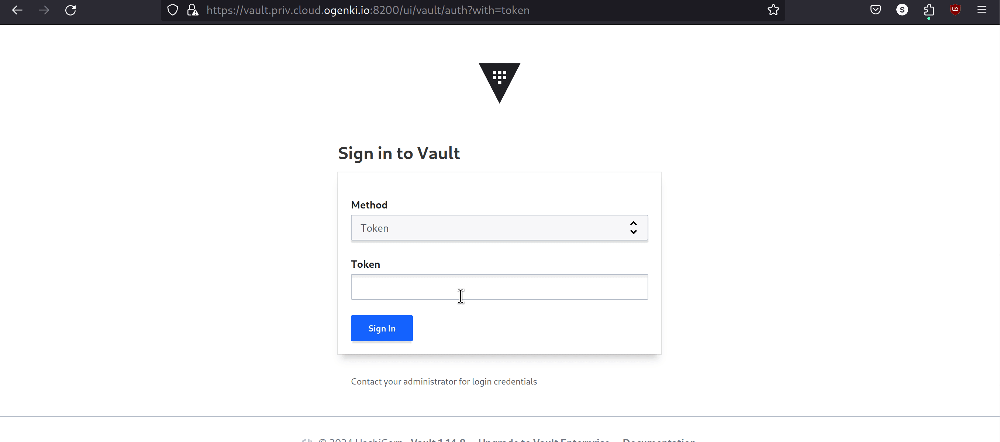

+++
author = "Smaine Kahlouch"
title = "`TLS` with Gateway API: Efficient and Secure Management of Public and Private Certificates"
date = "2024-02-01"
summary = "Building a robust PKI strategy for managing public and private TLS certificates using `Cert-Manager`, `Vault`, and `Let's Encrypt`."
featured = true
codeMaxLines = 21
usePageBundles = true
toc = true
tags = [
    "security"
]
thumbnail= "thumbnail.png"
+++

**TLS encryption** is an essential standard in securing services and applications, whether on the internet or within an enterprise. On the internet, using a TLS certificate validated by a recognized certification authority is crucial to ensure the confidentiality of data exchanges.

For internal communications, a private PKI (**Private Public Key Infrastructure**) plays a critical role in distributing and validating the certificates necessary for encrypting communications within the enterprise, thus ensuring enhanced security.

In this article, we will delve into setting up an effective and robust management of TLS certificates within an enterprise. We will explore best practices, tools, and strategies for a reliable certificate infrastructure.


## 🎯 Our target

<center></center>

* In order to allow users to access to our applications, we will use the [**Gateway API**](https://gateway-api.sigs.k8s.io/) standard. (You may want to have a look at my [previous article](https://blog.ogenki.io/post/cilium-gateway-api/) on the topic.)
* In the architecture presented above, one component plays a major role: [**Cert-manager**](https://cert-manager.io/). Indeed, it is the central engine that will handle the generation and renewal of certificates.
* For applications intended to remain internal and not exposed on the internet, we will opt for generating certificates via a **private PKI** with [**HashiCorp's Vault**](https://www.vaultproject.io/).
* On the other hand, for public applications, we will use certificates issued by [**Let's Encrypt**](https://letsencrypt.org/).


## 🛂 About Let's Encrypt

<table>
  <tr>
    <td style="vertical-align:middle; padding-left:20px;">
      Based on the ACME protocol (Automatic Certificate Management Environment), this solution enables <strong>automatic installation and renewal of certificates</strong>.<br>
      <a href="https://letsencrypt.org/"> <strong>Let's Encrypt</strong></a> is simple to implement, free, and enhances security. However, it's important to note that the certificates have a short duration, requiring frequent renewals.<br>
      For more information on how it works, you can refer to this <a href="https://letsencrypt.org/how-it-works/">documentation</a>.
    </td>
    <td>
      
    </td>
  </tr>
</table>

## 🔐 A private PKI with Vault

A private PKI, or **Private Public Key Infrastructure**, is a cryptographic system used within an organization to secure data and communications. It relies on an internal **Certification Authority** (CA) that issues organization-specific **TLS certificates**.

This system enables an organization to:

* Fully control the identity verification and authentication procedures, and to **issue certificates** for internal domains, which is not feasible with Let's Encrypt.
* **Secure internal communications** and data with strong authentication and encryption within the organization.

However, implementing such an infrastructure requires **careful attention** and the management of multiple components. Here, we'll explore one of the main features of **Vault**, which is initially a secret management tool but can also serve as a private PKI.

{}
All the actions performed in this post come from this [**git repository**](https://github.com/Smana/demo-cloud-native-ref)

It contains the `Opentofu` code for deploying and configuring Vault as well as **numerous resources** that help me write my blog posts. Feel free to provide feedback or open issues... 🙏
{}

### ✅ Requirements

{}
<table>
  <tr>
    <td>
      
    </td>
    <td style="vertical-align:middle; padding-left:20px;">
      A <strong>three-tier PKI</strong> consists of a Root Certificate Authority (CA) at the top, Intermediate CAs in the middle, and End Entities at the bottom. The Root CA issues certificates to the Intermediate CAs, and the Intermediate CAs to End Entities which in turn issue certificates to end users or devices. </br>
      This structure <strong>enhances security</strong> by minimizing the Root CA's exposure and simplifies management and revocation of certificates, offering a scalable and flexible solution for digital security.
    </td>
  </tr>
</table>
{}

To enhance the security of the certificate management system, it's recommended to create an offline Root Certification Authority (Root CA). Therefore, we need to complete the following steps beforehand:

* Generate the **Offline Root Certification Authority**: This approach minimizes security risks by isolating the Root CA from the network.

* Create an **Intermediate Certification Authority**: It operates under the Root CA's authority and is used to issue certificates, allowing for more flexible and secure management.

* Generate the **certificate for the Vault server from the Intermediate CA**: This ensures a trust chain from the Root CA to the end-user certificates, through the Intermediate CA.

By following the procedure described [**here**](https://github.com/Smana/demo-cloud-native-ref/blob/main/opentofu/openbao/cluster/docs/pki_requirements.md), you should obtain the following files which will be used throughout the rest of this article. This is a suggestion based on `openssl`, and you may use the method that best suits you to achieve the same outcome.

```console
cd opentofu/openbao/cluster

ls .tls/*.pem
.tls/bundle.pem  .tls/ca-chain.pem  .tls/intermediate-ca-key.pem  .tls/intermediate-ca.pem  .tls/root-ca-key.pem  .tls/root-ca.pem  .tls/vault-key.pem  .tls/vault.pem
```

### 🏗️ Building the cluster

There are several methods to deploy a Vault cluster, but I couldn't find one that suited me, so I built my own by making the following decisions:

* **Integrated storage** based on the [Raft](https://raft.github.io/) protocol, which is particularly suited for distributed systems and ensures high resilience. Below is a table illustrating fault tolerance depending on the cluster size:

  | Cluster size | Failure tolerance |
  |--------------|-------------------|
  |      1       |         0         |
  |      3       |         1         |
  |      5       |         2         |
  |      7       |         3         |

  I chose to run a Vault cluster that consists of **5 members**, allowing to tolerate the failure of 2 nodes.

* **Ephemeral node strategy with SPOT instances**: The architecture exclusively comprises SPOT instances for optimal cost efficiency. The _Autoscaling Group_ is configured with three distinct SPOT instance pools, each utilizing a different instance type. This strategic diversification aims to mitigate any potential failure due to a specific SPOT instance type shortage, thus ensuring high availability and a service continuity while maximizing cost efficiency.

* **Vault Auto-Unseal feature**: This function is crucial given the ephemeral nature of our nodes. It minimizes downtime and eliminates the need for manual interventions for Vault unsealing.

This article does not aim to describe all the steps, which are available in the [GitHub repo documentation](https://github.com/Smana/demo-cloud-native-ref/blob/main/opentofu/openbao/cluster/docs/getting_started.md). Here is an example of `Opentofu` variables:

```hcl
name                  = "ogenki-vault"
leader_tls_servername = "vault.priv.cloud.ogenki.io"
domain_name           = "priv.cloud.ogenki.io"
env                   = "dev"
mode                  = "ha"
region                = "eu-west-3"
enable_ssm            = true

# Use hardened AMI
ami_owner = "xxx" # Compte AWS où se trouve l'AMI
ami_filter = {
  "name" = ["*hardened-ubuntu-*"]
}
```

After completing all the steps, Vault can be accessed, and we end up with a cluster consisting of 5 nodes.



### 🛠️ Configuration

Deploying a complete platform is carried out sequentially, in **distinct steps**, because some operations must be done **manually** to ensure optimal security: The generation of the root certificate, which must be kept offline, and the initialization of Vault with the initial root token.


Obviously, supporting resources such as network components are required to deploy machines, then the Vault cluster can be installed and configured before considering the addition of other infrastructure elements, which will likely depend on the sensitive information stored in Vault.

The Vault configuration is applied using the [Terraform provider](https://registry.terraform.io/providers/hashicorp/vault/latest/docs), which authenticates using a token generated from the Vault instance. The proposal [**here**](https://github.com/Smana/demo-cloud-native-ref/tree/main/opentofu/openbao/management) demonstrates how to configure the PKI and allow internal applications to access to Vault's API, particularly on how to configure `Cert-Manager`.

Here are the organization's specific variables:

```hcl
domain_name      = "priv.cloud.ogenki.io"
pki_common_name  = "Ogenki Vault Issuer"
pki_country      = "France"
pki_organization = "Ogenki"
pki_domains = [
  "cluster.local",
  "priv.cloud.ogenki.io"
]
```

After following the procedure, the PKI is configured, and we can **generate certificates**.


{}
Unlike public PKIs, where certificates are automatically trusted by client software, in a private PKI, the certificates need to be manually approved and installed on users devices.

* [Ubuntu](https://ubuntu.com/server/docs/security-trust-store)
* [Archlinux](https://wiki.archlinux.org/title/Transport_Layer_Security#Add_a_certificate_to_a_trust_store)
* [macOS](https://support.apple.com/guide/keychain-access/add-certificates-to-a-keychain-kyca2431/mac)
* [Windows Server](https://learn.microsoft.com/en-us/windows-server/networking/core-network-guide/cncg/server-certs/install-the-certification-authority)
{}

### 💾 Scheduled Backups

Like any solution holding data, it is crucial to **back it up**. Especially for Vault which contains sensitive data: Regular backups to a secure location are therefore necessary.
The solution proposed [**here**](https://github.com/Smana/demo-cloud-native-ref/tree/main/security/base/vault-snapshot) is simply a _Cronjob_. It uses [Crossplane](https://www.crossplane.io/) to provision AWS resources and is broken down as follows:

* An `S3 bucket` for storing the snapshots
* A `lifecycle policy` to keep only the last 30 backups.
* The bucket is encrypted with a specific `KMS key`.
* An `external-secret` to retrieve the authentication parameters of the `Approle` specific to the _Cronjob_.
* A `Cronjob` that executes [the script available in the repo](https://github.com/Smana/demo-cloud-native-ref/blob/main/scripts/vault-snapshot.sh) and performs a snapshot as described in [Hashicorp's documentation](https://developer.hashicorp.com/vault/tutorials/standard-procedures/sop-backup).
* An `IRSA role` that grants the pod permissions to write the snapshots to S3.

## 🚀 TLS with Gateway API

The aim of this post is to demonstrate practical usage with `Gateway-API` and, depending on the protocol used, [several options are available](https://gateway-api.sigs.k8s.io/guides/tls/) for securing connections with TLS. For instance, we can use `Passthrough` to set TLS termination at the upstream (directly exposed by the pod). </br>
However, for our use case, we will use the most common scenario: **HTTPS at the Gateway level**.

Basically we only need to specify a Kubernetes _secret_ that stores the certificate.

```yaml
listeners:
- protocol: HTTPS
  port: 443
  tls:
    mode: Terminate
    certificateRefs:
    - name: foobar-tls
```

Let's look into this in detail, as there are a few preliminary steps in order to obtain these secrets 🔍.

### ☁️ A Public Certificate

{}
<table>
  <tr>
    <td width="180">
      
    </td>
    <td style="vertical-align:middle; padding-left:20px;">
       <a href="https://cert-manager.io/"> <strong>Cert-Manager</strong> </a> is an open-source tool for managing TLS certificates in Kubernetes. </br>
       It is basically a Kubernetes operator that is controlled through the use of CRDs (Custom Resource Definitions): it is indeed possible to generate certificates by creating resources of type <span style="color: red; font-family: 'Courier New', monospace;">certificate</span>. Cert-manager then takes care of ensuring they are always valid and initiates a renewal when necessary.</br>
       It can be integrated with an <a href="https://cert-manager.io/docs/configuration/issuers/">increasing number</a> of issuers such as <strong>Let's Encrypt</strong>, Venafi, Google, <strong>Vault</strong>, etc.
    </td>
  </tr>
</table>
{}

In order to configure Cert-manager with Let's Encrypt we'll create a `ClusterIssuer`. </br>
ℹ️ In the context of cert-manager, an `Issuer` is a Kubernetes resource that generates and manages certificates within a specific namespace, while a `ClusterIssuer` is a global resource that operates at the cluster level and can manage certificates across all namespaces.

[security/base/cert-manager/le-clusterissuer-prod.yaml](https://github.com/Smana/demo-cloud-native-ref/blob/main/security/base/cert-manager/le-clusterissuer-prod.yaml)

```yaml
apiVersion: cert-manager.io/v1
kind: ClusterIssuer
metadata:
  name: letsencrypt-prod
spec:
  acme:
    email: mymail@domain.tld
    server: https://acme-v02.api.letsencrypt.org/directory
    privateKeySecretRef:
      name: ogenki-issuer-account-key
    solvers:
      - selector:
          dnsZones:
            - "cloud.ogenki.io"
        dns01:
          route53:
            region: eu-west-3
```
* We are using the production instance of Let's Encrypt here, which is subject to certain rules, and it is recommended to start your tests on the **staging instance**.
* The email address is used to receive **notifications**, such as the need for renewal.
* An `ogenki-issuer-account-key` key is generated and used to authenticate with the ACME server.
* The mechanism that proves the legitimacy of a certificate request is done through **DNS resolution**.

Now, how can we call this `ClusterIssuer` from a `Gateway-API` resource?
It turns out there is a very simple integration through the use of an **annotation** at the `Gateway` level. This solution is experimental and requires a specific parameter during the deployment of cert-manager.

[security/base/cert-manager/helmrelease.yaml](https://github.com/Smana/demo-cloud-native-ref/blob/main/security/base/cert-manager/helmrelease.yaml)
```yaml {hl_lines=[9]}
apiVersion: helm.toolkit.fluxcd.io/v2beta2
kind: HelmRelease
metadata:
  name: cert-manager
  namespace: security
spec:
  values:
...
    featureGates: ExperimentalGatewayAPISupport=true
```

It's also necessary to grant permissions to the Cert-manager controller to interact with Route53 to complete the DNS challenge. [Here](https://github.com/Smana/demo-cloud-native-ref/blob/main/security/base/cert-manager/irsa.yaml), I'm using a Crossplane `Composition`. (ℹ️ If you want to delve into `Crossplane`, it's [over here](https://blog.ogenki.io/post/crossplane_composition_functions/).)

Then, the annotation and the target _secret_ need to be specified in the Gateway manifest.

[infrastructure/base/gapi/platform-public-gateway.yaml](https://github.com/Smana/demo-cloud-native-ref/blob/main/infrastructure/base/gapi/platform-public-gateway.yaml)
```yaml {hl_lines=[6,"13-16"]}
apiVersion: gateway.networking.k8s.io/v1beta1
kind: Gateway
metadata:
  name: platform-public
  annotations:
    cert-manager.io/cluster-issuer: letsencrypt-prod
spec:
  gatewayClassName: cilium
  listeners:
    - name: http
      hostname: "*.${domain_name}"
...
      tls:
        mode: Terminate
        certificateRefs:
          - name: platform-public-tls
```

When the Gateway is created, a certificate is generated. This certificate uses the `ClusterIssuer` _letsencrypt-prod_ mentioned above.

```console
kubectl describe certificate -n infrastructure platform-public-tls
Name:         platform-public-tls
Namespace:    infrastructure
API Version:  cert-manager.io/v1
Kind:         Certificate
...
Spec:
  Dns Names:
    *.cloud.ogenki.io
  Issuer Ref:
    Group:      cert-manager.io
    Kind:       ClusterIssuer
    Name:       letsencrypt-prod
  Secret Name:  platform-public-tls
  Usages:
    digital signature
    key encipherment
Status:
  Conditions:
    Last Transition Time:  2024-01-24T20:43:26Z
    Message:               Certificate is up to date and has not expired
    Observed Generation:   1
    Reason:                Ready
    Status:                True
    Type:                  Ready
  Not After:               2024-04-23T19:43:24Z
  Not Before:              2024-01-24T19:43:25Z
  Renewal Time:            2024-03-24T19:43:24Z
  Revision:                1
```

Finally, after a few seconds, a Kubernetes secret is created containing the certificate. This is a _secret of type `tls` which contains these files: `tls.crt`, `tls.key`, and `ca.crt`.

{}

The certificates generated by cert-manager are stored in **Kubernetes secrets**. Although it is possible to extract them using `base64` and `openssl` commands, why not make life easier?
I am a command line guy and I regularly use the [view-cert](https://github.com/lmolas/kubectl-view-cert) plugin, which displays a summary of `tls` type secrets.

```console
kubectl view-cert -n infrastructure platform-public-tls
[
    {
        "SecretName": "platform-public-tls",
        "Namespace": "infrastructure",
        "Version": 3,
        "SerialNumber": "35f659ad03e437805fbf48111b74738efe3",
        "Issuer": "CN=R3,O=Let's Encrypt,C=US",
        "Validity": {
            "NotBefore": "2024-01-28T09:41:35Z",
            "NotAfter": "2024-04-27T09:41:34Z"
        },
        "Subject": "CN=*.cloud.ogenki.io",
        "IsCA": false
    }
]
```

It can be installed using [krew](https://krew.sigs.k8s.io/)

```console
kubectl krew install view-cert
```

{}

### 🏠 A Private Certificate


Creating **private certificates using Vault** is pretty similar to the above method, with slights differences. We also need to define a `ClusterIssuer`:

[security/base/cert-manager/vault-clusterissuer.yaml](https://github.com/Smana/demo-cloud-native-ref/blob/main/security/base/cert-manager/le-clusterissuer-prod.yaml)
```yaml
apiVersion: cert-manager.io/v1
kind: ClusterIssuer
metadata:
  name: vault
  namespace: security
spec:
  vault:
    server: https://vault.priv.cloud.ogenki.io:8200
    path: pki_private_issuer/sign/ogenki
    caBundle: LS0tLS1CRUdJTiBDRVJUSUZJQ0...
    auth:
      appRole:
        path: approle
        roleId: f8363d0f-b7db-9b08-67ab-8425ab527587
        secretRef:
          name: cert-manager-vault-approle
          key: secretId
```

* The URL specified is that of the Vault server. It must be accessible from the pods within Kubernetes.
* The `path` in Vault is part of the [Vault configuration phase](https://github.com/Smana/demo-cloud-native-ref/blob/main/opentofu/openbao/management/roles.tf). It refers to the role authorized to generate certificates.
* Here, we are using authentication via an [Approle](https://github.com/Smana/demo-cloud-native-ref/blob/main/opentofu/openbao/management/docs/approle.md).

For more details on all the actions necessary for configuring Cert-Manager with Vault, refer to [this procedure](https://github.com/Smana/demo-cloud-native-ref/blob/main/opentofu/openbao/management/docs/cert-manager.md).

The main difference with the method used for Let's Encrypt lies in the fact that **the certificate must be explicitly created**. Indeed, the previous method allowed for automatic creation with an annotation.

[infrastructure/base/gapi/platform-private-gateway-certificate.yaml](https://github.com/Smana/demo-cloud-native-ref/blob/main/infrastructure/base/gapi/platform-private-gateway-certificate.yaml)
```yaml
apiVersion: cert-manager.io/v1
kind: Certificate
metadata:
  name: private-gateway-certificate
spec:
  secretName: private-gateway-tls
  duration: 2160h # 90d
  renewBefore: 360h # 15d
  commonName: private-gateway.priv.cloud.ogenki.io
  dnsNames:
    - gitops-${cluster_name}.priv.${domain_name}
    - grafana-${cluster_name}.priv.${domain_name}
    - harbor.priv.${domain_name}
  issuerRef:
    name: vault
    kind: ClusterIssuer
    group: cert-manager.io
```

As we can see, this certificate is used to serve certificates for `weave-gitops`, `grafana`, and `harbor` applications. It has a validity period of 90 days and will be automatically renewed 15 days before its expiration.

A few seconds after the `certificate` creation, a Kubernetes _secret_ is generated.

```console
kubectl describe certificates -n infrastructure private-gateway-certificate
Name:         private-gateway-certificate
Namespace:    infrastructure
API Version:  cert-manager.io/v1
Kind:         Certificate
...
Spec:
  Common Name:  private-gateway.priv.cloud.ogenki.io
  Dns Names:
    gitops-mycluster-0.priv.cloud.ogenki.io
    grafana-mycluster-0.priv.cloud.ogenki.io
    harbor.priv.cloud.ogenki.io
  Duration:  2160h0m0s
  Issuer Ref:
    Group:       cert-manager.io
    Kind:        ClusterIssuer
    Name:        vault
  Renew Before:  360h0m0s
  Secret Name:   private-gateway-tls
Status:
  Conditions:
    Last Transition Time:  2024-01-27T19:54:57Z
    Message:               Certificate is up to date and has not expired
    Observed Generation:   1
    Reason:                Ready
    Status:                True
    Type:                  Ready
  Not After:               2024-04-26T19:54:57Z
  Not Before:              2024-01-27T19:54:27Z
  Renewal Time:            2024-04-11T19:54:57Z
  Revision:                1
Events:
  Type    Reason     Age   From                                       Message
  ----    ------     ----  ----                                       -------
  Normal  Issuing    41m   cert-manager-certificates-trigger          Issuing certificate as Secret does not exist
  Normal  Generated  41m   cert-manager-certificates-key-manager      Stored new private key in temporary Secret resource "private-gateway-certificate-jggkv"
  Normal  Requested  41m   cert-manager-certificates-request-manager  Created new CertificateRequest resource "private-gateway-certificate-1"
  Normal  Issuing    38m   cert-manager-certificates-issuing          The certificate has been successfully issued
```

Finally, we just have to use this secret in the declaration of the private `Gateway`.

[infrastructure/base/gapi/platform-private-gateway.yaml](https://github.com/Smana/demo-cloud-native-ref/blob/main/infrastructure/base/gapi/platform-private-gateway.yaml)
```yaml {hl_lines=[9,14]}
apiVersion: gateway.networking.k8s.io/v1beta1
kind: Gateway
metadata:
  name: platform-private
spec:
  gatewayClassName: cilium
  listeners:
    - name: http
      hostname: "*.priv.${domain_name}"
...
      tls:
        mode: Terminate
        certificateRefs:
          - name: private-gateway-tls
```

We can **verify** the certification authority using the `curl` command:

```console
curl --verbose -k https://gitops-mycluster-0.priv.cloud.ogenki.io 2>&1 | grep 'issuer:'
*  issuer: O=Ogenki; CN=Ogenki Vault Issuer
```


## 💭 Final Thoughts

❓ Who hasn't experienced an incident related to certificate renewal?
❓ How to achieve a security level that meets enterprise standards?
❓ How can we simplify operational tasks related to TLS certificates maintenance?

This article has explored a concrete answer to these questions. Thanks to the automation built with **Cert-manager**, operational tasks are minimized while enhancing the security level.

The setup process for **Let's Encrypt** and the `Gateway API` is incredibly straightforward! Furthermore, the level of security that **Vault** offers for internal communications is certainly worth taking into account. However, it's clear that implementing multiple components requires meticulous attention during the setup of this entire infrastructure to ensure optimal security is maintained.

{}
It's important to recall some recommendations and best practices before considering a production deployment. To keep this article readable, some points have not been addressed, but it is **crucial** to include them in your strategy:

* Keep the **root certificate offline**. In other words, it's imperative to store it on a non-connected medium to protect it from any potential threats.
* The **revocation** of the root or intermediate CA wasn't discussed. As well as the provision of a revocation list (Certificate Revocation List).
* Access to the Vault API must be rigorously **restricted to a private network**. You should take a look at my [article on Tailscale](https://blog.ogenki.io/post/tailscale/).
* Also note that I didn't talk about authentication at all, but it's essential to set up an **identity provider** from the start and enable multi-factor authentication (**MFA**) to enhance security. Moreover, it's advisable to revoke Vault's **root token** once adequate authentication and permissions are in place. If necessary, the token can be regenerated following the procedure available [here](https://developer.hashicorp.com/vault/tutorials/operations/generate-root).
* The default Opentofu AMI value for the AMI (AWS Instance Image) deploys an Ubuntu from Canonical. It's recommended to use one that has been **hardened**. I built mine using this [project](https://github.com/konstruktoid/hardened-images).
* To be able to initialize Vault, a command must be run on the instance, which justifies the use of [**SSM**](https://docs.aws.amazon.com/systems-manager/latest/userguide/session-manager-working-with-sessions-start.html). However, it's advisable to **disable** it when the initialization phase is over (`enable_ssm: false` in the Opentofu variables).
* Send **audit logs** to a [SIEM](https://en.wikipedia.org/wiki/Security_information_and_event_management) to be able to detect suspicious behaviors.
* **Alert** before the certificates expire. For example, you can use [this exporter](https://github.com/enix/x509-certificate-exporter) Prometheus open-sourced by the folks at Enix 😉. This is an additional safety measure, knowing that the proposed architecture makes everything automated.
* Pay **special attention to KMS keys**: the one used to unseal Vault, but also the one that allows creating snapshots. They are vital for restoring your backups.
* _"A backup that's not verified is worthless"_: Therefore, construct a workflow that will **verify the consistency of data** in Vault. This might be the subject of another article, stay tuned!
* Organize periodic disaster recovery (**DR**) exercises to ensure your ability to rebuild the entire system from scratch, making sure you have all the necessary documentation and tools.
{}

## 🔖 References

**Github Issues**
* Cert-manager and Vault: ["The CA full chain is not included into the ca.crt"](https://github.com/cert-manager/cert-manager/issues/6632)

**Blog posts**
* [Private vs Public PKI: Building an Effective Plan](https://www.ssl.com/article/private-vs-public-pki-building-an-effective-plan/) (Author: Nick Naziridis)
* [PKI Best practices for 2023](https://www.ssl.com/article/pki-best-practices-for-2023/)
* [Build an Internal PKI with Vault](https://sestegra.medium.com/build-an-internal-pki-with-vault-f7179306f18c) (Author: Stéphane Este-Gracias)

**Hashicorp Documentation**
* Regarding the integrated Raft storage:
  - [Reference Architecture](https://developer.hashicorp.com/vault/tutorials/day-one-raft/raft-reference-architecture)
  - [Deployment Guide](https://developer.hashicorp.com/vault/tutorials/day-one-raft/raft-deployment-guide)
  - [AWS](https://developer.hashicorp.com/vault/tutorials/raft/raft-storage-aws)
* [Production hardening](https://developer.hashicorp.com/vault/tutorials/day-one-raft/production-hardening)
* [PKI](https://developer.hashicorp.com/vault/tutorials/secrets-management/pki-engine-external-ca)
