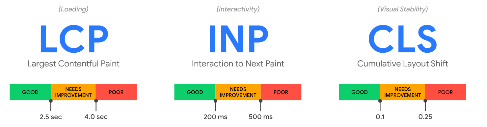
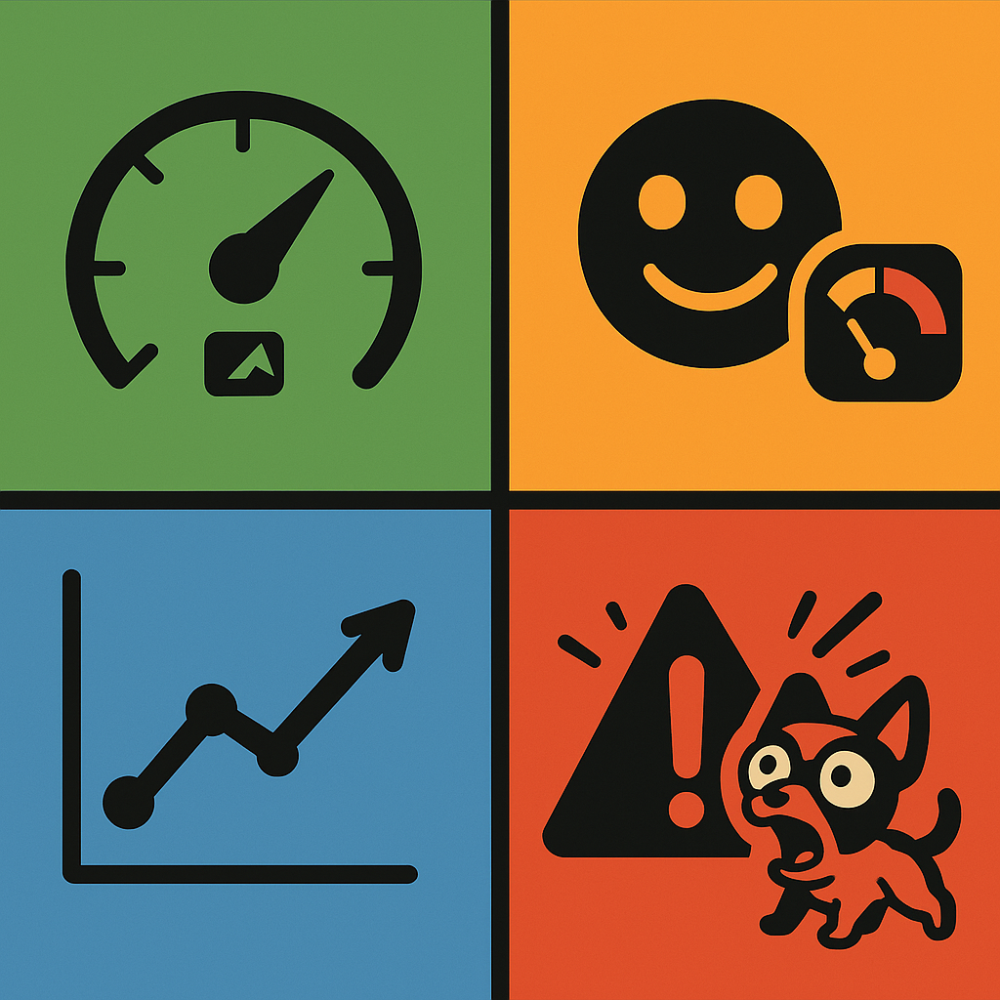
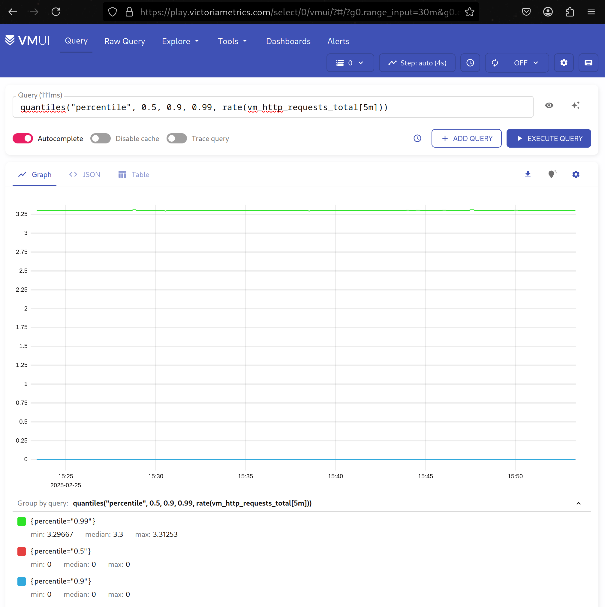
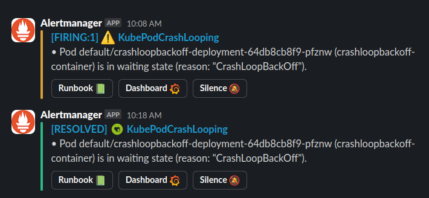
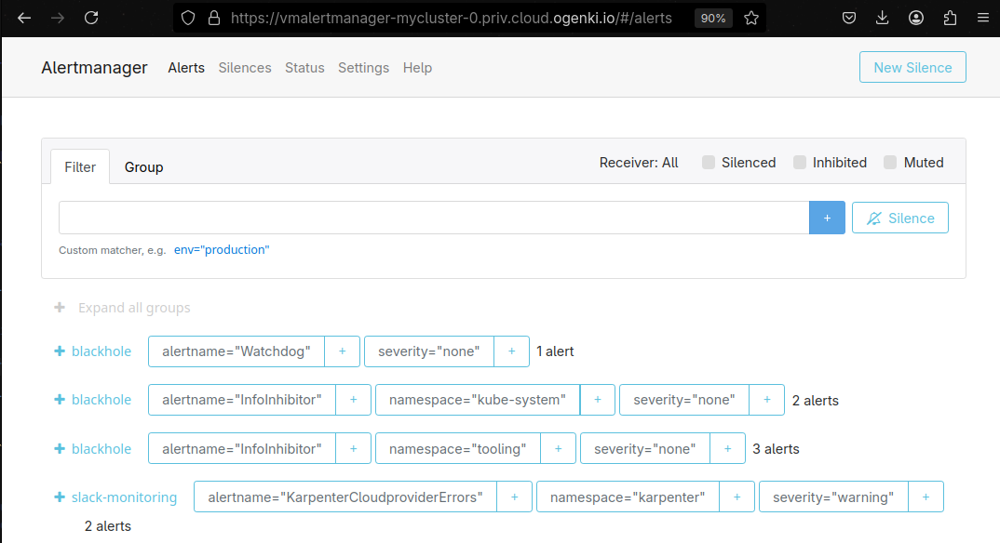
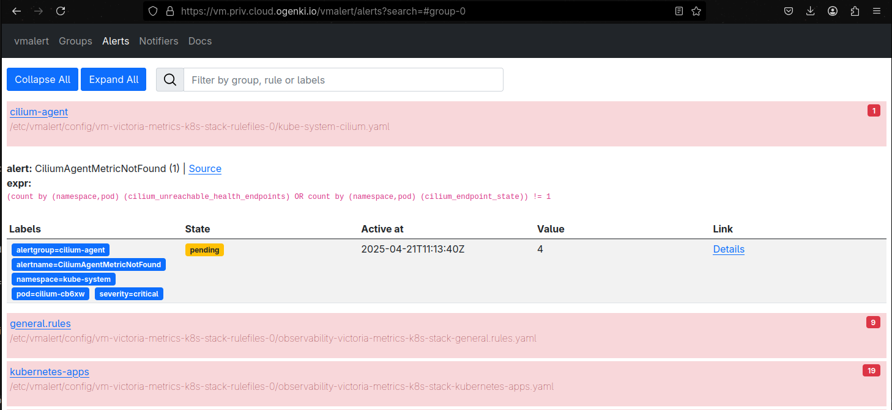
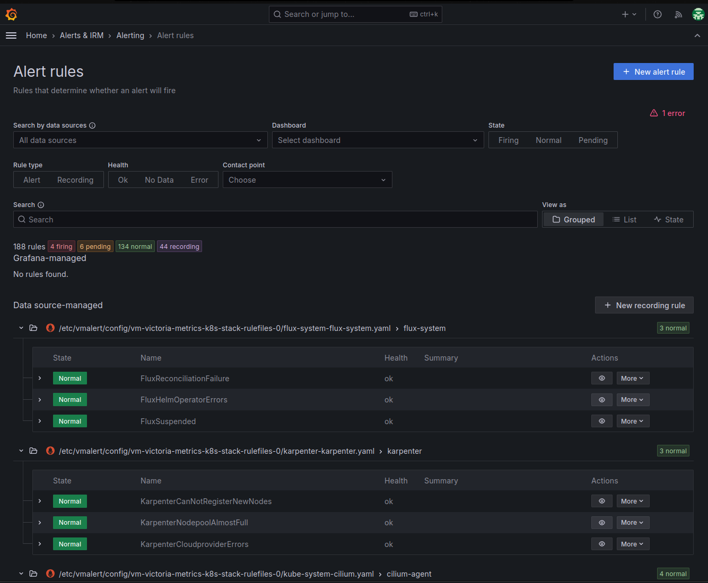

+++
author = "Smaine Kahlouch"
title = "`VictoriaMetrics` : Effective alerts, from theory to practice 🛠️"
date = "2025-04-21"
summary = "From `Core Web Vitals` to `Golden Signals`, through Slack notification configuration, discover how to set up effective alerts with the VictoriaMetrics operator."
featured = true
codeMaxLines = 21
usePageBundles = true
toc = true
series = [
  "observability"
]
tags = [
    "observability"
]
thumbnail= "thumbnail.png"
+++

{}
Once our application is deployed, it is essential to have indicators that help identify potential issues and track performance changes. Among these sources of information, **metrics** and **logs** play an essential role by providing valuable insights into the application's operation. Additionally, it is often useful to implement detailed **tracing** to accurately track all actions performed within the application.

In this [series of blog posts](https://blog.ogenki.io/fr/tags/observability/), we will explore the various areas of application monitoring. The goal is to thoroughly analyze the state of our applications, in order to improve their **availability** and **performance**, while ensuring an optimal user experience.
{}

In a [previous blog post](https://blog.ogenki.io/fr/post/series/observability/metrics/), we've seen how to collect and visualize metrics. These metrics allow us to analyze our applications' behavior and performance. It's also crucial to configure **alerts** to be notified of misbehaviours on our platform.

## 🎯 Our targets

* 📊 Understand standard approaches for defining effective alerts: "**Core Web Vitals**" and "**Golden Signals**"
* 🔍 Discover **PromQL** and **MetricsQL** languages for writing alert rules
* ⚙️ Configure alerts declaratively with **VictoriaMetrics Operator**
* 📱 **Route these alerts** to different Slack channels

## 📋 Prerequisites

Here we assume you already have:

* A working VictoriaMetrics instance deployed on a Kubernetes cluster
* Access to a Slack workspace for notifications

Setting up relevant alerts essential any observability strategy. However, defining appropriate thresholds and avoiding alert fatigue requires a thoughtful and methodical approach.

We'll see in this article that it's very easy to set thresholds beyond which we would be notified. However, making these alerts **relevant** isn't always straightforward.

## 🔍 What Makes a Good Alert?

<center></center>

A properly configured alert allows us to identify and resolve problems within our system **proactively**, before the situation becomes worse. Effective alerts should:

- Signal problems requiring **immediate intervention**
- Be triggered **at the right time**: early enough to prevent user impact, but not so frequently as to cause alert fatigue
- Indicate the **root cause** or area requiring investigation. To achieve this, it's recommended to perform an analysis that prioritizes relevant metrics that directly reflect service quality and user experience ([SLIs](https://sre.google/sre-book/service-level-objectives/))

Therefore, it's important to focus on a **controlled number** of metrics to monitor. There are approaches that allow us to implement effective monitoring of our systems.
Here we'll focus on two widely used alert models: **Core Web Vitals** and **Golden Signals**.

### 🌐 The "Core Web Vitals"

Core Web Vitals are metrics developed by Google to evaluate the **user experience** on web applications. They highlight metrics related to end-user satisfaction and help ensure our application offers good performance for real users. These metrics focus on three main aspects:

<center></center>

- **Largest Contentful Paint** (LCP), *Page Load Time*: LCP measures the time needed for the largest visible content element on a web page (for example, an image, video, or large text block) to be **fully rendered** in the web browser. A good LCP is below **2.5 seconds**.

- **Interaction to Next Paint** (INP), *Responsiveness*: INP evaluates a web page's responsiveness by measuring the **latency of all user interactions**, such as clicks, taps, and keyboard inputs, etc. It reflects the time needed for a page to visually respond to an interaction, that is, the delay before the browser displays the next render after a user action. A good INP should be less than **200 milliseconds**

- **Cumulative Layout Shift** (CLS), *Visual Stability*: CLS evaluates **visual stability** by quantifying unexpected layout shifts on a page, when elements move during loading or interaction. A good CLS score is less than or equal to **0.1**.

A website's performance is considered satisfactory if it reaches the thresholds described above at the **75th percentile**, thus favoring a good user experience and, consequently, better retention and search engine optimization ([SEO](https://en.wikipedia.org/wiki/Search_engine_optimization)).

{}
Adding specific alerts for these metrics requires careful consideration. Unlike classic metrics, such as availability or error rates, which directly reflect system stability, *Web Vitals* depend on **many external factors**, such as users' network conditions or their devices, making thresholds more complex to monitor effectively.

To avoid unnecessary alert overload, these alerts should only target **significant degradations**. For example, a sudden increase in **CLS** (visual stability) or a continuous deterioration of **LCP** (load time) over several days might indicate important problems requiring intervention.
{}

Finally, these alerts require appropriate tools, such as *RUM (Real User Monitoring)* for real data or *Synthetic Monitoring* for simulated tests, which require a specific solution not covered in this article.

### ✨ The "Golden Signals"

<center></center>

The _Golden Signals_ are a set of **four key metrics**, widely used in the field of system and application monitoring, particularly with tools like Prometheus. These signals allow effective monitoring of application health and performance. They are particularly appropriate in the context of a distributed architecture:

* **Latency** ⏳: It includes both successful request time and failed request time. Latency is crucial because an increase in response time can indicate performance problems.

* **Traffic** 📶: It can be measured in terms of requests per second, data throughput, or other metrics that express system load.

* **Errors** ❌: This is the failure rate of requests or transactions. This can include application errors, infrastructure errors, or any situation where a request didn't complete correctly (for example, HTTP 5xx responses or rejected requests).

* **Saturation** 📈: This is a measure of system resource usage, such as CPU, memory, or network bandwidth. Saturation indicates how close the system is to its limits. A saturated system can lead to slowdowns or failures.

These Golden Signals are essential because they allow us to **focus monitoring on critical aspects** that can quickly affect user experience or overall system performance. With Prometheus, these signals are often monitored via specific metrics to trigger alerts when certain thresholds are exceeded.

{}
I've mentioned here two methodologies that I find are a good starting point for optimizing our alerting system. That said, others exist, each with their specificities. We can mention [USE](https://www.brendangregg.com/usemethod.html) or [RED](https://grafana.com/blog/2018/08/02/the-red-method-how-to-instrument-your-services/) among others.

Similarly, beyond the Core Web Vitals presented above, other web metrics like **[FCP](https://web.dev/articles/fcp)** (First Contentful Paint) or **[TTFB](https://web.dev/articles/ttfb)** (Time To First Byte) can prove useful depending on your specific needs.

The main thing is to keep in mind that a good alerting strategy relies on a targeted set of relevant metrics 🎯
{}

You got it: Defining alerts requires thought! Now let's get practical and see **how to define thresholds from our metrics**.

## 🔍 Understanding PromQL and MetricsQL Query Languages

Metrics collected with Prometheus can be queried using a specific language called `PromQL` (Prometheus Query Language). This language allows extracting monitoring data, performing **calculations**, **aggregating** results, applying **filters**, and also configuring **alerts**.

(ℹ️ Refer to the [previous article](https://blog.ogenki.io/fr/post/series/observability/metrics/#-quest-ce-quune-m%C3%A9trique) to understand what we mean by metric.)

PromQL is a powerful language, here are some simple examples applied to metrics exposed by an Nginx web server:

* Total number of processed requests (`nginx_http_requests_total`) - returns the total count since server start:
  ```promql
  nginx_http_requests_total
  ```

* Request rate over a 5-minute window - calculates requests per second:
  ```promql
  rate(nginx_http_requests_total[5m])
  ```

* Error rate - calculates 5xx errors per second over the last 5 minutes:
  ```promql
  rate(nginx_http_requests_total{status=~"5.."}[5m])
  ```

* Request rate by pod - calculates requests/sec for each pod in namespace "myns":
  ```promql
  sum(rate(nginx_http_requests_total{namespace="myns"}[5m])) by (pod)
  ```

💡 In the examples above, we made use of two _Golden Signals_: traffic 📶 and errors ❌.

`MetricsQL` is the language used with VictoriaMetrics. It aims to be compatible with PromQL with slight differences that make it easier to write complex queries.</br>
It also brings new functions, here are some examples:

* `histogram(q)`: This function calculates a histogram for each group of points having the same timestamp, which is useful for visualizing a large number of time series via a heatmap.</br>
  To create a histogram of HTTP requests:
  ```promql
  histogram(rate(vm_http_requests_total[5m]))
  ```

* `quantiles("phiLabel", phi1, ..., phiN, q)`: Used to extract multiple quantiles (or percentiles) from a given metric.</br>
  To calculate the 50th, 90th, and 99th percentiles of HTTP request rate:
  ```promql
  quantiles("percentile", 0.5, 0.9, 0.99, rate(vm_http_requests_total[5m]))
  ```

To test your queries, you can use the demo provided by VictoriaMetrics: https://play.victoriametrics.com

<center></center>

## 🛠️ Configuring Alerts with the VictoriaMetrics Operator

VictoriaMetrics offers two essential components for alert management:
- **VMAlert**: responsible for evaluating alert rules
- **AlertManager**: manages routing and distribution of notifications

### VMAlert: The Rule Evaluation Engine

VMAlert is the component that continuously evaluates defined alert rules. It supports two types of rules:

* **Recording Rules** 📊
   Recording rules allow pre-calculating complex PromQL expressions and storing them as new metrics to optimize performance.

* **Alerting Rules** 🚨
   Alerting rules define conditions that trigger alerts when certain thresholds are exceeded.

In this blog post, we'll focus on alerting rules which are essential for proactive problem detection.

{}
<table>
  <tr>
        <td>
          
        </td>
        <td style="vertical-align:middle; padding-left:10px;" width="70%">

The rest of this article comes from a set of configurations you can find in the <strong><a href="https://github.com/Smana/cloud-native-ref">Cloud Native Ref</a></strong> repository.</br>
It uses many operators, including the one for [VictoriaMetrics](https://github.com/VictoriaMetrics/operator).

This project aims to <strong>quickly start a complete platform</strong> that applies best practices in terms of automation, monitoring, security, etc.</br>
Comments and contributions are welcome 🙏
        </td>
  </tr>
</table>
{}

### Declaring an Alerting Rule with `VMRule`

We've seen previously that VictoriaMetrics provides a Kubernetes operator that allows managing different components declaratively. Among the available custom resources, `VMRule` allows defining alerts and recording rules.

If you've already used the [Prometheus operator](https://github.com/prometheus-operator/prometheus-operator), you'll find a very similar syntax as the VictoriaMetrics operator is compatible with Prometheus custom resources. (This allows to migrate easily 😉).

Let's take a concrete example with a `VMRule` that monitors the health state of `Flux` resources:

[flux/observability/vmrule.yaml](https://github.com/Smana/cloud-native-ref/blob/main/flux/observability/vmrule.yaml)

```yaml
apiVersion: operator.victoriametrics.com/v1beta1
kind: VMRule
metadata:
  labels:
    prometheus-instance: main
  name: flux-system
  namespace: flux-system
spec:
  groups:
    - name: flux-system
      rules:
        - alert: FluxReconciliationFailure
          annotations:
            message: Flux resource has been unhealthy for more than 5m
            description: "{{ $labels.kind }} {{ $labels.exported_namespace }}/{{ $labels.name }} reconciliation has been failing for more than ten minutes."
            runbook_url: "https://fluxcd.io/flux/cheatsheets/troubleshooting/"
            dashboard: "https://grafana.priv.${domain_name}/dashboards"
          expr: max(gotk_reconcile_condition{status="False",type="Ready"}) by (exported_namespace, name, kind) + on(exported_namespace, name, kind) (max(gotk_reconcile_condition{status="Deleted"}) by (exported_namespace, name, kind)) * 2 == 1
          for: 10m
          labels:
            severity: warning
```

It's recommended to follow some **best practices** to provide maximum context for quickly identifying the root cause.

1. **Naming and Organization** 📝
   - Use descriptive names for rules, like `FluxReconciliationFailure`
   - Group rules by component (ex: `flux-system`, `flux-controllers`)
   - Document reconciliation conditions in annotations

2. **Thresholds and Durations** ⏱️
   - Adjust alert evaluation duration `for: 10m` to avoid false positives
   - Adapt thresholds according to the type of monitored resources
   - Consider different durations depending on the environment (prod/staging)

3. **Labels and Routing** 🏷️
   - Add labels for routing according to context. My example isn't very advanced as it's a demo configuration. But we could very add, for instance, a `team` label to route to the right team, or have different routing policies depending on the environment.
     ```yaml
     labels:
       severity: [critical|warning|info]
       team: [sre|dev|ops]
       environment: [prod|staging|dev]
     ```

4. **The Importance of Annotations** 📚

  Annotations allow adding various information about the alert context
  - A clear **description** of the reconciliation problem
  - The link to the **runbook** for Flux troubleshooting
  - The link to the dedicated **Grafana dashboard**

5. **PromQL Query** 🔍
   ```yaml
   expr: |
     max(gotk_reconcile_condition{status="False",type="Ready"}) by (exported_namespace, name, kind)
     + on(exported_namespace, name, kind)
     (max(gotk_reconcile_condition{status="Deleted"}) by (exported_namespace, name, kind)) * 2 == 1
   ```
   This alert will trigger if Flux fails to reconcile a resource. In detail:
   - The `gotk_reconcile_condition` metric exposes the health state of Flux resources
   - The filter `status="False",type="Ready"` identifies resources that aren't in the "Ready" state
   - The second part of the expression (`status="Deleted"`) detects resources that have been deleted
   - The operation `+ on(...) (...) * 2 == 1` combines these conditions to trigger an alert when:
     - A resource isn't "Ready" (first part = 1) AND has not been deleted (second part = 0)
     - OR a resource has been deleted (second part = 2) regardless of Ready state
   - The `max` and `by` allow grouping alerts by namespace, name, and resource type

## 💬 Integration with Slack

We can send these alerts through different channels or tools. We can mention Grafana OnCall, Opsgenie, PagerDuty, or simply emails, and more...

In our example, we're sending notifications to a Slack channel. We'll first create a Slack application and retrieve the generated token before configuring VictoriaMetrics.

### Slack Application Configuration

1. **Application Creation** 🔧
   - This is done on [https://api.slack.com/apps](https://api.slack.com/apps)
   - Click on "Create New App"
   - Choose "From scratch"
   - Name the application (ex: "AlertManager")
   - Select the target workspace

2. **Permission Configuration** 🔑
   In "OAuth & Permissions", add the following scopes:
   - `chat:write` (Required)
   - `chat:write.public` (For posting in public channels)
   - `channels:read` (For listing channels)
   - `groups:read` (For private groups)

<center>
  <video id="SlackPermissions" controls width="700" autoplay loop muted>
    <source src="slack-permissions.mp4" type="video/mp4">
    Your browser does not support the video tag.
  </video>
</center>

3. **Installation and Token** 🎟️
   - Install the application in the workspace
   - Copy the "Bot User OAuth Token" (starts with `xoxb-`)
   - Store the token securely. In our example, the secret is retrieved from AWS Secrets Manager using the [External Secrets operator](https://external-secrets.io).

### AlertManager Configuration for Slack

The rest of the configuration is done using **Helm** values to configure AlertManager

[observability/base/victoria-metrics-k8s-stack/vm-common-helm-values-configmap.yaml](https://github.com/Smana/cloud-native-ref/blob/main/observability/base/victoria-metrics-k8s-stack/vm-common-helm-values-configmap.yaml)

1. Configure AlertManager to use the Slack token

```yaml
    alertmanager:
      enabled: true
      spec:
        externalURL: "https://vmalertmanager-${cluster_name}.priv.${domain_name}"
        secrets:
          - "victoria-metrics-k8s-stack-alertmanager-slack-app"
      config:
        global:
          slack_api_url: "https://slack.com/api/chat.postMessage"
          http_config:
            authorization:
              credentials_file: /etc/vm/secrets/victoria-metrics-k8s-stack-alertmanager-slack-app/token
```

The External Secrets Operator retrieves the Slack token from AWS Secrets Manager and stores it in a Kubernetes secret named `victoria-metrics-k8s-stack-alertmanager-slack-app`. This secret is then referenced in the Helm values to configure AlertManager's authentication (`config.global.http_config.authorization.credentials_file`).

2. Routing Explanation

```yaml
        route:
          group_by:
            - cluster
            - alertname
            - severity
            - namespace
          group_interval: 5m
          group_wait: 30s
          repeat_interval: 3h
          receiver: "slack-monitoring"
          routes:
            - matchers:
                - alertname =~ "InfoInhibitor|Watchdog|KubeCPUOvercommit"
              receiver: "blackhole"
        receivers:
          - name: "blackhole"
          - name: "slack-monitoring"
```

* **Alert Grouping**: Alert grouping is important to reduce noise and improve notification readability. Without grouping, each alert would be sent individually, which could quickly become unmanageable. The chosen grouping criteria allow logical organization:
  * `group_by` defines the labels to group alerts by
  * `group_wait`: 30s delay before initial notification to allow grouping
  * `group_interval`: 5m interval between notifications for the same group
  * `repeat_interval`: Alerts are only repeated every 3h to avoid spam

* **Receivers**: Receivers are AlertManager components that define how and where to send alert notifications. They can be configured for different communication channels like Slack, Email, PagerDuty, etc. In our configuration:
  * `slack-monitoring`: Main receiver that sends alerts to a specific Slack channel with custom formatting
  * `blackhole`: Special receiver that "absorbs" alerts without transmitting them anywhere, useful for filtering non-relevant or purely technical alerts

{}
Alert routing can be customized based on your team structure and needs. Here's a practical example:

Let's say your organization has an on-call team that needs to be notified immediately about urgent issues. You can route alerts to them when:
- The alert comes from production or security environments
- The issue requires immediate attention from the on-call team

```yaml
        - matchers:
            - environment =~ "prod|security"
            - team = "oncall"
          receiver: "pagerduty"
```
{}

3. **Custom Templates** 📝

This configuration block defines a Slack receiver for AlertManager that uses Monzo templates. [Monzo templates](https://gist.github.com/milesbxf/e2744fc90e9c41b47aa47925f8ff6512) are a set of notification templates that allow formatting Slack alerts in an elegant and informative way.

```yaml
    alertmanager:
      config:
        receivers:
          - name: "slack-monitoring"
            slack_configs:
              - channel: "#alerts"
                send_resolved: true
                title: '{{ template "slack.monzo.title" . }}'
                icon_emoji: '{{ template "slack.monzo.icon_emoji" . }}'
                color: '{{ template "slack.monzo.color" . }}'
                text: '{{ template "slack.monzo.text" . }}'
                actions:
                  - type: button
                    text: "Runbook :green_book:"
                    url: "{{ (index .Alerts 0).Annotations.runbook_url }}"
                  - type: button
                    text: "Query :mag:"
                    url: "{{ (index .Alerts 0).GeneratorURL }}"
                  - type: button
                    text: "Dashboard :grafana:"
                    url: "{{ (index .Alerts 0).Annotations.dashboard }}"
                  - type: button
                    text: "Silence :no_bell:"
                    url: '{{ template "__alert_silence_link" . }}'
                  - type: button
                    text: '{{ template "slack.monzo.link_button_text" . }}'
                    url: "{{ .CommonAnnotations.link_url }}"
```
The notification format shown below demonstrates how alerts can be enriched with interactive elements. Users can quickly access relevant information through action buttons that link to the Grafana dashboard 📊, view the associated runbook 📚, or silence noisy alerts 🔕 when needed.

<center></center>

## 👀 Visualizing and Interacting with Alerts

VictoriaMetrics and its ecosystem provide multiple interfaces for managing and viewing alerts. Here are the main options available:

### Alertmanager: The Standard Solution

`Alertmanager` is the standard component that allows:
- Viewing current alert state
- Configuring notification routing
- Managing silences (temporarily pausing alerts)
- Consulting alert history

<center></center>

### VMUI: The Native VictoriaMetrics Interface

`VMUI` offers a simplified interface for:
- Viewing active alerts
- Visualizing alert rules
- Displaying associated metrics

<center></center>

### Grafana Alerting: A Complete Solution

Although we use Alertmanager for alert definition and routing, `Grafana Alerting` offers a complete alternative solution that allows:
- Centralizing alert management
- Viewing alerts in the context of dashboards
- Configuring alert rules directly from the interface
- Managing silences and notifications

<center></center>

{}
The choice of interface depends on your specific needs:
- Alertmanager is ideal for operational alert management
- VMUI is perfect for a quick and simple view
- Grafana Alerting is recommended if you want a solution integrated with your dashboards
{}

## 🎯 Conclusion

Defining relevant alerts is a key element of any observability strategy. The VictoriaMetrics operator, with its Kubernetes custom resources like `VMRule`, greatly simplifies setting up an effective alerting system. Declarative configuration allows quickly defining complex alert rules while maintaining excellent code readability and maintainability.

However, the technical configuration of alerts, even with powerful tools like VictoriaMetrics, isn't sufficient on its own. An effective alerting strategy must integrate into a broader organizational framework:
- Clear definition of on-call procedures
- Identification of teams responsible for monitoring
- Implementation of runbooks and incident response procedures
- Adaptation of notification channels according to criticality and context

{}
Discover how to integrate these alerts with other components of your observability stack in upcoming articles in this series, particularly correlation with logs and distributed tracing.
{}

## 🔖 References

* https://web.dev/articles/vitals
* https://medium.com/@romanhavronenko/victoriametrics-promql-compliance-d4318203f51e
* https://victoriametrics.com/blog/alerting-recording-rules-alertmanager/
* https://docs.victoriametrics.com/vmalert/
