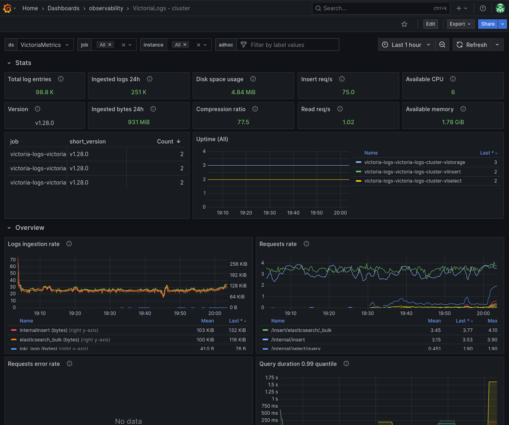

+++
author = "Smaine Kahlouch"
title = "`VictoriaLogs`: What if logs management became simple and performant?"
date = "2025-08-25"
summary = "In the era of distributed architectures, fast and efficient **logs** search remains a **challenge**, involving solutions that are sometimes complex to deploy and operate. Here I introduce a new challenger that might just capture your interest 😉."
featured = true
codeMaxLines = 25
usePageBundles = true
toc = true
series = ["observability"]
tags = ["observability"]
thumbnail= "thumbnail.png"
+++

{}
Once our application is deployed, it is essential to have indicators that help identify potential issues and track performance changes. Among these sources of information, **metrics** and **logs** play an essential role by providing valuable insights into the application's operation. Additionally, it is often useful to implement detailed **tracing** to accurately track all actions performed within the application.

In this [series of blog posts](https://blog.ogenki.io/fr/tags/observability/), we will explore the various areas of application monitoring. The goal is to thoroughly analyze the state of our applications, in order to improve their **availability** and **performance**, while ensuring an optimal user experience.
{}

Too often, logs management means complex solutions and slow queries. Yet **logs** are an essential pillar for understanding, diagnosing, and improving our applications performance and health.

Indeed, while _metrics_ allow us to observe indicator evolution over time and _traces_ let us follow a request's journey through our platform, logs provide the **detailed context** important for understanding events.

## ❓ What are our logs for?

Logs aren't just simple messages we accumulate in a corner of our infrastructure: they constitute the living **memory** of our systems. They're useful because they fulfill several critical roles, here are some concrete scenarios:

-   **Diagnostics and Troubleshooting**: An e-commerce application encounters 500 errors during payment; logs help trace the exact sequence of calls, identify that an external dependency (e.g., payment API) is the cause, and quickly fix the problem.
-   **Security and Compliance**: Logs reveal suspicious connection attempts outside of normal hours; they help detect a _brute force_ attack and strengthen security. They are also essential for meeting regulatory requirements ([GDPR](https://en.wikipedia.org/wiki/General_Data_Protection_Regulation), [PCI DSS](https://www.pcisecuritystandards.org/standards/pci-dss/), etc.).
-   **Proactive Monitoring and Alerting**: Alerting rules automatically detect an abnormal increase in the error rate in the logs of a critical service, allowing intervention before the situation worsens.
-   **Audit and Traceability**: During a GDPR audit, access logs make it possible to precisely reconstruct the history of actions on personal data.

But for these use cases to reveal their full value, it's not enough to collect logs: you must be able to **search them quickly**, **formulate simple queries**, and ensure their **long-term retention** without exploding costs or complexity. </br>

**This is exactly where `VictoriaLogs` comes into play** 🔎

## 🚀 VictoriaLogs: An answer to logs management and analysis

With the adoption of distributed architectures, our platforms generate ever-increasing number of logs.</br>

To leverage these growing volumes, we've traditionally used solutions like ELK (Elasticsearch, Logstash, Kibana) or Grafana Loki, which can sometimes involve operational complexity.

In 2023, `VictoriaLogs` emerged as a promising alternative that might just change the game.

Developed by the team behind the increasingly popular _time series_ database `VictoriaMetrics`, VictoriaLogs inherits the same qualities. Here are its main features:

-   **Easy to deploy and operate**: Its installation and configuration are quite simple, and we will explore the most advanced mode (cluster) together below.
-   **High performance**: Optimized for massive log ingestion and fast analytical queries, even on very large data volumes.
-   **Resource efficiency**: Low CPU and memory footprint, and effective data compression to minimize storage costs compared to other logs management systems.
-   **Integration with the VictoriaMetrics ecosystem**: Integrates naturally with VictoriaMetrics for a unified observability solution, with VMAlert for alerting, and with Grafana for visualization.
-   **Fast Full-Text and Label-based Search**: VictoriaLogs allows for both full-text searches on log content and precise filtering by labels.

{}

Several [references](#-comparisons-and-performance-analyses) attest to the **performance** of VictoriaLogs compared to other log management solutions.

The performance gaps, when compared with ELK or Loki, are quite impressive, whether in terms of **memory usage** or data **compression**.

Regarding log search, VictoriaLogs stands out by effectively combining Elasticsearch's full-text search and Loki's label-based filtering, thus offering the best of **both approaches** while maintaining fast query execution.

{}

### 🗃️ Ingestion and Storage

A log in VictoriaLogs is typically a **JSON object**. Every log must contain the following fields:

-   `_msg`: The raw content of the log message, as produced by the application.
-   `_time`: The timestamp of the log.
-   `_stream`: A set of labels (key-value) that uniquely identify the log source.

💡 In addition to these fields, any other field can be added to the JSON to simplify and optimize search for relevant information according to the context (We will see some examples later).

{}
The `_stream` field in VictoriaLogs optimizes compression and ensures ultra-fast search thanks to the contiguous storage of logs sharing the same labels.

Efficiency depends on a **careful choice**: only constant fields that uniquely identify an application instance (container, namespace, pod) should be part of the stream. Dynamic fields (IP, user_id, trace_id) must remain in the message to avoid excessively high cardinality.
{}

It's possible to store a log simply via a `curl` command, or by [using various agents](https://docs.victoriametrics.com/victorialogs/data-ingestion/#log-collectors-and-data-ingestion-formats) for collecting and transporting logs such as _Promtail_, _FluentBit_, _OpenTelemetry_, and many others.</br>

I chose [**Vector**](https://vector.dev/) because it's a very high-performance solution but also because it's offered by default in the Helm chart we're going to use 😉.

Among the required configuration elements, you must specify the destination but also the essential fields we mentioned earlier, which are configured here using HTTP headers.

```yaml
    sinks:
      vlogs-0:
        compression: gzip
        endpoints:
        - http://<victorialogs_host>:9428/insert/elasticsearch
        healthcheck:
          enabled: false
        inputs:
        - parser
        mode: bulk
        request:
          headers:
            AccountID: "0"
            ProjectID: "0"
            VL-Msg-Field: message,msg,_msg,log.msg,log.message,log
            VL-Stream-Fields: stream,kubernetes.pod_name,kubernetes.container_name,kubernetes.pod_namespace
            VL-Time-Field: timestamp
        type: elasticsearch
```

💡 The header `VL-Msg-Field` tells Vector to search for the log content in several common field names, providing flexibility for different log sources

The logs are collected on a Kubernetes cluster, and Vector **enriches** them with numerous fields to precisely identify their source. Here is a concrete example of an enriched log as it is stored in VictoriaLogs (This log has been intentionally truncated for the purpose of this article):

```json
  {
    "_time": "2025-07-29T07:25:49.870820279Z",
    "_stream_id": "00000000000000006a98e166d58afc9efc6ea35a22d87f1b",
    "_stream": "{kubernetes.container_name=\"loggen\",kubernetes.pod_name=\"loggen-loggen-68dc4f9b8b-6mrqj\",kubernetes.pod_namespace=\"observability\",stream=\"stdout\"}",
    "_msg": "236.161.251.196 - [07/Jul/2025:08:13:41 ] \"GET /homepage HTTP/2\" 204 4367 \"http://localhost/\" \"curl/7.68.0\" \"DE\" 0.83",
    "file": "/var/log/pods/observability_loggen-loggen-68dc4f9b8b-6mrqj_33076791-133a-490f-bd44-97717d242a61/loggen/0.log",
    "kubernetes.container_name": "loggen",
    "kubernetes.node_labels.beta.kubernetes.io/instance-type": "c5.xlarge",
    "kubernetes.node_labels.beta.kubernetes.io/os": "linux",
    "kubernetes.node_[labels.eks.amazonaws.com/capacityType](https://labels.eks.amazonaws.com/capacityType)": "SPOT",
    "kubernetes.pod_ip": "10.0.33.16",
    "kubernetes.pod_labels.app.kubernetes.io/name": "loggen",
    "kubernetes.pod_name": "loggen-loggen-68dc4f9b8b-6mrqj",
    "kubernetes.pod_namespace": "observability",
    "kubernetes.pod_node_name": "ip-10-0-47-231.eu-west-3.compute.internal",
    "source_type": "kubernetes_logs",
    "stream": "stdout"
    <REDACTED>
  }
```

Now that we have an overview of how VictoriaLogs works, I'll propose an installation and configuration method that can be considered for production.

## 🏗️ Installation and Configuration

VictoriaLogs can be installed in 2 ways:

* A `Single` mode which has the advantage of being very simple because a single binary handles all operations. This is the **preferred** mode because it's simple to operate. If you have a powerful machine with enough resources to meet your needs, this mode will always be more performant as it doesn't require network transfers between the different components of the cluster mode.</br>
💡 To ensure high availability, we can also deploy 2 `Single` instances as described [here](https://docs.victoriametrics.com/victorialogs/#single-mode).

* The `Cluster` mode is used for very high loads and when horizontal scaling is needed (when a single machine is not sufficient to meet the demand). Since this is the mode that provides the most flexibility for scaling, we will explore it in this article.

<center></center>

If you've read the [previous article on VictoriaMetrics](https://blog.ogenki.io/post/series/observability/metrics/), you'll notice that the cluster mode architecture is very similar:

* **VLStorage**: This is the component responsible for persisting logs to disk. It's therefore a [Statefulset](https://kubernetes.io/docs/concepts/workloads/controllers/statefulset/), and each pod has a dedicated volume ([Persistent Volume](https://kubernetes.io/docs/concepts/storage/persistent-volumes/)).

* **VLInsert**: This component receives logs from various sources and protocols and is responsible for distributing them to the VLStorages.

* **Vector**: Deployed as a [DaemonSet](https://kubernetes.io/docs/concepts/workloads/controllers/daemonset/), Vector is responsible for transferring logs stored on Kubernetes nodes to the VLInsert service.

* **VLSelect**: This is the service that exposes the API allowing us to execute queries. Data is retrieved from the VLStorages.

* **VMAlert**: To be able to send alerts based on logs, a dedicated [VMAlert](https://docs.victoriametrics.com/victoriametrics/vmalert/) instance is deployed.

The installation is done using the [Helm chart](https://docs.victoriametrics.com/helm/) provided by VictoriaMetrics, by setting a few variables. Here is an example suitable for EKS that we will describe below:

[observability/base/victoria-logs/helmrelease-vlcluster.yaml](https://github.com/Smana/cloud-native-ref/blob/main/observability/base/victoria-logs/helmrelease-vlcluster.yaml)

```yaml
    printNotes: false

    vlselect:
      horizontalPodAutoscaler:
        enabled: true
        maxReplicas: 10
        minReplicas: 2
        metrics:
          - type: Resource
            resource:
              name: cpu
              target:
                type: Utilization
                averageUtilization: 70

      podDisruptionBudget:
        enabled: true
        minAvailable: 1

      affinity:
        podAntiAffinity:
          requiredDuringSchedulingIgnoredDuringExecution:
            - labelSelector:
                matchExpressions:
                  - key: "app"
                    operator: In
                    values:
                      - "vlselect"
              topologyKey: "kubernetes.io/hostname"
      topologySpreadConstraints:
        - labelSelector:
            matchLabels:
              app: vlselect
          maxSkew: 1
          topologyKey: topology.kubernetes.io/zone
          whenUnsatisfiable: ScheduleAnyway

      resources:
        limits:
          cpu: 100m
          memory: 200Mi
        requests:
          cpu: 100m
          memory: 200Mi

      vmServiceScrape:
        enabled: true

    vlinsert:
      horizontalPodAutoscaler:
        enabled: true
        maxReplicas: 10
        minReplicas: 2
        metrics:
          - type: Resource
            resource:
              name: cpu
              target:
                type: Utilization
                averageUtilization: 70

      podDisruptionBudget:
        enabled: true
        minAvailable: 1

      affinity:
        podAntiAffinity:
          requiredDuringSchedulingIgnoredDuringExecution:
            - labelSelector:
                matchExpressions:
                  - key: "app"
                    operator: In
                    values:
                      - "vlinsert"
              topologyKey: "kubernetes.io/hostname"
      topologySpreadConstraints:
        - labelSelector:
            matchLabels:
              app: vlinsert
          maxSkew: 1
          topologyKey: topology.kubernetes.io/zone
          whenUnsatisfiable: ScheduleAnyway

      resources:
        limits:
          cpu: 100m
          memory: 200Mi
        requests:
          cpu: 100m
          memory: 200Mi

      vmServiceScrape:
        enabled: true

    vlstorage:
      # -- Enable deployment of vlstorage component. StatefulSet is used
      enabled: true
      retentionPeriod: 7d
      retentionDiskSpaceUsage: "9GiB"
      replicaCount: 3

      podDisruptionBudget:
        enabled: true
        minAvailable: 1

      affinity:
        podAntiAffinity:
          requiredDuringSchedulingIgnoredDuringExecution:
            - labelSelector:
                matchExpressions:
                  - key: "app"
                    operator: In
                    values:
                      - "vlstorage"
              topologyKey: "kubernetes.io/hostname"
      topologySpreadConstraints:
        - labelSelector:
            matchLabels:
              app: vlstorage
          maxSkew: 1
          topologyKey: topology.kubernetes.io/zone
          whenUnsatisfiable: ScheduleAnyway

      persistentVolume:
        enabled: true
        size: 10Gi

      resources:
        limits:
          cpu: 500m
          memory: 512Mi
        requests:
          cpu: 500m
          memory: 512Mi

      vmServiceScrape:
        enabled: true

    vector:
      enabled: true
```

* **Autoscaling**: The stateless components (`VLSelect` and `VLInsert`) are configured to scale automatically beyond 70% CPU usage.

* **Log Persistence**: For this demo environment, each `VLStorage` instance has a 10Gi EBS volume with a 7-day retention period to prevent disk saturation.

* **High Availability**: The configuration ensures maximum availability through distribution across different zones (`topologySpreadConstraints`) and pod anti-affinity for each component.

* **Monitoring**: The `vmServiceScrape` settings automatically expose the metrics of each component for monitoring via the [VictoriaMetrics operator](https://blog.ogenki.io/post/series/observability/metrics/#-configuration).

Once the Helm chart is installed, we can check that all pods have started correctly.

```console
kubectl get po -n observability -l app.kubernetes.io/instance=victoria-logs
NAME                                                            READY   STATUS    RESTARTS   AGE
victoria-logs-vector-9gww4                                      1/1     Running   0          11m
victoria-logs-vector-frj8l                                      1/1     Running   0          10m
victoria-logs-vector-jxm95                                      1/1     Running   0          10m
victoria-logs-vector-kr6q6                                      1/1     Running   0          12m
victoria-logs-vector-pg2fc                                      1/1     Running   0          12m
victoria-logs-victoria-logs-cluster-vlinsert-dbd47c5fd-cmqj9    1/1     Running   0          11m
victoria-logs-victoria-logs-cluster-vlinsert-dbd47c5fd-mbkwx    1/1     Running   0          12m
victoria-logs-victoria-logs-cluster-vlselect-7fbfbd9f8f-nmv8t   1/1     Running   0          11m
victoria-logs-victoria-logs-cluster-vlselect-7fbfbd9f8f-nrhs4   1/1     Running   0          12m
victoria-logs-victoria-logs-cluster-vlstorage-0                 1/1     Running   0          12m
victoria-logs-victoria-logs-cluster-vlstorage-1                 1/1     Running   0          11m
victoria-logs-victoria-logs-cluster-vlstorage-2                 1/1     Running   0          9m39s
```

And start using the Web UI which is exposed using [Cilium and Gateway API resources](https://blog.ogenki.io/post/cilium-gateway-api/) 🎉

<center>
  <video id="VictoriaLogs" controls width="1000" autoplay loop muted>
    <source src="vlog_demo.mp4" type="video/mp4">
    Your browser does not support the video tag.
  </video>
  <script>
    document.addEventListener('DOMContentLoaded', function() {
      const video = document.getElementById('VictoriaLogs');
      video.playbackRate = 1.5;
    });
  </script>
</center>

{}
All the configuration used for writing this article can be found in the <strong><a href="https://github.com/Smana/cloud-native-ref">Cloud Native Ref</a></strong> repository.</br>

The ambition of this project is to be able to <strong>quickly start a complete platform</strong> that applies best practices in terms of automation, monitoring, security, etc. </br>

Comments and contributions are welcome 🙏
{}

## 👩‍💻 LogsQL: A powerful and easy-to-learn language

LogsQL stands out for its ability to perform fast **full-text** searches and use the **fields** exposed by the logs.

For example, we can search for logs generated by pods whose name starts with `loggen`, then filter these results by including or excluding (by prefixing with `-`) certain character strings.

```logql
kubernetes.pod_name: "loggen"* "GET /homepage" -"example.com"
```

This query will therefore return all calls to the homepage with the GET method, excluding logs containing the domain "example.com".

💡 **Remember**: Full-text search is performed on the content of the `_msg` field.

We will now look at a few examples of simple queries that we could use in a Kubernetes environment.

### ☸ Kubernetes Events

Kubernetes events are a valuable source of information because they often reveal problems related to resource state changes or errors that are not visible elsewhere. It's therefore advisable to analyze them regularly.

⚠️ **Limitation**: These events are ephemeral, and if you want to explore their history, you need a solution to persist this data. Until Vector supports this feature, I'm using [Kubernetes Event Exporter](https://github.com/resmoio/kubernetes-event-exporter), although the project doesn't seem very active.

Once the solution is deployed, we can search for events using the `source` field.

<center></center>

* Use the `~` character to search for **a string within a field**. Here we can view the error notifications for a policy validation defined by Kyverno.

```logql
source:"kubernetes-event-exporter" AND type: "Warning" AND message:~"validation error: Privileged mode is disallowed"
```

* The following query uses the [logical operators](https://docs.victoriametrics.com/victorialogs/logsql/#logical-filter) `AND` and `NOT` to view events of type "Warning" while filtering out Kyverno errors.

```logql
source:"kubernetes-event-exporter" AND type: "Warning" AND NOT reason: "PolicyViolation"
```

### 🌐 Web Server Logs

For the purpose of this article, I created a [small and simple log generator](https://github.com/Smana/loggen).
It allows simulating web server type logs in order to run a few queries.

```console
loggen --sleep 1 --error-rate 0.2 --format json

{
  "remote_addr": "208.175.166.30",
  "remote_user": "-",
  "time_local": "19/Apr/2025:02:11:56 ",
  "request": "PUT /contact HTTP/1.1",
  "status": 202,
  "body_bytes_sent": 3368,
  "http_referer": "[https://github.com/](https://github.com/)",
  "http_user_agent": "Mozilla/5.0 (Macintosh; Intel Mac OS X 10_15_7) AppleWebKit/605.1.15 (KHTML, like Gecko) Version/15.1 Safari/605.1.15",
  "country": "AU",
  "request_time": 0.532
}
```

💡 **Remember**: Logs emitted by applications in JSON format allow all fields of the JSON object to be indexed. This simplifies searches and calculations. However, you must remain mindful of cardinality, which can impact performance.

Vector is configured to **parse JSON logs** and extract their fields. If it's not a JSON log, it keeps the original message without modifying it.

```yaml
    transforms:
      parser:
        inputs:
        - k8s
        source: |
          .log = parse_json(.message) ?? .message
          del(.message)
        type: remap
```

We thus obtain new fields prefixed with `log` in the logs stored by VictoriaLogs.

```json
{
  "log.body_bytes_sent": "4832",
  "log.country": "AU",
  "log.http_referer": "-",
  "log.http_user_agent": "Mozilla/5.0 (Macintosh; Intel Mac OS X 10_15_7) AppleWebKit/605.1.15 (KHTML, like Gecko) Version/15.1 Safari/605.1.15",
  "log.remote_addr": "84.74.62.151",
  "log.remote_user": "-",
  "log.request": "PUT /products HTTP/1.1",
  "log.request_time": "1.191",
  "log.status": "204",
  "log.time_local": "27/Jul/2025:10:57:48 ",
  <REDACTED>
}
```

Thanks to this, we can now write queries directly on the value of the fields. Here are some concrete examples:

* **Count HTTP codes and sort them in descending order:**</br>
    ```logql
    kubernetes.pod_name:"loggen"* | stats by (log.status) count() as count | sort by (count desc)
    ```

    💡 By using `stats`, it's possible to perform advanced calculations; [many functions](https://docs.victoriametrics.com/victorialogs/logsql/#stats-pipe-functions) are available.

<center></center>

* We previously saw that the `~` character allows searching for a string within a field. This character indicates that we are using regular expressions (`regexp`), as shown in this simple example to search only for requests from Japan or Italy.

```logql
_time:5m kubernetes.pod_name: "loggen"* AND log.country:~"JP|IT"
```

* Other comparison operators can be used. Here `>` is used to filter only logs whose execution time exceeds 1.5 seconds.

```logql
kubernetes.pod_labels.app.kubernetes.io/instance:"loggen" AND log.request_time:>1.5
```

{}

There is also a command-line tool that allows you to execute queries from a terminal: [vlogcli](https://docs.victoriametrics.com/victorialogs/querying/vlogscli/).

```console
vlogscli -datasource.url='[https://vl.priv.cloud.ogenki.io/select/logsql/query](https://vl.priv.cloud.ogenki.io/select/logsql/query)'
sending queries to -datasource.url=[https://vl.priv.cloud.ogenki.io/select/logsql/query](https://vl.priv.cloud.ogenki.io/select/logsql/query)
type ? and press enter to see available commands
;> kubernetes.pod_labels.app.kubernetes.io/instance:"loggen" | stats quantile(0.5, log.request_time) p50, quantile(0.9, log.request_time) p90, quantile(0.99, log.request_time) p99
executing ["kubernetes.pod_labels.app.kubernetes.io/instance":loggen | stats quantile(0.5, log.request_time) as p50, quantile(0.9, log.request_time) as p90, quantile(0.99, log.request_time) as p99]...; duration: 2.500s
{
  "p50": "1.022",
  "p90": "1.565",
  "p99": "1.686"
}
;>
```
{}

## 📊 Grafana Integration

Integration with Grafana is done with the dedicated [_Datasource_](https://grafana.com/grafana/plugins/victoriametrics-logs-datasource/). This allows building graphs from the data present in VictoriaLogs.

Here, we use the Kubernetes operator for Grafana, which allows declaring configuration through custom resources ([Custom Resources](https://kubernetes.io/docs/concepts/extend-kubernetes/api-extension/custom-resources/#custom-resources)).

There is therefore a `GrafanaDatasource` resource to add the connection to VictoriaLogs by indicating the address of the `VLSelect` service.

```yaml
apiVersion: grafana.integreatly.org/v1beta1
kind: GrafanaDatasource
metadata:
  name: vl-datasource
  namespace: observability
spec:
  allowCrossNamespaceImport: true
  datasource:
    access: proxy
    type: victoriametrics-logs-datasource
    name: VictoriaLogs
    url: [http://victoria-logs-victoria-logs-cluster-vlselect.observability:9471](http://victoria-logs-victoria-logs-cluster-vlselect.observability:9471)
  instanceSelector:
    matchLabels:
      dashboards: grafana
```

We can then use this Datasource to execute queries and build graphs.

<center></center>

There are also [ready-to-use dashboards](https://grafana.com/grafana/dashboards/?search=victorialogs).

Configuring a new dashboard is just as simple thanks to the Grafana operator. We specify the dashboard's address accessible from the Grafana.com API.

```yaml
apiVersion: grafana.integreatly.org/v1beta1
kind: GrafanaDashboard
metadata:
  name: observability-victoria-logs-cluster
  namespace: observability
spec:
  allowCrossNamespaceImport: true
  datasources:
    - inputName: "DS_VICTORIALOGS"
      datasourceName: "VictoriaLogs"
  instanceSelector:
    matchLabels:
      dashboards: "grafana"
  url: "[https://grafana.com/api/dashboards/23274/revisions/2/download](https://grafana.com/api/dashboards/23274/revisions/2/download)"
```

This one allows us to analyze the performance of the VictoriaLogs cluster components.

<center></center>

Another dashboard can be useful for viewing logs and thus unifying metrics and logs at a single address.

<center></center>

## 🚨 Sending Alerts

It is possible to **trigger alerts based on log analysis**.

Alerting uses [VMAlert](https://docs.victoriametrics.com/victoriametrics/vmalert/), the alerting component of the VictoriaMetrics ecosystem.

An additional instance **dedicated** to log analysis has been added (another instance being already deployed for metrics):

```yaml
apiVersion: [operator.victoriametrics.com/v1beta1](https://operator.victoriametrics.com/v1beta1)
kind: VMAlert
metadata:
  labels:
    app.kubernetes.io/component: victoria-logs-vmalert
    app.kubernetes.io/instance: victoria-logs
  name: victoria-logs
  namespace: observability
spec:
  ruleSelector:
    matchLabels:
      vmlog: "true"
  datasource:
    url: [http://victoria-logs-victoria-logs-cluster-vlselect.observability.svc.cluster.local](http://victoria-logs-victoria-logs-cluster-vlselect.observability.svc.cluster.local).:9471
  evaluationInterval: 20s
  image:
    tag: v1.122.0
  notifiers:
    - url: [http://vmalertmanager-victoria-metrics-k8s-stack-0.vmalertmanager-victoria-metrics-k8s-stack.observability.svc.cluster.local](http://vmalertmanager-victoria-metrics-k8s-stack-0.vmalertmanager-victoria-metrics-k8s-stack.observability.svc.cluster.local).:9093
  port: "8080"
  remoteRead:
    url: [http://vmselect-victoria-metrics-k8s-stack.observability.svc.cluster.local](http://vmselect-victoria-metrics-k8s-stack.observability.svc.cluster.local).:8481
  remoteWrite:
    url: [http://vminsert-victoria-metrics-k8s-stack.observability.svc.cluster.local](http://vminsert-victoria-metrics-k8s-stack.observability.svc.cluster.local).:8480/api/v1/write
  resources:
    limits:
      cpu: 100m
      memory: 256Mi
    requests:
      cpu: 100m
      memory: 128Mi
```

* **AlertManager Integration**: Uses the AlertManager instance deployed with VictoriaMetrics for notification management.
* **Rule Selector**: Only evaluates VMRules with the label `vmlog: "true"`, allowing the separation of log alerts from metric alerts.
* **Alert Storage**: Alerts are stored as metrics in VictoriaMetrics for history and analysis.

Here is a concrete example of an alert that detects an excessively high rate of HTTP errors:

```yaml
apiVersion: [operator.victoriametrics.com/v1beta1](https://operator.victoriametrics.com/v1beta1)
kind: VMRule
metadata:
  name: loggen
  namespace: observability
  labels:
    vmlog: "true"
spec:
  groups:
    - name: loggen
      type: vlogs
      interval: 10m
      rules:
        - alert: LoggenHTTPError500
          annotations:
            message: "The application Loggen is throwing too many errors in the last 10 minutes"
            description: 'The pod `{{ index $labels "kubernetes.pod_name" }}` has `{{ $value }}` server errors in the last 10 minutes'
          expr: 'kubernetes.pod_labels.app.kubernetes.io/instance:"loggen" AND log.status:"5"* | stats by (kubernetes.pod_name) count() as server_errors | filter server_errors:>100'
          labels:
            severity: warning
```

If `AlertManager` is configured to send to Slack as explained in [this article](https://blog.ogenki.io/post/series/observability/alerts/), we get the following result:

<center></center>

## 💭 Final Remarks

This exploration of VictoriaLogs leads me to say that the solution is simple to install and configure. The concepts are rather easy to grasp, whether it's the modular architecture of the cluster mode or the LogsQL language.
Indeed, this language is very intuitive, and one quickly gets used to the syntax.

Moreover, if we refer to the published performance tests, the query execution times as well as the effective data compression allow for projections on large-scale platforms.

As you might have guessed, despite the solution being relatively young, I would highly recommend studying it and taking an approach that allows comparison with your existing solutions before considering a switch 😉

## 🔖 References

📚 **Official Documentation and Resources**

-   [Official VictoriaLogs Documentation](https://docs.victoriametrics.com/victorialogs/)
-   [VictoriaMetrics Blog](https://victoriametrics.com/blog/)
-   [VictoriaLogs Roadmap](https://docs.victoriametrics.com/victorialogs/roadmap/) - Upcoming features
-   [LogsQL Playground](https://play-vmlogs.victoriametrics.com) - Practice the LogsQL language

🔍 **Comparisons and Performance Analyses**

-   [VictoriaLogs vs Loki](https://www.truefoundry.com/blog/victorialogs-vs-loki) - Detailed comparative analysis
-   [VictoriaLogs: The Space-Efficient Alternative to Elasticsearch](https://medium.com/@kienlt.qn/victorialogs-the-space-efficient-alternative-to-elasticsearch-for-log-management-b9948f4ef05c)
-   [ClickBench](https://benchmark.clickhouse.com/) - Performance benchmarks

🛠️ **Tools and Integrations**

-   [Support for Kubernetes events in Vector](https://github.com/vectordotdev/vector/issues/1293) - Ongoing GitHub issue
-   [Kubernetes Event Exporter](https://github.com/resmoio/kubernetes-event-exporter) - Persisting K8s events

💬 **Community and Support**

-   [VictoriaMetrics Slack](https://victoriametrics.slack.com/) - #victorialogs channel
-   [VictoriaLogs GitHub Issues](https://github.com/VictoriaMetrics/VictoriaLogs/issues) - Report bugs or request features
