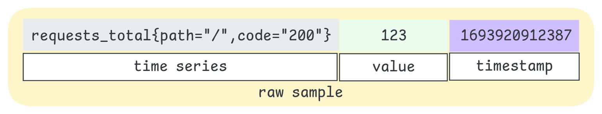
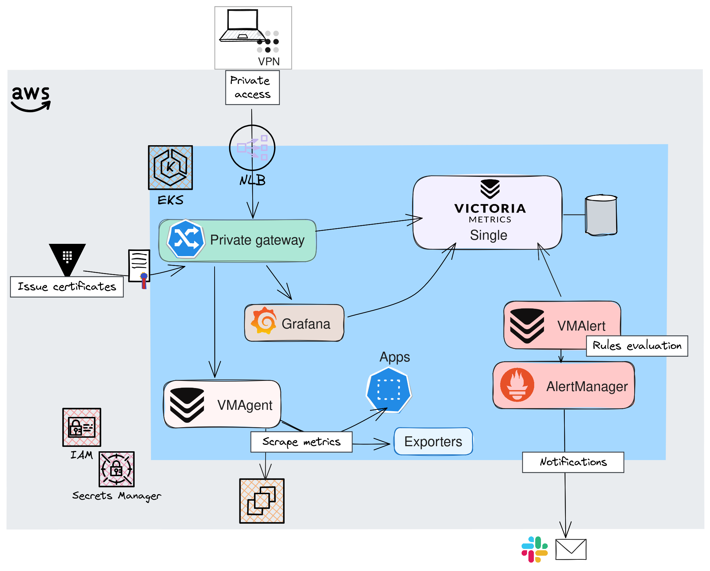
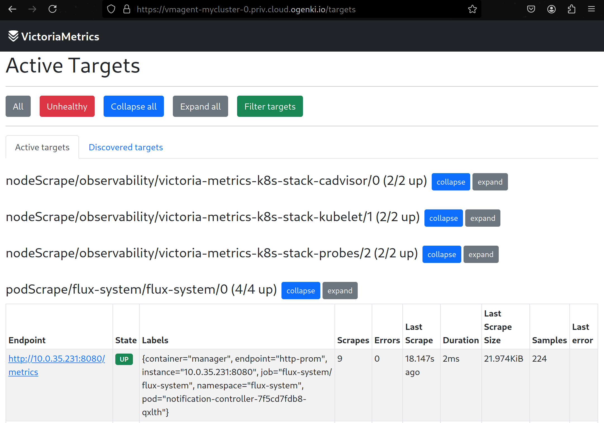
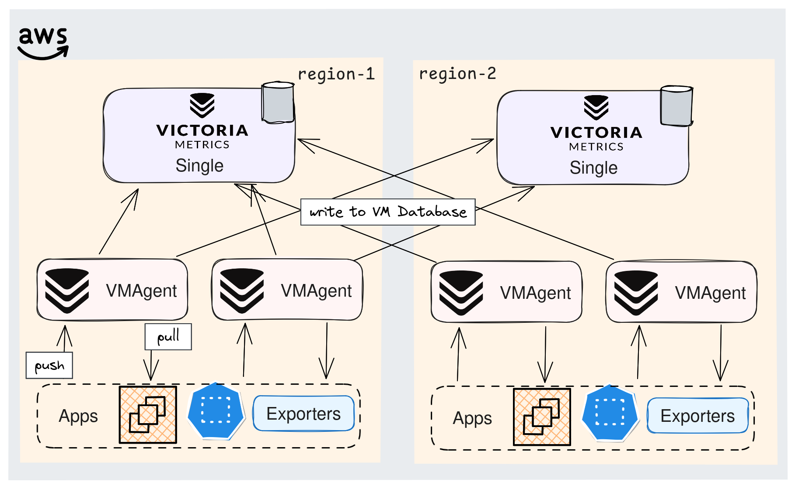

+++
author = "Smaine Kahlouch"
title = "Harness the Power of `VictoriaMetrics` and `Grafana` Operators for Metrics Management"
date = "2024-09-11"
summary = "There are several solutions to **collect, store, and visualize metrics**. The most common combination often relies on Prometheus and Grafana. In this article, we will take it a step further 🚀 by exploring an optimized, high-performance, and scalable solution based on VictoriaMetrics."
featured = true
codeMaxLines = 30
usePageBundles = true
toc = true
series = [
  "observability"
]
tags = [
    "observability"
]
thumbnail= "thumbnail.png"
+++

{}
Once our application is deployed, it is essential to have indicators that help identify potential issues and track performance changes. Among these sources of information, **metrics** and **logs** play an essential role by providing valuable insights into the application's operation. Additionally, it is often useful to implement detailed **tracing** to accurately track all actions performed within the application.

In this [series of blog posts](https://blog.ogenki.io/fr/tags/observability/), we will explore the various areas of application monitoring. The goal is to thoroughly analyze the state of our applications, in order to improve their **availability** and **performance**, while ensuring an optimal user experience.
{}

This first article focuses on **collecting and visualizing metrics**. We will deploy a scalable and high-performance solution to forward these metrics to a **reliable and durable storage system**. Then, we will see how to **visualize** them for analysis purposes.

## ❓ What is a metric

### Definition

Before collecting this so-called "metric", let's first look at its definition and characteristics:</br>
A metric is a **measurable** data point that helps track the status and performance of an application. These data points are typically collected at **regular intervals**, such as the number of requests, memory usage, or error rates.

When it comes to monitoring, it is hard to avoid hearing about [Prometheus](https://prometheus.io/). This project has contributed to the emergence of a **standard** that defines how metrics are exposed, called [**OpenMetrics**](https://github.com/OpenObservability/OpenMetrics/blob/main/specification/OpenMetrics.md), which follows this format:

<center></center>

* **Time Series**: A unique `time series` is the combination of the metric's name and its labels. For instance, `request_total{code="200"}` and `request_total{code="500"}` are considered two distinct _time series_.

* **Labels**: `Labels` can be associated with a metric to provide more specific details. They are added after the metric's name using curly braces. Although optional, they are commonly used, especially in a Kubernetes context (pod, namespace, etc.).

* **Value**: The `value` is the numeric data collected at a specific point in time for a given time series. Depending on the [**metric type**](https://prometheus.io/docs/concepts/metric_types/), it represents a measured or counted value that tracks a metric's evolution over time.

* **Timestamp**: Specifies **when** the data was collected (in epoch format to the millisecond). If not present, it is added when the metric is retrieved.

**This full line is called a`raw sample`**.

{}
The more labels you have, the more possible combinations of them exist, which leads to an exponential increase in the number of time series. This total number of combinations is known as **cardinality**. High cardinality can **significantly affect performance**, especially by increasing memory usage and storage demands.

High cardinality also occurs when new metrics are frequently created. This phenomenon, known as **churn rate**, reflects the rate at which metrics appear and disappear within a system. In the context of Kubernetes, where pods are regularly created and deleted, this churn rate can contribute to the rapid increase in cardinality.
{}

### A Glimpse of How Metrics Are Gathered

Now that we understand what a metric is, let's see how they are collected. Most modern solutions expose an endpoint that allows **scraping metrics**, meaning they are queried **at regular intervals**. For instance, using the Prometheus SDK, available in most programming languages, it's easy to expose an endpoint for  metrics collection into our applications.

This is worth noting that Prometheus generally uses a "**Pull**" model, where the server periodically queries targets to retrieve metrics via these exposed endpoints. This approach helps control the frequency of data collection and prevents overloading the systems.

Let's take an example with an Nginx web server. The server is installed via the Helm chart with Prometheus support enabled. Here, the parameter `metrics.enabled=true` adds a path that exposes the metrics endpoint.

```console
helm install ogenki-nginx bitnami/nginx --set metrics.enabled=true
```

Then, we can retrieve a significant number of metrics with a simple HTTP call.
```console
kubectl port-forward svc/ogenki-nginx metrics &
Forwarding from 127.0.0.1:9113 -> 9113

curl -s localhost:9113/metrics
...
# TYPE promhttp_metric_handler_requests_total counter
promhttp_metric_handler_requests_total{code="200"} 257
...
```

The curl command was just an example. Generally speaking, the metrics scrapping is carried out by a system responsible for **storing this data** so it can later be used.</br>

<center></center>

ℹ️ When using `Prometheus`, an additional component is required to **Push** metrics from applications: [PushGateway](https://github.com/prometheus/pushgateway).

In this article, I’ve chosen to introduce you to `VictoriaMetrics`.

## ✨ VictoriaMetrics: An Enhanced Prometheus?

Like Prometheus, VictoriaMetrics is a **Time Series Database** ([TSDB](https://en.wikipedia.org/wiki/Time_series_database)). These databases are designed to track and store events that **change over time**. Although VictoriaMetrics appeared a few years after Prometheus, they share many similarities: both are **open-source** databases licensed under Apache 2.0, dedicated to handling time series data. VictoriaMetrics remains fully compatible with Prometheus, using the same metric format, `OpenMetrics`, and supporting the `PromQL` query language.

Both projects are also very active, with dynamic communities and regular contributions from various companies [as you can see here](https://ossinsight.io/analyze/prometheus/prometheus?vs=VictoriaMetrics%2FVictoriaMetrics#overview).

Now, let’s explore the key differences and reasons why one might choose VictoriaMetrics:

* **Efficient storage and compression**: This is likely one of the major advantages, especially when dealing with large amounts of data or needing long-term retention. With Prometheus, an additional component like [Thanos](https://thanos.io/) is needed for this purpose. VictoriaMetrics, in the other hand, has an **optimized storage engine** that batches and optimizes data before writing it to disk. Furthermore, it uses **powerful compression algorithms**, making disk space usage much more efficient compared to Prometheus.

* **Memory footprint**: VictoriaMetrics is said to use up to 7 times less memory than a Prometheus-based solution. However, the available benchmarks are somewhat outdated, and Prometheus has since benefited from [several memory optimizations](https://thenewstack.io/30-pull-requests-later-prometheus-memory-use-is-cut-in-half/).

* **MetricsQL**: VictoriaMetrics extends the PromQL language with new functions. This language is also designed to be more performant, especially on large datasets.

* **Modular architecture**: VictoriaMetrics can be deployed in two modes: "Single" or "Cluster". We’ll explore this in more detail later in the article.

* **And much more...**: The points above are the key reasons I highlighted, but there are others. VictoriaMetrics can also operate in **Push mode**, support **multitenancy**, and offers additional features available in the [**Enterprise version**](https://docs.victoriametrics.com/enterprise/#victoriametrics-enterprise-features).


{}
On the VictoriaMetrics website, you'll find numerous [testimonials and case studies](https://docs.victoriametrics.com/casestudies/) from companies that have migrated from other systems (such as Thanos, InfluxDB, etc.). Some examples are particularly insightful, especially those from [Roblox](https://www.datanami.com/2023/05/30/why-roblox-picked-victoriametrics-for-observability-data-overhaul/), [Razorpay](https://engineering.razorpay.com/scaling-to-trillions-of-metric-data-points-f569a5b654f2), and [Criteo](https://techblog.criteo.com/victoriametrics-a-prometheus-remote-storage-solution-57081a3d8e61), which handle a very large volume of metrics.
{}


## 🔎 A modular and scalable architecture

{}
<table>
  <tr>
        <td>
          
        </td>
        <td style="vertical-align:middle; padding-left:10px;" width="70%">

The remaining of this article comes from a set of configurations available in the repository <strong><a href="https://github.com/Smana/cloud-native-ref">Cloud Native Ref</a></strong>.</br>
It makes use of several operators, notably those for [VictoriaMetrics](https://github.com/VictoriaMetrics/operator) and [Grafana](https://github.com/grafana/grafana-operator).

The aim of this project is to **quickly bootstrap a complete platform** that follows best practices in terms of automation, monitoring, security, and more. </br>
Comments and contributions are welcome 🙏
        </td>
  </tr>
</table>
{}

`VictoriaMetrics` can be deployed in various ways: The default mode is called `Single`, and as the name suggests, it involves deploying a **single instance** that handles read, write, and storage operations. It is recommended to start with this mode as it is **optimized** and meets most use cases, as explained in [this section](https://docs.victoriametrics.com/#capacity-planning).

### Single Mode

The deployment method chosen in this article makes use of the Helm chart [**victoria-metrics-k8s-stack**](https://github.com/VictoriaMetrics/helm-charts/tree/master/charts/victoria-metrics-k8s-stack), which configures multiple resources (VictoriaMetrics, Grafana, Alertmanager, some dashboards, etc.). Below is a snippet of a [Flux](https://fluxcd.io/) configuration for the `Single` mode.

[observability/base/victoria-metrics-k8s-stack/helmrelease-vmsingle.yaml](https://github.com/Smana/cloud-native-ref/blob/main/observability/base/victoria-metrics-k8s-stack/helmrelease-vmsingle.yaml)

```yaml
apiVersion: helm.toolkit.fluxcd.io/v2
kind: HelmRelease
metadata:
  name: victoria-metrics-k8s-stack
  namespace: observability
spec:
  releaseName: victoria-metrics-k8s-stack
  chart:
    spec:
      chart: victoria-metrics-k8s-stack
      sourceRef:
        kind: HelmRepository
        name: victoria-metrics
        namespace: observability
      version: "0.25.15"
...
  values:
    vmsingle:
      spec:
        retentionPeriod: "1d" # Minimal retention, for tests only
        replicaCount: 1
        storage:
          accessModes:
            - ReadWriteOnce
          resources:
            requests:
              storage: 10Gi
        extraArgs:
          maxLabelsPerTimeseries: "50"
```

When all the Kubernetes manifests are applied, the resulting architecture looks like this:

<center></center>

* 🔒 **Private Access**: Although not directly related to metric collection, I wanted to highlight how access to the various UIs is managed. I chose to use [**Gateway API**](https://gateway-api.sigs.k8s.io/), which I’ve been using for some time and have covered in [previous blog posts](https://blog.ogenki.io/tags/security/). An alternative would be to use a VictoriaMetrics component, [VMAuth](https://docs.victoriametrics.com/vmauth/?highlight=vmauth), which can act as a proxy for authorization and routing http requests, but I did not choose this option for now.

* 👷 **VMAgent**: A very lightweight agent whose main function is to **gather metrics** and send them to a Prometheus-compatible database. Additionally, this agent can apply **filters and transformations** to metrics before forwarding them. If the destination is unavailable or there is insufficient memory, it can cache data on disk. </br>
VMAgent also has a web interface that lists the "Targets" being scraped.

<center></center>

* 🔥 **VMAlert** & **VMAlertManager**: These components are responsible for sending notifications in case of issues (for instance when reaching a given threshold). I won’t go into further detail here as this will be covered in a **future article**.

* ⚙️ **VMsingle**: This is the VictoriaMetrics database deployed as a single pod that handles all operations (reading, writing, and data persistence).

Once all pods are started, you can access the main VictoriaMetrics interface: `VMUI`. This UI provides access to a wide range of information, including the scraped metrics, the top queries, cardinality statistics, and [much more](https://docs.victoriametrics.com/#vmui).

<center>
  <video id="VMUI" controls height="800" autoplay loop muted>
    <source src="vmui.webm" type="video/webm">
    Your browser does not support the video tag.
  </video>
</center>

<script>
  var video = document.getElementById('VMUI');
  video.playbackRate = 1.8;
</script>


### High Availability

To ensure we never lose sight of what's happening with our applications, the monitoring platform must always remain up and running. All VictoriaMetrics components can be configured for high availability. Depending on the desired level of redundancy, several options are available.

A straightforward approach would be to send data to **two `Single` instances**, duplicating the data in two different locations. Additionally, these instances could be deployed in two different regions.

It’s also recommended to **deploy 2 VMAgents** that scrape the same targets to ensure that no data is lost.

{}
In such an architecture, since multiple VMAgents are sending data and scraping the same targets, we end up with **duplicate** metrics. The [De-duplication](https://docs.victoriametrics.com/#deduplication) feature in VictoriaMetrics ensures that **only one version** is retained when two raw samples are identical.</br>
One parameter requires special attention: `-dedup.minScrapeInterval`. Only the **most recent** version is kept when identical raw samples are found within this time interval.

It is also recommended to:

* Set this parameter to a value equal to the `scrape_interval` defined in the Prometheus configuration.
* Keep the `scrape_interval` value consistent across all scraped services.
{}

The diagram below shows one of the many possible combinations to ensure optimal availability.</br>
⚠️ However, it's important to consider the **additional costs**, not only for storage and compute, but also for network transfers between zones/regions. Sometimes, having a solid **backup and restore strategy** is a smarter choice 😅.

<center></center>

### Cluster Mode

As mentioned earlier, in most cases, the `Single` mode is more than sufficient. It has the advantage of being easy to maintain and, with vertical scaling, it can handle **nearly all use cases**. There is also a `Cluster` mode, but it is only relevant in two specific cases:

* The need for [multitenancy](https://docs.victoriametrics.com/cluster-victoriametrics/#multitenancy), for example, to isolate multiple teams or customers.
* When the limits of vertical scaling are reached.

My configuration allows you to choose between either mode:

[observability/base/victoria-metrics-k8s-stack/kustomization.yaml](https://github.com/Smana/cloud-native-ref/blob/main/observability/base/victoria-metrics-k8s-stack/kustomization.yaml)

```yaml
resources:
...

  - vm-common-helm-values-configmap.yaml
  # Choose between single or cluster helm release

  # VM Single
  - helmrelease-vmsingle.yaml
  - httproute-vmsingle.yaml

  # VM Cluster
  # - helmrelease-vmcluster.yaml
  # - httproute-vmcluster.yaml
```

<center></center>

In this mode, the **read, write, and storage functions** are separated into three distinct deployments.

* ✏️ **VMInsert**: Distributes the data across VMStorage instances using [consistent hashing](https://en.wikipedia.org/wiki/Consistent_hashing) based on the time series (combination of the metric name and its labels).

* 💾 **VMStorage**: Responsible for writing data to disk and returning the requested data to VMSelect.

* 📖 **VMSelect**: For each query, it retrieves the data from the VMStorages.

The main benefit of this mode is the ability to adjust **scaling** according to needs. For example, if more write capacity is required, you can add more VMInsert replicas.

The initial parameter that ensures a minimum level of redundancy is `replicationFactor` set to `2`. </br>
Here is a snippet of the Helm _values_ for the cluster mode.

[observability/base/victoria-metrics-k8s-stack/helmrelease-vmcluster.yaml](https://github.com/Smana/cloud-native-ref/blob/main/observability/base/victoria-metrics-k8s-stack/helmrelease-vmcluster.yaml)

```yaml
    vmcluster:
      enabled: true
      spec:
        retentionPeriod: "10d"
        replicationFactor: 2
        vmstorage:
          storage:
            volumeClaimTemplate:
              storageClassName: "gp3"
              spec:
                resources:
                  requests:
                    storage: 10Gi
          resources:
            limits:
              cpu: "1"
              memory: 1500Mi
          affinity:
            podAntiAffinity:
              requiredDuringSchedulingIgnoredDuringExecution:
                - labelSelector:
                    matchExpressions:
                      - key: "app.kubernetes.io/name"
                        operator: In
                        values:
                          - "vmstorage"
                  topologyKey: "kubernetes.io/hostname"
          topologySpreadConstraints:
            - labelSelector:
                matchLabels:
                  app.kubernetes.io/name: vmstorage
              maxSkew: 1
              topologyKey: topology.kubernetes.io/zone
              whenUnsatisfiable: ScheduleAnyway
        vmselect:
          storage:
            volumeClaimTemplate:
              storageClassName: "gp3"
```

:information_source: It's worth noting that some of these parameters follow Kubernetes best practices, especially when using [Karpenter](https://karpenter.sh/): `topologySpreadConstraints` helps distribute pods across different zones, and `podAntiAffinity` ensures that two pods for the same service do not end up on the same node.

## 🛠️ Configuration

Alright, VictoriaMetrics is now deployed 👏. It's time to **configure** the monitoring for our applications, and for this, we'll rely on the Kubernetes operator pattern.
Actually, this means declaring c[Custom Resources](https://kubernetes.io/docs/concepts/extend-kubernetes/api-extension/custom-resources/) that will be consumed by the [**VictoriaMetrics Operator**](https://github.com/VictoriaMetrics/operator) to configure and manage VictoriaMetrics.

The Helm chart we used doesn't directly deploy VictoriaMetrics, but instead primarily installs the operator. This operator is responsible for creating and managing custom resources such as `VMSingle` or `VMCluster`, which define how VictoriaMetrics is deployed and configured based on the needs.

The role of `VMServiceScrape` is to declare **where to scrape metrics** for a given service. It relies on Kubernetes labels to identify the proper service and port.

[observability/base/victoria-metrics-k8s-stack/vmservicecrapes/karpenter.yaml](https://github.com/Smana/cloud-native-ref/blob/main/observability/base/victoria-metrics-k8s-stack/vmservicecrapes/karpenter.yaml)

```yaml
apiVersion: operator.victoriametrics.com/v1beta1
kind: VMServiceScrape
metadata:
  name: karpenter
  namespace: karpenter
spec:
  selector:
    matchLabels:
      app.kubernetes.io/name: karpenter
  endpoints:
    - port: http-metrics
      path: /metrics
  namespaceSelector:
    matchNames:
      - karpenter
```

We can verify that the parameters are correctly configured using `kubectl`.
```console
kubectl get services -n karpenter --selector app.kubernetes.io/name=karpenter -o yaml | grep -A 4 ports
    ports:
    - name: http-metrics
      port: 8000
      protocol: TCP
      targetPort: http-metrics
```

Sometimes there is no service, in which case we can specify how to identify the pods directly using `VMPodScrape`.

[observability/base/flux-config/observability/vmpodscrape.yaml](https://github.com/Smana/cloud-native-ref/blob/main/observability/base/flux-config/observability/vmpodscrape.yaml)
```yaml
apiVersion: operator.victoriametrics.com/v1beta1
kind: VMPodScrape
metadata:
  name: flux-system
  namespace: flux-system
spec:
  namespaceSelector:
    matchNames:
      - flux-system
  selector:
    matchExpressions:
      - key: app
        operator: In
        values:
          - helm-controller
          - source-controller
          - kustomize-controller
          - notification-controller
          - image-automation-controller
          - image-reflector-controller
  podMetricsEndpoints:
    - targetPort: http-prom
```

Not all of our applications are necessarily deployed on Kubernetes. The `VMScrapeConfig` resource in VictoriaMetrics allows the use of several "[Service Discovery](https://docs.victoriametrics.com/sd_configs/index.html)" methods. This resource offers flexibility in defining how to scrape targets via different discovery mechanisms, such as EC2 instances (AWS), cloud services, or other systems. </br>
In the example below, we use the custom tag `observability:node-exporter` and apply label transformations, allowing us to collect metrics exposed by [node-exporters](https://github.com/prometheus/node_exporter) installed on these instances.

[observability/base/victoria-metrics-k8s-stack/vmscrapeconfigs/ec2.yaml](https://github.com/Smana/cloud-native-ref/blob/main/observability/base/victoria-metrics-k8s-stack/vmscrapeconfigs/ec2.yaml)
```yaml
apiVersion: operator.victoriametrics.com/v1beta1
kind: VMScrapeConfig
metadata:
  name: aws-ec2-node-exporter
  namespace: observability
spec:
  ec2SDConfigs:
    - region: ${region}
      port: 9100
      filters:
        - name: tag:observability:node-exporter
          values: ["true"]
  relabelConfigs:
    - action: replace
      source_labels: [__meta_ec2_tag_Name]
      target_label: ec2_name
    - action: replace
      source_labels: [__meta_ec2_tag_app]
      target_label: ec2_application
    - action: replace
      source_labels: [__meta_ec2_availability_zone]
      target_label: ec2_az
    - action: replace
      source_labels: [__meta_ec2_instance_id]
      target_label: ec2_id
    - action: replace
      source_labels: [__meta_ec2_region]
      target_label: ec2_region
```

ℹ️ If you were already using the Prometheus Operator, migrating to VictoriaMetrics is very simple because it is fully **compatible** with the CRDs defined by the Prometheus Operator.

## 📈 Visualizing Metrics with the Grafana Operator

It's easy to guess what the Grafana Operator does: It uses Kubernetes resources to configure Grafana 😝. It allows you to deploy Grafana instances, add datasources, import dashboards from various sources (URL, JSON), organize them into folders, and more... </br>
This offers an alternative to defining everything in the Helm chart or using configmaps, and in my opinion, provides better readability. In this example, I group all the resources related to monitoring Cilium.

```bash
tree  infrastructure/base/cilium/
infrastructure/base/cilium/
├── grafana-dashboards.yaml
├── grafana-folder.yaml
├── httproute-hubble-ui.yaml
├── kustomization.yaml
├── vmrules.yaml
└── vmservicescrapes.yaml
```

Defining the `Folder` is super straightforward.

[observability/base/infrastructure/cilium/grafana-folder.yaml](https://github.com/Smana/cloud-native-ref/blob/main/observability/base/infrastructure/cilium/grafana-folder.yaml)
```yaml
apiVersion: grafana.integreatly.org/v1beta1
kind: GrafanaFolder
metadata:
  name: cilium
spec:
  allowCrossNamespaceImport: true
  instanceSelector:
    matchLabels:
      dashboards: "grafana"
```

Here is a `Dashboard` resource that fetches the configuration from an HTTP link. We can also use dashboards available from the [Grafana website](https://grafana.com/grafana/dashboards/) by specifying the appropriate ID, or simply provide the definition in JSON format.

[observability/base/infrastructure/cilium/grafana-dashboards.yaml](https://github.com/Smana/cloud-native-ref/blob/main/observability/base/infrastructure/cilium/grafana-dashboards.yaml)
```yaml
apiVersion: grafana.integreatly.org/v1beta1
kind: GrafanaDashboard
metadata:
  name: cilium-cilium
spec:
  folderRef: "cilium"
  allowCrossNamespaceImport: true
  datasources:
    - inputName: "DS_PROMETHEUS"
      datasourceName: "VictoriaMetrics"
  instanceSelector:
    matchLabels:
      dashboards: "grafana"
  url: "https://raw.githubusercontent.com/cilium/cilium/main/install/kubernetes/cilium/files/cilium-agent/dashboards/cilium-dashboard.json"
```

Note that I chose **not to use the Grafana Operator to deploy the instance**, but to keep the one installed via the VictoriaMetrics Helm chart. Therefore, we have to tell to the Grafana Operator where are the **credentials** so it can apply changes to this instance.

[observability/base/grafana-operator/grafana-victoriametrics.yaml](https://github.com/Smana/cloud-native-ref/blob/main/observability/base/grafana-operator/grafana-victoriametrics.yaml)
```yaml
apiVersion: grafana.integreatly.org/v1beta1
kind: Grafana
metadata:
  name: grafana-victoriametrics
  labels:
    dashboards: "grafana"
spec:
  external:
    url: http://victoria-metrics-k8s-stack-grafana
    adminPassword:
      name: victoria-metrics-k8s-stack-grafana-admin
      key: admin-password
    adminUser:
      name: victoria-metrics-k8s-stack-grafana-admin
      key: admin-user
```

Finally, we can use Grafana and explore our various dashboards 🎉!

<center>
  <video id="Grafana" controls height="800" autoplay loop muted>
    <source src="grafana.webm" type="video/webm">
    Your browser does not support the video tag.
  </video>
</center>

<script>
  var video = document.getElementById('Grafana');
  video.playbackRate = 1.3;
</script>


## 💭 Final Thoughts

Based on the various articles reviewed, one of the main reasons to migrate to or choose VictoriaMetrics is generally **better performances**. However, it’s wise to remain cautious, as benchmark results depend on several factors and the specific goals in mind. This is why it's highly recommended to run your own tests. VictoriaMetrics provides a [benchmarking tool](https://github.com/VictoriaMetrics/prometheus-benchmark) that can be used on Prometheus-compatible TSDBs.

As you can see, today my preference is for VictoriaMetrics for metrics collection, as I appreciate the modular architecture with a variety of combinations depending on the **evolving needs**. However, a solution using the Prometheus Operator works perfectly fine in most cases and has the advantage of being governed by a foundation.

Additionally, it's important to note that some features are only available in the [**Enterprise version**](https://docs.victoriametrics.com/enterprise/), such as downsampling, which is highly useful when wanting to retain a large amount of data over the long term.

In this article, we highlighted the **ease of implementation** to achieve a solution that efficiently collects and visualizes metrics. This is done while using the Kubernetes operator pattern,the "GitOps way", allowing the declaration of various resources through Custom Resources. For instance, a developer can easily include a `VMServiceScrape` and a `VMRule` in their manifests, thus embedding the observability culture within the application delivery processes.

Having metrics is great, but is it enough? We'll try to answer that in the upcoming articles...

## 🔖 References

* [Articles sur VictoriaMetrics](https://docs.victoriametrics.com/articles/)
