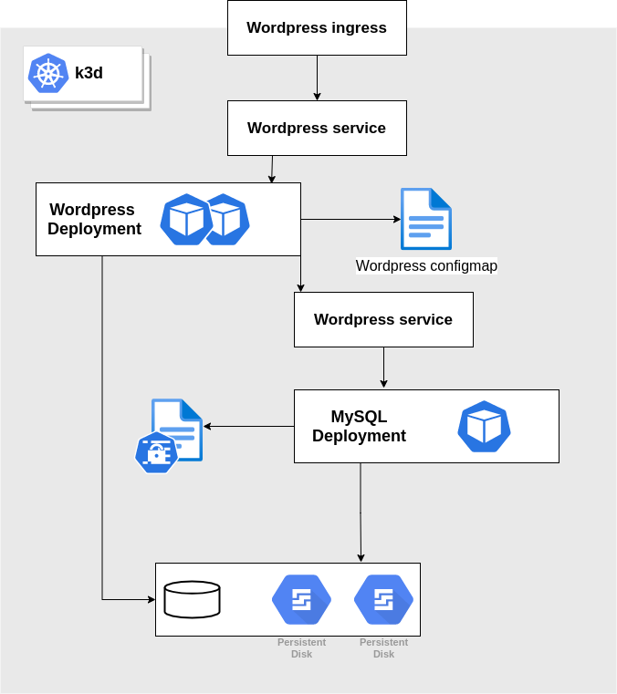

:information_source: This section is, for a most part, based on the official [Kubernetes doc](https://kubernetes.io/docs/tutorials/stateful-application/mysql-wordpress-persistent-volume/).

By the end of this lab we'll create the following components. You may want to come back to this schema from time to time in order to get the whole picture.



## A database with a persistent volume

Check that your cluster is up and running and that your context is still configured with the namespace `foo`

```console
kubectl config get-contexts
CURRENT   NAME           CLUSTER        AUTHINFO             NAMESPACE
*         k3d-workshop   k3d-workshop   admin@k3d-workshop   foo
```

### Create a persistent volume claim

There are several [options](https://kubernetes.io/docs/concepts/storage/persistent-volumes/#types-of-persistent-volumes) when it comes to persistent workloads on Kubernetes. For this workshop we'll use our local disks thanks to the [local path provisionner](https://github.com/rancher/local-path-provisioner).

Create a persistentVolumeClaim, it will stay pending until a pod consumes it

```console
kubectl apply -f content/resources/kubernetes_workshop/mysql/pvc.yaml
persistentvolumeclaim/local-path-mysql created

kubectl get pvc
NAME               STATUS    VOLUME   CAPACITY   ACCESS MODES   STORAGECLASS   AGE
local-path-mysql   Pending                                      local-path     16s
```

### Create the MySQL secret

In Kubernetes sensitive data are stored in `Secrets`. Here we'll create a secret that stores the MySQL root password

```console
kubectl create secret generic mysql-pass --from-literal=password=YOUR_PASSWORD
secret/mysql-pass created
```

Note that a secret is stored in an `base64` encoded format and can be easily decoded. (There are best practices to enforce safe access to the secrets that we're not going to cover there)

```console
kubectl get secrets mysql-pass -o yaml
apiVersion: v1
data:
  password: WU9VUl9QQVNTV09SRA==
kind: Secret
metadata:
  creationTimestamp: "2021-06-20T09:11:59Z"
  name: mysql-pass
  namespace: foo
  resourceVersion: "2809"
  uid: c96c58d6-8472-4d68-8554-5dcfb69d834c
type: Opaque

echo -n "WU9VUl9QQVNTV09SRA==" | base64 -d
YOUR_PASSWORD
```

### Run the MySQL deployment

We will now create a MySQL deployment. It will be composed of a single replica as we're accessing to a local volume and it is configured to make use of the secret we've created previously.

```console
kubectl apply -f content/resources/kubernetes_workshop/mysql/deployment.yaml
deployment.apps/wordpress-mysql created

kubectl get po -w
NAME                               READY   STATUS              RESTARTS   AGE
wordpress-mysql-6c597b98bd-vcm62   0/1     ContainerCreating   0          9s
wordpress-mysql-6c597b98bd-vcm62   1/1     Running             0          13s
^C
```

### Service discovery in Kubernetes

In order to be able to call our MySQL deployment we may want to expose it using a `service`.

```console
kubectl apply -f content/resources/kubernetes_workshop/mysql/svc.yaml
service/wordpress-mysql created

kubectl get svc
NAME              TYPE        CLUSTER-IP   EXTERNAL-IP   PORT(S)    AGE
wordpress-mysql   ClusterIP   None         <none>        3306/TCP   6s
```

Kubernetes's service discovery is based on an internal DNS system. For instance a service A service is accessible using the following nomenclature: `<service_name>.<Namespace>.svc.<Cluster_domain_name>`

Let's try to access to the database server using a mysql client pod and create a database named `foobar`

```console
kubectl run -ti --rm mysql-client --restart=Never --image=mysql:5.7 -- /bin/bash
If you don't see a command prompt, try pressing enter.
root@mysql-client:/# apt -qq update && apt install -yq netcat
...
Setting up netcat (1.10-41.1) ...


root@mysql-client:/# nc -vz wordpress-mysql.foo.svc.cluster.local 3306
DNS fwd/rev mismatch: wordpress-mysql.foo.svc.cluster.local != 10-42-1-8.wordpress-mysql.foo.svc.cluster.local
wordpress-mysql.foo.svc.cluster.local [10.42.1.8] 3306 (?) open

root@mysql-client:/# mysql -u root -h wordpress-mysql -p
Enter password:
...

mysql> show databases;
+--------------------+
| Database           |
+--------------------+
| information_schema |
| mysql              |
| performance_schema |
+--------------------+
3 rows in set (0.01 sec)

mysql> create database foobar;
Query OK, 1 row affected (0.00 sec)

mysql> exit
Bye
```

**Note**: You can either use the service name `wordpress-mysql`, or if your source pod is in another namespace use `wordpress-mysql.foo`

### Check how the data is persisted with the local-path-provisioner

We may want to check how the data is stored.
Now that we have a MySQL instance running and consuming the pvc, a persistent volume has been provision

```console
kubectl get pvc
NAME               STATUS   VOLUME                                     CAPACITY   ACCESS MODES   STORAGECLASS   AGE
local-path-mysql   Bound    pvc-4bb3c033-2261-4d5c-ba61-41e364769599   500Mi      RWO            local-path     14m
```

Having a closer look we notice that the volume is actually a directory within a worker node.

```console
kubectl describe pv pvc-4bb3c033-2261-4d5c-ba61-41e364769599
Name:              pvc-4bb3c033-2261-4d5c-ba61-41e364769599
Labels:            <none>
Annotations:       pv.kubernetes.io/provisioned-by: rancher.io/local-path
Finalizers:        [kubernetes.io/pv-protection]
StorageClass:      local-path
Status:            Bound
Claim:             foo/local-path-mysql
Reclaim Policy:    Delete
Access Modes:      RWO
VolumeMode:        Filesystem
Capacity:          500Mi
Node Affinity:
  Required Terms:
    Term 0:        kubernetes.io/hostname in [k3d-workshop-agent-0]
Message:
Source:
    Type:          HostPath (bare host directory volume)
    Path:          /var/lib/rancher/k3s/storage/pvc-4bb3c033-2261-4d5c-ba61-41e364769599_foo_local-path-mysql
    HostPathType:  DirectoryOrCreate
Events:            <none>
```

```console
docker exec k3d-workshop-agent-0 ls /var/lib/rancher/k3s/storage/pvc-4bb3c033-2261-4d5c-ba61-41e364769599_foo_local-path-mysql
auto.cnf
foobar
ib_logfile0
ib_logfile1
ibdata1
mysql
performance_schema
```

That means that even if you restart your laptop you should retrieve the data (here the database foobar we've created previously)

```console
k3d cluster stop workshop
INFO[0000] Stopping cluster 'workshop'

k3d cluster list
NAME       SERVERS   AGENTS   LOADBALANCER
workshop   0/1       0/1      true

k3d cluster start workshop
INFO[0000] Starting cluster 'workshop'
INFO[0000] Starting servers...
INFO[0000] Starting Node 'k3d-workshop-server-0'
INFO[0006] Starting agents...
INFO[0006] Starting Node 'k3d-workshop-agent-0'
INFO[0013] Starting helpers...
INFO[0013] Starting Node 'k3d-workshop-serverlb'

kubectl run -ti --rm mysql-client --restart=Never --image=mysql:5.7 -- mysql -u root -h wordpress-mysql --password="YOUR_PASSWORD"
If you don't see a command prompt, try pressing enter.

mysql> show databases;
+--------------------+
| Database           |
+--------------------+
| information_schema |
| foobar             |
| mysql              |
| performance_schema |
+--------------------+
4 rows in set (0.00 sec)
```

## The Wordpress deployment

Now we will deploy the wordpress instance with a persistent volume.

So first of all create a pvc as follows

```console
kubectl apply -f content/resources/kubernetes_workshop/wordpress/pvc.yaml
persistentvolumeclaim/wp-pv-claim created
```

Then create the deployment. Note that it is configured with our mysql database as backend.

```console
kubectl apply -f content/resources/kubernetes_workshop/wordpress/deployment.yaml
deployment.apps/wordpress created

$ kubectl get deploy
NAME              READY   UP-TO-DATE   AVAILABLE   AGE
wordpress-mysql   1/1     1            1           11h
wordpress         1/1     1            1           4s
```

Most of the time, when we want to expose an HTTP service to the outside world (outside of the cluster), we would create an [ingress](https://kubernetes.io/docs/concepts/services-networking/ingress/)

```console
kubectl apply -f content/resources/kubernetes_workshop/wordpress/svc.yaml
service/wordpress created

kubectl apply -f content/resources/kubernetes_workshop/wordpress/ingress.yaml
ingress.networking.k8s.io/wordpress created
```

With k3d the ingress endpoint has been defined when we've created the cluster. With the parameter `-p "8081:80@loadbalancer"`
Our wordpress should therefore be accessible through `http://localhost:8081`


### Configure your pods

A `ConfigMap` is a kubernetes resource that stores non-sensitive data. Its content can be consumed as config files, environment variables or command args.

Let's consider that we need a configfile to be mounted in our wordpress deployment as well as an environment variable made available.

Create a dumb "hello world" config file

```console
echo "Hello World!" > /tmp/helloworld.conf
```

Then we'll create a configmap that contains a file and environment variable we want to make use of.
**Note** This following command doesn't actually apply the resource on our Kubernetes cluster. It just generate a local yaml file using `--dry-run` and `-o yaml`.

```console
kubectl create configmap helloworld --from-file=/tmp/helloworld.conf --from-literal=HELLO=WORLD -o yaml --dry-run=client > /tmp/cm.yaml
```

Check the configmap
```yaml
apiVersion: v1
data:
  HELLO: WORLD
  helloworld.conf: |
    Hello World!
kind: ConfigMap
metadata:
  creationTimestamp: null
  name: helloworld
```

And apply it

```console
$ kubectl apply -f /tmp/cm.yaml
configmap/helloworld created
```

Now we're gonna make use of it by changing the wordpress deployment. For this kind of change it is recommended to use an IDE with a Kubernetes plugin that will highlight errors.

Edit the file located here: `content/resources/kubernetes_workshop/wordpress/deployment.yaml`

```yaml
...
          env:
            - name: WORDPRESS_DB_HOST
              value: wordpress-mysql
            - name: WORDPRESS_DB_PASSWORD
              valueFrom:
                secretKeyRef:
                  name: mysql-pass
                  key: password
            - name: HELLO
              valueFrom:
                configMapKeyRef:
                  name: helloworld
                  key: HELLO
          volumeMounts:
            - name: wordpress-persistent-storage
              mountPath: /var/www/html
            - name: helloworld-config
              mountPath: /config
      volumes:
        - name: wordpress-persistent-storage
          persistentVolumeClaim:
            claimName: wp-pv-claim
        - name: helloworld-config
          configMap:
            name: helloworld
            items:
              - key: helloworld.conf
                path: helloworld.conf
```

Applying this change will trigger a rolling-update

```console
$ kubectl apply -f content/resources/kubernetes_workshop/wordpress/deployment.yaml
deployment.apps/wordpress configured

$ kubectl get po
NAME                               READY   STATUS    RESTARTS   AGE
wordpress-mysql-6c597b98bd-4mbbd   1/1     Running   2          41h
wordpress-594f88c9c4-n9qqr         1/1     Running   0          5s
```

And the configuration will be available in the newly created pod

```console
$ kubectl exec -ti wordpress-594f88c9c4-n9qqr -- env | grep HELLO
HELLO=WORLD

$ kubectl exec -ti wordpress-594f88c9c4-n9qqr -- cat /config/helloworld.conf
Hello World!
```


:warning: Do not delete anything, we'll make use of these resources in the next section.

:arrow_right: [Next: Resources in Kubernetes](/post/series/workshop_kubernetes/autoscaling/)
