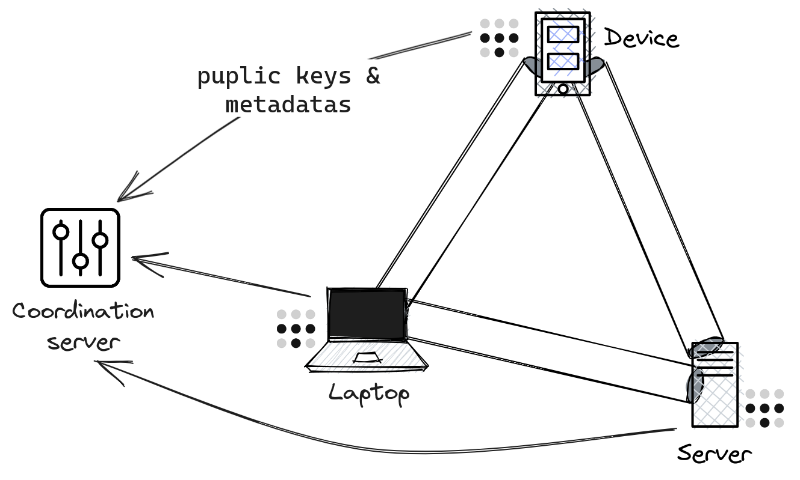
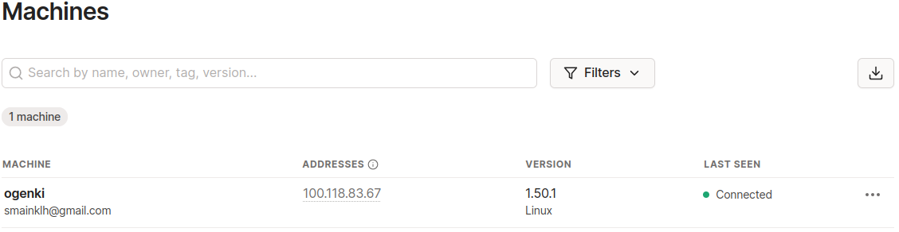

+++
author = "Smaine Kahlouch"
title = "Beyond Traditional VPNs: Simplifying Cloud Access with `Tailscale`"
date = "2023-10-16"
summary = "Tailscale is a **VPN** solution that allows devices or servers to connect securely. How can one leverage it to access a Cloud infrastructure?"
featured = true
codeMaxLines = 21
usePageBundles = true
toc = true
tags = [
    "security",
    "network"
]
thumbnail= "thumbnail.png"
+++

When we talk about securing access to cloud resources, one of the golden rules is to avoid direct exposure to the Internet. This raises a question for Dev/Ops: How can we , for instance, access a database, a Kubernetes cluster, or a server via SSH without compromising security? </br>

**Virtual Private Networks (VPN)** offer an answer by establishing a secure link between different elements of a network, regardless of their geographical location. Solutions range from SaaS models to self-hosted platforms, using various protocols, either open-source or proprietary.

Among these options, I wanted to introduce you to [**Tailscale**](https://tailscale.com/). This solution uses `WireGuard` under the hood, known for its simplicity and performance. With Tailscale, you can securely connect devices or servers as if they were on the same local network, even though they are spread across the globe.

## 🎯 Our target

* Understanding how Tailscale works
* Implementing a secure connection with AWS in a few minutes
* Interacting with an EKS cluster API via a private network
* Accessing services hosted on Kubernetes using the private network.

<center></center>

Throughout this article, you will obviously need to **create a Tailscale account**. It's worth noting that authentication is delegated to third-party identity providers (e.g., Okta, OneLogin, Google).

Once the account is created, you'll have instant access to the management console. It allows you to list connected devices, visualize logs, and change most of the settings.

## 💡 Under the Hood

{}
**Mesh VPN**: A _mesh VPN_ refers to a VPN network configuration in which every node (i.e., each device or machine) connects directly to every other node, creating a mesh-like structure. This stands in contrast to traditional VPN configurations that usually adopt a "hub and spoke" topology, where multiple clients connect to one central server.

**Zero Trust**: This approach operates on the principle that every access request to a network is inherently untrusted. Whether an application or user, identity must be proven and authorization given before accessing a resource. Trust isn't assumed based solely on originating from an internal network or a specific geographic location.

**Tailnet**: When you first use Tailscale, a _Tailnet_ is automatically generated for you, representing your personal private network. Every device within this tailnet is assigned a unique Tailscale IP.
{}

<center></center>

Tailscale's architecture clearly distinguishes between the Control plane and the Data plane:

* The coordination server primarily manages the exchange of metadata and public keys among all Tailnet members. Importantly, by Tailscale's design, only the public key is shared, with the private key securely retained on its originating node.

* The nodes in the Tailnet establish a mesh network: Instead of passing data through the coordination server, these nodes communicate directly in a peer-to-peer manner. Each node has a unique identity, allowing it to authenticate and become part of the Tailnet.

## :inbox_tray: Client Installation

Most platforms are supported, and the installation options are listed [here](https://tailscale.com/kb/installation/).
As for me, I am on Archlinux:

```console
sudo pacman -S tailscale
```

It's possible to start the service automatically upon machine startup.
```console
sudo systemctl enable --now tailscaled
```

To register your personal computer, run the following command:
```console
sudo tailscale up --accept-routes

To authenticate, visit:

        https://login.tailscale.com/a/f50...
```

<center></center>

ℹ️ The `--accept-routes` option is required on Linux in order to configure the routes announced by _Subnet routers_. We'll delve deeper into this later on in this post.

Ensure that you've indeed acquired an IP from the Tailscale network:
```console
tailscale ip -4
100.118.83.67

tailscale status
100.118.83.67   ogenki               smainklh@    linux   -
```

ℹ️ For Linux users, ensure that Tailscale works well with your DNS configuration: Follow [this documentation](https://tailscale.com/kb/1188/linux-dns/).

{}
All the steps performed in this article come from this [**git repository**](https://github.com/Smana/demo-cloud-native-ref).

It will allow you to create all the components aiming to set up an EKS Lab cluster, following a previous blog post on [Cilium and Gateway API](https://blog.ogenki.io/fr/post/cilium-gateway-api/).

{}

## ☁️ Accessing AWS Privately


To securely access all resources available on AWS, one can deploy a _**Subnet router**_.

A _Subnet router_ is a Tailscale instance that provides access to subnets not directly linked to Tailscale. It acts as a **bridge** between Tailscale's virtual private network (_Tailnet_) and other local networks.

We can then **reach Cloud subnets through Tailscale's VPN**.

⚠️ To do so, on AWS, you'll need to configure the _security groups_ appropriately to allow _Subnet routers_.

### 🚀 Deploying a Subnet Router

Let's dive in and deploy a _Subnet router_ on an AWS network!</br>
Everything is done using the **Terraform** code present in the directory [terraform/network](https://github.com/Smana/demo-cloud-native-ref/tree/main/terraform/network). We will analyze the Tailscale-specific configuration present in the [tailscale.tf](https://github.com/Smana/demo-cloud-native-ref/blob/main/terraform/network/tailscale.tf) file before deploying.

#### The Terraform provider

You can configure several settings via the **API** Tailscale using the [Terraform provider](https://github.com/tailscale/terraform-provider-tailscale).
First, you need to generate an API key 🔑 from the admin console:

<center></center>

You should keep this key in a secure store as it is used to deploy the _Subnet router_.

```hcl
provider "tailscale" {
  api_key = var.tailscale.api_key
  tailnet = var.tailscale.tailnet
}
```

<ins>**The ACL's**</ins>

Access Control Lists allow you to define who is authorized to communicate with whom (user or device). Upon account creation, they are very permissive, and there are no restrictions (everyone can communicate with everyone).

```hcl
resource "tailscale_acl" "this" {
  acl = jsonencode({
    acls = [
      {
        action = "accept"
        src    = ["*"]
        dst    = ["*:*"]
      }
    ]
...
}
```

{}
For my Lab environment, I kept this default configuration because I'm the only person accessing it. Furthermore, the only devices connected to my Tailnet are my laptop and the Subnet router. However, in a corporate setting, you need to think this through. It's then possible to **define a security policy** based on groups of people or node tags.

Check out this [doc](https://tailscale.com/kb/1018/acls/) for more info.
{}

<ins>**Domain Names**</ins>

There are [various ways](https://tailscale.com/kb/1054/dns/) to manage DNS with Tailscale:

**Magic DNS**: When a device joins the Tailnet, it registers with a name, and this can be immediately used to communicate with the device.

```console
tailscale status
100.118.83.67   ogenki               smainklh@    linux   -
100.115.31.152  ip-10-0-43-98        smainklh@    linux   active; relay "par", tx 3044 rx 2588

ping ip-10-0-43-98
PING ip-10-0-43-98.tail9c382.ts.net (100.115.31.152) 56(84) bytes of data.
64 bytes from ip-10-0-43-98.tail9c382.ts.net (100.115.31.152): icmp_seq=1 ttl=64 time=11.4 ms
```

**AWS**: To use AWS internal domain names, you can utilize the [second IP of the VPC](https://docs.aws.amazon.com/vpc/latest/userguide/vpc-dns.html#AmazonDNS), which always corresponds to the DNS server (In our case it would be `10.0.0.2`). This enables the use of potential private zones on route53 or connection to resources using domain names.

The simplest configuration is thus to declare the list of DNS servers to use and add the AWS one. Here's an example with Cloudflare's public DNS.

```hcl
resource "tailscale_dns_nameservers" "this" {
  nameservers = [
    "1.1.1.1",
    cidrhost(module.vpc.vpc_cidr_block, 2)
  ]
}
```

<ins>**The Authentication Key**</ins>

For a device to join the Tailnet at startup, Tailscale must be started using an authentication key. It is generated as follows:

```hcl
resource "tailscale_tailnet_key" "this" {
  reusable      = true
  ephemeral     = false
  preauthorized = true
}
```

* `reusable`: As we're using an `autoscaling group` which can be composed of multiple instances, this key should be reusable multiple times.
* `ephemeral`: For this demo, we have created a non-expiring key. In a production environment, enabling expiration would be preferable.
* `preauthorized`: This key needs to be valid and preauthorized so that the instance can automatically join Tailscale.

The generated key is then used to launch tailscale with the `--auth-key` parameter.

```console
sudo tailscale up --authkey=<REDACTED>
```

<ins>**Announcing Routes for AWS subnets**</ins>

It's also necessary to announce the network that we wish to route through the _Subnet router_. In our example, we choose to route the entire VPC network with the CIDR `10.0.0.0/16`.

To automate this process, an [autoApprovers](https://tailscale.com/kb/1018/acls/#auto-approvers-for-routes-and-exit-nodes) rule needs to be added. This indicates that the routes announced by the user `smainklh@gmail.com` are authorized without requiring an approval step.

```hcl
    autoApprovers = {
      routes = {
        "10.0.0.0/16" = ["smainklh@gmail.com"]
      }
    }
```

Here is the Taiscale command run in the _Subnet router_:

```console
sudo tailscale up --authkey=<REDACTED> --advertise-routes="10.0.0.0/16"
```

#### The Terraform Module

I've created a [module](https://github.com/Smana/terraform-aws-tailscale-subnet-router) that is straightforward and allows deploying an `autoscaling group` on AWS and configuring Tailscale. Upon the instance's startup, it will authenticate using an `auth_key` and announce the specified networks. In the example below, the instance announces the CIDR of the VPC on AWS.

```hcl
module "tailscale_subnet_router" {
  source  = "Smana/tailscale-subnet-router/aws"
  version = "1.0.4"

  region = var.region
  env    = var.env

  name     = var.tailscale.subnet_router_name
  auth_key = tailscale_tailnet_key.this.key

  vpc_id                = module.vpc.vpc_id
  subnet_ids            = module.vpc.private_subnets
  advertise_routes      = [module.vpc.vpc_cidr_block]
...
}
```

Now that we've examined the various parameters, it's time to **start our Subnet router** 🚀 !! </br>

First, you need to create a `variable.tfvars` file in the [terraform/network](https://github.com/Smana/demo-cloud-native-ref/tree/main/terraform/network) directory.

```hcl
env                 = "dev"
region              = "eu-west-3"
private_domain_name = "priv.cloud.ogenki.io"

tailscale = {
  subnet_router_name = "ogenki"
  tailnet            = "smainklh@gmail.com"
  api_key            = "tskey-api-..."
}

tags = {
  project = "demo-cloud-native-ref"
  owner   = "Smana"
}
```

Then run the following command:

```console
tofu plan --var-file variables.tfvars
```

After checking the plan, apply the changes as follows

```console
tofu apply --var-file variables.tfvars
```

When the instance starts up, it will appear in the list of devices on the Tailnet.

```console
tailscale status
100.118.83.67   ogenki               smainklh@    linux   -
100.68.109.138  ip-10-0-26-99        smainklh@    linux   active; relay "par", tx 33868 rx 32292
```

We can also check that the route is correctly announced as follows:

```console
tailscale status --json|jq '.Peer[] | select(.HostName == "ip-10-0-26-99") .PrimaryRoutes'
[
  "10.0.0.0/16"
]
```

⚠️ For security reasons, do not forget to delete the `variables.tfvars` file as it contains the API key.

👏 That's it! We are now able to **access the network on AWS**, provided we've also set up the filtering rules, such as ACLs and security groups. For instance, we can access a database from the workstation.

```console
psql -h demo-tailscale.cymnaynfchjt.eu-west-3.rds.amazonaws.com -U postgres
Password for user postgres:
psql (15.4, server 15.3)
SSL connection (protocol: TLSv1.2, cipher: ECDHE-RSA-AES256-GCM-SHA384, compression: off)
Type "help" for help.

postgres=>
```

### 💻 A Different Way to SSH

Traditionally, we often connect to servers using the SSH protocol. This involves generating a private key and distributing the corresponding public key to remote servers.

Unlike traditional SSH key usage, Tailscale uses `Wireguard` for authentication and encrypted connections, eliminating the need to **re-authenticate the client**. Furthermore, Tailscale handles the distribution of SSH host keys. Through ACL rules, user access can be revoked without the need to delete SSH keys. There's also a mode that can be activated to enhance security by requiring periodic re-authentication. It's evident that `Tailscale SSH` **simplifies** authentication, streamlines SSH connection management, and **enhance security levels**.

To achieve this, one must also initiate Tailscale with the `--ssh` option. Permissions for SSH are managed at the **ACL** level as follows:

```hcl
...
    ssh = [
      {
        action = "check"
        src    = ["autogroup:member"]
        dst    = ["autogroup:self"]
        users  = ["autogroup:nonroot"]
      }
    ]
...
```

The rule mentioned above allows all users to access their own devices via SSH. When trying to connect, they must use a user account other than `root`. Each connection attempt mandates an additional authentication (`action=check`). This authentication is carried out by visiting a specific web link.

```console
ssh ubuntu@ip-10-0-26-99
...
# Tailscale SSH requires an additional check.
# To authenticate, visit: https://login.tailscale.com/a/f1f09a548cc6
...
ubuntu@ip-10-0-26-99:~$
```

Access logs to the machine can be viewed using `journalctl`.

```console
ubuntu@ip-10-0-26-99:~$ journalctl -aeu tailscaled|grep ssh
Oct 15 15:51:34 ip-10-0-26-99 tailscaled[1768]: ssh-conn-20231015T155130-00ede660b8: handling conn: 100.118.83.67:55098->ubuntu@100.68.109.138:22
Oct 15 15:51:56 ip-10-0-26-99 tailscaled[1768]: ssh-conn-20231015T155156-b6d1dc28c0: handling conn: 100.118.83.67:44560->ubuntu@100.68.109.138:22
Oct 15 15:52:52 ip-10-0-26-99 tailscaled[1768]: ssh-conn-20231015T155156-b6d1dc28c0: starting session: sess-20231015T155252-5b2acc170e
Oct 15 15:52:52 ip-10-0-26-99 tailscaled[1768]: ssh-session(sess-20231015T155252-5b2acc170e): handling new SSH connection from smainklh@gmail.com (100.118.83.67) to ssh-user "ubuntu"
Oct 15 15:52:52 ip-10-0-26-99 tailscaled[1768]: ssh-session(sess-20231015T155252-5b2acc170e): access granted to smainklh@gmail.com as ssh-user "ubuntu"
Oct 15 15:52:52 ip-10-0-26-99 tailscaled[1768]: ssh-session(sess-20231015T155252-5b2acc170e): starting pty command: [/usr/sbin/tailscaled be-child ssh --uid=1000 --gid=1000 --groups=1000,4,20,24,25,27,29,30,44,46,115,116 --local-user=ubuntu --remote-user=smainklh@gmail.com --remote-ip=100.118.83.67 --has-tty=true --tty-name=pts/0 --shell --login-cmd=/usr/bin/login --cmd=/bin/bash -- -l]
```

ℹ️ With Tailscale SSH, you can SSH into a device no matter where it's located. However, in a 100% AWS context, one would likely prefer using [AWS SSM](https://docs.aws.amazon.com/systems-manager/latest/userguide/session-manager.html).

{}
💾 In security, retaining logs for future reference is vital. There are various types of logs:

**Audit Logs**: These provide insights into who did what. They can be accessed through the admin console and can also be forwarded to a [SIEM](https://tailscale.com/learn/security-information-and-event-management/).

**Device Logs**: Specific commands to each device can be used to view these, such as (`journalctl -u tailscaled` on Linux).

**Network Logs**: These are useful for visualizing the connections between devices.

{}

### ☸ What About Kubernetes?

In the context of Kubernetes, there are [several options](https://tailscale.com/kb/1185/kubernetes/) for accessing a `Service`:

* **Proxy**: This method involves an additional pod that forwards calls to an existing Service.
* **Sidecar**: This allows a pod to connect to the Tailnet. As a result, end-to-end connectivity is established, making bi-directional communication possible (from the pod to the Tailnet nodes).
* **Operator**: This approach facilitates exposing Kubernetes services and the API (`ingress`) and permits pods to access Tailnet nodes (`egress`). Configuration is achieved by modifying existing resources: Services and Ingresses.

In our setup, we already have a _Subnet router_ that routes the entire VPC network. As such, it's sufficient for our service to be exposed via a private IP.

#### The Kubernetes API

To access the Kubernetes API, it's essential to **authorize the Subnet router**. This is accomplished by setting the following rule for the source _security group_.

[terraform/eks/main.tf](https://github.com/Smana/demo-cloud-native-ref/blob/main/terraform/eks/main.tf#L44)

```hcl
module "eks" {
...
  cluster_security_group_additional_rules = {
    ingress_source_security_group_id = {
      description              = "Ingress from the Tailscale security group to the API server"
      protocol                 = "tcp"
      from_port                = 443
      to_port                  = 443
      type                     = "ingress"
      source_security_group_id = data.aws_security_group.tailscale.id
    }
  }
...
}
```

Let's ensure that the API is indeed accessible on a private IP.

```console
CLUSTER_URL=$(TERM=dumb kubectl cluster-info | grep "Kubernetes control plane" | awk '{print $NF}')

curl -s -o /dev/null -w '%{remote_ip}\n' ${CLUSTER_URL}
10.228.244.167

kubectl get ns
NAME                STATUS   AGE
cilium-secrets      Active   5m46s
crossplane-system   Active   4m1s
default             Active   23m
flux-system         Active   5m29s
infrastructure      Active   4m1s
...
```

#### Accessing Kubernetes Services Privately

An exposed Kubernetes `Service` is just another AWS network resource 😉. We simply need to ensure that this service uses a **private IP**.
In my example, I'm using the `Gateway API` to configure Clouder's load balancing, and I encourage you to read my [**previous article**](https://blog.ogenki.io/fr/post/cilium-gateway-api/) on the subject.

All that's needed is to create an internal NLB, ensuring that the `Service` has the annotation `service.beta.kubernetes.io/aws-load-balancer-scheme` set to `internal`. With Cilium Gateway API, this is achieved via the [Kyverno](https://kyverno.io/) [clusterPolicy](https://github.com/Smana/demo-cloud-native-ref/blob/main/security/mycluster-0/platform-gw-clusterpolicy.yaml).

```yaml
          metadata:
            annotations:
              external-dns.alpha.kubernetes.io/hostname: gitops-${cluster_name}.priv.${domain_name},grafana-${cluster_name}.priv.${domain_name}
              service.beta.kubernetes.io/aws-load-balancer-scheme: "internal"
              service.beta.kubernetes.io/aws-load-balancer-backend-protocol: tcp
          spec:
            loadBalancerClass: service.k8s.aws/nlb
```

However, there's an additional prerequisite since we can't use Let's Encrypt for private DNS zones. I've thus generated an **internal PKI** that produces self-signed certificates with [Cert-manager](https://cert-manager.io/).

In this post, I won't delve into the details of the EKS cluster deployment or the configuration of [Flux](https://fluxcd.io/). Once the cluster is created and all the Kubernetes resources have been reconciled, we have a service that is exposed via an internal AWS LoadBalancer.

```console
NLB_DOMAIN=$(kubectl get svc -n infrastructure cilium-gateway-platform -o jsonpath={.status.loadBalancer.ingress[0].hostname})
dig +short ${NLB_DOMAIN}
10.0.33.5
10.0.26.228
10.0.9.183
```

An DNS record is also automatically created for the exposed services, allowing us to access privately through the Flux web interface.

```console
dig +short gitops-mycluster-0.priv.cloud.ogenki.io
10.0.9.183
10.0.26.228
10.0.33.5
```

<center></center>

## 💭 Final Thoughts

Some time ago, in a professional context, I implemented [Cloudflare Zero Trust](https://developers.cloudflare.com/cloudflare-one/). I've noticed here that Tailscale shares many similarities with this solution. Of course, there are other solutions like [Teleport](https://goteleport.com/), and the choice of a solution for private access to one's infrastructure depends on the context and security goals.

For me, I was particularly **convinced by the simplicity of Tailscale's implementation**, perfectly meeting my need to access the Clouder network.

Part of Tailscale's code is **open source**, especially the client which is under the [BSD 3-Clause](https://opensource.org/license/bsd-3-clause/) license. The proprietary part mainly concerns the coordination platform. It's worth noting that there's an open-source alternative named [Headscale](https://github.com/juanfont/headscale). This is a distinct initiative with no connection to the `Tailscale` company.

For **personal use**, Tailscale is quite generous, offering free access for up to **100 devices and 3 users**. That said, Tailscale is a serious option to consider for businesses, and in my opinion, it's essential to support companies that have a clear open-source policy and a quality product.
