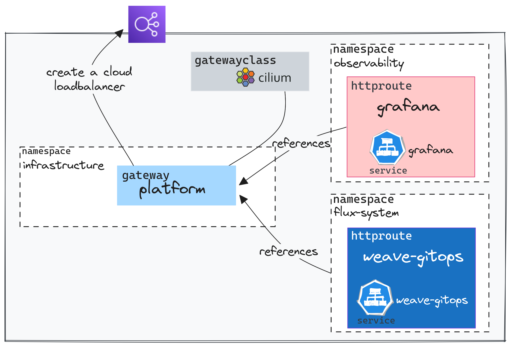

+++
author = "Smaine Kahlouch"
title = "`Gateway API`: Remplacer mon Ingress Controller avec `Cilium`?"
date = "2023-09-17"
summary = "Cilium permet de prendre en charge les fonctionnalités généralement fournies par des **Ingress controllers** grâce à l'implémentation du standard **Gateway API**. Une introduction et une mise en oeuvre concrète"
featured = true
# featureImage = "crossplane_k3d.png"
codeMaxLines = 21
usePageBundles = true
toc = true
tags = [
    "kubernetes",
    "infrastructure",
    "network"
]
thumbnail= "thumbnail.png"
+++

Lorsque l'on déploie une application sur Kubernetes, l'étape suivante consiste généralement à l'exposer aux utilisateurs. On utilise habituellement des "[**Ingress controllers**](https://kubernetes.io/docs/concepts/services-networking/ingress-controllers/)", comme Nginx, Haproxy, Traefik ou encore ceux des différents Clouders afin de diriger le trafic entrant vers l'application, gérer l'équilibrage de charge, la terminaison TLS et j'en passe.

Il faut alors choisir parmi la pléthore d'[options disponibles](https://kubernetes.io/docs/concepts/services-networking/ingress-controllers/) 🤯 la solution qui sera en charge de tous ces aspects et Cilium est, depuis relativement récemment, l'une d'entre elles.

[**Cilium**](https://cilium.io/)  est une solution Open-Source de connectivité réseau et de sécurité basée sur eBPF dont l'adoption est grandissante.
Il s'agit probablement du plugin réseau qui fournit le plus de fonctionnalités. Nous n'allons pas toutes les parcourir mais l'une d'entre elles consiste à gérer le trafic entrant en utilisant le standard [**Gateway API**](https://gateway-api.sigs.k8s.io/) (`GAPI`).


## 🎯 Notre objectif

* Comprendre ce qu'est exactement **Gateway API** et en quoi il s'agit d'une évolution par rapport à l'API `Ingress`.
* Démonstrations de cas concrets à la sauce GitOps.
* Les limitations actuelles et les évolutions à venir.

{}
Toutes les étapes réalisées dans cet article proviennent de ce [**dépôt git**](https://github.com/Smana/cilium-gateway-api)

Je vous invite à le parcourir car, il va bien au delà du contexte de cet article:

* Installation d'un cluster **EKS** avec `Cilium` configuré en mode sans kube-proxy et un Daemonset dédié à `Envoy`
* Proposition de structure de configuration `Flux` avec une gestion des dépendances et une factorisation que je trouve efficaces.
* `Crossplane` et composition [IRSA](https://docs.aws.amazon.com/eks/latest/userguide/iam-roles-for-service-accounts.html) qui simplifie la gestion des permissions IAM pour les composants plateforme
* Gestion des noms de domaine ainsi que des certificats automatisés avec `External-DNS` et `Let's Encrypt`

L'idée étant d'avoir l'ensemble configuré au bout de quelques minutes, en une seule ligne de commande 🤩.
{}

## ☸ Introduction à Gateway API

Comme évoqué précédemment, il y a de nombreuses options qui font office d' _Ingress controller_ et chacune a ses propres spécificités et des fonctionnalités particulières, rendant leur utilisation parfois complexe. Par ailleurs, l'API `Ingress`, utilisée historiquement dans Kubernetes possède très peu d'options. Certaines solutions ont d'ailleurs créé des [CRDs](https://kubernetes.io/docs/concepts/extend-kubernetes/api-extension/custom-resources/) (Ressources personalisées) quand d'autres font usage des `annotations` pour lever ces limites.

C'est dans ce contexte que **Gateway API** fait son apparition. Il s'agit d'un **standard** qui permet de définir des fonctionnalités réseau avancées sans nécessiter d'extensions spécifiques au contrôleur sous-jacent. De plus étant donné que tous les contrôleurs utilisent la même API , il est possible de passer d'une solution à une autre **sans changer de configuration** (les ressources qui gèrent le trafic entrant restent les mêmes).

Parmi les concepts que nous allons explorer la GAPI  introduit un schéma de répartition des responsabilités. Elle définit des **roles explicites avec des permissions bien distinctes**. (Plus d'informations sur le modèle de sécurité GAPI [ici](https://gateway-api.sigs.k8s.io/concepts/security-model/#roles-and-personas)).

Enfin il est important de noter que ce projet est dirigé par le groupe de travail [sig-network-kubernetes](https://github.com/kubernetes/community/tree/master/sig-network) et un canal slack vous permettra de les solliciter si nécessaire.

Voyons comment cela s'utilise concrètement 🚀!

## :ballot_box_with_check: Prérequis

Pour le reste de cet article nous considérons qu'un cluster EKS a été déployé. Si vous n'utilisez pas la [méthode proposée dans le repo de démo](https://github.com/Smana/cilium-gateway-api/tree/main/terraform/eks) servant de socle à cet article, il y a **certains points à valider** pour que GAPI puisse être utilisé.

ℹ️ La méthode d'installation decrite ici se base sur `Helm`, l'ensemble des `values` peuvent être consultées [ici](https://github.com/Smana/cilium-gateway-api/blob/main/terraform/eks/helm_values/cilium.yaml).

* **Installer** les `CRDs` (resources personnalisés) disponibles dans le repository [Gateway API](https://github.com/kubernetes-sigs/gateway-api/tree/main/config/crd)
{}

Si Cilium est configuré avec le support `GAPI` (voir ci-dessous)  et que les CRDs sont absentes, il ne démarrera pas.

Dans le [repo de demo](https://github.com/Smana/cilium-gateway-api) les **CRDs** `GAPI` sont installées une première fois lors de la création du cluster afin que Cilium puisse démarrer puis elles sont ensuite gérées par Flux.
{}

* **Remplacer** `kube-proxy` par les fonctionnalités de transfert réseau apportées par Cilium et `eBPF`.

```yaml
kubeProxyReplacement: true
```

* **Activer** le support de Gateway API

```yaml
gatewayAPI:
  enabled: true
```

* **Vérifier** L'installation
  Il faut pour cela installer le client en ligne de commande `cilium`. J'utilise personnellement [asdf](https://blog.ogenki.io/post/asdf/asdf/) pour cela:

  ```console
  asdf plugin-add cilium-cli
  asdf install cilium-cli 0.15.7
  asdf global cilium 0.15.7
  ```

  La commande suivante permet de s'assurer que tous les composants sont démarrés et opérationnels
  ```console
  cilium status --wait
     /¯¯\
  /¯¯\__/¯¯\    Cilium:             OK
  \__/¯¯\__/    Operator:           OK
  /¯¯\__/¯¯\    Envoy DaemonSet:    OK
  \__/¯¯\__/    Hubble Relay:       disabled
     \__/       ClusterMesh:        disabled

  Deployment             cilium-operator    Desired: 2, Ready: 2/2, Available: 2/2
  DaemonSet              cilium             Desired: 2, Ready: 2/2, Available: 2/2
  DaemonSet              cilium-envoy       Desired: 2, Ready: 2/2, Available: 2/2
  Containers:            cilium             Running: 2
                        cilium-operator    Running: 2
                        cilium-envoy       Running: 2
  Cluster Pods:          33/33 managed by Cilium
  Helm chart version:    1.14.2
  Image versions         cilium             quay.io/cilium/cilium:v1.14.2@sha256:6263f3a3d5d63b267b538298dbeb5ae87da3efacf09a2c620446c873ba807d35: 2
                        cilium-operator    quay.io/cilium/operator-aws:v1.14.2@sha256:8d514a9eaa06b7a704d1ccead8c7e663334975e6584a815efe2b8c15244493f1: 2
                        cilium-envoy       quay.io/cilium/cilium-envoy:v1.25.9-e198a2824d309024cb91fb6a984445e73033291d@sha256:52541e1726041b050c5d475b3c527ca4b8da487a0bbb0309f72247e8127af0ec: 2
  ```

  Enfin le support de GAPI peut être vérifié comme suit

  ```console
  cilium config view | grep -w "enable-gateway-api"
  enable-gateway-api                                true
  enable-gateway-api-secrets-sync                   true
  ```

  Il est aussi possible de lancer des tests de connectivité pour s'assurer qu'il n'y a pas de problèmes avec la configuration réseau du cluster:

  ```console
  cilium connectivity test
  ```

  ⚠️ Cette commande (`connectivity test`) provoque actuellement des erreurs lors de l'activation d'Envoy en tant que DaemonSet. ([Issue Github](https://github.com/cilium/cilium/issues/28057)).

{}
 **as DaemonSet**

Par défaut l'agent cilium intégre `Envoy` et lui délegue les opérations réseau de niveau 7.
Depuis la version `v1.14`, il est possible de déployer Envoy séparément ce qui apporte certains avantages:

* Si l'on modifie/redémarre un composant (que ce soit Cilium ou Envoy), cela n'affecte pas l'autre.
* Mieux attribuer les ressources à chacun des composants afin d'optimiser les perfs.
* Limite la surface d'attaque en cas de compromission d'un des pods.
* Les logs Envoy et de l'agent Cilium ne sont pas mélangés

Il est possible d'utiliser la commande suivante pour vérifier que cette fonctionnalité est bien active:

```console {hl_lines=[5]}
cilium status
    /¯¯\
 /¯¯\__/¯¯\    Cilium:             OK
 \__/¯¯\__/    Operator:           OK
 /¯¯\__/¯¯\    Envoy DaemonSet:    OK
 \__/¯¯\__/    Hubble Relay:       disabled
    \__/       ClusterMesh:        disabled
```

[Plus d'information](https://isovalent.com/blog/post/cilium-release-114/#h-envoy-daemonset).

{}

## 🚪 La porte d'entrée: GatewayClass et Gateway

<center></center>

Une fois [les conditions nécessaires](#☑️-prérequis) remplies, nous avons accès à plusieurs éléments. Nous pouvons notamment utiliser les ressources de la Gateway API grâce aux CRDs. D'ailleurs, dès l'installation de Cilium, une `GatewayClass` est directement disponible.

```console
kubectl get gatewayclasses.gateway.networking.k8s.io
NAME     CONTROLLER                     ACCEPTED   AGE
cilium   io.cilium/gateway-controller   True       7m59s
```

Sur un cluster il est possible de configurer plusieurs `GatewayClass` et donc d'avoir la possibilité de faire usage de différentes implémentations. Nous pouvons par exemple utiliser `Linkerd` en référencant la GatewayClass dans la configuration de la `Gateway`.

La `Gateway` est la ressource qui permet **déclencher** la création de composants de répartition de charge chez le Clouder.

Voici un exemple simple:
[apps/base/echo/gateway.yaml](https://github.com/Smana/cilium-gateway-api/blob/main/apps/base/echo/gateway.yaml)

```yaml {hl_lines=[7]}
apiVersion: gateway.networking.k8s.io/v1beta1
kind: Gateway
metadata:
  name: echo-gateway
  namespace: echo
spec:
  gatewayClassName: cilium
  listeners:
    - protocol: HTTP
      port: 80
      name: echo-1-echo-server
      allowedRoutes:
        namespaces:
          from: Same
```

Sur AWS (EKS), quand on configure une `Gateway`, Cilium crée un `Service` de type `LoadBalancer`. Ce service est alors interprété par un autre contrôleur, l'([AWS Load Balancer Controler](<https://kubernetes-sigs.github.io/aws-load-balancer-controller>)), qui produit un [NLB](https://docs.aws.amazon.com/elasticloadbalancing/latest/network/introduction.html).

```console
kubectl get svc -n echo cilium-gateway-echo
NAME                  TYPE           CLUSTER-IP     EXTERNAL-IP                                                                 PORT(S)        AGE
cilium-gateway-echo   LoadBalancer   172.20.19.82   k8s-echo-ciliumga-64708ec85c-fcb7661f1ae4e4a4.elb.eu-west-3.amazonaws.com   80:30395/TCP   2m58s
```

Il est intéressant de noter que l'adresse en question est aussi associée à la resource `Gateway`.

```console
kubectl get gateway -n echo echo
NAME   CLASS    ADDRESS                                                                     PROGRAMMED   AGE
echo   cilium   k8s-echo-ciliumga-64708ec85c-fcb7661f1ae4e4a4.elb.eu-west-3.amazonaws.com   True         16m
```

## :arrow_right_hook: Les règles de routage: HTTPRoute

### Un routage simple
<center></center>

Pour résumer le schéma ci-dessus en quelques mots: </br>
Une ressource `HTTPRoute` permet de configurer le routage vers le service en référencant la gateway et en définissant le les paramètres de routage souhaités.

{}
 **workaround**

À ce jour, il n'est pas possible de configurer les annotations des services générés par les `Gateways` ([Issue Github](https://github.com/cilium/cilium/issues/25357)). Une solution de contournement a été proposé afin de modifier le service généré par la `Gateway` dès lors qu'il est créé.

Kyverno est un outil qui permet de garantir la conformité des configurations par rapport aux bonnes pratiques et aux exigences de sécurité. Nous utilisons ici uniquement sa capacité à décrire une règle de [mutation](https://kyverno.io/docs/writing-policies/mutate/) facilement.

[security/mycluster-0/echo-gw-clusterpolicy.yaml](https://github.com/Smana/cilium-gateway-api/blob/main/security/mycluster-0/echo-gw-clusterpolicy.yaml)

```yaml
spec:
  rules:
    - name: mutate-svc-annotations
      match:
        any:
          - resources:
              kinds:
                - Service
              namespaces:
                - echo
              name: cilium-gateway-echo
      mutate:
        patchStrategicMerge:
          metadata:
            annotations:
              external-dns.alpha.kubernetes.io/hostname: echo.${domain_name}
              service.beta.kubernetes.io/aws-load-balancer-scheme: "internet-facing"
              service.beta.kubernetes.io/aws-load-balancer-backend-protocol: tcp
          spec:
            loadBalancerClass: service.k8s.aws/nlb
```

Le service `cilium-gateway-echo` se verra donc ajouter les annotations du contrôleur AWS ainsi qu'une annotation permettant de configurer une entrée DNS automatiquement.

{}

[apps/base/echo/httproute.yaml](https://github.com/Smana/cilium-gateway-api/blob/main/apps/base/echo/httproute.yaml)
```yaml {hl_lines=["7-10"]}
apiVersion: gateway.networking.k8s.io/v1beta1
kind: HTTPRoute
metadata:
  name: echo-1
  namespace: echo
spec:
  parentRefs:
    - name: echo
      namespace: echo
  rules:
    - matches:
        - path:
            type: PathPrefix
            value: /
      backendRefs:
        - name: echo-1-echo-server
          port: 80
```

L'exemple utilisé ci-dessus est simpliste: toutes les requêtes sont transférées au service `echo-1-echo-server`.<br>
`parentRefs` permet d'indiquer la `Gateway` à utiliser puis les règles de routage sont définies dans `rules.`


Les règles de routages pourraient aussi être basées sur le `path`.

```yaml
...
spec:
  hostnames:
  - foo.bar.com
  rules:
  - matches:
    - path:
        type: PathPrefix
        value: /login
```

Ou une entête HTTP

```yaml
...
spec:
  rules:
  - matches:
      headers:
      - name: "version"
        value: "2"
...
```

Vérifions que le service est joignable:

```console
curl -s http://echo.cloud.ogenki.io | jq -rc '.environment.HOSTNAME'
echo-1-echo-server-fd88497d-w6sgn
```

Comme vous pouvez le voir le service est exposé en HTTP sans certificat. Essayons de corriger cela 😉

### Exposer un service en utilisant un certificat TLS

Il existe plusieurs méthodes pour configurer du TLS avec GAPI. Ici nous allons utiliser le cas le plus commun: protocole HTTPS et terminaison TLS sur la Gateway.

Supposons que nous souhaitons configurer le nom de domaine `echo.cloud.ogenki.io` utilisé précédemment. La configuration se fait principalement au niveau de la `Gateway`

[apps/base/echo/tls-gateway.yaml](https://github.com/Smana/cilium-gateway-api/blob/main/apps/base/echo/tls-gateway.yaml)

```yaml {hl_lines=[7,"12-14","18-21"]}
apiVersion: gateway.networking.k8s.io/v1beta1
kind: Gateway
metadata:
  name: echo
  namespace: echo
  annotations:
    cert-manager.io/cluster-issuer: letsencrypt-prod
spec:
  gatewayClassName: cilium
  listeners:
    - name: http
      hostname: "echo.${domain_name}"
      port: 443
      protocol: HTTPS
      allowedRoutes:
        namespaces:
          from: Same
      tls:
        mode: Terminate
        certificateRefs:
          - name: echo-tls
```

Le point essentiel ici est la référence à un secret contenant le certificat `echo-tls`. Ce certificat peut être créé manuellement mais j'ai décidé pour cet article d'automatiser cela avec **Let's Encrypt** et `cert-manager`.

{}
 **cert-manager**

Avec `cert-manager` il est très simple d'automatiser la création et la mise à jour des certificats exposés par la `Gateway`.
Pour cela, il faut permettre au contrôlleur d'accéder à [route53](https://aws.amazon.com/route53/) afin de résoudre un challenge DNS01 (Mécanisme qui permet de s'assurer que les clients peuvent seulement demander des certificats pour des domaines qu'ils possèdent).

Une ressource [ClusterIssuer](https://github.com/Smana/cilium-gateway-api/blob/main/security/base/cert-manager/cluster-issuer-staging.yaml) décrit la configuration nécessaire pour générer des certificats grâce à cert-manager.

Ensuite il suffit d'ajouter une annotation `cert-manager.io/cluster-issuer` et indiquer le secret Kubernetes où sera stocké le certificat.

ℹ️ Dans le repo de demo les permissions sont attribuées en utilisant `Crossplane` qui se charge de configurer cela au niveau du Cloud AWS.

[Plus d'informations](https://cert-manager.io/docs/usage/gateway/)
{}

Pour que le routage se fasse correctement il faut aussi bien entendu référencer la bonne Gateway mais aussi indiquer le nom de domaine dans la ressource `HTTPRoute`.

```yaml {hl_lines=["8-11"]}
apiVersion: gateway.networking.k8s.io/v1beta1
kind: HTTPRoute
metadata:
  name: echo-1
  namespace: echo
spec:
  parentRefs:
    - name: echo
      namespace: echo
  hostnames:
    - "echo.${domain_name}"
...
```
Il faut patienter quelques minutes le temps que le certificat soit créé.

```console
kubectl get cert -n echo
NAME       READY   SECRET     AGE
echo-tls   True    echo-tls   43m
```

Nous pouvons enfin vérifier que le certificat est bien issue de Let's Encrypt comme suit:

```console
curl https://echo.cloud.ogenki.io -v 2>&1 | grep -A 6 'Server certificate'
* Server certificate:
*  subject: CN=echo.cloud.ogenki.io
*  start date: Sep 15 14:43:00 2023 GMT
*  expire date: Dec 14 14:42:59 2023 GMT
*  subjectAltName: host "echo.cloud.ogenki.io" matched cert's "echo.cloud.ogenki.io"
*  issuer: C=US; O=Let's Encrypt; CN=R3
*  SSL certificate verify ok.
```

{}
GAPI permet aussi de configurer le TLS de bout en bout, jusqu'au conteneur.
Cela se fait en configurant la Gateway en `Passthrough` et en utilisant une ressource `TLSRoute`.
Il faut aussi que le certificat soit porté par le pod qui fait terminaison TLS.
{}

### Une Gateway partagée par plusieurs namespaces

<center></center>

Avec `GAPI` il est possible de router le trafic à travers les `Namespaces`. Cela est rendu possible grâce à des ressources distinctes pour chaque fonction: Une `Gateway` qui permet de configurer l'infrastructure et notamment de provisionner une adresse IP, et les `*Routes`. Ces routes peuvent référencer une Gateway située dans un autre namespace. Il est ainsi possible pour différent(e)s équipes/projets de partager les mêmes éléments d'infrastructure.

Il est cependant requis de spécifier quelle route est autorisée à référencer la Gateway. Ici nous supposons que nous avons une Gateway dédiée aux outils internes qui s'appelle `platform`.
En utilisant le paramètre `allowedRoutes`, nous spécifions explicitement quelles sont les namespaces autorisés à référencer cette Gateway.

[infrastructure/base/gapi/platform-gateway.yaml](https://github.com/Smana/cilium-gateway-api/blob/main/infrastructure/base/gapi/platform-gateway.yaml)
```yaml
...
      allowedRoutes:
        namespaces:
          from: Selector
          selector:
            matchExpressions:
              - key: kubernetes.io/metadata.name
                operator: In
                values:
                  - observability
                  - flux-system
      tls:
        mode: Terminate
        certificateRefs:
          - name: platform-tls
```

Les `HTTPRoutes` situées dans les namespaces `observability` et `flux-system` réferéncent cette même `Gateway`.

```yaml
...
spec:
  parentRefs:
    - name: platform
      namespace: infrastructure
```

Et utilisent le même répartiteur de charge du Clouder

```console
NLB_DOMAIN=$(kubectl get svc -n infrastructure cilium-gateway-platform -o jsonpath={.status.loadBalancer.ingress[0].hostname})

dig +short ${NLB_DOMAIN}
13.36.89.108

dig +short grafana-mycluster-0.cloud.ogenki.io
13.36.89.108

dig +short gitops-mycluster-0.cloud.ogenki.io
13.36.89.108
```

{}
🔒 Ces outils internes ne devraient pas être exposés sur Internet mais vous comprendrez qu'il s'agit là d'une démo 🙏.
On pourrait par exemple, utiliser et une Gateway interne (IP privée) en jouant sur les annotations et un moyen de connexion privé (VPN, tunnels ...)
{}

### Traffic splitting

<center></center>

Il est souvent utile de tester une application sur une portion du trafic lorsqu'une nouvelle version est disponible (A/B testing ou Canary deployment).
`GAPI` permet cela de façon très simple en utilisant des poids.

Voici un exemple permettant de tester sur 5% du trafic vers le service `echo-2-echo-server`

[apps/base/echo/httproute-split.yaml](https://github.com/Smana/cilium-gateway-api/blob/main/apps/base/echo/httproute-split.yaml)

```yaml
...
  hostnames:
    - "split-echo.${domain_name}"
  rules:
    - matches:
        - path:
            type: PathPrefix
            value: /
      backendRefs:
        - name: echo-1-echo-server
          port: 80
          weight: 95
        - name: echo-2-echo-server
          port: 80
          weight: 5
```

Vérifions que la répartition se fait bien comme attendu:

[scripts/check-split.sh](https://github.com/Smana/cilium-gateway-api/blob/main/scripts/check-split.sh)

```console
./scripts/check-split.sh https://split-echo.cloud.ogenki.io
Number of requests for echo-1: 95
Number of requests for echo-2: 5
```

### Manipulation des entêtes HTTP (Headers)

Il est aussi possible de jouer avec les entêtes HTTP (**Headers**): en ajouter, modifier ou supprimer. Ces modifications peuvent se faire sur les Headers de requête ou de réponse par le biais de [filtres](https://gateway-api.sigs.k8s.io/api-types/httproute#filters-optional) ajoutés à la ressource `HTTPRoute`.

Nous allons par exemple ajouter un Header à la **requête**

```yaml
apiVersion: gateway.networking.k8s.io/v1beta1
kind: HTTPRoute
metadata:
  name: echo-1
  namespace: echo
spec:
...
  rules:
    - matches:
        - path:
            type: PathPrefix
            value: /req-header-add
      filters:
        - type: RequestHeaderModifier
          requestHeaderModifier:
            add:
              - name: foo
                value: bar
      backendRefs:
        - name: echo-1-echo-server
          port: 80
...
```

La commande suivante permet de vérifier que le header est bien présent.

```console {hl_lines=[10]}
curl -s https://echo.cloud.ogenki.io/req-header-add -sk | jq '.request.headers'
{
  "host": "echo.cloud.ogenki.io",
  "user-agent": "curl/8.2.1",
  "accept": "*/*",
  "x-forwarded-for": "81.220.234.254",
  "x-forwarded-proto": "https",
  "x-envoy-external-address": "81.220.234.254",
  "x-request-id": "320ba4d2-3bd6-4c2f-8a97-74296a9f3f26",
  "foo": "bar"
}
```

## 🪪 Les roles et permissions

`GAPI` offre un modèle de partage des permissions claire entre l'infrastructure de routage du trafic (gérée par les administrateurs de cluster) et les applications (gérées par les développeurs).

Le fait de disposer de plusieurs ressources nous permet d'utiliser les ressources **RBAC** dans Kubernetes pour attribuer les droits de façon déclarative.
J'ai ajouté [quelques exemples](https://github.com/Smana/cilium-gateway-api/tree/main/security/base/rbac) qui n'ont aucun effet dans mon cluster de démo mais qui peuvent vous permettre de vous faire une idée.

La configuration suivante permet aux membres du groupe `developers` de gérer les `HTTPRoutes` dans le namespace `echo`. En revanche ils ne possédent que des droits en lecture sur les `Gateways`.

```yaml
---
apiVersion: rbac.authorization.k8s.io/v1
kind: Role
metadata:
  namespace: echo
  name: gapi-developer
rules:
  - apiGroups: ["gateway.networking.k8s.io"]
    resources: ["httproutes"]
    verbs: ["*"]
  - apiGroups: ["gateway.networking.k8s.io"]
    resources: ["gateways"]
    verbs: ["get", "list"]
---
apiVersion: rbac.authorization.k8s.io/v1
kind: RoleBinding
metadata:
  name: gapi-developer
  namespace: echo
subjects:
  - kind: Group
    name: "developers"
    apiGroup: rbac.authorization.k8s.io
roleRef:
  kind: Role
  name: gapi-developer
  apiGroup: rbac.authorization.k8s.io
```

## 🤔 Un périmètre pas évident

Il ne faut pas confondre `GAPI` avec ce que l'on nomme couramment une `API Gateway`. Une section de la [FAQ](https://gateway-api.sigs.k8s.io/faq/) a d'ailleurs été créé pour éclaircir ce point. Bien que GAPI offre des fonctionnalités typiquement présentes dans une API Gateway, il s'agit avant tout d'une implémentation spécifique pour Kubernetes. Cependant, ce choix de dénomination peut **prêter à confusion**.

Il est essentiel de mentionner que cet article se concentre uniquement sur le trafic entrant, appelé [north-south](https://gateway-api.sigs.k8s.io/concepts/glossary/#northsouth-traffic), traditionnellement géré par les _Ingress Controllers_. Ce trafic représente le périmètre initial de GAPI. Une initiative récente nommée [**GAMMA**](https://gateway-api.sigs.k8s.io/concepts/gamma/) vise à également gérer le routage [east-west](https://gateway-api.sigs.k8s.io/concepts/glossary/#eastwest-traffic), ce qui permettra de standardiser certaines fonctionnalités des solutions de `Service Mesh` à l'avenir. (voir [cet article](https://kubernetes.io/blog/2023/08/29/gateway-api-v0-8/) pour plus d'informations).

## 💭 Dernières remarques

Pour être honnête, j'ai entendu parlé de **Gateway API** depuis un petit moment. J'ai lu quelques articles mais jusqu'ici je n'avais pas pris le temps d'approfondir le sujet. Je me disais "Pourquoi? J'arrive à faire ce que je veux avec mon _Ingress Controller_ ? et puis il faut apprendre à utiliser de nouvelles ressources".

GAPI gagne en maturité et nous sommes proche d'une version GA. De nombreux projets l'ont déjà adopté, Istio et Linkerd par exemple sont totalement compatibles avec la version 0.8.0 et cette façon de gérer le trafic au sein de Kubernetes deviendra rapidement la norme.

Toujours est-il que j'ai beaucoup aimé la déclaration des différentes configurations que je trouve très intuitive et explicite ❤️.
D'autre part le modèle de sécurité permet de donner le pouvoir aux developpeurs sans sacrifier la sécurité. Enfin la gestion de l'infrastructure se fait de façon transparente, nous pouvons rapidement passer d'une implémentation (contrôleur sous-jacent) à une autre sans toucher aux `*Routes`.

Alors suis-je prêt à changer mon Ingress Controller pour `Cilium` aujourd'hui? La réponse courte est **Non mais bientôt**!.

Tout d'abord j'aimerais mettre en évidence sur l'étendue des possiblités offertes par Cilium: De nombreuses personnes se sentent noyées sous les nombreux outils qui gravitent autour de Kubernetes. Cilium permettrait de remplir les fonctionnalités de nombre d'entre eux (metrics, tracing, service-mesh, sécurité et ... _Ingress Controller_ avec GAPI).

Cependant, bien que nous puissions faire du routage HTTP de base, il y à certains points d'attention:

* Le [support de TCP et UDP](https://github.com/cilium/cilium/issues/21929)
* Le [support de GRPC](https://github.com/cilium/cilium/issues/21928)
* Devoir passer par une règle de mutation pour pouvoir configurer les composants cloud. ([Issue Github](https://github.com/cilium/cilium/issues/25357))
* De nombreuses fonctionnalités explorées sont toujours au stade expérimental. On peut citer les [fonctions étendues](https://github.com/cilium/cilium/pull/27472) qui supportés depuis quelques jours: J'ai par exemple tenté de configurer une redirection HTTP>HTTPS simple mais je suis tombé sur [ce problème](https://github.com/kubernetes-sigs/gateway-api/issues/1185). Je m'attends donc à ce qu'il y ait des changements dans l'API très prochainement.

Je n'ai pas abordé toutes les fonctionnalités de l'implémentation Cilium de GAPI (Honnêtement, cet article est déjà bien fourni 😜). Néanmoins, je suis vraiment **convaincu** de son potentiel. J'ai bon espoir qu'on pourra bientôt envisager son utilisation en production. Si vous n'avez pas encore envisagé cette transition, c'est le moment de s'y pencher 😉 ! Toutefois, compte tenu des aspects évoqués précédemment, je conseillerais de patienter un peu.
## 🔖 References

* <https://gateway-api.sigs.k8s.io/>
* <https://docs.cilium.io/en/latest/network/servicemesh/gateway-api/gateway-api/#gs-gateway-api>
* <https://isovalent.com/blog/post/cilium-gateway-api/>
* <https://isovalent.com/blog/post/tutorial-getting-started-with-the-cilium-gateway-api/>
* Les [labs](https://isovalent.com/resource-library/labs/) d'Isovalent permettent de rapidement de tester GAPI et vous pourrez ajouter des badges à votre collection 😄 
