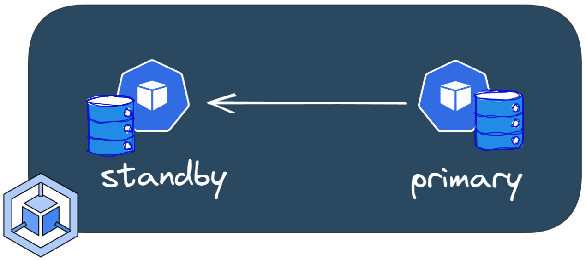
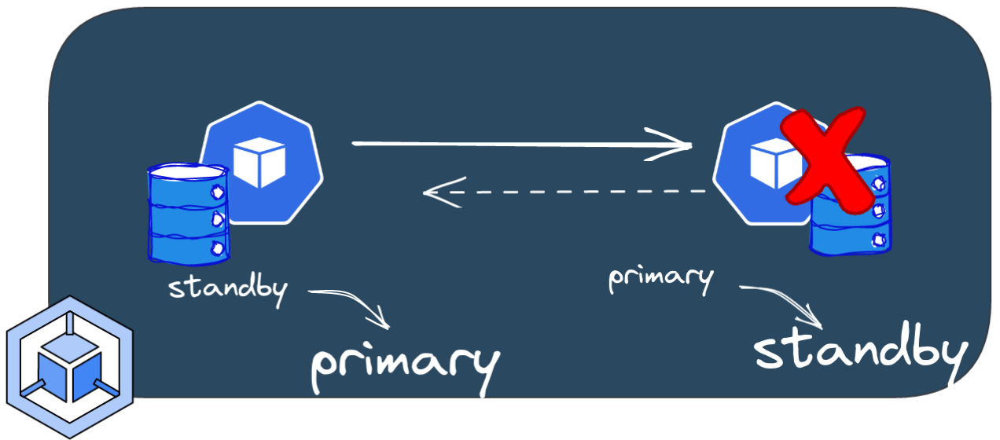
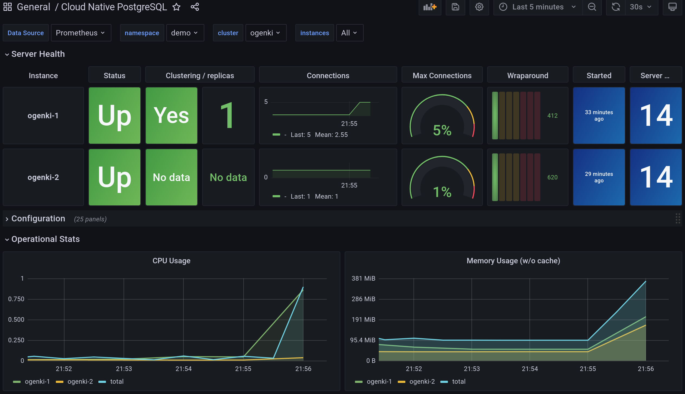

+++
author = "Smaine Kahlouch"
title = '`CloudNativePG`: et PostgreSQL devient facile sur Kubernetes'
date = "2022-10-23"
summary = "**CloudNativePG** est un opérateur Kubernetes qui facilite la gestion et l'exploitation de bases de données PostgreSQL. Cet article montre comment créer un serveur, effectuer des sauvegardes et des récupérations, la supervision et quelques petits conseils."
featureImage = "cnpg.png"
featured = true
codeMaxLines = 20
usePageBundles = true
toc = true
tags = [
    "data"
]
thumbnail= "cloudnativepg.png"
+++

Kubernetes est désormais la plate-forme privilégiée pour orchestrer les applications "sans état" aussi appelé "stateless". Les conteneurs qui ne stockent pas de données peuvent être détruits et recréés ailleurs sans impact. En revanche, la gestion d'applications "stateful" dans un environnement dynamique tel que Kubernetes peut être un véritable **défi**. Malgré le fait qu'il existe un nombre croissant de solutions de base de données "Cloud Native" (comme CockroachDB, TiDB, K8ssandra, Strimzi ...) et il y a de nombreux **éléments à considérer** lors de leur évaluation:

* Quelle est la maturité de l'opérateur? (Dynamisme et contributeurs, gouvernance du projet)
* Quels sont les resources personalisées disponibles ("custom resources"), quelles opérations permettent t-elles de réaliser?
* Quels sont les type de stockage disponibles: HDD / SSD, stockage local / distant?
* Que se passe-t-il lorsque quelque chose se passe mal: Quelle est le niveau de résilience de la solution?
* Sauvegarde et restauration: est-il facile d'effectuer et de planifier des sauvegardes?
* Quelles options de réplication et de mise à l'échelle sont disponibles?
* Qu'en est-il des limites de connexion et de concurrence, les pools de connexion?
* A propos de la supervision, quelles sont les métriques exposées et comment les exploiter?

J'étais à la recherche d'une solution permettant de gérer un serveur **PostgreSQL**. La base de données qui y serait hébergée est nécessaire pour un logiciel de réservation de billets nommé [Alf.io](https://alf.io/). Nous sommes en effet en train d'organiser les [Kubernetes Community Days France](https://kcdfrance.fr) vous êtes tous conviés! 👐.

Je cherchais spécifiquement une solution indépendante d'un clouder (cloud agnostic) et l'un des principaux critères était la simplicité d'utilisation. Je connaissais déjà plusieurs opérateurs Kubernetes, et j'ai fini par évaluer une solution relativement récente: [**CloudNativePG**](https://cloudnative-pg.io/).

> CloudNativepg est l'opérateur de Kubernetes qui couvre le cycle de vie complet d'un cluster de base de données PostgreSQL hautement disponible avec une architecture de réplication native en streaming.

Ce projet été créé par l'entreprise [EnterpriseDB](https://www.enterprisedb.com/) et a été soumis à la **CNCF** afin de rejoindre les projets _Sandbox_.

## :bullseye: Notre objectif

Je vais donner ici une **introduction** aux principales fonctionnalités de CloudNativePG.

Le plan est de:

- Créez une base de données PostgreSQL sur un cluster GKE,
- Ajoutez une instance secondaire (réplication)
- Exécutez quelques tests de résilience.

Nous verrons également comment tout cela se comporte en terme de performances et quels sont les outils de supervision disponibles.
Enfin, nous allons jeter un œil aux méthodes de sauvegarde/restauration.


{}
Dans cet article, nous allons tout créer et tout mettre à jour manuellement. Mais dans un environnement de production, il est conseillé d'utiliser un moteur **GitOps**, par exemple Flux (sujet couvert dans un [article précédent](/post/deflux/)).

Si vous souhaitez voir un **exemple complet**, vous pouvez consulter le dépôt git [KCD France infrastructure](https://github.com/cncfparis/kcdfrance-gitops).

Toutes les resources de cet article sont dans [ce dépôt](https://github.com/Smana/smana.github.io/tree/main/content/resources/cnpg).
{}


## :ballot_box_with_check: Prérequis

### :inbox_tray: Outils

* **gcloud SDK:** Nous allons déployer sur Google Cloud (en particulier sur GKE) et, pour ce faire, nous devrons créer quelques ressources dans notre projet GCP. Nous aurons donc besoin du SDK et de la CLI Google Cloud. Il est donc nécessaire de l'installer en suivant [cette documentation](https://cloud.google.com/sdk/docs/install-sdk).

* **kubectl plugin:** Pour faciliter la gestion des clusters, il existe un plugin `kubectl` qui donne des informations synthétiques sur l'instance PostgreSQL et permet aussi d'effectuer certaines opérations.
Ce plugin peut être installé en utilisant [krew](https://krew.sigs.k8s.io/):

```console
kubectl krew install cnpg
```

### ☁️ Créer les resources Google Cloud

Avant de créer notre instance PostgreSQL, nous devons configurer certaines choses:

* Nous avons besoin d'un cluster Kubernetes. (Cet article suppose que vous avez déjà pris soin de provisionner un cluster **GKE**)
* Nous allons créer un bucket (Google Cloud Storage) pour stocker les sauvegardes et [Fichiers WAL](https://www.postgresql.org/docs/15/wal-intro.html).
* Nous configurerons **les permissions** pour nos pods afin qu'ils puissent écrire dans ce bucket.

Créer le bucket à l'aide de CLI `gcloud`

```console
gcloud storage buckets create --location=eu --default-storage-class=coldline gs://cnpg-ogenki
Creating gs://cnpg-ogenki/...

gcloud storage buckets describe gs://cnpg-ogenki
[...]
name: cnpg-ogenki
owner:
  entity: project-owners-xxxx0008
projectNumber: 'xxx00008'
rpo: DEFAULT
selfLink: https://www.googleapis.com/storage/v1/b/cnpg-ogenki
storageClass: STANDARD
timeCreated: '2022-10-15T19:27:54.364000+00:00'
updated: '2022-10-15T19:27:54.364000+00:00'
```

Nous allons maintenant configurer les permissions afin que les pods (PostgreSQL Server) puissent permettant écrire/lire à partir du bucket grâce à [**Workload Identity**](https://cloud.google.com/kubernetes-engine/docs/how-to/workload-identity).

{}
_Workload Identity_ doit être activé au niveau du cluster GKE.
Afin de vérifier que le cluster est bien configuré, vous pouvez lancer la commande suivante:

```console
gcloud container clusters describe <cluster_name> --format json --zone <zone> | jq .workloadIdentityConfig
{
  "workloadPool": "{{ gcp_project }}.svc.id.goog"
}
```
{}


Créer un [compte de service](https://cloud.google.com/iam/docs/service-accounts?hl=fr) Google Cloud

```console
gcloud iam service-accounts create cloudnative-pg --project={{ gcp_project }}
Created service account [cloudnative-pg].
```

Attribuer au compte de service la permission `storage.admin`

```console
gcloud projects add-iam-policy-binding {{ gcp_project }} \
--member "serviceAccount:cloudnative-pg@{{ gcp_project }}.iam.gserviceaccount.com" \
--role "roles/storage.admin"
[...]
- members:
  - serviceAccount:cloudnative-pg@{{ gcp_project }}.iam.gserviceaccount.com
  role: roles/storage.admin
etag: BwXrGA_VRd4=
version: 1
```

Autoriser le compte de service (Attention il s'agit là du compte de service au niveau Kubernetes) afin d'**usurper le compte de service IAM**. <br>
:information_source: Assurez-vous d'utiliser le format approprié `serviceAccount:{{ gcp_project }}.svc.id.goog[{{ kubernetes_namespace }}/{{ kubernetes_serviceaccount }}]`

```console
gcloud iam service-accounts add-iam-policy-binding cloudnative-pg@{{ gcp_project }}.iam.gserviceaccount.com \
--role roles/iam.workloadIdentityUser --member "serviceAccount:{{ gcp_project }}.svc.id.goog[demo/ogenki]"
Updated IAM policy for serviceAccount [cloudnative-pg@{{ gcp_project }}.iam.gserviceaccount.com].
bindings:
- members:
  - serviceAccount:{{ gcp_project }}.svc.id.goog[demo/ogenki]
  role: roles/iam.workloadIdentityUser
etag: BwXrGBjt5kQ=
version: 1
```

Nous sommes prêts à créer les ressources Kubernetes :muscle:

### :key: Créer les secrets pour les utilisateurs PostgreSQL

Nous devons créer les paramètres d'authentification des utilisateurs qui seront créés pendant la phase de "bootstrap" (nous y reviendrons par la suite): le superutilisateur et le propriétaire de base de données nouvellement créé.

```console
kubectl create secret generic cnpg-mydb-superuser --from-literal=username=postgres --from-literal=password=foobar --namespace demo
secret/cnpg-mydb-superuser created
```

```console
kubectl create secret generic cnpg-mydb-user --from-literal=username=smana --from-literal=password=barbaz --namespace demo
secret/cnpg-mydb-user created
```

## :hammer_and_wrench: Deploy the CloudNativePG operator using Helm

Ici nous utiliserons le chart Helm pour déployer CloudNativePG:

```console
helm repo add cnpg https://cloudnative-pg.github.io/charts

helm upgrade --install cnpg --namespace cnpg-system \
--create-namespace charts/cloudnative-pg

kubectl get po -n cnpg-system
NAME                    READY   STATUS      RESTARTS   AGE
cnpg-74488f5849-8lhjr   1/1     Running     0          6h17m
```

Suite à l'installation de l'opérateur Kubernetes, quelques resources personnalisées (_Custom Resources Definitions_) sont disponibles.

```console
kubectl get crds | grep cnpg.io
backups.postgresql.cnpg.io                       2022-10-08T16:15:14Z
clusters.postgresql.cnpg.io                      2022-10-08T16:15:14Z
poolers.postgresql.cnpg.io                       2022-10-08T16:15:14Z
scheduledbackups.postgresql.cnpg.io              2022-10-08T16:15:14Z
```

Pour une liste complète des paramètres possibles, veuillez vous référer à la doc de l'[API](https://cloudnative-pg.io/documentation/1.18/api_reference/).

<br>

## :rocket: Créer un serveur PostgreSQL

<center></center>

Dous pouvons désormais créer notre première instance en utilisant une **resource personnalisée** `Cluster`. La définition suivante est assez simple:
nous souhaitons démarrer un serveur PostgreSQL, créer automatiquement une base de données nommée `mydb`  et configurer les informations d'authentification en fonction des [secrets créés précédemment](#key-créer-les-secrets-pour-les-utilisateurs-postgresql).

```yaml
apiVersion: postgresql.cnpg.io/v1
kind: Cluster
metadata:
  name: ogenki
  namespace: demo
spec:
  description: "PostgreSQL Demo Ogenki"
  imageName: ghcr.io/cloudnative-pg/postgresql:14.5
  instances: 1

  bootstrap:
    initdb:
      database: mydb
      owner: smana
      secret:
        name: cnpg-mydb-user

  serviceAccountTemplate:
    metadata:
      annotations:
        iam.gke.io/gcp-service-account: cloudnative-pg@{{ gcp_project }}.iam.gserviceaccount.com

  superuserSecret:
    name: cnpg-mydb-superuser

  storage:
    storageClass: standard
    size: 10Gi

  backup:
    barmanObjectStore:
      destinationPath: "gs://cnpg-ogenki"
      googleCredentials:
        gkeEnvironment: true
    retentionPolicy: "30d"

  resources:
    requests:
      memory: "1Gi"
      cpu: "500m"
    limits:
      memory: "1Gi"
```

Créer le `namespace` où notre instance postgresql sera déployée
```console
kubectl create ns demo
namespace/demo created
```

Adapdez le fichier YAML ci-dessus vos besoins et appliquez comme suit:
```console
kubectl apply -f cluster.yaml
cluster.postgresql.cnpg.io/ogenki created
```

Vous remarquerez que le cluster sera en phase _Initializing_. Nous allons utiliser le plugin **CNPG** pour la première fois afin de vérifier son état.
Cet outil deviendra par la suite notre meilleur ami pour afficher une vue synthétique de l'état du cluster.

```console
kubectl cnpg status ogenki -n demo
Cluster Summary
Primary server is initializing
Name:              ogenki
Namespace:         demo
PostgreSQL Image:  ghcr.io/cloudnative-pg/postgresql:14.5
Primary instance:   (switching to ogenki-1)
Status:            Setting up primary Creating primary instance ogenki-1
Instances:         1
Ready instances:   0

Certificates Status
Certificate Name    Expiration Date                Days Left Until Expiration
----------------    ---------------                --------------------------
ogenki-ca           2023-01-13 20:02:40 +0000 UTC  90.00
ogenki-replication  2023-01-13 20:02:40 +0000 UTC  90.00
ogenki-server       2023-01-13 20:02:40 +0000 UTC  90.00

Continuous Backup status
First Point of Recoverability:  Not Available
No Primary instance found
Streaming Replication status
Not configured

Instances status
Name  Database Size  Current LSN  Replication role  Status  QoS  Manager Version  Node
----  -------------  -----------  ----------------  ------  ---  ---------------  ----
```

immédiatement après la déclaration de notre nouveau `Cluster`, une action de **bootstrap** est lancée.
Dans notre exemple, nous créons une toute nouvelle base de données nommée `mydb` avec un propriétaire `smana` dont les informations d'authentification viennent du secret créé précédemment.

```yaml
[...]
  bootstrap:
    initdb:
      database: mydb
      owner: smana
      secret:
        name: cnpg-mydb-user
[...]
```

```console
kubectl get po -n demo
NAME                    READY   STATUS      RESTARTS   AGE
ogenki-1                0/1     Running     0          55s
ogenki-1-initdb-q75cz   0/1     Completed   0          2m32s
```

Après quelques secondes, le cluster change de statut et devient `Ready` (configuré et prêt à l'usage) :clap:

```console
kubectl cnpg status ogenki -n demo
Cluster Summary
Name:               ogenki
Namespace:          demo
System ID:          7154833472216277012
PostgreSQL Image:   ghcr.io/cloudnative-pg/postgresql:14.5
Primary instance:   ogenki-1
Status:             Cluster in healthy state
Instances:          1
Ready instances:    1

[...]

Instances status
Name      Database Size  Current LSN  Replication role  Status  QoS        Manager Version  Node
----      -------------  -----------  ----------------  ------  ---        ---------------  ----
ogenki-1  33 MB          0/17079F8    Primary           OK      Burstable  1.18.0           gke-kcdfrance-main-np-0e87115b-xczh
```

{}
Il existe de nombreuses façons de bootstrap un cluster. Par exemple, la restauration d'une sauvegarde dans une toute nouvelle instance ou en exécutant du code SQL ...
Plus d'infos [ici](https://cloudnative-pg.io/documentation/1.18/bootstrap/).
{}

## 🩹 Standby instance and resiliency

{}
Dans les architectures postgresql traditionnelles, nous trouvons généralement un composant supplémentaire pour gérer la haute disponibilité (ex: [Patroni](https://patroni.readthedocs.io/en/latest/)). Un aspect spécifique de l'opérateur CloudNativePG est qu'il tire parti des fonctionnalités de Kubernetes intégrées et s'appuie sur un composant nommé [_Postgres instance manager_](https://cloudnative-pg.io/documentation/1.17/instance_manager/).
{}

Ajoutez une instance de veille en définissant le nombre de répliques sur 2.

<center></center>

```console
kubectl edit cluster -n demo ogenki
cluster.postgresql.cnpg.io/ogenki edited
```

```yaml
apiVersion: postgresql.cnpg.io/v1
kind: Cluster
[...]
spec:
  instances: 2
[...]
```

L'opérateur remarque immédiatement le changement, ajoute une instance de veille et démarre le processus de réplication.

```console
kubectl cnpg status -n demo ogenki
Cluster Summary
Name:               ogenki
Namespace:          demo
System ID:          7155095145869606932
PostgreSQL Image:   ghcr.io/cloudnative-pg/postgresql:14.5
Primary instance:   ogenki-1
Status:             Creating a new replica Creating replica ogenki-2-join
Instances:          2
Ready instances:    1
Current Write LSN:  0/1707A30 (Timeline: 1 - WAL File: 000000010000000000000001)
```

```console
kubectl get po -n demo
NAME                  READY   STATUS    RESTARTS   AGE
ogenki-1              1/1     Running   0          3m16s
ogenki-2-join-xxrwx   0/1     Pending   0          82s
```

Après un certain temps (selon la quantité de données à reproduire), l'instance de veille sera opérationnelle et nous pouvons voir les statistiques de réplication.

```console
kubectl cnpg status -n demo ogenki
Cluster Summary
Name:               ogenki
Namespace:          demo
System ID:          7155095145869606932
PostgreSQL Image:   ghcr.io/cloudnative-pg/postgresql:14.5
Primary instance:   ogenki-1
Status:             Cluster in healthy state
Instances:          2
Ready instances:    2
Current Write LSN:  0/3000060 (Timeline: 1 - WAL File: 000000010000000000000003)

[...]

Streaming Replication status
Name      Sent LSN   Write LSN  Flush LSN  Replay LSN  Write Lag  Flush Lag  Replay Lag  State      Sync State  Sync Priority
----      --------   ---------  ---------  ----------  ---------  ---------  ----------  -----      ----------  -------------
ogenki-2  0/3000060  0/3000060  0/3000060  0/3000060   00:00:00   00:00:00   00:00:00    streaming  async       0

Instances status
Name      Database Size  Current LSN  Replication role  Status  QoS        Manager Version  Node
----      -------------  -----------  ----------------  ------  ---        ---------------  ----
ogenki-1  33 MB          0/3000060    Primary           OK      Burstable  1.18.0           gke-kcdfrance-main-np-0e87115b-76k7
ogenki-2  33 MB          0/3000060    Standby (async)   OK      Burstable  1.18.0           gke-kcdfrance-main-np-0e87115b-xszc
```


Let's promote the standby instance to primary (perform a **_Switchover_**).

<center></center>

Le plugin `cnpg` permet de le faire impératif en exécutant cette commande

```console
kubectl cnpg promote ogenki ogenki-2 -n demo
Node ogenki-2 in cluster ogenki will be promoted
```

Dans mon cas, le basculement était vraiment rapide.Nous pouvons vérifier que l'instance `ogenki-2` est désormais le principal et que la réplication est effectuée dans l'autre sens.

```console
kubectl cnpg status -n demo ogenki
[...]
Status:             Switchover in progress Switching over to ogenki-2
Instances:          2
Ready instances:    1
[...]
Streaming Replication status
Name      Sent LSN   Write LSN  Flush LSN  Replay LSN  Write Lag  Flush Lag  Replay Lag  State      Sync State  Sync Priority
----      --------   ---------  ---------  ----------  ---------  ---------  ----------  -----      ----------  -------------
ogenki-1  0/4004CA0  0/4004CA0  0/4004CA0  0/4004CA0   00:00:00   00:00:00   00:00:00    streaming  async       0

Instances status
Name      Database Size  Current LSN  Replication role  Status  QoS        Manager Version  Node
----      -------------  -----------  ----------------  ------  ---        ---------------  ----
ogenki-2  33 MB          0/4004CA0    Primary           OK      Burstable  1.18.0           gke-kcdfrance-main-np-0e87115b-xszc
ogenki-1  33 MB          0/4004CA0    Standby (async)   OK      Burstable  1.18.0           gke-kcdfrance-main-np-0e87115b-76k7
```

Maintenant, simulons un **_Switchover_** en supprimant le pod principal

<center></center>

```console
kubectl delete po -n demo --grace-period 0 --force ogenki-2
Warning: Immediate deletion does not wait for confirmation that the running resource has been terminated. The resource may continue to run on the cluster indefinitely.
pod "ogenki-2" force deleted
```

```console
Cluster Summary
Name:               ogenki
Namespace:          demo
System ID:          7155095145869606932
PostgreSQL Image:   ghcr.io/cloudnative-pg/postgresql:14.5
Primary instance:   ogenki-1
Status:             Failing over Failing over from ogenki-2 to ogenki-1
Instances:          2
Ready instances:    1
Current Write LSN:  0/4005D98 (Timeline: 3 - WAL File: 000000030000000000000004)

[...]
Instances status
Name      Database Size  Current LSN  Replication role  Status             QoS        Manager Version  Node
----      -------------  -----------  ----------------  ------             ---        ---------------  ----
ogenki-1  33 MB          0/40078D8    Primary           OK                 Burstable  1.18.0           gke-kcdfrance-main-np-0e87115b-76k7
ogenki-2  -              -            -                 pod not available  Burstable  -                gke-kcdfrance-main-np-0e87115b-xszc
```

After a few seconds, the cluster becomes healthy again

```console
kubectl get cluster -n demo
NAME     AGE   INSTANCES   READY   STATUS                     PRIMARY
ogenki   13m   2           2       Cluster in healthy state   ogenki-1
```

So far so good, we've been able to test the high availability and the experience is pretty smooth 😎.

## 👁️ Supervision

Nous allons utiliser la [Stack Prometheus](https://github.com/prometheus-operator/kube-prometheus). Nous ne couvrirons pas son installation dans cet article.Si vous voulez voir comment l'installer "la manière Gitops", vous pouvez vérifier [cet exemple](https://github.com/Smana/kcdfrance-gitops/tree/main/observability).

Pour gratter les mesures de notre instance, nous devons créer un _PodMonitor_.

```yaml
apiVersion: monitoring.coreos.com/v1
kind: PodMonitor
metadata:
  labels:
    prometheus-instance: main
  name: cnpg-ogenki
  namespace: demo
spec:
  namespaceSelector:
    matchNames:
    - demo
  podMetricsEndpoints:
  - port: metrics
  selector:
    matchLabels:
      postgresql: ogenki
```

Nous pouvons ensuite ajouter le tableau de bord Grafana disponible [ici](https://github.com/EnterpriseDB/cnp-sandbox/blob/main/charts/cnp-sandbox/dashboard.json).



Enfin, vous souhaiterez peut-être configurer des alertes et vous pouvez créer un _PrometheusRule_ en utilisant [ces règles](https://github.com/EnterpriseDB/cnp-sandbox/blob/main/charts/cnp-sandbox/alerts.yaml).

## :fire: Performances and benchmark

Cela vaut la peine d'exécuter un **test de performances** afin de connaître les limites de votre serveur actuel et de garder une base de référence pour de futures améliorations.

{}
En ce qui concerne les performances, il existe de nombreux domaines d'amélioration sur lesquels nous pouvons travailler.Cela dépend principalement de l'**objectif** que nous voulons atteindre.En effet, nous ne voulons pas perdre du temps et de l'argent pour les performances dont nous n'aurons probablement jamais besoin.

Voici les principales choses à regarder:

* [Tuning de la configuration PostgreSQL](https://wiki.postgresql.org/wiki/Tuning_Your_PostgreSQL_Server)
* **Resources systèmes** (cpu et mémoire)
* Types de **Disque** : IOPS, stockage locale ([local-volume-provisioner](https://docs.pingcap.com/tidb-in-kubernetes/stable/deploy-on-gcp-gke#use-local-storage)),
* Disques dédiées pour les **WAL** et les données **PG_DATA**
* **"Pooling"** de connexions [PGBouncer](https://cloudnative-pg.io/documentation/1.18/connection_pooling/#connection-pooling). The CloudNativePG fourni une resource personnalisée `Pooler` qui permet de configurer cela facilement.
* Optimisation de la base de données, analyser les plans d'exécution grâce à [**explain**](https://www.postgresql.org/docs/current/performance-tips.html), utiliser l'extension `pg_stat_statement` ...
{}

<center></center>


Tout d'abord, nous ajouterons des étiquettes aux nœuds afin d'exécuter le `pgbench` cCommande sur différentes machines de celles hébergeant la base de données.

```console
PG_NODE=$(kubectl get po -n demo -l postgresql=ogenki,role=primary -o jsonpath={.items[0].spec.nodeName})
kubectl label node ${PG_NODE} workload=postgresql
node/gke-kcdfrance-main-np-0e87115b-vlzm labeled


# Choose any other node different than the ${PG_NODE}
kubectl label node gke-kcdfrance-main-np-0e87115b-p5d7 workload=pgbench
node/gke-kcdfrance-main-np-0e87115b-p5d7 labeled
```

Et nous déploierons le graphique de la barre comme suit
```console
git clone git@github.com:EnterpriseDB/cnp-bench.git
cd cnp-bench

cat > pgbench-benchmark/myvalues.yaml <<EOF
cnp:
  existingCluster: true
  existingHost:  ogenki-rw
  existingCredentials: cnpg-mydb-superuser
  existingDatabase: mydb

pgbench:
  # Node where to run pgbench
  nodeSelector:
    workload: pgbench
  initialize: true
  scaleFactor: 1
  time: 600
  clients: 10
  jobs: 1
  skipVacuum: false
  reportLatencies: false
EOF

helm upgrade --install -n demo pgbench -f pgbench-benchmark/myvalues.yaml  pgbench-benchmark/
```
{}
Il existe différents services selon que vous souhaitez lire et **écrire** ou de la **lecture seule**.
```console
kubectl get ep -n demo
NAME        ENDPOINTS                          AGE
ogenki-any   10.64.1.136:5432,10.64.1.3:5432    15d
ogenki-r     10.64.1.136:5432,10.64.1.3:5432    15d
ogenki-ro    10.64.1.136:5432                   15d
ogenki-rw    10.64.1.3:5432                     15d
```

{}


```console
kubectl logs -n demo job/pgbench-pgbench-benchmark -f
Defaulted container "pgbench" out of: pgbench, wait-for-cnp (init), pgbench-init (init)
pgbench (14.1, server 14.5 (Debian 14.5-2.pgdg110+2))
starting vacuum...end.
transaction type: <builtin: TPC-B (sort of)>
scaling factor: 1
query mode: simple
number of clients: 10
number of threads: 1
duration: 600 s
number of transactions actually processed: 545187
latency average = 11.004 ms
initial connection time = 111.585 ms
tps = 908.782896 (without initial connection time)
```

## 💽 Backup and Restore

{}
Le fait de pouvoir stocker des sauvegarde et fichiers WAL dans le bucket GCP est possible car nous avons attribué les autorisations en utilisant une annotation présente dans le `ServiceAccount` utilisé par le cluster

```yaml
serviceAccountTemplate:
    metadata:
      annotations:
        iam.gke.io/gcp-service-account: cloudnative-pg@{{ gcp_project }}.iam.gserviceaccount.com
```

{}

Nous pouvons d'abord déclencher une sauvegarde **on demand** à l'aide de la ressource personnalisée `Backup`

```yaml
apiVersion: postgresql.cnpg.io/v1
kind: Backup
metadata:
  name: ogenki-now
  namespace: demo
spec:
  cluster:
    name: ogenki
```

```console
kubectl apply -f backup.yaml
backup.postgresql.cnpg.io/ogenki-now created

kubectl get backup -n demo
NAME                      AGE   CLUSTER   PHASE       ERROR
ogenki-now                36s   ogenki    completed
```

Si vous jetez un œil au contenu de stockage Google Cloud, vous verrez un nouveau répertoire qui stocke les sauvegardes de **base** ("base backups").

```console
gcloud storage ls gs://cnpg-ogenki/ogenki/base
gs://cnpg-ogenki/ogenki/base/20221023T130327/
```

Mais la plupart du temps, nous préfererons avoir une sauvegarde **planifiée** ("scheduled"). Voici une configuration pour une sauvegarde quotidienne:

```yaml
apiVersion: postgresql.cnpg.io/v1
kind: ScheduledBackup
metadata:
  name: ogenki-daily
  namespace: demo
spec:
  backupOwnerReference: self
  cluster:
    name: ogenki
  schedule: 0 0 0 * * *
```

Les restaurations ne peuvent être effectuées que sur de nouvelles instances. Ici, nous utiliserons la sauvegarde que nous avons créée précédemment afin d'initialiser une nouvelle instance.

```console
gcloud iam service-accounts add-iam-policy-binding cloudnative-pg@{{ gcp_project }}.iam.gserviceaccount.com \
--role roles/iam.workloadIdentityUser --member "serviceAccount:{{ gcp_project }}.svc.id.goog[demo/ogenki-restore]"
Updated IAM policy for serviceAccount [cloudnative-pg@{{ gcp_project }}.iam.gserviceaccount.com].
bindings:
- members:
  - serviceAccount:{{ gcp_project }}.svc.id.goog[demo/ogenki-restore]
  - serviceAccount:{{ gcp_project }}.svc.id.goog[demo/ogenki]
  role: roles/iam.workloadIdentityUser
etag: BwXrs755FPA=
version: 1
```

```yaml
apiVersion: postgresql.cnpg.io/v1
kind: Cluster
metadata:
  name: ogenki-restore
  namespace: demo
spec:
  instances: 1

  serviceAccountTemplate:
    metadata:
      annotations:
        iam.gke.io/gcp-service-account: cloudnative-pg@{{ gcp_project }}.iam.gserviceaccount.com

  storage:
    storageClass: standard
    size: 10Gi

  resources:
    requests:
      memory: "1Gi"
      cpu: "500m"
    limits:
      memory: "1Gi"

  superuserSecret:
    name: cnpg-mydb-superuser

  bootstrap:
    recovery:
      backup:
        name: ogenki-now
```

Nous pouvons remarquer un premier pod qui effectue la restauration complète ("full recovery").

```console
kubectl get po -n demo
NAME                                   READY   STATUS      RESTARTS      AGE
ogenki-1                               1/1     Running     1 (18h ago)   18h
ogenki-2                               1/1     Running     0             18h
ogenki-restore-1                       0/1     Init:0/1    0             0s
ogenki-restore-1-full-recovery-5p4ct   0/1     Completed   0             51s
```

Ensuite, le nouveau cluster devient opérationnel.

```console
kubectl get cluster -n demo
NAME             AGE   INSTANCES   READY   STATUS                     PRIMARY
ogenki           18h   2           2       Cluster in healthy state   ogenki-1
ogenki-restore   80s   1           1       Cluster in healthy state   ogenki-restore-1
```

## :broom: Nettoyage

Suppression du cluster

```console
kubectl delete cluster -n demo ogenki ogenki-restore
cluster.postgresql.cnpg.io "ogenki" deleted
cluster.postgresql.cnpg.io "ogenki-restore" deleted
```

Supprimer le service IAM

```console
gcloud iam service-accounts delete cloudnative-pg@{{ gcp_project }}.iam.gserviceaccount.com
You are about to delete service account [cloudnative-pg@{{ gcp_project }}.iam.gserviceaccount.com].

Do you want to continue (Y/n)?  y

deleted service account [cloudnative-pg@{{ gcp_project }}.iam.gserviceaccount.com]
```

## 💭 final thoughts

Je viens de découvrir CloudNativePG et je n'ai fait que gratter la surface, mais une chose est certainement que la gestion de PostgreSQL est vraiment rendue **facile**.
Cependant, le choix d'une solution de base de données est un ** bien que la décision **.Selon le cas d'utilisation, les contraintes de l'entreprise, la critique de l'application et les compétences des équipes OPS, il existe de nombreuses options: bases de données gérées par le cloud, installations traditionnelles en métal nu, construire l'architecture avec une infrastructure comme outil de code ...

Nous pouvons également envisager d'utiliser un plan transversal et une composition pour donner un moyen d'opinion de déclarer des bases de données gérées dans les fournisseurs de cloud, mais cela nécessite plus de configuration.

CloudNativepg brille par sa simplicité: il est facile à exécuter et facile à comprendre.De plus, la ** documentation ** est excellente (l'une des meilleures que j'aie jamais vues!), Surtout pour un si jeune projet open source (cela vous aidera dans le processus d'acceptation de bac à sable CNCF 🤞).

Si vous voulez en savoir plus à ce sujet, il y avait une présentation à ce sujet à [KubeCon NA 2022](https://kccncna2022.sched.com/event/182GB/data-on-kubernetes-deploying-and-running-postgresql-and-patterns-for-databases-in-a-kubernetes-cluster-chris-milsted-ondat-gabriele-bartolini-edb).
