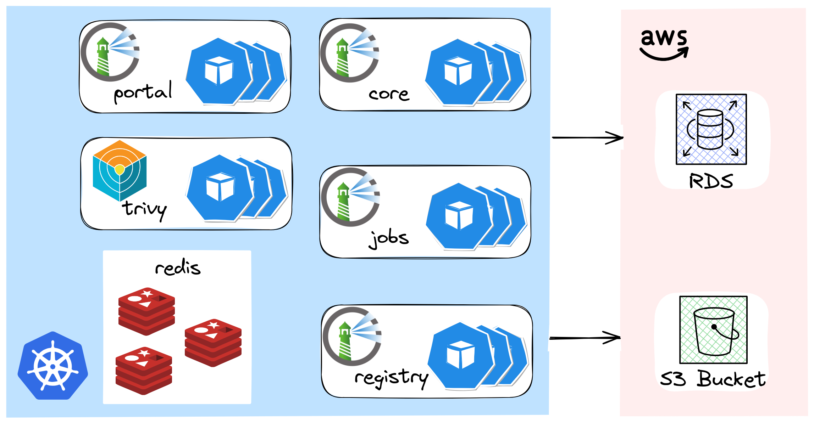
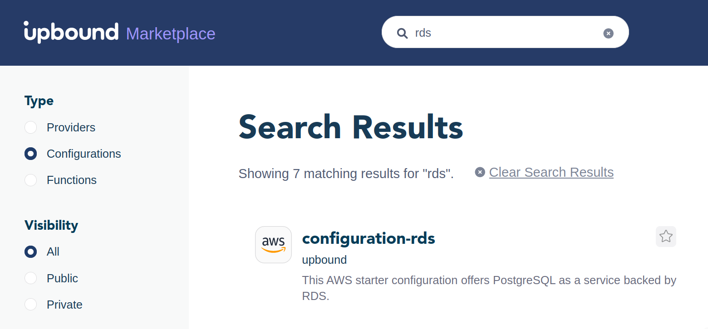
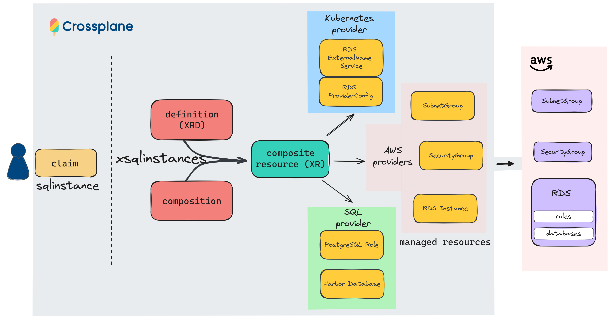
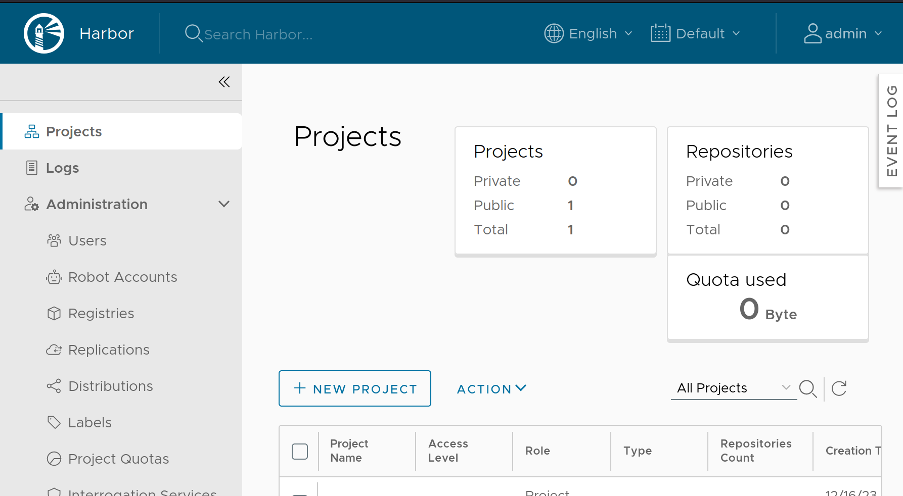

+++
author = "Smaine Kahlouch"
title = "Aller plus loin avec `Crossplane`: Compositions et fonctions"
date = "2023-12-23"
summary = "Découvrez comment l'emploi de concepts avancés de Crossplane dans un exemple concret pourrait signaler une étape clé pour le projet. Est-ce le changement que nous attendions ?"
codeMaxLines = 21
usePageBundles = true
toc = true
tags = [
    "infrastructure",
    "devxp",
    "gitops"
]
thumbnail= "thumbnail.png"
+++

{}
J'utilise désormais [KCL (Kusion Configuration Language)](https://www.kcl-lang.io/) pour les compositions Crossplane.
{}

Avec l'émergence du _[Platform engineering](https://thenewstack.io/how-is-platform-engineering-different-from-devops-and-sre/)_, on assiste à une évolution vers la création de solutions dites "**self-service**" à destination des développeurs. Cette approche permet une standardisation des pratiques DevOps, une meilleure expérience pour les développeurs, et une réduction de la charge cognitive liée à la gestion des outils.

`Crossplane`, un projet [sous l'égide de la Cloud Native Computing Foundation (CNCF)](https://www.cncf.io/projects/crossplane/) vise à devenir le framework incontournable pour créer des plateformes Cloud Natives. Dans mon [premier article sur Crossplane](https://blog.ogenki.io/fr/post/crossplane_k3d/), j'ai présenté cet outil et expliqué comment il utilise les principes **GitOPs** pour l'infrastructure, permettant ainsi de créer un cluster `GKE`.

Le projet, qui fête maintenant ses 5 ans 🎂🎉, a gagné en maturité et s'est enrichi de nouvelles fonctionnalités au fil du temps.

Dans cet article, nous explorerons certaines fonctionnalités clés de Crossplane, avec un intérêt particulier pour les **compositions functions** qui génèrent un vif intérêt au sein de la communauté. Allons-nous assister à un tournant décisif pour le projet ?

## 🎯 Notre objectif

La [documentation](https://docs.crossplane.io/) de Crossplane est très bien fournie, nous allons donc passer rapidement sur les concepts de base pour se concentrer sur un cas d'usage concret: Déployer [**Harbor**](https://goharbor.io/) sur un cluster EKS en suivant les recommandations en terme de **haute disponibilité**.

{}
**Harbor**, issue aussi de la CNCF, est une solution de gestion d'artefacts de conteneurs centrée sur la sécurité. Son rôle principal est de stocker, signer et analyser les vulnérabilités des **images de conteneurs**. Harbor dispose d'un contrôle d'accès fin, d'une API ainsi que d'une interface web afin de permettre aux équipes de dev d'y accéder et gérer leurs images simplement.
{}

La disponibilité d'Harbor dépend principalement de ses composants avec des **données persistantes** (stateful). L'utilisateur est responsable de leur mise en œuvre, qui doit être adaptée à l'infrastructure cible. L'article présente les options choisies pour un niveau de disponibilité optimal.

<center></center>

* **Redis** déployé avec le [chart Helm de Bitnami](https://github.com/bitnami/charts/tree/main/bitnami/redis) en mode "master/slave"
* Les artefacts sont stockés dans un bucket AWS **S3**
* Une instance [**RDS**](https://aws.amazon.com/rds/) pour la base de données PostgreSQL

Nous allons maintenant explorer comment Crossplane facilite le provisionnement d'une base de données (RDS), en offrant un niveau d'**abstraction** simple, exposant uniquement les options nécessaires. 🚀

## 🏗️ Prérequis

Avant de pouvoir construire nos compositions, nous devons préparer le terrain car certaines opérations préalables sont nécessaires.
Ces étapes sont réalisées dans un ordre bien précis:

<center></center>

1. Déploiement du contrôlleur Crossplane en utilisant le [chart Helm](https://docs.crossplane.io/latest/software/install/).
2. Installation des providers et de leur configuration.
3. Déploiement de diverses configurations faisant usage des providers installés préalablement. Notamment les **`Compositions`** et les **`Composition Functions`**.
4. Déclarations de _Claims_ pour consommer les Compositions.

Ces étapes sont traduites en dépendances [Flux](https://fluxcd.io/), et peuvent être consultées [ici](https://github.com/Smana/cloud-native-ref/tree/3d095dfb726b941d15d8ef6768211a6880170cee/infrastructure/base/crossplane).

{}
Toutes les actions réalisées dans cet article proviennent de ce [**dépôt git**](https://github.com/Smana/cloud-native-ref)

On peut y trouver de nombreuses sources qui me permettent de construire mes articles de blog. N'hésitez pas à me faire des retours, ouvrir des issues si nécessaire ... 🙏

Les liens vers les fichiers ci-dessous pointent vers le commit de l'époque, afin de montrer exactement le code cité ici. Les compositions ont depuis été réécrites en KCL et déplacées dans le dépôt [crossplane-configuration](https://github.com/Smana/crossplane-configuration).
{}

## 📦 Les compositions

Pour le dire simplement, une `Composition` dans Crossplane est un moyen d'agrèger et de gérer automatiquement plusieurs ressources dont la configuration peut s'avérer parfois **complexe**.

Elle utilise l'API de Kubernetes pour définir et orchestrer non seulement des éléments d'infrastructure tels que le stockage et le réseau, mais aussi de nombreux  autres composants (se référer à la liste des [providers](https://marketplace.upbound.io/providers)). Cette méthode offre aux développeurs une **interface simplifiée**, représentant une couche d'abstraction qui masque les détails techniques plus complexes de l'infrastructure sous-jacente.

Pour atteindre mon objectif, qui est de créer une base de données RDS lors du déploiement de l'application Harbor, j'ai d'abord recherché s'il existait un exemple pertinent. Pour ce faire, j'ai utilisé le [marketplace d'Upbound](https://marketplace.upbound.io/), où l'on peut trouver de nombreuses _Compositions_ pouvant servir de point de départ.

<center></center>

En me basant sur la composition [configuration-rds](https://github.com/upbound/configuration-rds), j'ai souhaité y ajouter les éléments suivants:

* 🔑 Permettre aux pods d'accéder à l'instance.
* ▶️ Création d'un service de type [**ExternalName**](https://kubernetes.io/docs/concepts/services-networking/service/#externalname) avec un nom prédictible qui peut être utilisé dans la configuration de Harbor
* 💾 Création de bases de données et des rôles qui en seront propriétaires.

❓ Comment cette _Composition_ serait-elle alors utilisée si, par exemple, un développeur souhaite disposer d'une base de données?
Il suffit de déclarer une _**Claim**_ qui représente le niveau d'abstraction exposé aux utilisateurs.

[tooling/base/harbor/sqlinstance.yaml](https://github.com/Smana/cloud-native-ref/blob/3d095dfb726b941d15d8ef6768211a6880170cee/tooling/base/harbor/sqlinstance.yaml)

```yaml
apiVersion: cloud.ogenki.io/v1alpha1
kind: SQLInstance
metadata:
  name: xplane-harbor
  namespace: tooling
spec:
  parameters:
    engine: postgres
    engineVersion: "15"
    size: small
    storageGB: 20
    databases:
      - owner: harbor
        name: registry
    passwordSecretRef:
      namespace: tooling
      name: harbor-pg-masterpassword
      key: password
  compositionRef:
    name: xsqlinstances.cloud.ogenki.io
  writeConnectionSecretToRef:
    name: xplane-harbor-rds
```

ici nous constatons que cela se limite à une **simple** ressource avec peu de paramètres pour exprimer nos souhaits:

* Une instance **PostgreSQL** en version 15 sera créée
* La **type d'instance** de celle-ci est laissé à l'appréciation de l'équipe plateforme (les mainteneurs de la composition). Dans la `Claim` ci-dessus nous souhaitons une "petite" instance, qui est traduit par la composition en `db.t3.small`.

[infrastructure/base/crossplane/configuration/sql-instance-composition.yaml](https://github.com/Smana/cloud-native-ref/blob/3d095dfb726b941d15d8ef6768211a6880170cee/infrastructure/base/crossplane/configuration/sql-instance-composition.yaml#L150C18-L150C18)

```yaml
transforms:
  - type: map
    map:
      large: db.t3.large
      medium: db.t3.medium
      small: db.t3.small
```

* Le mot de passe de l'utilisateur `master` est extrait d'un secret `harbor-pg-masterpassword`, généré via un [External Secret](https://github.com/Smana/cloud-native-ref/blob/3d095dfb726b941d15d8ef6768211a6880170cee/tooling/base/harbor/externalsecret-sqlinstance-password.yaml).
* Une fois l'instance créée, les détails pour la connexion sont stockés dans un  **secret** `xplane-harbor-rds`

C'est là que nous pouvons pleinement apprécier la **puissance des Compositions** Crossplane! En effet, de **nombreuses ressources** sont générées de manière transparente, comme illustré par le schéma suivant :

<center></center>

Au bout de quelques minutes, toutes les ressources sont créées. (ℹ️ La [CLI Crossplane](https://docs.crossplane.io/latest/cli/) permet désormais de nombreuses opérations, notamment visualiser les ressources d'une Composition. Elle est dénommée `crank` pour la différencier du binaire `crossplane` qui est le binaire qui tourne sur Kubernetes.
)

```console
kubectl get xsqlinstances
NAME                  SYNCED   READY   COMPOSITION                     AGE
xplane-harbor-jmdhp   True     True    xsqlinstances.cloud.ogenki.io   8m32s

crank beta trace xsqlinstances.cloud.ogenki.io xplane-harbor-jmdhp
NAME                                                    SYNCED   READY   STATUS
XSQLInstance/xplane-harbor-jmdhp                        True     True    Available
├─ SecurityGroupIngressRule/xplane-harbor-jmdhp-n785k   True     True    Available
├─ SecurityGroup/xplane-harbor-jmdhp-8jnhc              True     True    Available
├─ Object/external-service-xplane-harbor                True     True    Available
├─ Object/providersql-xplane-harbor                     True     True    Available
├─ Database/registry                                    True     True    Available
├─ Role/harbor                                          True     True    Available
├─ Instance/xplane-harbor-jmdhp-whv4g                   True     True    Available
└─ SubnetGroup/xplane-harbor-jmdhp-fjfth                True     True    Available
```

Et Harbor devient accessible grâce à Cilium et Gateway API (Vous pouvez jeter un oeil à un [précédent post](https://blog.ogenki.io/fr/post/cilium-gateway-api/) sur le sujet 😉)

<center></center>

{}
Les [**EnvironmentConfigs**](https://docs.crossplane.io/latest/concepts/environment-configs/) permettent d'utiliser des variables **spécifiques au cluster local**. Ces éléments de configuration sont chargés en mémoire et peuvent ensuite être utilisés dans la composition.

Étant donné que le cluster EKS est créé avec [Opentofu](https://opentofu.org/), nous stockons ses propriétés par le biais de variables Flux. (plus d'infos sur les variables de substitution [ici](https://blog.ogenki.io/fr/post/terraform-controller/#substition-de-variables))

[infrastructure/base/crossplane/configuration/environmentconfig.yaml](https://github.com/Smana/cloud-native-ref/blob/3d095dfb726b941d15d8ef6768211a6880170cee/infrastructure/base/crossplane/configuration/environmentconfig.yaml)

```yaml
apiVersion: apiextensions.crossplane.io/v1alpha1
kind: EnvironmentConfig
metadata:
  name: eks-environment
data:
  clusterName: ${cluster_name}
  oidcUrl: ${oidc_issuer_url}
  oidcHost: ${oidc_issuer_host}
  oidcArn: ${oidc_provider_arn}
  accountId: ${aws_account_id}
  region: ${region}
  vpcId: ${vpc_id}
  CIDRBlock: ${vpc_cidr_block}
  privateSubnetIds: ${private_subnet_ids}
```

Ces variables peuvent ensuite être utilisées dans les _Compositions_ via la directive **`FromEnvironmentFieldPath`**. Par exemple pour permettre aux pods d'accéder à notre instance RDS, nous autorisons le CIDR du VPC:

[infrastructure/base/crossplane/configuration/sql-instance-composition.yaml](https://github.com/Smana/cloud-native-ref/blob/3d095dfb726b941d15d8ef6768211a6880170cee/infrastructure/base/crossplane/configuration/sql-instance-composition.yaml#L85-L105)

```yaml
- name: SecurityGroupIngressRule
  base:
    apiVersion: ec2.aws.upbound.io/v1beta1
    kind: SecurityGroupIngressRule
    spec:
      forProvider:
        cidrIpv4: ""
  patches:
...
    - fromFieldPath: CIDRBlock
      toFieldPath: spec.forProvider.cidrIpv4
      type: FromEnvironmentFieldPath
```

⚠️ A l'heure où j'écris cet article, la fonctionnalité est toujours en alpha.
{}

## 🛠️ Les fonctions de compositions

Les fonctions de compositions (**`Composition Functions`**) représentent une évolution significative pour le développement de Compositions. En effet, la méthode traditionnelle de _patching_ dans une composition présentait certaines **limitations**, telles que l'incapacité à utiliser des conditions, des boucles dans le code, ou à exécuter des fonctions avancées (ex: calcul de sous-réseaux, vérification de l'état des ressources externes...).

Les _Composition Functions_  permettent de lever ces limites et sont en réalité des programmes qui étendent les capacités de templating des ressources au sein de Crossplane. Elles sont rédigées dans **n'importe quel langage** de programmation, offrant ainsi une souplesse et une puissance presque infinies lors de la définition des compositions. Cela permet désormais des tâches complexes telles que les transformations conditionnelles, les itérations, et les opérations dynamiques.

Ces fonctions sont exécutées de manière **séquentielle** (mode `Pipeline`), chaque fonction manipulant et transformant les ressources, puis transmettant le résultat à la fonction suivante, ouvrant ainsi la porte à des combinaisons puissantes.

Mais **revenons à notre composition RDS 🔍 !** Celle-ci utilise, en effet, cette nouvelle façon de définir des `Compositions` et est composée de 3 étapes:

[infrastructure/base/crossplane/configuration/sql-instance-composition.yaml](https://github.com/Smana/cloud-native-ref/blob/3d095dfb726b941d15d8ef6768211a6880170cee/infrastructure/base/crossplane/configuration/sql-instance-composition.yaml)

```yaml
apiVersion: apiextensions.crossplane.io/v1
kind: Composition
metadata:
  name: xsqlinstances.cloud.ogenki.io
...
spec:
  mode: Pipeline
...
  pipeline:
    - step: patch-and-transform
      functionRef:
        name: function-patch-and-transform
...
    - step: sql-go-templating
      functionRef:
        name: function-go-templating
...
    - step: ready
      functionRef:
        name: function-auto-ready
```

1. La syntaxe de la première étape `patch-and-transform` vous parait probablement familière 😉. Il s'agit en effet de la méthode de **patching** traditionnelle de Crossplane mais cette fois ci, elle est exécutée en tant que fonction dans le Pipeline.
2. La seconde étape consiste à faire appel à la fonction [**function-go-templating**](https://github.com/crossplane-contrib/function-go-templating) dont nous allons parler un peu plus loin.
3. Enfin la dernière étape utilise la fonction [function-auto-ready](https://github.com/crossplane-contrib/function-auto-ready) qui permet de vérifier que la ressource composite (`XR`) est prête. C'est à dire que l'ensemble des ressources qui la compose ont atteint l'état `Ready`

{}

Si vous avez déjà des Compositions dans le format précédent ([Patch & Transforms](https://docs.crossplane.io/latest/concepts/patch-and-transform/)), il existe un super outil qui permet de **migrer** vers le mode `Pipeline`: [crossplane-migrator](https://github.com/crossplane-contrib/crossplane-migrator)

* Installer crossplane-migrator

```console
go install github.com/crossplane-contrib/crossplane-migrator@latest
```

* Puis lancer la commande suivante qui permettra d'obtenir le bon format dans `compostion-pipeline.yaml`

```console
crossplane-migrator new-pipeline-composition --function-name crossplane-contrib-function-patch-and-transform -i composition.yaml -o composition-pipeline.yaml
```

ℹ️ Cet outil devrait être ajouté à la CLI Crossplane en version 1.15

{}

## 🐹 Du Go Template dans Crossplane

Comme évoqué précédemment, la puissance des _Composition functions_ réside principalement dans le fait que n'importe quel langage peut être utilisé. Il est notamment possible de générer des ressources à partir de templates Go. **Cela n'est pas si différent de l'écriture de Charts [Helm](https://helm.sh/)**.

Il suffit de faire appel à la fonction et lui fournir en entrée le template permettant de générer des ressources Kubernetes. Dans la composition SQLInstance, les YAMLs sont générés directement en ligne mais il est aussi possible de charger des fichiers locaux (`source: Filesystem`)

```yaml
    - step: sql-go-templating
      functionRef:
        name: function-go-templating
      input:
        apiVersion: gotemplating.fn.crossplane.io/v1beta1
        kind: GoTemplate
        source: Inline
        inline:
          template: |
          ...
```

Ensuite c'est à vous de jouer! Par exemple il y a peu de différence pour générer une base de données MariaDB ou PostgreSQL et nous pouvons donc formuler des conditions comme la suivante:

```go
{{- $apiVersion := "" }}
{{- if eq $parameters.engine "postgres" }}
  {{- $apiVersion = "postgresql.sql.crossplane.io/v1alpha1" }}
{{- else }}
  {{- $apiVersion = "mysql.sql.crossplane.io/v1alpha1" }}
{{- end -}}
```

Cela m'a aussi permit de définir une liste de bases de données ainsi que le propriétaire associé

```yaml
apiVersion: cloud.ogenki.io/v1alpha1
kind: SQLInstance
metadata:
...
spec:
  parameters:
...
    databases:
      - owner: owner1
        name: db1
      - owner: owner2
        name: db2
```

Puis d'utiliser des boucles Golang pour les créer en utilisant le [provider SQL](https://github.com/crossplane-contrib/provider-sql).

```go
{{- range $parameters.databases }}
---
apiVersion: {{ $apiVersion }}
kind: Database
metadata:
  name: {{ .name | replace "_" "-" }}
  annotations:
    {{ setResourceNameAnnotation (print "db-" (replace "_" "-" .name)) }}
spec:
...
{{- end }}
```

Il est même possible de développer une logique plus complexe dans des fonctions go template avec les directives habituelles `define` et `include`. Voici un extrait des exemples disponibles dans le [repo de la fonction](https://github.com/crossplane-contrib/function-go-templating/tree/main/example)

```go
{{- define "labels" -}}
some-text: {{.val1}}
other-text: {{.val2}}
{{- end }}
...
labels:
  {{- include "labels" $vals | nindent 4}}
...
```

Enfin nous pouvons tester la Composition et afficher le **rendu du template** avec la commande suivante:

```console
crank beta render tooling/base/harbor/sqlinstance.yaml infrastructure/base/crossplane/configuration/sql-instance-composition.yaml infrastructure/base/crossplane/configuration/function-go-templating.yaml
```

Comme on peut le voir, les possibilités sont décuplées grâce à la capacité de construire des ressources en utilisant un langage de programmation. Cependant, il est également nécessaire de veiller à ce que la composition reste **lisible** et maintenable sur le long terme. Nous assisterons probablement à l'émergence de bonnes pratiques à mesure que nous gagnons en expérience sur l'utilisation de ces fonctions.

## 💭 Dernières remarques

Lorsqu'on parle d'Infrastructure As Code, Terraform est souvent le premier nom qui nous vient à l'esprit. Cet outil, soutenu par une vaste communauté et qui dispose d'un écosystème bien établi, reste un choix de premier ordre. Mais il est intéressant de se demander comment Terraform a évolué face aux nouveaux paradigmes apportés par Kubernetes. Nous avons abordé cette question dans notre article sur [terraform controller](https://blog.ogenki.io/fr/post/terraform-controller/). Depuis, vous avez sûrement remarqué le petit séisme causé par la décision de [Hashicorp de passer sous licence BSL](https://www.hashicorp.com/blog/hashicorp-adopts-business-source-license). Cette évolution a suscité de nombreuses réactions et a peut-être influencé la stratégie et la roadmap d'autres solutions...

Il est difficile de dire si c'est une réaction directe, mais récemment, `Crossplane` a mis à jour sa [charte](https://blog.crossplane.io/charter-expansion-upjet-donation/) pour élargir son champ d'action à l'ensemble de l'écosystème (providers, functions), notamment en intégrant le projet [**Upjet**](https://github.com/crossplane/upjet) sous l'égide de la CNCF. L'objectif de cette démarche est de renforcer la gouvernance des projets associés et d'améliorer, en fin de compte, l'**expérience des développeurs**.

Personnellement, j'utilise `Crossplane` depuis un moment pour des cas d'usage spécifiques. Je l'ai même mis en **production** dans une entreprise, utilisant une composition pour définir des permissions spécifiques pour les pods sur EKS (IRSA). Nous avions également restreint les types de ressources qu'un développeur pouvait déclarer.

❓ Alors, que penser de cette nouvelle expérience avec Crossplane?

Il faut le dire, les _**Composition Functions**_ offrent de larges perspectives et on peut s'attendre à voir de nombreuses fonctions apparaître en 2024 🚀

Toutefois, à mon avis, il est crucial que les **outils de développement et d'exploitation** se perfectionnent pour favoriser l'adoption du projet. Par exemple, une interface web ou un plugin k9s seraient utiles.

Pour un débutant souhaitant développer une composition ou une fonction, le **premier pas peut sembler difficile**. La validation d'une composition n'est pas simple, et les exemples à suivre ne sont pas très nombreux. On espère que le [marketplace](https://marketplace.upbound.io/) s'enrichira avec le temps.

Cela dit, ces préoccupations ont été **prises en compte par la communauté de Crossplane**, notamment par le SIG Dev XP dont il faut féliciter l'effort et qui mène actuellement un travail important. 👏

Je vous encourage à suivre de près l'évolution du projet dans les prochains mois 👀, et à tenter l'expérience Crossplane pour vous faire votre propre idée. Pour ma part, je suis particulièrement intéressé par la fonction CUElang, un langage sur lequel je prévois de me pencher prochainement.

## 🔖 References

* Crossplane blog: [Improve Crossplane Compositions Authoring with go-templating-function](https://blog.upbound.io/go-templating-function)
* [Dev XP Roadmap](https://github.com/crossplane/crossplane/issues/4654)
* Vidéo (Kubecon NA 2023): [Crossplane Intro and Deep Dive - the Cloud Native Control Plane Framework](https://www.youtube.com/watch?v=I5Rd0X7AROw)
* Vidéo (DevOps Toolkit): [Crossplane Composition Functions: Unleashing the Full Potential](https://www.youtube.com/watch?v=jjtpEhvwgMw)
