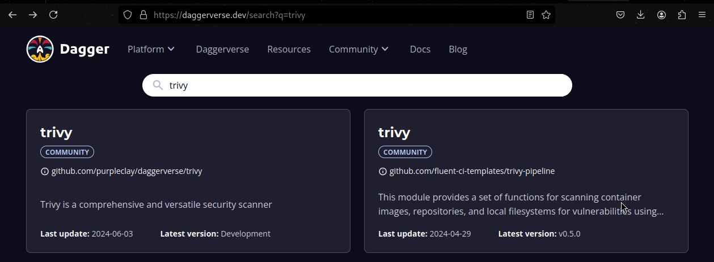
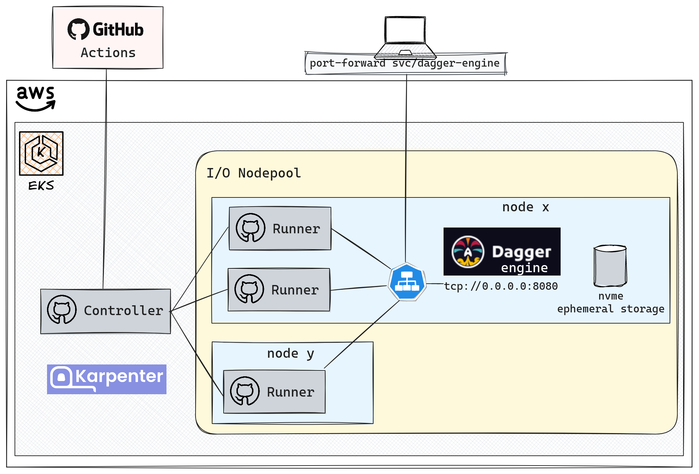

+++
author = "Smaine Kahlouch"
title = "`Dagger`: la pièce manquante de l'expérience développeur?"
date = "2024-07-08"
summary = "Découverte de `Dagger` pour améliorer l'automatisation et simplifier les pipelines de développement. Self-Hosted `Github Actions` et `EKS` pour un partage efficace du cache."
featured = true
codeMaxLines = 21
usePageBundles = true
toc = true
tags = [
    "devxp"
]
thumbnail= "thumbnail.png"
+++

[Dagger](https://dagger.io/) est un projet open source qui promet de révolutionner la façon de définir les pipelines d'**intégration continue (CI)**. Il a été créé par les fondateurs de Docker qui se sont basés sur une étude des difficultés courantes dans les entreprises. Il ont alors identifié un manque d'outillage efficaces le long du cycle de développement jusqu'au passage en production.

Il y a notamment un manque d'**homogénéité entre les environnements d'exécution**, vous avez probablement déjà entendu votre voisin(e) se plaindre avec un truc du genre: "Erf, ça marchait bien sur ma machine! C'est quoi cette erreur sur la CI?" 😆

Offrant une méthode commune et centralisée, Dagger serait LA réponse à cette problématique et permettrait, par ailleurs, d'améliorer l'expérience développeur locale, la collaboration et ainsi d'accélerer le cycle de développement.

<center></center>

Beaucoup d'entre nous ont déjà utilisé des scripts bash, des Makefiles et d'autres méthodes traditionnelles pour automatiser certaines actions. Cependant, ces solutions peuvent vite devenir **complexes et difficiles à maintenir**. Dagger propose une alternative moderne et simplifiée, permettant de standardiser et d'uniformiser nos pipelines, peu importe l'environnement.

Mais alors, quelles sont les principales fonctionnalités de Dagger, et comment l'utiliser efficacement?


## 🎯 Notre objectif

Voici les points que nous allons aborder dans cet article :

1. Tout d'abord, nous allons comprendre le fonctionnement de `Dagger` et faire nos premiers pas.

2. Ensuite, nous prendrons des cas concrets pour sa mise en œuvre. Nous verrons comment transformer un projet existant, et je vous présenterai également un module que j'utilise désormais quotidiennement.

3. Enfin, nous décrirons une solution de mise en cache efficace, qui nous permettra de nous projeter dans la mise à l'échelle avec Dagger.


## 🔎 La découverte

En gros, `Dagger` est un outil qui nous permet de définir des tâches dans notre **langage préféré** et de rendre ce code **portable**. Autrement dit, ce que j'exécute sur ma machine sera exécuté de la même manière sur la CI ou sur l'ordinateur de mon/ma collègue.

Il y a 2 composants principaux qui entrent en jeu

* La **CLI Dagger**: Notre point d'accès principal pour interagir avec les différentes fonctions et modules, les télécharger et afficher le résultat de leur exécution.
* Le **moteur Dagger**: Toutes les opérations effectuées avec la CLI passent par une API `GraphQL` exposée par un moteur Dagger. Chaque client initie sa propre session avec l'API Core qui dispose des fonctionnalités de base. Elles peuvent ensuite être étendues grâce à des modules.

<center></center>

Commençons par installer la CLI. Si vous avez parcouru mes précédents articles, vous savez que j'affectionne particulièrement [**asdf**](https://blog.ogenki.io/fr/post/asdf/asdf/)

```console
asdf plugin-add dagger

asdf install dagger 0.11.9
Downloading dagger from https://github.com/dagger/dagger/releases/download/v0.11.9/dagger_v0.11.9_linux_amd64.tar.gz

asdf global dagger 0.11.9
dagger version
dagger v0.11.9 (registry.dagger.io/engine) linux/amd64
```

Entrons dans le vif du sujet, nous pouvons tout de suite exécuter un module fournie par la communauté. Supposons que l'on veuille scanner un repo git et une image Docker avec [trivy](https://aquasecurity.github.io/trivy/v0.53/).

{}
Le [**Daggerverse**](https://daggerverse.dev/) est une plateforme permettant a quiconque de **partager** des modules. Lorsque vous avez un besoin, il est conseillé de regarder ce qui est déjà proposé par d'autres. </br>
Faites le test en recherchant par example `golangci`, `black`, `gptscript`, `wolfi`...
<center></center>
{}


Nous pouvons consulter les **fonctions disponibles** dans le module en utilisant l'argument `functions`
```console
TRIVY_MODULE="github.com/purpleclay/daggerverse/trivy@c3f44e0c8a396b2adf024bb862714037ae4cc8e7"

dagger functions -m ${TRIVY_MODULE}
Name          Description
filesystem    Scan a filesystem for any vulnerabilities
image         Scan a published (or remote) image for any vulnerabilities
image-local   Scan a locally exported image for any vulnerabilities
```

Les functions peuvent aussi prendre divers paramètres

```console
dagger call -m ${TRIVY_MODULE} filesystem --help
...
ARGUMENTS
      --dir Directory      the path to directory to scan [required]
      --exit-code int      the returned exit code when vulnerabilities are detected (0)
      --format string      the type of format to use when generating the compliance report (table)
      --ignore-unfixed     filter out any vulnerabilities without a known fix
      --scanners string    the types of scanner to execute (vuln,secret)
      --severity string    the severity of security issues to detect (UNKNOWN,LOW,MEDIUM,HIGH,CRITICAL)
      --template string    a custom go template to use when generating the compliance report
      --vuln-type string   the types of vulnerabilities to scan for (os,library)
```

Analysons donc le niveau de sécurité de mon repository local 🕵️

```console
dagger call -m ${TRIVY_MODULE} filesystem --dir "."

scan/go.mod (gomod)
===================
Total: 1 (UNKNOWN: 0, LOW: 0, MEDIUM: 1, HIGH: 0, CRITICAL: 0)

┌────────────────────────────────┬────────────────┬──────────┬────────┬───────────────────┬───────────────┬───────────────────────────────────────────────────┐
│            Library             │ Vulnerability  │ Severity │ Status │ Installed Version │ Fixed Version │                       Title                       │
├────────────────────────────────┼────────────────┼──────────┼────────┼───────────────────┼───────────────┼───────────────────────────────────────────────────┤
│ github.com/vektah/gqlparser/v2 │ CVE-2023-49559 │ MEDIUM   │ fixed  │ 2.5.11            │ 2.5.14        │ gqlparser denial of service vulnerability via the │
│                                │                │          │        │                   │               │ parserDirectives function                         │
│                                │                │          │        │                   │               │ https://avd.aquasec.com/nvd/cve-2023-49559        │
└────────────────────────────────┴────────────────┴──────────┴────────┴───────────────────┴───────────────┴───────────────────────────────────────────────────┘
```

Oups! il semble qu'il y ait une vulnérabilité critique dans mon image 😨.

```console
dagger call -m ${TRIVY_MODULE} image --ref smana/dagger-cli:v0.11.9 --severity CRITICAL

smana/dagger-cli:v0.11.9 (ubuntu 23.04)
=======================================
Total: 0 (CRITICAL: 0)


usr/local/bin/dagger (gobinary)
===============================
Total: 1 (CRITICAL: 1)

┌─────────┬────────────────┬──────────┬────────┬───────────────────┬─────────────────┬────────────────────────────────────────────────────────────┐
│ Library │ Vulnerability  │ Severity │ Status │ Installed Version │  Fixed Version  │                           Title                            │
├─────────┼────────────────┼──────────┼────────┼───────────────────┼─────────────────┼────────────────────────────────────────────────────────────┤
│ stdlib  │ CVE-2024-24790 │ CRITICAL │ fixed  │ 1.22.3            │ 1.21.11, 1.22.4 │ golang: net/netip: Unexpected behavior from Is methods for │
│         │                │          │        │                   │                 │ IPv4-mapped IPv6 addresses                                 │
│         │                │          │        │                   │                 │ https://avd.aquasec.com/nvd/cve-2024-24790                 │
└─────────┴────────────────┴──────────┴────────┴───────────────────┴─────────────────┴────────────────────────────────────────────────────────────┘
```

  C'est déjà super cool de pouvoir bénéficier de nombreuses sources 🤩 ! Ces modules peuvent donc être utilisés directement ou devenir une source d'inspiration précieuse pour nos futurs pipelines.

  Un `module` est une **collection de fonctions** qui prend des paramètres en entrée et nous renvoie une réponse sous différentes formes : du texte en sortie, l'exécution d'un terminal, le lancement d'un service, etc. Notons aussi que toutes les fonctions sont **exécutées dans des conteneurs**.

  Après cette courte intro, passons à des cas d'usage réels en commençant par ajouter des tâches/fonctions à un projet existant.

## 🦋 Daggeriser une application existante

<table>
  <tr>
    <td>
      
    </td>
    <td style="vertical-align:middle; padding-left:20px;" width="60%">
      Prenons un <strong><a href="https://github.com/Smana/golang-helloworld">projet de démonstration</a></strong> existant, un simple serveur web avec une fonction de stockage de mots dans une base de données. Nous allons progressivement transformer ce projet en y <strong>injectant du Dagger</strong> 💉. </br>
      Cette approche itérative, étape par étape, peut également être appliquée à des projets plus importants pour les Daggeriser progressivement.
    </td>
  </tr>
</table>


### Première fonction 👶

Notre priorité va être de **tester** le code en utilisant la commande `go test`.

Commençons donc par initialiser le repo git afin de générer l'arborescence requise pour l'exécution des fonctions Dagger.
```console
git clone https://github.com/Smana/golang-helloworld.git
cd golang-helloworld
dagger init --sdk=go
```

```console
ls -l dagger*
.rw-r--r-- 101 smana 28 Jun 21:54 dagger.json

dagger:
.rw-------  25k smana 28 Jun 21:54 dagger.gen.go
drwxr-xr-x    - smana 28 Jun 21:54 internal
.rw------- 1.4k smana 28 Jun 21:54 main.go
```

La commande d'initialisation génère donc un fichier `main.go` qui contient des fonctions d'exemple que nous allons totalement **remplacer** par le code suivant:

```golang
package main

import (
	"context"n mont
)

type GolangHelloworld struct{}

// Test runs the tests for the GolangHelloworld project
func (m *GolangHelloworld) Test(ctx context.Context, source *Directory) (string, error) {
	ctr := dag.Container().From("golang:1.22")
	return ctr.
		WithWorkdir("/src").
		WithMountedDirectory("/src", source).
		WithExec([]string{"go", "test", "./..."}).
		Stdout(ctx)
}
```

Il s'agit là d'une fonction très simple:

* Cette fonction, appelée `Test`, prend en paramètre un répertoire `source`.
* Nous utilisons une image `golang:1.22`.
* Le code du répertoire donné en paramètre est monté dans le dossier `/src` du conteneur.
* Ensuite, nous exécutons la commande `go test ./...` sur le répertoire source.
* Enfin, nous récupérons le résultat des tests (stdout).

{}
Il est régulièrement nécessaire de lancer la commande suivante afin de mettre à jour les fichiers Dagger (dépendances etc...)
```console
dagger develop
```
{}

C'est parti, testons notre code!

```console
dagger call test --source "."
?       helloworld/cmd/helloworld       [no test files]
?       helloworld/dagger       [no test files]
?       helloworld/dagger/internal/dagger       [no test files]
?       helloworld/dagger/internal/querybuilder [no test files]
?       helloworld/dagger/internal/telemetry    [no test files]
ok      helloworld/internal/server      0.004s
```

:information_source: La première exécution prend du temps car elle construit télécharge l'image et installe les dépendances Go, mais les exécutions suivantes sont beaucoup plus rapides. Nous aborderons le sujet de la mise en cache plus tard dans cet article.

### Et mon docker-compose alors? 🐳

Le projet initial permet de lancer un environnement de **test local** en utilisant [Docker Compose](https://docs.docker.com/compose/)

La commande `docker-compose up --build` effectue plusieurs actions : </br>
elle construit l'image Docker de l'application en se basant sur le Dockerfile local, puis lance deux conteneurs : un pour l'application et un pour la base de données. Elle permet également la communication entre ces deux conteneurs.

```console
docker ps
CONTAINER ID   IMAGE                               COMMAND                  CREATED         STATUS         PORTS                                       NAMES
a1673d56f9c8   golang-helloworld-app               "/app/main"              3 seconds ago   Up 3 seconds   0.0.0.0:8080->8080/tcp, :::8080->8080/tcp   golang-helloworld-app-1
bb3dee1305dc   postgres:16                         "docker-entrypoint.s…"   3 seconds ago   Up 3 seconds   0.0.0.0:5432->5432/tcp, :::5432->5432/tcp   golang-helloworld-database-1
```

Il est ensuite possible d'accéder à l'application et de stocker des mots dans la base de données.

```console
curl -X POST -d '{"word":"foobar"}' -H "Content-Type: application/json" http://localhost:8080/store

curl http://localhost:8080/list
["foobar"]
```

**Comment réaliser la même chose avec Dagger?**

Tout d'abord nous allons construire l'image:

```golang
// Build the Docker container
func (m *GolangHelloworld) Build(ctx context.Context, source *Directory) *Container {
	// build the binary
	builder := dag.Container().
		From(golangImage).
		WithDirectory("/src", source).
		WithWorkdir("/src").
		WithEnvVariable("CGO_ENABLED", "0").
		WithExec([]string{"go", "build", "-o", "helloworld", "cmd/helloworld/main.go"})

	// Create the target image with the binary
	targetImage := dag.Container().
		From(alpineImage).
		WithFile("/bin/helloworld", builder.File("/src/helloworld"), ContainerWithFileOpts{Permissions: 0700, Owner: "nobody"}).
		WithUser("nobody:nobody").
		WithEntrypoint([]string{"/bin/helloworld"})

	return targetImage
}
```

Ce code démontre l'utilisation du **"multi-stage build"** pour optimiser la sécurité et la taille de l'image. Cette méthode permet de n'inclure que ce qui est nécessaire dans l'image finale, réduisant ainsi la surface d'attaque et la taille de l'image.

Ensuite nous avons besoin d'une instance `PostgreSQL`. Ça tombe bien il y a un [module](https://daggerverse.dev/mod/github.com/quartz-technology/daggerverse/postgres@627fc4df7de8ce3bd8710fa08ea2db6cf16712b3) pour ça ®!

Nous allons donc installer cette dépendance pour pouvoir utiliser ses fonctions directement dans notre code.

```console
dagger install github.com/quartz-technology/daggerverse/postgres@v0.0.3
```

La fonction `Database()` permet de lancer un conteneur Postgres.
```golang
...
	opts := PostgresOpts{
		DbName:     dbName,
		Cache:      cache,
		Version:    "13",
		ConfigFile: nil,
		InitScript: initScriptDir,
	}

...
	pgCtr := dag.Postgres(pgUser, pgPass, pgPortInt, opts).Database()
```

Ensuite, nous devons créer un lien entre les deux conteneurs. Ci-dessous, nous récupérons les informations du service exposé par le conteneur Postgres pour les utiliser dans notre application.

```golang
...
	pgSvc := pgCtr.AsService()

	pgHostname, err := pgSvc.Hostname(ctx)
	if err != nil {
		return nil, fmt.Errorf("could not get postgres hostname: %w", err)
	}

	return ctr.
		WithSecretVariable("PGPASSWORD", pgPass).
		WithSecretVariable("PGUSER", pgUser).
		WithEnvVariable("PGHOST", pgHostname).
		WithEnvVariable("PGDATABASE", opts.DbName).
		WithEnvVariable("PGPORT", pgPort).
		WithServiceBinding("database", pgSvc).
		WithExposedPort(8080), nil
...
```

{}
Les informations sensibles peuvent être passées lors de l'appel aux fonctions Dagger de plusieurs façon: Des **variables d'environnement**, lecture du contenu de **fichiers** ou la sortie d'une **ligne de commande**.
Dans cet article nous avons privilégié les variables d'environnement mais nous aurions très bien pu utiliser une commande `vault`. ([Article précédent sur Vault](https://blog.ogenki.io/fr/post/pki-gapi/))
{}

`up` permet de transférer les appels locaux aux services exposés par le conteneur.

```console
export PGUSER="user"
export PGPASS="password"
dagger call serve --pg-user=env:PGUSER --pg-pass=env:PGPASS --source "."  as-service up

...
  ● start /bin/helloworld 30.7s
  ┃ 2024/06/30 08:27:50 Starting server on :8080
  ┃ 2024/06/30 08:27:50 Starting server on :8080
```

Et voilà! nous pouvons désormais tester notre application en local.</br>


{}
J'ai volontairement tronqué ces derniers extraits, mais je vous invite à consulter la configuration complète [**ici**](https://github.com/Smana/golang-helloworld/blob/daggerize/dagger/main.go). Vous y trouverez notamment la possibilité de publier l'image dans un registry.

De plus, je vous conseille de parcourir le [**Cookbook**](https://docs.dagger.io/cookbook) dans la documentation Dagger, où vous trouverez de nombreux exemples.
{}

## 🧩 Le module Kubeconform

Je suis parti d'un **réel cas d'usage**: J'utilise depuis quelques années un [script bash](https://github.com/fluxcd/flux2-kustomize-helm-example/blob/main/scripts/validate.sh) pour valider les manifests Kubernetes/Kustomize ainsi que la configuration [Flux](https://fluxcd.io/).
L'idée est donc de répondre à ce même besoin mais aussi d'aller un peu plus loin...

L'initialisation d'un module se fait de la façon suivante:
```console
dagger init --name=kubeconform --sdk=go kubeconform
```

Il faut ensuite décider des paramètres d'entrée. Par exemple je souhaite pouvoir choisir la version du binaire [Kubeconform](https://github.com/yannh/kubeconform).
```golang
...
	// Kubeconform version to use for validation.
	// +optional
	// +default="v0.6.6"
	version string,
...
```

Les commentaires ci-dessus sont importants: La description sera affichée à l'utilisateur et nous pouvons faire en sorte que ce paramètre ne soit pas requis avec une version par défault.
```console
dagger call -m github.com/Smana/daggerverse/kubeconform@v0.0.4 validate --help
Validate the Kubernetes manifests in the provided directory and optional source CRDs directories
...
      --version string        Kubeconform version to use for validation. (default "v0.6.6")
```

L'objectif est de pouvoir partager ce module, donc tous les éléments de contexte doivent être clairs et compréhensibles.

En développant ce module, j'ai suis passé par plusieurs itérations et j'ai obtenu des infos très utiles sur le [Discord](https://discord.com/invite/ufnyBtc8uY) de Dagger. C'est un super moyen d'échanger avec la communauté.

Analysons par exemple ceci:
```go
kubeconformBin := dag.Arc().
    Unarchive(dag.HTTP(fmt.Sprintf("https://github.com/yannh/kubeconform/releases/download/%s/kubeconform-linux-amd64.tar.gz", kubeconform_version)).
        WithName("kubeconform-linux-amd64.tar.gz")).File("kubeconform-linux-amd64/kubeconform")
```

J'utilise le module [Arc](https://daggerverse.dev/mod/github.com/sagikazarmark/daggerverse/arc@b45dbd7448bb967aca4a538af9ce7f042abf0316) pour décompresser un fichier récupéré avec la fonction `HTTP` et je ne prends que le binaire inclus dans cette archive. Plutôt efficace !

Dans cet autre exemple j'utilise le module [Apko](https://daggerverse.dev/mod/github.com/vito/daggerverse/apko@09c1b5b172e58a8fd58ee790d81018cd478590fc) pour construire l'image initial, y installer des packages...
```go
ctr := dag.Apko().Wolfi([]string{"bash", "curl", "kustomize", "git", "python3", "py3-pip", "yq"}).
    WithExec([]string{"pip", "install", "pyyaml"})
```

Au moment où j'écris cet article, le module Kubeconform inclut aussi un bout de script bash, essentiellement pour parcourir l'arborescence efficacement et exécuter `kubeconform`
```golang
	scriptContent := `#!/bin/bash
...
`

	// Add the manifests and the script to the container
	ctr = ctr.
		WithMountedDirectory("/work", manifests).
		WithNewFile("/work/run_kubeconform.sh", ContainerWithNewFileOpts{
			Permissions: 0750,
			Contents:    scriptContent,
		})

	// Execute the script
	kubeconform_command := []string{"bash", "/work/run_kubeconform.sh"}
...
```

Pour tester et corriger le module nous pouvons l'exécuter localement sur un repo qui contient des manifests Kubernetes.
```console
dagger call validate --manifests ~/Sources/demo-cloud-native-ref/clusters --catalog
...
Summary: 1 resource found in 1 file - Valid: 1, Invalid: 0, Errors: 0, Skipped: 0
Validation successful for ./mycluster-0/crds.yaml
Processing file: ./mycluster-0/flux-config.yaml
Summary: 1 resource found in 1 file - Valid: 1, Invalid: 0, Errors: 0, Skipped: 0
Validation successful for ./mycluster-0/flux-config.yaml
```

Nous pouvons aussi augmenter le niveau de verbosité. Le niveau le plus élevé étant `-vvv --debug`
```console
dagger call validate --manifests ~/Sources/demo-cloud-native-ref/clusters --catalog -vvv --debug
...
09:32:07 DBG new end old="2024-07-06 09:32:07.436103097 +0200 CEST" new="2024-07-06 09:32:07.436103273 +0200 CEST"
09:32:07 DBG recording span span=telemetry.LogsSource/Subscribe id=b3fc48ec7900f581
09:32:07 DBG recording span child span=telemetry.LogsSource/Subscribe parent=ae535768bb2be9d7 child=b3fc48ec7900f581
09:32:07 DBG new end old="2024-07-06 09:32:07.436103273 +0200 CEST" new="2024-07-06 09:32:07.438699251 +0200 CEST"
09:32:07 DBG recording span span="/home/smana/.asdf/installs/dagger/0.11.9/bin/dagger call -m github.com/Smana/daggerverse/kubeconform@v0.0.4 validate --manifests /home/smana/Sources/demo-cloud-native-ref/clusters --catalog -vvv --debug" id=ae535768bb2be9d7
09:32:07 DBG frontend exporting logs logs=4
09:32:07 DBG exporting log span=0xf62760 body=""
09:32:07 DBG got EOF
09:32:07 DBG run finished err=<nil>

✔ 609fcdee60c94c07 connect 0.6s
  ✔ c873c2d69d2b7ce7 starting engine 0.5s
    ✔ 5f48c41bd0a948ca create 0.5s
      ✔ dbd62c92c3db105f exec docker start dagger-engine-ceb38152f96f1298 0.0s
      ┃ dagger-engine-ceb38152f96f1298
  ✔ 4db8303f1d7ec940 connecting to engine 0.1s
  ┃ 09:32:03 DBG connecting runner=docker-image://registry.dagger.io/engine:v0.11.9 client=5fa0kn1nc4qlku1erer3868nj
  ┃ 09:32:03 DBG subscribing to telemetry remote=docker-image://registry.dagger.io/engine:v0.11.9
  ┃ 09:32:03 DBG subscribed to telemetry elapsed=19.095µs
```

Il m'est aussi arrivé régulièrement d'ajouter des commandes dans le conteneur, par exemple pour vérifier le contenu d'un répertoire
```golang
	stdout, err := ctr.
		WithExec([]string{"ls", "-l", "/work"}).
		Stdout(ctx)
```

Avec ce module j'ai pu ajouter aussi des fonctionnalités manquantes qui sont fort utiles:

* Convertir toutes les CRDs en JSONSchemas afin de valider 100% des manifests Kubernetes
* Le rendre compatible avec les substitutions de variables de Flux.

Enfin, j'ai pu le partager dans le [Daggerverse](https://daggerverse.dev/mod/github.com/Smana/daggerverse/kubeconform@3291d9cd86b8421fdff3bc7fafd9ca73be4c6060) et mettre à jour mes workflows de CI sur Github Actions.

<center></center>


## 🚀 Itération rapide et collaboration grâce à un cache partagé

Utiliser un cache permet de ne pas réexécuter les étapes dont le code n'a pas changé. Lors de la première exécution, toutes les étapes seront exécutées, mais les suivantes ne reprendront que les étapes modifiées, ce qui permet de **gagner un temps considérable**.

Dagger permet de mettre en cache, à **chaque exécution**, les opérations de manipulation des fichiers, la construction des conteneurs, l'exécution des tests, la compilation du code, ainsi que les volumes qui doivent être explicitement définis dans le code.

Par défaut, le moteur Dagger est disponible en local, et utilise du cache local.

```console
docker ps
CONTAINER ID   IMAGE                               COMMAND                  CREATED      STATUS       PORTS     NAMES
3cec5bf51843   registry.dagger.io/engine:v0.11.9   "dagger-entrypoint.s…"   8 days ago   Up 2 hours             dagger-engine-ceb38152f96f1298
```

La proposition suivante vise à définir un **cache partagé et distant**, accessible à tous les collaborateurs ainsi que depuis la CI. L'objectif est d'**accélérer** les exécutions ultérieures, peu importe où Dagger est exécuté.

Nous allons voir comment mettre cela en pratique avec:

* Des Github Runners exécutés en privé, sur notre plateforme (Self-Hosted)
* Un moteur Dagger centralisé

{}
<table>
  <tr>
	<td>
	  
	</td>
	<td style="vertical-align:middle; padding-left:80px;" width="70%">
Cette solution de <strong>CI sur EKS</strong> est déployée en utilisant le repository <strong><a href="https://github.com/Smana/demo-cloud-native-ref">Cloud Native Ref</a></strong>.</br>
Je vous encourage vivement à le consulter, car j'y aborde de nombreux sujets relatifs aux technlogies Cloud Native. L'idée initial de ce projet est de pouvoir <strong>démarrer rapidement une plateforme</strong> qui applique les bonnes pratiques en terme d'automatisation, de supervision, de sécurité etc.
Les commentaires et contributions sont les bienvenues 🙏
	</td>
  </tr>
</table>
{}

Voici comment les composants de CI interagissent, avec Dagger jouant un **rôle central** grâce au cache partagé.

<center></center>

Maintenant que nous avons une vue d'ensemble de Dagger et de son utilisation, nous allons explorer comment optimiser son utilisation en entreprise en utilisant un cache partagé.

### 🤖 Github Self Hosted Runners: Accès au cache

Dagger s'intègre bien avec la plupart des solutions de CI. Il suffit en effet de lancer une commande `dagger`. Dans cet article nous faisons usage de l'[Action](https://github.com/dagger/dagger-for-github) pour Github Actions.

```yaml
  kubernetes-validation:
    name: Kubernetes validation ☸
    runs-on: ubuntu-latest
    steps:
      - name: Checkout
        uses: actions/checkout@v4

      - name: Validate Flux clusters manifests
        uses: dagger/dagger-for-github@v5
        with:
          version: "latest"
          verb: call
          module: github.com/Smana/daggerverse/kubeconform@kubeconform/v0.0.4
          args: validate --manifests "./clusters" --catalog
```

Ce job télécharge le code source du repo git et exécute le module `kubeconform`. Bien que cela fonctionne très bien, il faut noter que ce job est exécuté sur les runners fournis par Github sur leur infrastructure.

Les [GitHub self-hosted runners](https://docs.github.com/en/actions/hosting-your-own-runners/managing-self-hosted-runners/about-self-hosted-runners) sont des machines que vous configurez pour exécuter des workflows GitHub Actions sur **votre propre infrastructure**, plutôt que d'utiliser les runners hébergés par GitHub. Ils offrent plus de contrôle et de flexibilité, permettant de **personnaliser l'environnement d'exécution** selon vos besoins spécifiques. Cela peut conduire à des **performances** améliorées et permet un accès sécurisé à des **ressources privées**.

Un `Scale set` est un group de runners Github qui partage une configuration commune:
[.github/workflows/ci.yaml](https://github.com/Smana/demo-cloud-native-ref/blob/main/.github/workflows/ci.yaml)

```yaml {hl_lines=[10,11,15]}
apiVersion: helm.toolkit.fluxcd.io/v2
kind: HelmRelease
metadata:
  name: dagger-gha-runner-scale-set
spec:
  releaseName: dagger-gha-runner-scale-set
...
  values:
    runnerGroup: "default"
    githubConfigUrl: "https://github.com/Smana/demo-cloud-native-ref"
    githubConfigSecret: gha-runner-scale-set
    maxRunners: 5

    containerMode:
      type: "dind"
```

* Ce `scale set` est configuré pour le repo [Cloud Native Ref](https://github.com/Smana/demo-cloud-native-ref)
* Il faut lui indiquer un secret dans lequel est configuré les paramètres de la `Github App`
* `dind` indique le mode utilisé pour lancer les conteneurs. ⚠️ Attention cependant en termes de sécurité : Dagger doit s'exécuter en tant qu'**utilisateur root** et avoir des permissions élevées pour contrôler les conteneurs, volumes, réseaux, etc. (Plus d'informations [ici](https://github.com/dagger/dagger/blob/main/core/docs/d7yxc-operator_manual.md#can-i-run-the-dagger-engine-as-a-rootless-container)).


### ☸️ Considération spécifiques à EKS

Il existe plusieurs approches lorsqu'il s'agit de l'optimisation du cache, chacune présentant des avantages et inconvénients. Cela fait d'ailleurs l'objet de discussions très intéressantes [ici](ttps://github.com/dagger/dagger/issues/6486).
J'ai fait quelques choix qui, selon moi, sont un bon compromis entre disponibilité et performances dont voici les principales lignes:

* **Le moteur Dagger**: Un unique pod expose un service HTTP.

* **NodePool spécifique** : Un node pool avec des contraintes permettant d'obtenir des disques NVME locaux.
  ```yaml
        - key: karpenter.k8s.aws/instance-local-nvme
          operator: Gt
          values: ["100"]
        - key: karpenter.k8s.aws/instance-category
          operator: In
          values: ["c", "i", "m", "r"]
      taints:
        - key: ogenki/io
          value: "true"
          effect: NoSchedule
  ```

* **Les points de montages des conteneurs**: Lorsqu'un nœud du nodepool io démarre, il exécute la commande `/usr/bin/setup-local-disks raid0`. Cette commande prépare les disques en créant un array en **raid0** et monte les systèmes de fichiers des conteneurs dessus. Ainsi, tout cet espace est directement accessible depuis le pod !

⚠️ Notez que c'est un **volume éphémère** : les données sont perdues lorsque le pod est arrêté. C'est cet espace que nous utilisons pour le **cache** Dagger.

```yaml
...
        - name: varlibdagger
          ephemeral:
            volumeClaimTemplate:
              spec:
                accessModes: ["ReadWriteOnce"]
                resources:
                  requests:
                    storage: 10Gi
        - name: varrundagger
          ephemeral:
            volumeClaimTemplate:
              spec:
                accessModes: ["ReadWriteOnce"]
                resources:
                  requests:
                    storage: 90Gi
...
```

```console
kubectl exec -ti -n tooling dagger-engine-c746bd8b8-b2x6z -- /bin/sh
/ # df -h | grep nvme
/dev/nvme3n1              9.7G    128.0K      9.7G   0% /var/lib/dagger
/dev/nvme2n1             88.0G     24.0K     88.0G   0% /run/buildkit
```

* **Bonnes pratiques avec Karpenter**: Afin d'optimiser la disponibilité du moteur Dagger, nous l'avons configuré avec un [Pod Disruption Budget](https://kubernetes.io/docs/concepts/workloads/pods/disruptions/#pod-disruption-budgets) ainsi que l'annotation `karpenter.sh/do-not-disrupt: "true"`. Par ailleurs il est préférable d'utiliser des instances `On-demand`, que nous pourrions envisager de réserver auprès de AWS afin d'obtenir un discount.

* **Network policies**: Étant donné que les runners peuvent exécuter n'importe quel code, il est fortement recommandé de limiter les flux réseaux au strict nécessaire, que ce soit pour les self-hosted runners ou le moteur dagger.

Afin de tester cela, nous allons lancer un job qui crée un conteneur en installer de nombreux paquets relativement lourds. L'idée etant que cela prenne en peu de temps.

[.github/workflows/ci.yaml](https://github.com/Smana/demo-cloud-native-ref/blob/main/.github/workflows/ci.yaml)

```yaml
  test-cache:
    name: Testing in-cluster cache
    runs-on: dagger-gha-runner-scale-set
    container:
      image: smana/dagger-cli:v0.11.9
    env:
      _EXPERIMENTAL_DAGGER_RUNNER_HOST: "tcp://dagger-engine:8080"
      cloud-token: ${{ secrets.DAGGER_CLOUD_TOKEN }}

    steps:
      - name: Simulate a build with heavy packages
        uses: dagger/dagger-for-github@v5
        with:
          version: "latest"
          verb: call
          module: github.com/shykes/daggerverse.git/wolfi@dfb1f91fa463b779021d65011f0060f7decda0ba
          args: container --packages "python3,py3-pip,go,rust,clang"
```

ℹ️  Accéder au moteur Dagger distant se fait en utilisant la variable d'environnement `_EXPERIMENTAL_DAGGER_RUNNER_HOST`

Lors de la première exécution, le job met **3min et 37secs**
<center></center>

En revanche tout autre exécution ultérieure sera **beaucoup plus rapide** (10secs)! 🎉 🚀 🥳
<center></center>


En local 💻 , je peux aussi bénéficier de ce cache en configurant mon environnement comme cela:

```console
kubectl port-forward -n tooling svc/dagger-engine 8080
_EXPERIMENTAL_DAGGER_RUNNER_HOST="tcp://127.0.0.1:8080"
```

Mes tests locaux seront aussi accessible par la CI et un autre développeur reprenant mon travail n'aura pas à tout reconstruire de zéro.

{}
➕ Cette solution a l'avantage non négigeable de disposer d'un stockage ulta **rapide**! De plus l'architecture est on ne peut plus simple: un seul moteur Dagger avec un stockage local qui expose un service.

➖ ⚠️ C'est pourtant loin d'être parfait: il faut, en effet accépter que ce cache soit **éphémère** malgré les précautions prises pour garantir un niveau de disponibilité élevé. Par ailleurs il faut aussi prendre en compte le **coût** d'une instance qui tourne tout le temps, le scaling ne peut se faire qu'en prenant une machine plus grosse.
{}


{}
<table>
  <tr>
	<td style="vertical-align:middle; padding-left:80px;" width="60%">
    <strong>Dagger Cloud</strong> est une solution pour les entreprises permettant une visualisation très claire de l'exécution des pipelines, avec la possibilité de parcourir toutes les étapes et d'identifier rapidement les éventuelles problèmes. C'est gratuit pour un usage individuel et je vous encourage à tester. </br>
    Cette offre fourni également une alternative à la solution proposée ci-dessus: un cache distribué, géré par Dagger. (Plus d'informations <a href="https://dagger.io/cloud">ici</a>)
	</td>
	<td>
	  
	</td>
  </tr>
  <tr>
	<td colspan="2">
  <video controls style="width:100%;">
    <source src="dagger-cloud.webm" type="video/webm">
    Your browser does not support the video tag.
  </video>
	</td>
  </tr>
</table>
{}

## 💭 Dernières remarques

Dagger est un projet assez récent qui **évolue vite**, soutenu par une communauté toujours plus grande et active. Les questions de scaling abordées dans cet article seront probablement améliorées dans le futur.

Pour les modules disponibles dans le Daggerverse, il est parfois difficile de juger leur **qualité**. Il n'y a pas de modules "validés" ou "officiels", il faut donc souvent en tester plusieurs, analyser le code et parfois en créer un soi-même.

Cet article vous a permis de découvrir Dagger et ses principales fonctions que j'ai utilisées. Mon expérience s'est limitée au SDK Golang, mais l'expérience devrait être similaire avec d'autres langages. Je découvre des choses nouvelles chaque jour. La prise en main initiale n'est pas évidente pour ceux qui, comme moi, ne développent pas quotidiennement, mais plus je l'utilise sur des cas concrets, plus je me sens à l'aise. J'ai même migré les quelques [jobs de mon repo](https://github.com/Smana/demo-cloud-native-ref/blob/main/.github/workflows/ci.yaml) à 100% sur Dagger.

Je suis passé de Makefile à [Task](https://taskfile.dev/) et j'espère maintenant aller plus loin avec Dagger. J'ai l'ambition de construire des pipelines plus complexes, comme la restauration et la [vérification d'un backup Vault](https://github.com/Smana/demo-cloud-native-ref/issues/217) ou encore la [création et les tests d'un cluster EKS avant de le détruire](https://github.com/Smana/demo-cloud-native-ref/issues/216). Quoi qu'il en soit, Dagger fait maintenant partie de ma boîte à outils ! :white_check_mark:

## 🔖 References

* [Doc](https://docs.dagger.io)
* [Discord](https://discord.com/invite/ufnyBtc8uY)
* [Youtube](https://www.youtube.com/@dagger-io)
