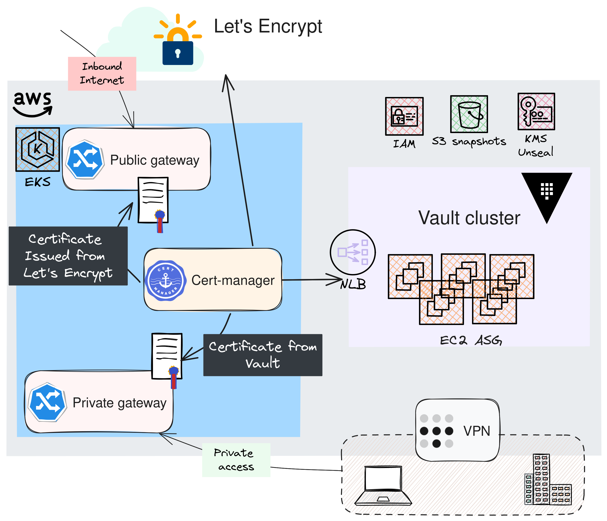
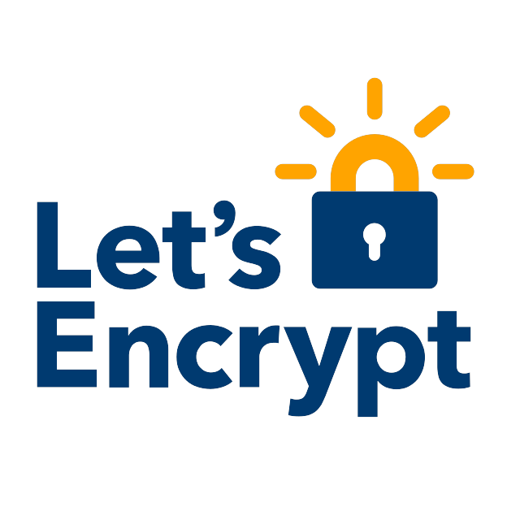
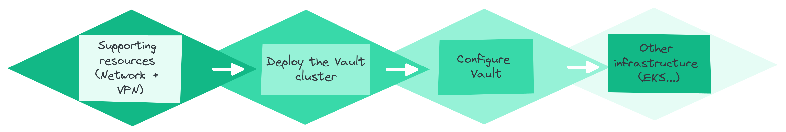
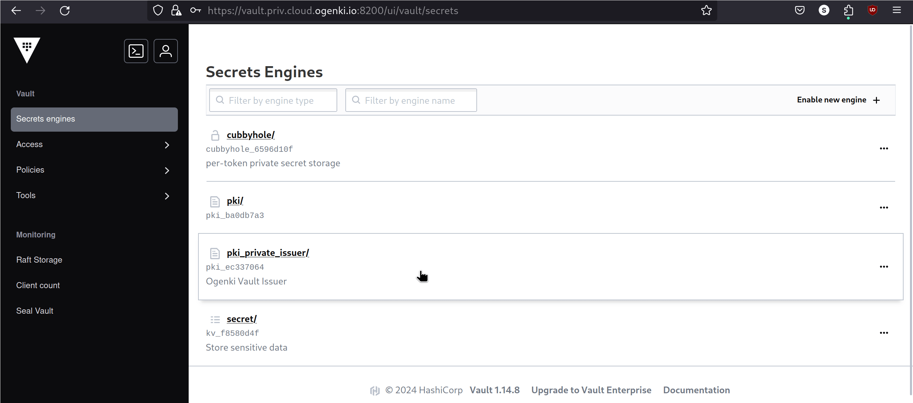

+++
author = "Smaine Kahlouch"
title = "`TLS` avec Gateway API: Une gestion efficace et sécurisée des certificats publiques et privés"
date = "2024-01-20"
summary = "Dans cet article nous allons construire une stratégie de PKI solide permettant de gérer des certificats TLS publiques et privés en utilisant `Vault` et `cert-manager`"
featured = true
codeMaxLines = 21
usePageBundles = true
toc = true
tags = [
    "security"
]
thumbnail= "thumbnail.png"
+++

Le **chiffrement TLS** est un standard incontournable dans la sécurisation des services et applications, que ce soit sur Internet ou au sein même de l'entreprise. Sur Internet, le recours à un certificat TLS, validé par une autorité de certification reconnue, est essentiel pour garantir la confidentialité et l'intégrité des échanges de données.

En ce qui concerne les communications internes, la PKI privée (**Private Public Key Infrastructure**) joue un rôle crucial dans la distribution et la validation des certificats nécessaires au chiffrement des communications au sein de l'entreprise, assurant ainsi une sécurité renforcée.

Dans cet article, nous allons plonger dans le vif du sujet : la mise en place d'une gestion efficace et robuste des certificats TLS au sein d'une entreprise. Nous explorerons les meilleures pratiques, les outils et les stratégies pour une infrastructure de certificats fiable.


## 🎯 Notre objectif

<center></center>

* Afin que les utilisateurs puissent accéder aux applications, nous utiliserons le standard [**Gateway API**](https://gateway-api.sigs.k8s.io/). (Je vous invite à lire mon [précédent article](https://blog.ogenki.io/post/cilium-gateway-api/) sur le sujet.)
* Dans l'implémentation présentée ci-dessus, un composant joue un rôle majeur: [**Cert-manager**](https://cert-manager.io/). Il s'agit en effet du moteur central qui se chargera de générer et de renouveler les certificats.
* Pour les applications destinées à rester internes et non exposées sur Internet, nous opterons pour la génération de certificats via une **PKI privée** avec [**Vault d'Hashicorp**](https://www.vaultproject.io/).
* Quant aux applications publiques, elles utiliseront des certificats délivrés par [**Let's Encrypt**](https://letsencrypt.org/).


## 🛂 A propos de Let's Encrypt

<table>
  <tr>
    <td style="vertical-align:middle; padding-left:20px;">
      Basé sur le protocole ACME (Automatic Certificate Management Environment), cette solution permet une <strong>installation et un renouvellement automatiques des certificats</strong>.<br>
      <a href="https://letsencrypt.org/"> <strong>Let's Encrypt</strong></a> est simple à mettre en oeuvre, gratuit et améliore la sécurité. Cependant, il est important de noter que la durée des certificats est courte, et nécessite donc des renouvellements fréquents.<br>
      Pour en savoir plus sur son fonctionnement, vous pouvez vous référer à cette <a href="https://letsencrypt.org/how-it-works/">documentation</a>.
    </td>
    <td>
      
    </td>
  </tr>
</table>


## 🔐 Une PKI privée avec Vault

Une PKI privée, ou **Infrastructure à Clé Publique privée**, est un système cryptographique utilisé au sein d'une organisation pour sécuriser les données et les communications. Elle repose sur une **Autorité de Certification** (CA) interne qui émet des **certificats TLS** spécifiques à l'organisation.

Ce système permet à une organisation de :

* Contrôler entièrement les procédures de vérification de l'identité et de l'authentification, et d'**émettre des certificats** pour des domaines internes, ce qui n'est pas possible avec Let's Encrypt.
* **Sécuriser les communications** et les données internes avec une authentification et un chiffrement forts au sein de l'organisation.

Cependant, la mise en œuvre de ce type d'infrastructure requiert une **attention particulière** et une gestion de plusieurs composants. Ici, nous allons explorer une des fonctionnalités principales de **Vault**, qui est initialement un outil de gestion de secrets mais qui peut aussi faire office de PKI interne.

{}
Toutes les actions réalisées dans cet article proviennent de ce [**dépôt git**](https://github.com/Smana/demo-cloud-native-ref)

On y trouve le code `Opentofu` permettant de déployer et configurer Vault mais aussi de **nombreuses sources** qui me permettent de construire mes articles de blog. N'hésitez pas à me faire des retours, ouvrir des issues si nécessaire ... 🙏
{}

### ✅ Prérequis

{}
<table>
  <tr>
    <td>
      
    </td>
    <td style="vertical-align:middle; padding-left:20px;">
      Une <strong>infrastructure à trois niveaux de PKI</strong> (Three-tier PKI) comprend une Autorité de Certification Racine (CA) au sommet, des Autorités de Certification Intermédiaires au milieu, et des Entités Finales à la base. L'Autorité de Certification Racine délivre des certificats aux Autorités de Certification Intermédiaires, qui à leur tour émettent des certificats aux utilisateurs finaux ou aux dispositifs.</br>
      Cette structure <strong>renforce la sécurité</strong> en réduisant l'exposition de l'Autorité de Certification Racine et simplifie la gestion et la révocation des certificats, offrant une solution évolutive et flexible pour la sécurité numérique.
    </td>
  </tr>
</table>
{}

Pour renforcer la sécurité le système de gestion de certificats, il est recommandé de créer une Autorité de Certification Racine (AC Racine) hors ligne. Nous devons donc réaliser, au préalable, les étapes suivantes :

* Générer l'**Autorité de Certification Racine hors ligne** : Cette approche minimise les risques de sécurité en isolant l'AC Racine du réseau.

* Créer une **Autorité de Certification Intermédiaire** : Elle agit sous l'autorité de l'AC Racine et est utilisée pour émettre des certificats, permettant une gestion plus flexible et sécurisée.

* Générer le **certificat pour le serveur Vault depuis l'AC Intermédiaire** : Cela assure une chaîne de confiance depuis l'AC Racine jusqu'aux certificats utilisateurs finaux, en passant par l'AC Intermédiaire.

En suivant la procédure décrite [**ici**](https://github.com/Smana/demo-cloud-native-ref/blob/main/terraform/vault/cluster/docs/pki_requirements.md) vous devriez obtenir les fichiers suivants qui seront utilisés dans le reste de cet article. Il s'agit là d'une proposition basé sur `openssl`, et vous pouvez utiliser la méthode qui vous convient pour parvenir au même résultat

```console
cd terraform/vault/cluster

ls .tls/*.pem
.tls/bundle.pem  .tls/ca-chain.pem  .tls/intermediate-ca-key.pem  .tls/intermediate-ca.pem  .tls/root-ca-key.pem  .tls/root-ca.pem  .tls/vault-key.pem  .tls/vault.pem
```

### 🏗️ Construire le cluster

Il existe plusieurs méthodes pour déployer un cluster Vault mais je n'ai pas trouvé celle qui me convenait, je l'ai donc construite en prenant les décisions suivantes:

* **Stockage intégré** basé sur le protocole [Raft](https://raft.github.io/), qui est particulièrement adapté aux systèmes distribués et garantit une résilience élevée. Voici un tableau illustrant la tolérance aux pannes en fonction de la taille du cluster :
|   Cluster size     |  Failure tolerance  |
|--------------------|---------------|
|         1          |       0       |
|         3          |       1       |
|         5          |       2       |
|         7          |       3       |

  Par conséquent notre cluster Vault sera composé de **5 membres**, ce qui nous permettra de tolérer la défaillance de 2 nœuds.

* **Stratégie de nœuds éphémères avec instances SPOT** : L'architecture est constituée exclusivement d'instances SPOT pour une efficacité optimale en termes de coût. Ce groupe est  configuré avec trois _pools_ d'instances Spot distincts, chacun exploitant un type d'instance différent. Cette diversification stratégique vise à pallier toute défaillance potentielle liée à une pénurie spécifique de type d'instance SPOT, assurant ainsi une haute disponibilité et une continuité de service ininterrompue, tout en maximisant l'efficience des coûts.

* **Fonctionnalité de déverrouillage automatique de Vault** (Unseal) : Cette fonction est essentielle compte tenu de la nature éphémère de nos nœuds. Elle permet de minimiser les temps d'arrêt et d'éliminer le besoin d'interventions manuelles pour le déverrouillage de Vault.

Cet article n'a pas pour but de décrire toutes les étapes qui sont disponibles dans la [documentation du repo Github](https://github.com/Smana/demo-cloud-native-ref/blob/main/terraform/vault/cluster/docs/getting_started.md). Le fichier de variables `Opentofu` contient la configuration souhaitée.

```hcl
name                  = "ogenki-vault"
leader_tls_servername = "vault.priv.cloud.ogenki.io"
domain_name           = "priv.cloud.ogenki.io"
env                   = "dev"
mode                  = "ha"
region                = "eu-west-3"
enable_ssm            = true

# Use hardened AMI
ami_owner = "xxx" # Compte AWS où se trouve l'AMI
ami_filter = {
  "name" = ["*hardened-ubuntu-*"]
}
```

Après avoir exécuté l'ensemble des étapes, Vault peut être utilisé et nous obtenons un cluster constitué de 5 noeuds.


### 🛠️ Configuration

Le déploiement de toute une plateforme se fait par **étapes distinctes** car certaines opérations doivent être faites **manuellement** afin de garantir une sécurité optimale: La génération du certificat racine qui doit être conservé hors ligne et l'initialisation de Vault avec le token root initial.



Il faut bien entendu tous les composants réseaux afin d'y déployer des machines, puis le cluster Vault peut être installé et configuré avant de considérer l'ajout d'autres éléments d'infrastructure, qui dépendront probablement des informations sensibles stockées dans Vault.

La configuration de Vault se fait grâce au [provider Terraform](https://registry.terraform.io/providers/hashicorp/vault/latest/docs) dont l'authentification se fait via un token généré depuis l'instance Vault. La proposition [**ici**](https://github.com/Smana/demo-cloud-native-ref/tree/main/terraform/vault/management) démontre comment autoriser les applications internes à interagir avec l'API de Vault et, en particulier, comment configurer Cert-Manager.

Il suffit donc de déclarer les variables propre à votre organisation

```hcl
domain_name      = "priv.cloud.ogenki.io"
pki_common_name  = "Ogenki Vault Issuer"
pki_country      = "France"
pki_organization = "Ogenki"
pki_domains = [
  "cluster.local",
  "priv.cloud.ogenki.io"
]
```

Après avoir suivi la procédure, la PKI est configurée et il est alors possible de générer des certificats.




### 💾 Sauvegardes planifiées

Comme toute solution contenant des données, il est indispensable de les sauvegarder. Notons aussi la sensibilité de celles stockées dans Vault. Il nous faut donc une sauvegarde régulière dans lieu sécurisé.
La solution proposée ici est basée sur Crossplane pour construire les ressources AWS, ainsi qu'une Cronjob Kubernetes.


## 🚀 En pratique avec Gateway API!

{}
<table>
  <tr>
    <td>
      
    </td>
    <td style="vertical-align:middle; padding-left:20px;">
      Avec `cert-manager` il est très simple d'automatiser la création et la mise à jour des certificats exposés par la `Gateway`.
      Pour cela, il faut permettre au contrôlleur d'accéder à [route53](https://aws.amazon.com/route53/) afin de résoudre un challenge DNS01 (Mécanisme qui permet de s'assurer que les clients peuvent seulement demander des certificats pour des domaines qu'ils possèdent).
      Une ressource [ClusterIssuer](https://github.com/Smana/cilium-gateway-api/blob/main/security/base/cert-manager/cluster-issuer-staging.yaml) décrit la configuration nécessaire pour générer des certificats grâce à cert-manager.
      Ensuite il suffit d'ajouter une annotation `cert-manager.io/cluster-issuer` et indiquer le secret Kubernetes où sera stocké le certificat.
      ℹ️ Dans le repo de demo les permissions sont attribuées en utilisant `Crossplane` qui se charge de configurer cela au niveau du Cloud AWS.
    </td>
  </tr>
</table>
{}

```console
kubectl get clusterissuer
NAME                  READY   AGE
letsencrypt-prod      True    68m
letsencrypt-staging   True    68m
vault                 True    68m
```

### ☁️ Un certificate publique

```console
kubectl describe certificate -n infrastructure platform-public-tls
Name:         platform-public-tls
Namespace:    infrastructure
API Version:  cert-manager.io/v1
Kind:         Certificate
...
Spec:
  Dns Names:
    *.cloud.ogenki.io
  Issuer Ref:
    Group:      cert-manager.io
    Kind:       ClusterIssuer
    Name:       letsencrypt-prod
  Secret Name:  platform-public-tls
  Usages:
    digital signature
    key encipherment
Status:
  Conditions:
    Last Transition Time:  2024-01-24T20:43:26Z
    Message:               Certificate is up to date and has not expired
    Observed Generation:   1
    Reason:                Ready
    Status:                True
    Type:                  Ready
  Not After:               2024-04-23T19:43:24Z
  Not Before:              2024-01-24T19:43:25Z
  Renewal Time:            2024-03-24T19:43:24Z
  Revision:                1
```

{}

Les certificats générés par cert-manager sont stockés dans des secrets Kubernetes. Bien qu'il soit possible de les extraire à coup de commandes `base64` et `openssl`. Pourquoi ne pas se simplifier la vie?
Je suis un adepte de la ligne de commande et j'utilise pour ma part régulièrement le plugin [view-cert](https://github.com/lmolas/kubectl-view-cert) qui permet d'afficher une synthèse des secrets de type `tls`.

```console
kubectl view-cert -n infrastructure platform-public-tls
[
    {
        "SecretName": "platform-public-tls",
        "Namespace": "infrastructure",
        "Version": 3,
        "SerialNumber": "35f659ad03e437805fbf48111b74738efe3",
        "Issuer": "CN=R3,O=Let's Encrypt,C=US",
        "Validity": {
            "NotBefore": "2024-01-28T09:41:35Z",
            "NotAfter": "2024-04-27T09:41:34Z"
        },
        "Subject": "CN=*.cloud.ogenki.io",
        "IsCA": false
    }
]
```

Il peut être installé en utilisant [krew](https://krew.sigs.k8s.io/)

```console
kubectl krew install view-cert
```

{}

### 🏠 Un certificat privée


```console
kubectl get certificates -n infrastructure private-gateway-certificate
NAME                          READY   SECRET                AGE
private-gateway-certificate   True    private-gateway-tls   3m16s
```

```console
Name:         private-gateway-certificate
Namespace:    infrastructure
API Version:  cert-manager.io/v1
Kind:         Certificate
...
Spec:
  Common Name:  private-gateway.priv.cloud.ogenki.io
  Dns Names:
    gitops-mycluster-0.priv.cloud.ogenki.io
    grafana-mycluster-0.priv.cloud.ogenki.io
    harbor.priv.cloud.ogenki.io
  Duration:  2160h0m0s
  Issuer Ref:
    Group:       cert-manager.io
    Kind:        ClusterIssuer
    Name:        vault
  Renew Before:  360h0m0s
  Secret Name:   private-gateway-tls
Status:
  Conditions:
    Last Transition Time:  2024-01-27T19:54:57Z
    Message:               Certificate is up to date and has not expired
    Observed Generation:   1
    Reason:                Ready
    Status:                True
    Type:                  Ready
  Not After:               2024-04-26T19:54:57Z
  Not Before:              2024-01-27T19:54:27Z
  Renewal Time:            2024-04-11T19:54:57Z
  Revision:                1
Events:
  Type    Reason     Age   From                                       Message
  ----    ------     ----  ----                                       -------
  Normal  Issuing    41m   cert-manager-certificates-trigger          Issuing certificate as Secret does not exist
  Normal  Generated  41m   cert-manager-certificates-key-manager      Stored new private key in temporary Secret resource "private-gateway-certificate-jggkv"
  Normal  Requested  41m   cert-manager-certificates-request-manager  Created new CertificateRequest resource "private-gateway-certificate-1"
  Normal  Issuing    38m   cert-manager-certificates-issuing          The certificate has been successfully issued
```

```console
curl --verbose -k https://gitops-mycluster-0.priv.cloud.ogenki.io 2>&1 | grep 'issuer:'
*  issuer: O=Ogenki; CN=Ogenki Vault Issuer
```


{}
Contrairement aux PKI publiques, où les certificats sont automatiquement approuvés par les logiciels clients, dans une PKI privée, les certificats doivent être approuvés manuellement par les utilisateurs ou déployés sur tous les appareils par l'administrateur de domaine​

* [Ubuntu](https://ubuntu.com/server/docs/security-trust-store)
* [Archlinux](https://wiki.archlinux.org/title/Transport_Layer_Security#Add_a_certificate_to_a_trust_store)
* [Windows Server](https://learn.microsoft.com/fr-fr/windows-server/networking/core-network-guide/cncg/server-certs/install-the-certification-authority)
{}

## 💭 Dernières remarques

❓ Qui n'a pas subit un incident lié au renouvellement d'un certificat? </br>
❓ Comment obtenir un niveau de sécurité correspondant aux éxigences de l'entreprise? </br>
❓ Comment peut-on se simplifier les tâches opérationnelles liées à la maintenance des certificats TLS?


* Vault en premier lieu à part de Kube
* Stratégie de DRP (Backup/restore)
* Supervision de l'expiration des certificats
* License BSL

{}
Il est important de rappeler quelques recommandations et bonnes pratiques avant de considérer une mise en production. Afin que cet article reste lisible, certains points ne sont même pas été adressés mais il est **primordial** de les inclure dans votre stratégie:

* Conservez le **certificat racine hors ligne**. En d'autres termes, il est impératif de le stocker sur un support non connecté pour le protéger de toute menace potentielle.
* La **révocation** de la CA root ou intermédiaire n'a pas été évoqué. Ainsi que la mise à disposition d'une liste de révocation (Certificate Revocation List).
* L'accès à l'API Vault doit être rigoureusement **restreint à un réseau privé**. Vous devriez jeter un coup d'oeil à mon [article sur Tailscale](https://blog.ogenki.io/fr/post/tailscale/).
* Vous noterez aussi que je ne parle pas du tout d'authentification mais Il est essentiel de configurer un **fournisseur d'identité** dès le début et d'activer l'authentification multi-facteurs (**MFA**) pour renforcer la sécurité. Par ailleurs, il est conseillé de révoquer le **token racine** de Vault une fois l'authentification et les autorisations adéquates mises en place. Si nécessaire, le token peut être régénéré suivant la procédure disponible [ici](https://developer.hashicorp.com/vault/tutorials/operations/generate-root).
* Par défaut le code proposé déploie des AMI (Images d'instances AWS) Ubuntu de Canonical. Il est conseillé d'en utiliser une dont la sécurité a été renforcée (**Hardened AMI**). J'ai construit la mienne en utilisant ce [projet](https://github.com/konstruktoid/hardened-images).
* Afin de pouvoir initialiser Vault une commande doit être lancée sur l'instance ce qui justifie l'utilisation de [**SSM**](https://docs.aws.amazon.com/systems-manager/latest/userguide/session-manager-working-with-sessions-start.html). Cependant il est conseillé de le **désactiver** lorsque la phase d'initialisation est terminée (`enable_ssm: false` dans les variables Opentofu)
* Envoyez les **logs d'audit** vers un [SIEM](https://en.wikipedia.org/wiki/Security_information_and_event_management) afin de pouvoir détecter des comportements suspects.
* **Alerter** avant que les certificats n'arrivent à expiration. Vous pouvez, par exemple, utiliser [cet exporter](https://github.com/enix/x509-certificate-exporter) Prometheus opensourcé par mes potes d'Enix 😉. Il s'agit là d'une sécurité supplémentaire sachant que l'architecture proposée rend le tout automatisé.
* Accordez une **attention particulière aux clés KMS**: celle utilisé pour dévérouiller Vault, mais aussi celle qui permet de créer des snapshots. Elles sont vitalespour la restauration de vos sauvegardes.
* _"Une sauvegarde qui n'est pas vérifiée ne sert à rien"_: Il faut donc construire un workflow qui permettra de **vérifier la consistence des données** dans Vault. C'est peut être le sujet d'un autre article, stay tuned!
* Organisez périodiquement des exercices de reprise après sinistre (**PRA**) pour garantir votre capacité à reconstruire l'ensemble du système à partir de zéro, en vous assurant de disposer de toute la documentation et des outils nécessaires.
{}

Issue: https://github.com/cert-manager/cert-manager/issues/6632

## 🔖 References

Blog posts:
* [Privé vs Public PKI: Construire un plan efficace](https://www.ssl.com/fr/article/pki-priv%C3%A9-vs-public-construire-un-plan-efficace/) (Author: Nick Naziridis)
* [PKI Meilleures pratiques pour 2023](https://www.ssl.com/fr/article/pki-bonnes-pratiques-pour-2023)
* [Build an Internal PKI with Vault](https://sestegra.medium.com/build-an-internal-pki-with-vault-f7179306f18c) (Author: Stéphane Este-Gracias)

Documentation Hashicorp:
* A propos du stockage Raft:
  - [Reference Architecture](https://developer.hashicorp.com/vault/tutorials/day-one-raft/raft-reference-architecture)
  - [Deployment Guide](https://developer.hashicorp.com/vault/tutorials/day-one-raft/raft-deployment-guide)
  - [AWS](https://developer.hashicorp.com/vault/tutorials/raft/raft-storage-aws)
* [Production hardening](https://developer.hashicorp.com/vault/tutorials/day-one-raft/production-hardening)
* [PKI](https://developer.hashicorp.com/vault/tutorials/secrets-management/pki-engine-external-ca)