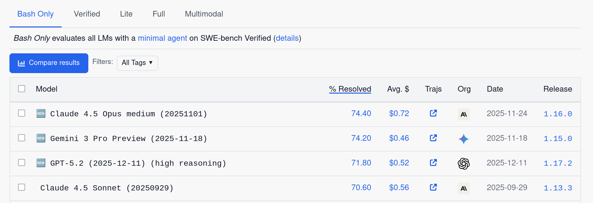
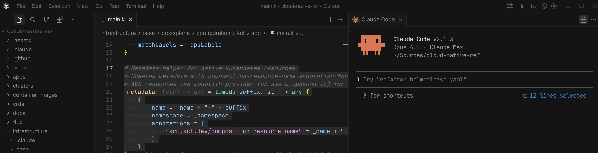

+++
author = "Smaine Kahlouch"
title = "Claude Code : Quand l'IA devient le copilote du Platform Engineer"
date = "2026-01-08"
summary = "Utilisation pratique d'un **coding agent** dans le quotidien du platform engineering. Au-delà du hype, des cas concrets qui démontrent comment cette nouvelle façon de travailler peut réellement **booster notre productivité**. Concepts, et retours d'expérience."
featured = true
codeMaxLines = 30
usePageBundles = true
toc = true
tags = [
    "ai",
    "devxp",
    "tooling"
]
thumbnail = "thumbnail.png"
+++

{}
Impossible d'y échapper : l'IA transforme nos métiers. Fin 2025, **65% des développeurs** utilisent des outils d'IA au moins une fois par semaine selon [Stack Overflow](https://stackoverflow.com/). Mais au-delà des annonces sensationnelles, qu'en est-il **concrètement** pour nous, platform engineers ?

Dans cet article, je partage mon expérience avec Claude Code et vous montre, par des exemples réels, comment cet outil est devenu un allié précieux dans mes tâches quotidiennes.
{}

Nous le voyons bien, nous assistons à un réel bouleversement provoqué par l'utilisation de l'IA. Ce domaine évolue à une vitesse vertigineuse et, honnêtement, il est difficile de mesurer aujourd'hui l'impact sur tous les aspects de notre métier. Une chose est sûre cependant : dans la tech, c'est une **révolution** !

Je ne vais pas vous faire un énième tutoriel ChatGPT. Ici, je vais vous présenter une utilisation **pratique** dans le métier du platform engineering avec une exploration de l'utilisation d'un **coding agent** — pas un simple chatbot — dans certaines tâches communes de notre quotidien.

Mais surtout, je vais tenter de vous démontrer par des cas concrets que cette nouvelle façon de travailler augmente **réellement** notre productivité. Si si !

## :dart: Objectifs de cet article

* Comprendre ce qu'est un **coding agent** et pourquoi c'est différent d'un simple chatbot
* Découvrir les concepts clés : MCPs, subagents, skills, commands, hooks
* **Cas concrets** d'utilisation dans le platform engineering
* Optimiser son utilisation et maîtriser ses coûts
* Réflexions sur les limites et les pièges à éviter

{}
<table>
  <tr>
    <td></td>
    <td style="vertical-align:middle; padding-left:10px;" width="70%">
Les exemples qui suivent sont issus de mon travail sur le repository <strong><a href="https://github.com/Smana/cloud-native-ref">Cloud Native Ref</a></strong>. Il s'agit d'une plateforme complète combinant EKS, Cilium, VictoriaMetrics, Crossplane, Flux et bien d'autres outils.
    </td>
  </tr>
</table>
{}

---

## :brain: Comprendre les coding agents

### Qu'est-ce qui différencie un agent d'un chatbot ?

Vous utilisez probablement déjà ChatGPT ou Gemini pour poser des questions. C'est pratique, mais ça reste du **one-shot** : vous posez une question, vous obtenez une réponse, point final.

Un **coding agent** fonctionne différemment. Il opère en boucle selon le pattern **ReAct** (Reasoning + Action) :

<center></center>

1. **Raisonnement** : L'agent analyse votre demande et planifie les étapes
2. **Action** : Il exécute une action (lire un fichier, exécuter une commande, chercher dans le code)
3. **Observation** : Il analyse le résultat de son action
4. **Itération** : Il décide si c'est suffisant ou s'il faut continuer

{}
[Simon Willison](https://simonwillison.net/2025/Sep/30/designing-agentic-loops/), expert reconnu du domaine, définit un agent LLM comme : *"quelque chose qui exécute des outils en boucle pour atteindre un objectif"*. C'est simple, mais ça capture l'essentiel.
{}

Concrètement, si vous demandez à un chatbot classique *"Corrige le bug dans mon auth"*, il vous donnera des suggestions génériques. Un agent, lui, va :

1. Chercher les fichiers liés à l'authentification
2. Lire le code concerné
3. Identifier le problème
4. Proposer une correction
5. L'appliquer si vous validez
6. Vérifier que ça compile/fonctionne

C'est cette capacité à **agir** sur votre environnement qui fait toute la différence.

### L'anatomie d'un agent

On peut résumer un agent avec cette formule :

```
Agent = LLM + Tools + Memory + Planning
```

| Composant | Rôle | Exemple dans Claude Code |
|-----------|------|--------------------------|
| **LLM** | Le "cerveau" qui raisonne | Claude Opus 4.5 / Sonnet 4 |
| **Tools** | Les actions possibles | Read, Write, Bash, Grep, WebFetch |
| **Memory** | Le contexte conservé | CLAUDE.md, conversation history |
| **Planning** | La stratégie d'exécution | Décomposition en sous-tâches |

### Le choix du modèle : une course effrénée

Les nouvelles versions de modèles apparaissent à une vitesse folle. Impossible de suivre ! L'efficacité (qualité de code, hallucinations, context mis à jour) peut radicalement différer selon les modèles.

Le benchmark [**SWE-bench Verified**](https://www.swebench.com/) est devenu la référence pour évaluer les capacités des modèles en développement logiciel. Il mesure la capacité à résoudre de vrais bugs issus de repositories GitHub.

<center></center>

{}
Consultez [swebench.com](https://www.swebench.com/) pour les derniers résultats. Au moment de la rédaction, les modèles frontier (Claude Opus 4.5, GPT-5.x, Gemini 3) se disputent la première place avec des scores autour de **75-80%**.
{}

La compétition est si féroce que la première place change régulièrement. En pratique, tous les modèles frontier sont suffisamment performants pour la plupart des tâches de platform engineering.

### Pourquoi Claude Code ?

Il existe de nombreuses options de coding agents : [Cursor](https://cursor.sh/), [Windsurf](https://codeium.com/windsurf), [GitHub Copilot](https://github.com/features/copilot), [Gemini CLI](https://github.com/google-gemini/gemini-cli)... Je ne suis clairement pas capable de toutes les évaluer en profondeur.

J'ai utilisé Cursor dans un premier temps, puis je suis passé à Claude Code. La raison ? Mon **background de sysadmin** plutôt porté sur le terminal. Là où d'autres préfèrent travailler exclusivement dans leur IDE, je me sens plus à l'aise avec une CLI.

| Outil | Type | Forces | Idéal pour |
|-------|------|--------|------------|
| **Claude Code** | Terminal | Context 200K, score SWE-bench le plus élevé | Refactoring large, DevOps, automation |
| **Cursor** | IDE | Workflow visuel, Composer mode | Développement applicatif, UI |
| **GitHub Copilot** | IDE Plugin | Intégration native, entreprise-ready | Équipes Microsoft/GitHub |
| **Windsurf** | IDE | Cascade mode, UX soignée | Prototypage rapide |

{}
Beaucoup de développeurs utilisent **plusieurs outils** : Cursor pour écrire du code applicatif, Claude Code pour le refactoring et l'infrastructure. Ce n'est pas exclusif !
{}

---

## :books: Les concepts essentiels de Claude Code

Cette section présente les concepts fondamentaux pour tirer le meilleur parti de Claude Code. Pour l'installation et la configuration de base, de nombreux tutoriels existent — je vous recommande notamment la [documentation officielle](https://docs.anthropic.com/en/docs/claude-code) et l'excellent guide [How I Use Every Claude Code Feature](https://blog.sshh.io/p/how-i-use-every-claude-code-feature).

### Tokens et fenêtre de contexte

#### L'essentiel sur les tokens

Un **token** est l'unité de base que le modèle traite — environ 4 caractères en anglais, 2-3 en français. Pourquoi c'est important ? Parce que **tout se paye en tokens** : input, output, et contexte.

La **fenêtre de contexte** (200K tokens pour Claude) représente la "mémoire de travail" du modèle. Claude Code dispose d'un mécanisme d'**auto-compaction** qui résume automatiquement les conversations trop longues.

```console
# Visualiser ce qui consomme votre contexte
/context
```

<center></center>

### Les MCPs : connecter Claude au monde extérieur

Le **Model Context Protocol** (MCP) est un standard ouvert créé par Anthropic qui permet aux agents IA de se connecter à des sources de données et outils externes. Pensez-y comme une **prise USB-C pour l'IA** : un connecteur universel.

{}
En décembre 2025, Anthropic a [donné MCP à la Linux Foundation](https://www.anthropic.com/news/donating-the-model-context-protocol-and-establishing-of-the-agentic-ai-foundation) via l'Agentic AI Foundation. OpenAI, Google, Microsoft et AWS l'ont adopté. Avec **97 millions** de téléchargements mensuels et plus de **5,800 serveurs** disponibles, c'est devenu LE standard de facto.
{}

#### Mes MCPs indispensables pour le platform engineering

| MCP | Catégorie | Usage | Intérêt pour PE |
|-----|-----------|-------|-----------------|
| **[context7](https://github.com/upstash/context7)** | Documentation | Doc à jour des libs | Évite les hallucinations d'API |
| **[flux](https://fluxcd.control-plane.io/mcp/)** | GitOps | Debug Flux, reconciliation | Troubleshooting pipelines |
| **[victoriametrics](https://github.com/VictoriaMetrics-Community/mcp-victoriametrics)** | Métriques | Requêtes PromQL | Analyse cardinalité, alertes |
| **[victorialogs](https://github.com/VictoriaMetrics-Community/mcp-victorialogs)** | Logs | LogsQL | Root cause analysis |
| **[grafana](https://github.com/grafana/mcp-grafana)** | Visualisation | Dashboards, alertes | Création/modification dashboards |
| **[steampipe](https://github.com/turbot/steampipe-mcp)** | Cloud SQL | Requêtes infrastructure | Audit multi-cloud |

{}
Les MCPs peuvent être configurés globalement (`~/.claude/mcp.json`) ou par projet (`.mcp.json`). J'utilise `context7` globalement car je m'en sers quasi systématiquement, les autres au niveau du repo.
{}

{}
Pour Kubernetes, j'utilise directement `kubectl` via les commandes bash plutôt qu'un MCP dédié. La CLI consomme **moins de tokens** et Claude la maîtrise parfaitement.
{}

### Subagents : déléguer intelligemment

Un **subagent** est une instance Claude séparée, lancée par l'agent principal pour effectuer une tâche spécifique. C'est comme déléguer à un "stagiaire spécialisé".

| Avantage | Explication |
|----------|-------------|
| **Contexte isolé** | Le subagent a sa propre mémoire, il ne pollue pas la conversation principale |
| **Spécialisation** | Vous pouvez lui donner un "persona" (expert sécurité, expert Terraform...) |
| **Parallélisme** | Jusqu'à 10 subagents peuvent tourner simultanément |

```
> J'ai 50 fichiers Terraform à auditer pour des problèmes de sécurité.
> Utilise des subagents pour analyser chaque module en parallèle
> et donne-moi un rapport consolidé.
```

{}
- Les subagents **ne peuvent pas spawner d'autres subagents** (pas de récursion infinie)
- Pas de mode "thinking" interactif dans les subagents
- Maximum **10 agents en parallèle** (les suivants sont mis en queue)
{}

### Skills : étendre les connaissances de Claude

{}
Depuis la version **2.1.3**, Skills et Slash Commands forment un **système unifié**. Chaque skill peut être invoqué automatiquement (Claude décide du contexte) **ou** explicitement via `/project:nom`. Cette simplification élimine la confusion entre les deux concepts.
{}

Les **Skills** sont des bases de connaissances que Claude charge quand c'est pertinent. C'est l'outil idéal pour injecter les conventions, patterns et procédures spécifiques à votre projet.

Un fichier Markdown dans `.claude/skills/` ou `.claude/commands/` devient un skill Claude :

```markdown
<!-- .claude/skills/audit-terraform/SKILL.md -->
---
description: Audit sécurité des fichiers Terraform
allowed-tools: Read, Grep, Bash
disable-model-invocation: false  # Peut être invoqué auto ou via /project:audit-terraform
---

Analyse tous les fichiers Terraform (*.tf) dans le répertoire courant.
Pour chaque fichier :
1. Vérifie les ressources exposées publiquement
2. Identifie les secrets en dur
3. Vérifie les tags obligatoires

Génère un rapport markdown avec résumé par sévérité.
```

{}
Pour les Skills complexes, utilisez une structure en dossier avec des fichiers `references/`. Claude charge d'abord le `SKILL.md` principal (~2000 mots max), puis les références détaillées uniquement si nécessaire. Cela optimise la consommation de tokens.
```
.claude/skills/k8s-troubleshooter/
├── SKILL.md           # Essentiels (~1800 mots)
└── references/
    ├── patterns.md    # Détails chargés à la demande
    └── advanced.md
```
{}

#### Skills pour le Platform Engineering

Le repo **[cc-devops-skills](https://github.com/akin-ozer/cc-devops-skills)** propose une collection de 31 skills DevOps organisés par catégorie. Voici les patterns à retenir :

| Catégorie | Skills | Pattern |
|-----------|--------|---------|
| **Infrastructure** | Terraform, Terragrunt, Ansible | Generator + Validator |
| **Containers/K8s** | Docker, Kubernetes, Helm | Manifest + Debug |
| **CI/CD** | GitHub Actions, GitLab CI, Jenkins | Pipeline + Lint |
| **Observabilité** | PromQL, LogQL, Fluent Bit | Query builder |

**Le pattern Generator-Validator** : Chaque domaine a deux skills complémentaires. Le *generator* crée des ressources suivant les best practices, le *validator* vérifie la syntaxe et la sécurité. Ce workflow garantit une qualité constante :

```
Generator (best practices) → Validator (lint/security) → Fix → Output
```

**Exemple de skill PromQL pour le platform engineering :**
```markdown
<!-- .claude/skills/promql-generator/SKILL.md -->
---
description: Génère des requêtes PromQL optimisées pour VictoriaMetrics
---

## Contexte
Tu es expert en PromQL pour VictoriaMetrics/Prometheus.

## Règles
- Utilise `rate()` sur 5m minimum pour les counters
- Préfère `topk()` pour limiter la cardinalité
- Ajoute toujours un label `job` dans les filtres
- Utilise `recording rules` pour les requêtes coûteuses

## Patterns courants
### Latence P99
histogram_quantile(0.99, rate(http_request_duration_seconds_bucket[5m]))

### Error rate
sum(rate(http_requests_total{status=~"5.."}[5m])) / sum(rate(http_requests_total[5m]))
```

#### Agents personnalisés : processus autonomes

Les **agents** restent un concept distinct : ce sont des **subprocess autonomes** capables de prendre des décisions intermédiaires. Idéal pour les tâches multi-étapes complexes.

```markdown
<!-- .claude/agents/k8s-security-reviewer.md -->
---
name: k8s-security-reviewer
description: |
  Use this agent when the user asks to "review Kubernetes manifests for security",
  "audit K8s security", or when reviewing PRs containing K8s YAML files.
model: sonnet
---

## Rôle
Expert en sécurité Kubernetes qui audite les manifests.

## Processus
1. **Scan** : Trouver tous les fichiers YAML K8s
2. **Analyse** : SecurityContext, NetworkPolicies, RBAC
3. **Scoring** : Attribuer un score de sécurité
4. **Remédiation** : Proposer des correctifs concrets
```

| Aspect | Skills/Commands unifiés | Agents |
|--------|------------------------|--------|
| **Exécution** | Contexte principal | Subprocess isolé |
| **Mémoire** | Partagée avec la conversation | Contexte propre |
| **Parallélisme** | Non | Jusqu'à 10 simultanés |
| **Cas d'usage** | Connaissances, actions ciblées | Tâches multi-étapes, audit parallèle |

### Les Hooks : automatiser et être notifié

Les **Hooks** permettent d'exécuter des commandes shell à des moments précis du cycle de vie de Claude Code : `PreToolUse`, `PostToolUse`, `Stop`, `SessionStart`.

Le cas d'usage le plus pratique : **être notifié** quand Claude a fini une tâche longue.

```json
// .claude/settings.json
{
  "hooks": {
    "Stop": [
      {
        "matcher": "",
        "hooks": [
          {
            "type": "command",
            "command": "~/.local/bin/claude-notify.sh"
          }
        ]
      }
    ]
  }
}
```

Les hooks permettent aussi la validation automatique (lint avant commit), le blocage d'actions dangereuses, et bien plus. Consultez la [documentation officielle](https://docs.anthropic.com/en/docs/claude-code/hooks) et [claude-code-hooks-mastery](https://github.com/disler/claude-code-hooks-mastery) pour des exemples avancés.

---

## :rocket: Cas concrets de platform engineering

Assez de théorie ! Passons à ce qui nous intéresse vraiment : comment Claude Code peut nous aider au quotidien. Je vais vous partager deux cas concrets et détaillés qui illustrent la puissance des MCPs et du workflow avec Claude.

### :mag: Cas 1 : Troubleshooting complet d'une Network Policy

Ce cas illustre un workflow de troubleshooting de bout en bout, en utilisant plusieurs MCPs pour identifier et résoudre un problème réseau.

#### Le contexte

Après un déploiement, une application ne peut plus communiquer avec un service dans un autre namespace. Les logs montrent des timeouts mais aucune erreur explicite. Une alerte VictoriaMetrics a été déclenchée.

#### Étape 1 : Identifier les alertes actives

Avec le **MCP VictoriaMetrics**, je demande à Claude d'analyser les alertes :

```
> Utilise le MCP VictoriaMetrics pour lister les alertes actives
> sur le namespace demo. Quelles sont les alertes de type réseau ?
```

Claude interroge l'API et trouve :

```
ALERTES ACTIVES - namespace demo

| Alerte | Sévérité | Depuis | Description |
|--------|----------|--------|-------------|
| HTTPHighLatency | warning | 15min | Latence HTTP > 5s (service backend) |
| CiliumDropsHigh | critical | 12min | Drops réseau élevés (>100/min) |
| EndpointNotReady | warning | 15min | Endpoint postgres non atteignable |
```

#### Étape 2 : Analyser les logs avec VictoriaLogs

Je demande à Claude de corréler avec les logs via le **MCP VictoriaLogs** :

```
> Utilise le MCP VictoriaLogs pour chercher les erreurs de connexion
> dans le namespace demo des 30 dernières minutes.
```

Claude identifie : les timeouts commencent exactement à 14:32, soit **2 minutes après un déploiement** d'une nouvelle NetworkPolicy.

#### Étape 3 : Investigation et correction

Claude trouve la policy problématique — il manque le selector de namespace :

```yaml {hl_lines=[12]}
# Correction proposée
spec:
  ingress:
    - fromEndpoints:
        - matchLabels:
            k8s:io.kubernetes.pod.namespace: demo  # ✅ Ajouté
            app: backend
```

#### Étape 4 : Créer une VMRule de prévention

Pour éviter que ce problème ne se reproduise, je demande une alerte préventive. Claude génère une `VMRule` qui alerte sur les drops Cilium vers les services database.

#### Résumé du workflow

| Étape | MCP utilisé | Action |
|-------|-------------|--------|
| 1 | VictoriaMetrics | Identifier les alertes |
| 2 | VictoriaLogs | Analyser les logs, corréler |
| 3 | kubectl | Lister et corriger les NetworkPolicies |
| 4 | — | Créer VMRule prévention |

{}
Avec les MCPs, Claude a fait tout cela en **5 minutes** au lieu de 45 minutes de navigation manuelle entre VMUI, les logs, et Grafana.
{}

---

### :building_construction: Cas 2 : Feature produit avec Spec-Driven Development

{}
Le **Spec-Driven Development** est un paradigme où les spécifications — et non le code — servent d'artefact principal. À l'ère de l'IA agentique, le SDD fournit les garde-fous nécessaires pour éviter le "Vibe Coding" (prompting non structuré) et garantir que les agents produisent du code maintenable.

**Principes clés :**
- **Intent as Sovereign** : Si le code et la spec divergent, c'est le code qui est "buggy"
- **Specs exécutables** : Les agents traitent les specs comme des instructions de haut niveau
- **Human-in-the-Loop** : Vous validez la Spec et le Plan, l'IA gère l'implémentation

**Le workflow type** : `Specify → Clarify → Tasks → Implement → Validate`

**Les frameworks majeurs en 2026 :**

| Framework | Force principale | Cas d'usage idéal |
|-----------|-----------------|-------------------|
| **[GitHub Spec Kit](https://github.com/github/spec-kit)** | Intégration native GitHub/Copilot | Projets greenfield, workflow structuré |
| **[BMAD](https://github.com/bmad-sim/bmad-method)** | Équipes multi-agents (PM, Architect, Dev) | Systèmes complexes multi-repos |
| **[OpenSpec](https://github.com/Fission-AI/OpenSpec)** | Léger, centré sur les changements | Projets brownfield, itération rapide |

Pour cet article, j'utilise une variante inspirée de GitHub Spec Kit, adaptée au platform engineering.
{}

{}
Le **[Ralph Wiggum](https://github.com/ghuntley/how-to-ralph-wiggum)** de [Geoff Huntley](https://ghuntley.com/ralph/) est une méthodologie orientée vers l'**autonomie maximale** — idéale pour le **vibe coding** et les projets **greenfield**.

**Le principe** : une boucle bash qui relance Claude jusqu'à complétion, avec git comme mémoire.
```bash
while :; do cat PROMPT.md | claude --dangerously-skip-permissions; done
```

**Cas d'usage validés** :
- Une équipe YC a généré **6 MVPs complets** en une nuit avec Ralph
- Huntley a créé un **langage de programmation entier** (CURSED) via des boucles Ralph sur 3 mois
- Coût d'un MVP testé : ~300$ USD vs 50k$ en outsourcing traditionnel

| Aspect | SDD (Platform Engineering) | Ralph (Vibe Coding) |
|--------|---------------------------|---------------------|
| **Cas idéal** | Infra existante, prod | Projets from scratch, MVPs |
| **Vérification** | Humain valide spec/plan | Tests automatisés, linters |
| **Contrôle** | Human-in-the-Loop | Autonomie totale |
| **Risque** | Faible (checkpoints) | Nécessite sandbox strict |

**Mon avis** : Ralph brille pour le **développement applicatif from scratch** où les tests automatisés valident le résultat. Pour le platform engineering (Terraform, Kubernetes, cloud), je préfère le SDD — les erreurs d'infrastructure sont souvent irréversibles et coûteuses.
{}

Ce cas illustre comment utiliser Claude pour implémenter une vraie feature produit en suivant une approche SDD.

#### Le contexte

L'équipe produit veut pouvoir choisir entre **Kafka (Strimzi)** et **AWS SQS** pour le queuing de leurs applications. Actuellement, aucune abstraction n'existe.

#### Étape 1 : Créer la spec avec `/specify`

La commande `/specify` est le point d'entrée du SDD. Elle crée automatiquement l'issue GitHub et le fichier de spec :

```
> /specify composition "Queue composition for Kafka and SQS backends"
```

Claude exécute la commande qui :
1. Crée une **GitHub Issue** `[SPEC] Queue composition for Kafka and SQS backends`
2. Génère un fichier de spec `docs/specs/active/0002-#42-queue-kafka-sqs.md`
3. Pré-remplit avec le template approprié
4. Lit la **constitution** du projet pour les contraintes non-négociables

```
✅ Specification created!

🔗 GitHub Issue: https://github.com/Smana/cloud-native-ref/issues/42
📄 Spec File: docs/specs/active/0002-#42-queue-kafka-sqs.md

## Review Personas (before implementation)
- [ ] PM: Problem clear? User stories valid?
- [ ] Platform Engineer: Patterns consistent? Implementation feasible?
- [ ] Security: Zero-trust? Least privilege?
- [ ] SRE: Observable? Recoverable?
```

#### Étape 2 : Clarifier avec `/clarify`

Je complète la spec en ajoutant des marqueurs `[NEEDS CLARIFICATION]` pour les points à éclaircir :

```markdown
[NEEDS CLARIFICATION: Faut-il supporter les FIFO queues pour SQS ?]
[NEEDS CLARIFICATION: Quelle version de Kafka par défaut ?]
```

Puis j'exécute `/clarify` — Claude trouve les marqueurs, me pose les questions, et remplace par `[CLARIFIED: ...]`.

#### Étape 3 : Implémenter en suivant la spec

Claude implémente en respectant la spec ET la constitution du projet (préfixe `xplane-*`, pas de mutation KCL, etc.).

#### Étape 4 : Créer la PR avec `/create-pr`

La commande `/create-pr` détecte automatiquement la spec active et génère un PR avec référence `Implements #42`.

#### Résultat : l'API utilisateur finale

Le développeur peut maintenant simplement déclarer :

```yaml
apiVersion: cloud.ogenki.io/v1alpha1
kind: Queue
metadata:
  name: orders-queue
  namespace: ecommerce
spec:
  queue:
    type: kafka
    size: medium
```

{}
- **GitHub Issue** : Discoverabilité, discussion, ancre immuable
- **Spec File** : Design détaillé, checklists des 4 personas
- **Après merge** : Spec archivée dans `docs/specs/completed/` pour référence historique
{}

---

## :bulb: Optimiser son utilisation

### Git Worktrees : paralléliser les sessions Claude

Plutôt que de jongler avec des branches et du `stash`, utilisez les **git worktrees** pour travailler sur plusieurs features en parallèle avec des sessions Claude indépendantes.

```console
# Créer des worktrees pour deux features
git worktree add ../worktrees/feature-a -b feat/feature-a
git worktree add ../worktrees/feature-b -b feat/feature-b

# Lancer des sessions Claude séparées
cd ../worktrees/feature-a && claude  # Terminal 1
cd ../worktrees/feature-b && claude  # Terminal 2
```

Chaque session a son **propre contexte** et sa propre mémoire — aucune interférence entre les tâches.

### Le workflow hybride Cursor + Claude Code

C'est l'approche que je recommande : **Cursor** pour l'édition quotidienne, **Claude Code** pour les tâches agentiques.

<center></center>

| Besoin | Outil | Pourquoi |
|--------|-------|----------|
| Édition rapide, autocomplete | Cursor | Latence minimale, vous restez dans le flow |
| Refactoring, debugging multi-fichiers | Claude Code | Raisonnement profond, boucles autonomes |

**Le vrai gain** : Claude modifie via le terminal, vous validez les diffs dans l'interface Cursor — bien plus lisible que `git diff`.

### Économiser le contexte

Le contexte est précieux (et coûteux). Quelques règles simples :

1. **`/clear` entre les tâches** : Chaque nouvelle tâche devrait commencer par un `/clear`
2. **CLAUDE.md concis** : Chaque token est chargé à chaque conversation
3. **CLIs > MCPs** : Pour Kubernetes, `kubectl` consomme moins de tokens
4. **`/context` pour auditer** : Identifiez ce qui consomme et désactivez les MCPs non utilisés

### Choisir le bon modèle

C'est **LA** clé pour optimiser ses coûts :

| Tâche | Modèle | Pourquoi |
|-------|--------|----------|
| Debugging complexe | **Opus 4.5** | Analyse profonde, corrélation |
| Génération YAML/Terraform | **Sonnet 4.5** | Suffisamment précis, moins cher |
| Commits, petites éditions | **Haiku** | Rapide et économique |

```console
# Changer de modèle en cours de session
/model sonnet
```

{}
*"J'utilise Opus 4.5 avec thinking pour tout. Comme vous avez moins besoin de le guider, il est presque toujours plus rapide au final."*

Mon avis : vrai pour les tâches complexes, mais Haiku reste plus économique pour les tâches simples.
{}

### Ce qui fonctionne bien vs ce qui nécessite vigilance

| ✅ Claude excelle | ⚠️ Vigilance requise |
|-------------------|----------------------|
| Debugging avec contexte | Création from scratch |
| Conversion de formats | Sécurité/PKI |
| Refactoring répétitif | Ressources cloud coûteuses |
| Analyse de dépendances | Breaking changes |

### Plugins recommandés

Claude Code dispose d'un écosystème de plugins qui étendent ses capacités. Voici deux plugins particulièrement utiles :

#### Code-Simplifier : nettoyer le code généré

Le plugin **[code-simplifier](https://github.com/anthropics/claude-plugins-official/tree/main/plugins/code-simplifier)** est développé par Anthropic et utilisé en interne par l'équipe Claude Code. Il nettoie automatiquement le code généré par l'IA tout en préservant la fonctionnalité.

**Cas d'usage** : Après une longue session de coding où Claude a implémenté plusieurs features, lancez le code-simplifier pour éliminer le code dupliqué, simplifier les structures complexes et harmoniser le style.

{}
J'utilise systématiquement le code-simplifier avant de créer une PR après une session intensive. Il tourne sur Opus et peut significativement réduire la dette technique introduite par le code IA.
{}

#### Claude-Mem : mémoire persistante entre sessions

Le plugin **[claude-mem](https://github.com/thedotmack/claude-mem)** capture automatiquement le contexte de vos sessions et le réinjecte dans les sessions futures. Plus besoin de réexpliquer votre projet à chaque nouvelle conversation.

**Fonctionnalités clés :**
- **Capture automatique** : Enregistre les actions Claude (tool usage, décisions)
- **Recherche sémantique** : Skill `mem-search` pour retrouver des informations passées
- **Interface web** : Dashboard sur `http://localhost:37777`
- **Workflow 3-layer** : Optimise la consommation de tokens (~10x d'économie)

{}
Claude-mem stocke localement les données de session. Pour les projets sensibles, utilisez les tags `<private>` pour exclure des informations de la capture.
{}

---

## :thought_balloon: Réflexions et mises en garde

### Éviter la dépendance : continuer à apprendre

C'est peut-être le point le plus important. Une [étude METR](https://metr.org/blog/2025-07-10-early-2025-ai-experienced-os-dev-study/) a trouvé un résultat surprenant : les développeurs utilisant l'IA prennent **19% plus de temps** pour compléter des tâches ! Pourtant, ils *croient* avoir été plus rapides de 24%.

**Comment maintenir ses compétences :**

1. **Reviewer systématiquement** le code généré — comprendre *pourquoi* cette solution
2. **Se forcer à des sessions "sans IA"** — une fois par semaine, débugger à l'ancienne
3. **Enseigner aux autres** — expliquer le code généré force à le comprendre

### Qualité du code et dette technique

Selon une [étude Qodo](https://www.qodo.ai/reports/state-of-ai-code-quality/), le code IA génère **4× plus de code dupliqué** et la dette technique est la frustration n°1 des développeurs (62.4%).

Mon conseil : demandez explicitement la solution la plus simple possible.

### Hallucinations et contexte manquant

Malgré les progrès, **25%** des développeurs estiment qu'1 suggestion sur 5 contient des erreurs.

**Comment mitiger :**
```console
# Toujours spécifier les versions
> Utilise Terraform 1.11 et le provider AWS 6.x

# Utiliser context7 pour la doc à jour
> use context7 pour la doc Cilium 1.15
```

### Sécurité et confidentialité

Un point crucial à comprendre : **ce que vous envoyez à Claude est utilisé différemment selon votre plan**.

| Aspect | Free / Pro / Max | Team / Enterprise |
|--------|------------------|-------------------|
| **Training sur vos données** | Oui (par défaut) | **Non** |
| **Rétention données** | 30 jours | Configurable |
| **Zero Data Retention** | Non disponible | Option disponible |
| **SSO / Audit logs** | Non | Oui |

{}
Si vous travaillez sur du code sensible ou propriétaire :
- Utilisez le plan **Team** ou **Enterprise** — vos données ne servent pas à l'entraînement
- Demandez l'option **Zero-Data-Retention** (ZDR) si nécessaire
- N'utilisez **jamais** le plan Free/Pro pour du code confidentiel

Consultez la [documentation sur la confidentialité](https://www.anthropic.com/policies/privacy) pour plus de détails.
{}

### Mes règles personnelles

1. **Jamais de merge sans review manuelle** — même si les tests passent
2. **Toujours comprendre avant d'appliquer** — si je ne comprends pas, je ne merge pas
3. **Une heure de "no-AI" par jour** — pour rester capable de travailler sans
4. **Vérifier les claims techniques** — consulter la doc officielle
5. **Documenter ce que Claude a fait** — pour moi-même dans 6 mois

### Le risque du vendor locking

C'est une préoccupation que je partage avec beaucoup de développeurs : **que se passe-t-il si Anthropic change les règles du jeu ?**

Cette crainte s'est matérialisée début janvier 2026. Anthropic a [bloqué sans préavis](https://venturebeat.com/technology/anthropic-cracks-down-on-unauthorized-claude-usage-by-third-party-harnesses) l'accès à Claude via des outils tiers comme [OpenCode](https://github.com/opencode-ai/opencode). Des développeurs payant 200$/mois pour Max se sont retrouvés du jour au lendemain incapables d'utiliser leur abonnement avec leurs outils préférés. [DHH](https://twitter.com/dhh), le créateur de Ruby on Rails, a qualifié cette décision de "customer hostile".

La justification officielle ? Éviter le "spoofing" et les bugs introduits par des wrappers non officiels. La réalité économique ? Un abonnement Max à 200$/mois offre des tokens illimités via Claude Code, alors que le même usage via l'API coûterait 1000$+.

{}
Pour réduire la dépendance à un seul fournisseur, plusieurs alternatives méritent attention :

| Outil | Type | Modèle | Particularité |
|-------|------|--------|---------------|
| **[Mistral Vibe](https://mistral.ai/news/devstral-2-vibe-cli)** | CLI | Devstral 2 (123B) | Open source, 72.2% SWE-bench |
| **[Aider](https://aider.chat/)** | CLI | Multi-modèles | Intégration Git native |
| **[Cline](https://cline.bot/)** | VS Code | Multi-modèles | Open source, support MCP |
| **[Continue.dev](https://continue.dev/)** | IDE | Multi-modèles | Modèles locaux via Ollama |

J'ai pour objectif de tester **Devstral** et **Mistral Vibe** prochainement — le score SWE-bench est prometteur et l'approche open source plus rassurante sur le long terme.
{}

---

## :dart: Conclusion

Les coding agents comme Claude Code ne sont pas un gadget, mais un **véritable changement de paradigme** dans notre façon de travailler.

### Ce que j'ai appris

| Aspect | Avant Claude Code | Avec Claude Code |
|--------|-------------------|------------------|
| Debugging Cilium | 2h de lecture de logs | 15 min avec contexte |
| Refactoring Terraform | Journée entière | 2h avec review |
| Écriture de doc | Procrastination | Généré + relu = 30 min |
| Onboarding nouveau repo | Plusieurs jours | Quelques heures |

### Les clés du succès

1. **Investir dans le contexte** : Un bon `CLAUDE.md` fait toute la différence
2. **Choisir le bon modèle** : Opus pour le complexe, Haiku pour le simple
3. **Maintenir l'esprit critique** : Review systématique, jamais d'acceptation aveugle
4. **Continuer à apprendre** : L'IA augmente, elle ne remplace pas

### Et pour la suite ?

Le domaine évolue à une vitesse folle. Mon conseil : **expérimentez maintenant**. Même si vous êtes sceptique, prenez une heure pour tester.

{}
J'aimerais beaucoup avoir vos retours d'expérience ! N'hésitez pas à me contacter ou à ouvrir une issue sur le [repo cloud-native-ref](https://github.com/Smana/cloud-native-ref).
{}

---

## :bookmark: Références

### Documentation et guides
- [Claude Code Documentation](https://docs.anthropic.com/en/docs/claude-code) — Documentation officielle
- [Claude Code Best Practices](https://www.anthropic.com/engineering/claude-code-best-practices) — Anthropic Engineering
- [How I Use Every Claude Code Feature](https://blog.sshh.io/p/how-i-use-every-claude-code-feature) — Guide complet
- [Model Context Protocol](https://modelcontextprotocol.io/) — Spécification officielle
- [Claude Pricing](https://www.anthropic.com/pricing) — Tarification à jour

### Spec-Driven Development et méthodologies
- [GitHub Spec Kit](https://github.com/github/spec-kit) — Toolkit SDD de GitHub
- [OpenSpec](https://github.com/Fission-AI/OpenSpec) — SDD léger pour projets brownfield
- [BMAD Method](https://github.com/bmad-sim/bmad-method) — Multi-agent SDD
- [Ralph Wiggum Technique](https://github.com/ghuntley/how-to-ralph-wiggum) — Boucle autonome (Geoff Huntley)
- [Ralph Playbook](https://github.com/ClaytonFarr/ralph-playbook) — Guide complet Ralph
- [Spec-driven development with AI](https://github.blog/ai-and-ml/generative-ai/spec-driven-development-with-ai-get-started-with-a-new-open-source-toolkit/) — GitHub Blog

### Plugins et Skills
- [Claude Plugins Official](https://github.com/anthropics/claude-plugins-official) — Plugins officiels Anthropic
- [Code-Simplifier](https://github.com/anthropics/claude-plugins-official/tree/main/plugins/code-simplifier) — Nettoyage de code IA
- [Claude-Mem](https://github.com/thedotmack/claude-mem) — Mémoire persistante entre sessions
- [CC-DevOps-Skills](https://github.com/akin-ozer/cc-devops-skills) — 31 skills DevOps prêts à l'emploi
- [Awesome Claude Code Plugins](https://github.com/ccplugins/awesome-claude-code-plugins) — Liste curatée de plugins

### MCPs pour Platform Engineering
- [Context7 MCP](https://github.com/upstash/context7) — Documentation à jour (Upstash)
- [Flux MCP Server](https://fluxcd.control-plane.io/mcp/) — GitOps et Flux (ControlPlane)
- [VictoriaMetrics MCP](https://github.com/VictoriaMetrics-Community/mcp-victoriametrics) — Métriques PromQL
- [VictoriaLogs MCP](https://github.com/VictoriaMetrics-Community/mcp-victorialogs) — Logs LogsQL
- [Grafana MCP](https://github.com/grafana/mcp-grafana) — Dashboards et alertes
- [Steampipe MCP](https://github.com/turbot/steampipe-mcp) — Requêtes SQL cloud (Turbot)

### Articles et études
- [Opus 4.5 is going to change everything](https://burkeholland.github.io/posts/opus-4-5-change-everything/) — Burke Holland
- [METR Study on AI Productivity](https://metr.org/blog/2025-07-10-early-2025-ai-experienced-os-dev-study/) — Étude sur la productivité
- [State of AI Code Quality 2025](https://www.qodo.ai/reports/state-of-ai-code-quality/) — Qodo
- [Building Effective Agents](https://www.anthropic.com/research/building-effective-agents) — Anthropic Research

### Outils et ressources
- [Cloud Native Ref](https://github.com/Smana/cloud-native-ref) — Mon repo de référence
- [Claude Code Hooks Mastery](https://github.com/disler/claude-code-hooks-mastery) — Exemples de hooks
- [SWE-bench Leaderboards](https://www.swebench.com/) — Benchmark de référence
