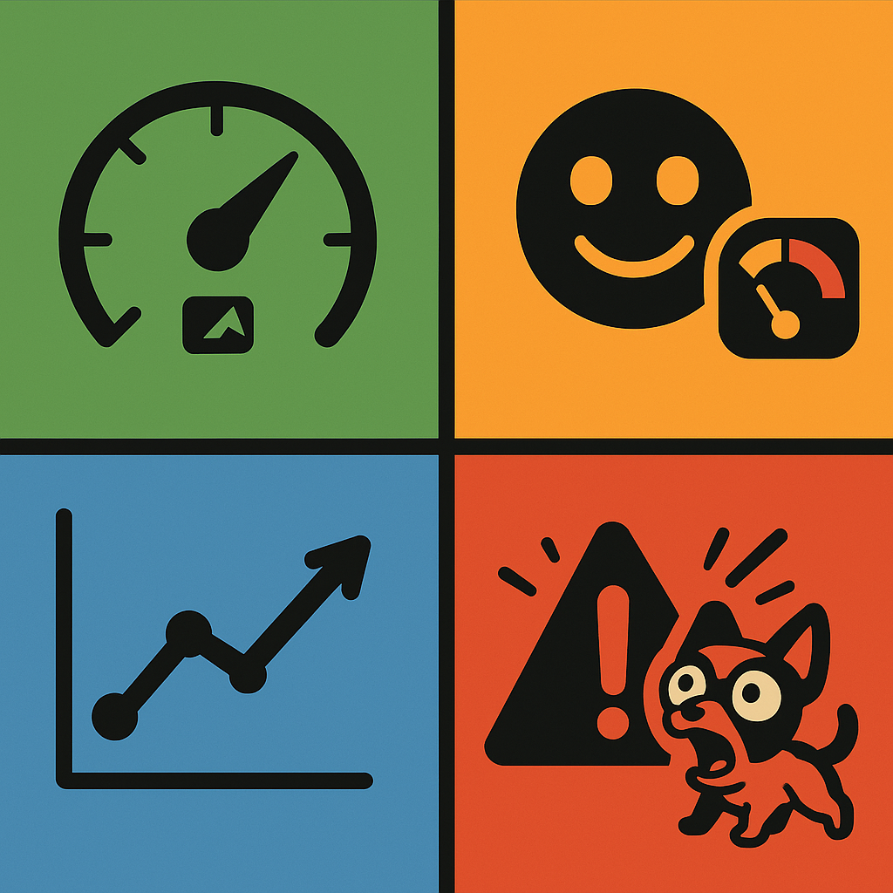
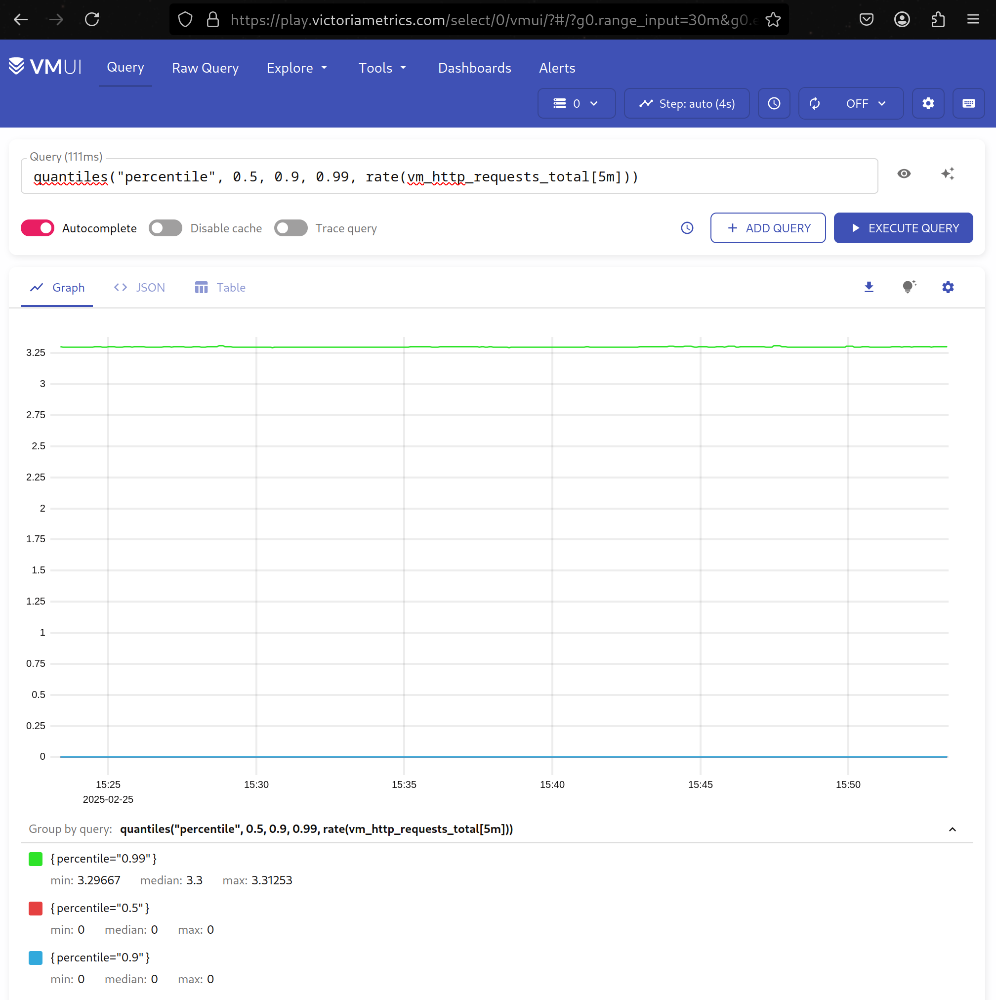
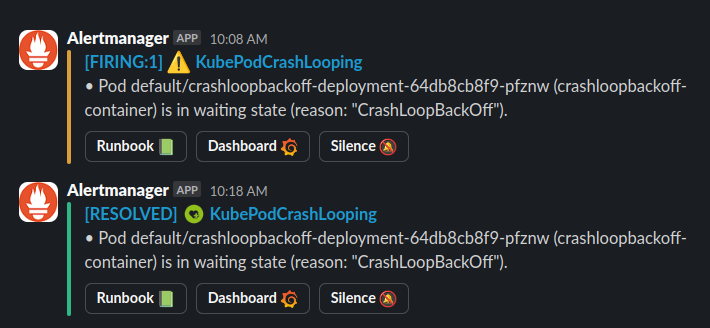
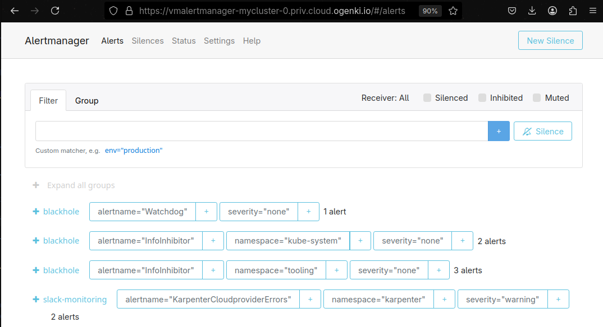
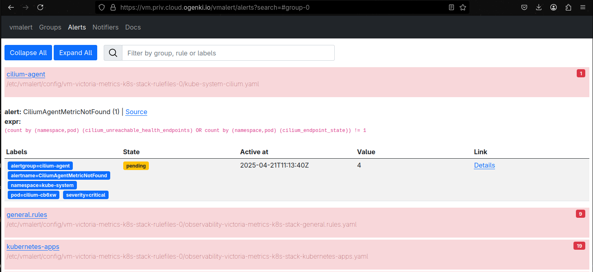

+++
author = "Smaine Kahlouch"
title = "`VictoriaMetrics` : Des alertes efficaces, de la théorie à la pratique 🛠️"
date = "2025-04-21"
summary = "Des `Core Web Vitals` aux `Golden Signals`, en passant par la configuration de notifications Slack, découvrez comment mettre en place des alertes efficaces avec l'opérateur VictoriaMetrics."
featured = true
codeMaxLines = 21
usePageBundles = true
toc = true
series = [
  "observability"
]
tags = [
    "observability"
]
thumbnail= "thumbnail.png"
+++

{}
Une fois que notre application est déployée, il est primordial de disposer d'indicateurs permettant d'identifier d'éventuels problèmes ainsi que suivre les évolutions de performance. Parmi ces éléments, les **métriques** et les **logs** jouent un rôle essentiel en fournissant des informations précieuses sur le fonctionnement de l'application. En complément, il est souvent utile de mettre en place un **tracing** détaillé pour suivre précisément toutes les actions réalisées par l'application.

Dans cette [série d'articles](http://localhost:1313/fr/series/observability/), nous allons explorer les différents aspects liés à la supervision applicative. L'objectif étant d'analyser en détail l'état de nos applications, afin d'améliorer leur **disponibilité** et leurs **performances**, tout en garantissant une expérience utilisateur optimale.
{}

Lors d'un [précédent article](https://blog.ogenki.io/fr/post/series/observability/metrics/), nous avons vu comment collecter et visualiser des métriques. Celles-ci permettent d'analyser le comportement et les performances de nos applications. Il est tout aussi primordial de configurer des **alertes** afin d'être notifié en cas d'anomalies sur notre plateforme.

## 🎯 Objectifs

* 📊 Comprendre les approches standards pour définir des alertes efficaces : Les "**Core Web Vitals**" et les "**Golden Signals**"
* 🔍 Découvrir les langages **PromQL** et **MetricsQL** pour l'écriture de règles d'alerte
* ⚙️ Configurer des alertes de façon déclarative avec **VictoriaMetrics Operator**
* 📱 **Router ces alertes** vers différents canaux Slack

## 📋 Prérequis

La suite de cet article suppose que vous avez déjà :

* Une instance VictoriaMetrics fonctionnelle déployée sur Kubernetes
* Un accès à un workspace Slack pour les notifications

La mise en place d'alertes pertinentes est un élément crucial de toute stratégie d'observabilité. Cependant, définir des seuils appropriés et éviter la fatigue liée aux alertes nécessite une approche réfléchie et méthodique.


Nous allons voir dans cet article qu'il est très simple de positionner des seuils au delà desquels nous serions notifiés. Cependant faire en sorte que ces alertes soient **pertinentes** n'est pas toujours évident.

## 🔍 Qu'est ce qu'une bonne alerte?

<center></center>

Une alerte correctement configurée permet d'identifier et de résoudre les problèmes au sein de notre système de manière **proactive**, avant qu'ils ne s'aggravent. Des alertes efficaces doivent:

- Signaler des problèmes nécessitant une **intervention immédiate**.
- Etre déclenchées **au bon moment**: suffisamment tôt pour prévenir un impact sur les utilisateurs, sans toutefois être trop fréquentes au point de provoquer une fatigue liée aux alertes.
- Indiquer la **cause racine** ou la zone nécessitant une investigation. Pour ce faire il est recommandé d'effectuer une analyse permettant la priorisation d'indicateurs pertinents, avec un réel impact sur le métier ([SLIs](https://sre.google/sre-book/service-level-objectives/)).

Il est donc important de se focaliser sur un **nombre maitrisé** d'indicateurs à surveiller. Il existe pour cela des approches qui permettent de mettre en oeuvre une supervision efficace de nos systèmes.
Ici nous allons nous pencher sur 2 modèles d'alerte reconnus: Les **Core Web Vitals** et les **Golden Signals**.

### 🌐 Les "Core Web Vitals"

Les Core Web Vitals sont des métriques développées par Google pour évaluer l'**expérience utilisateur** sur les applications web. Ils mettent en évidence des indicateurs liés à la satisfaction des utilisateurs finaux et permettent de garantir que notre application offre de bonnes performances pour les utilisateurs réels. Ces métriques se concentrent sur trois aspects principaux :

<center></center>

- **Largest Contentful Paint** (LCP), *Temps de chargement de la page* : Le LCP mesure le temps nécessaire pour que le plus grand élément de contenu visible sur une page web (par exemple, une image, une vidéo ou un large bloc de texte) soit **entièrement rendu** dans la fenêtre d'affichage. Un bon LCP se situe en dessous de **2,5 secondes**.

- **Interaction to Next Paint** (INP), *Réactivité* : L'INP évalue la réactivité d'une page web en mesurant la **latence de toutes les interactions** utilisateur, telles que les clics, les taps et les entrées clavier, etc... Elle reflète le temps nécessaire pour qu'une page réagisse visuellement à une interaction, c'est-à-dire le délai avant que le navigateur affiche le prochain rendu après une action de l'utilisateur. un bon INP doit être inférieur à **200 millisecondes**

- **Cumulative Layout Shift** (CLS), *Stabilité visuelle* : Le CLS évalue la **stabilité visuelle** en quantifiant les décalages de mise en page inattendus sur une page, lorsque des éléments se déplacent pendant le chargement ou l'interaction. Un bon score CLS est inférieur ou égal à **0,1**.

La performance d'un site web est considérée satisfaisante si elle atteint les seuils décrits ci-dessus au **75ᵉ percentile**, favorisant ainsi une bonne expérience utilisateur et, par conséquent, une meilleure rétention et un meilleur référencement ([SEO](https://en.wikipedia.org/wiki/Search_engine_optimization)).

{}
L'ajout d'alertes spécifiques sur ces métriques doit être mûrement réfléchi. Contrairement aux indicateurs opérationnels classiques, tels que la disponibilité ou le taux d'erreurs, qui reflètent directement la stabilité du système, les *Web Vitals* dépendent de **nombreux facteurs externes**, comme les conditions réseau des utilisateurs ou leurs appareils, rendant les seuils plus complexes à surveiller efficacement.

Pour éviter une surcharge d'alertes inutiles, ces alertes doivent uniquement cibler des **dégradations significatives**. Par exemple, une augmentation soudaine du **CLS** (stabilité visuelle) ou une détérioration continue du **LCP** (temps de chargement) sur plusieurs jours peuvent indiquer des problèmes importants nécessitant une intervention.
{}

Enfin, ces alertes nécessitent des outils adaptés, comme le *RUM (Real User Monitoring)* pour les données réelles ou le *Synthetic Monitoring* pour des tests simulés, qui requièrent une solution spécifique non abordée dans cet article.

### ✨ Les "Golden Signals"

<center></center>

Les _Golden Signals_ sont un ensemble de **quatre indicateurs clés**, largement utilisés dans le domaine de la supervision des systèmes et des applications, notamment avec des outils comme Prometheus. Ces signaux permettent de surveiller la santé et la performance des applications de manière efficace. Ils sont particulièrement appropriés dans le contexte d'une architecture distribuée:

* **La Latence** ⏳: Elle inclut à la fois le temps des requêtes réussies et le temps des requêtes échouées. La latence est cruciale car une augmentation du temps de réponse peut indiquer des problèmes de performance.

* **Le Trafic** 📶: Il peut être mesurée en termes de nombre de requêtes par seconde, de débit de données, ou d'autres métriques qui expriment la charge du système.

* **Les erreurs** ❌: Il s'agit du taux d'échec des requêtes ou des transactions. Cela peut inclure des erreurs d'application, des erreurs d'infrastructure ou toute situation où une requête ne s'est pas terminée correctement (par exemple, des réponses HTTP 5xx ou des requêtes rejetées).

* **La saturation** 📈: C'est une mesure de l'utilisation des ressources du système, comme le CPU, la mémoire ou la bande passante réseau. La saturation indique à quel point le système est proche de ses limites. Un système saturé peut entraîner des ralentissements ou des pannes.

Ces Golden Signals sont essentiels car ils permettent de **concentrer la surveillance sur les aspects critiques** qui peuvent rapidement affecter l'expérience utilisateur ou la performance globale du système. Avec Prometheus, ces signaux sont souvent surveillés via des métriques spécifiques pour déclencher des alertes lorsque certains seuils sont dépassés.

{}
J'ai évoqué ici 2 méthodologies qui, je trouve, sont un bon point de départ pour ajuster au mieux notre système d'alerting. Ceci-dit il en existe d'autres, chacune avec leurs spécificités. On peut ainsi citer [USE](https://www.brendangregg.com/usemethod.html) ou [RED](https://grafana.com/blog/2018/08/02/the-red-method-how-to-instrument-your-services/).

De même, au-delà des Core Web Vitals présentés plus haut, d'autres métriques web comme **[FCP](https://web.dev/articles/fcp)** (First Contentful Paint) ou **[TTFB](https://web.dev/articles/ttfb)** (Time To First Byte) peuvent s'avérer utiles selon vos besoins spécifiques.

Le choix des métriques à surveiller dépendra de votre contexte et de vos objectifs. L'essentiel est de garder à l'esprit qu'une bonne stratégie d'alerting repose sur un ensemble ciblé d'indicateurs pertinents 🎯
{}

Vous l'aurez compris: Definir des alertes ça se réfléchit! Maintenant entrons dans le concret et voyons **comment définir des seuils à partir de nos métriques**.

## 💻 Exprimer des requêtes avec PromQL/MetricsQL

Les métriques collectées avec Prometheus peuvent être requetées avec un langage spécifique appelé `PromQL` (Prometheus Query Language). Ce langage permet d'extraire des données de supervision, d'effectuer des **calculs**, d'**agréger** les résultats, d'appliquer des **filtres**, mais aussi de configurer des **alertes**.

(ℹ️ Se référer au [précédent article](https://blog.ogenki.io/fr/post/series/observability/metrics/#-quest-ce-quune-m%C3%A9trique) pour comprendre ce que l'on entend par métrique.)

PromQL est un langage puissant dont voici quelques exemples simples appliqués aux métriques exposées par un serveur web Nginx :

* Nombre total de requêtes traitées (`nginx_http_requests_total`) :
  ```promql
  nginx_http_requests_total
  ```

* Nombre moyen de requêtes par seconde sur une fenêtre de 5 minutes.
  ```promql
  rate(nginx_http_requests_total[5m])
  ```

* Nombre de requêtes HTTP par seconde retournant un code d'erreur 5xx sur les 5 dernières minutes.
  ```promql
  rate(nginx_http_requests_total{status=~"5.."}[5m])
  ```

* Nombre de requêtes par seconde, agrégé par pod et filtré sur le namespace "myns" sur les 5 dernières minutes.
  ```promql
  sum(rate(nginx_http_requests_total{namespace="myns"}[5m])) by (pod)
  ```

💡 Dans les exemples ci-dessus, nous avons mis en évidence deux _Golden Signals_ : le trafic 📶 et les erreurs ❌.

`MetricsQL` est le langage utilisé avec VictoriaMetrics. Il se veut compatible avec PromQL avec de légères différences qui permettent de faciliter l'écriture de requêtes complexes.</br>
Il apporte aussi de nouvelles fonctions dont voici quelques exemples:

* `histogram(q)`: Cette fonction calcule un histogramme pour chaque groupe de points ayant le même horodatage, ce qui est utile pour visualiser un grand nombre de séries temporelles (timeseries) via un heatmap. </br>
  Pour créer un histogramme des requêtes HTTP
  ```promql
  histogram(rate(vm_http_requests_total[5m]))
  ```

* `quantiles("phiLabel", phi1, ..., phiN, q)`: Utilisé pour extraire plusieurs quantiles (ou percentiles) d'une métrique donnée . </br>
  Pour calculer les 50e, 90e et 99e percentiles du taux de requêtes HTTP
  ```promql
  quantiles("percentile", 0.5, 0.9, 0.99, rate(vm_http_requests_total[5m]))
  ```

Afin de pouvoir tester ses requêtes, vous pouvez utiliser la démo fournie par VictoriaMetrics: https://play.victoriametrics.com

<center></center>

## 🛠️ Configurer des alertes avec VictoriaMetrics Operator

VictoriaMetrics propose deux composants essentiels pour la gestion des alertes :
- **VMAlert** : responsable de l'évaluation des règles d'alerte
- **AlertManager** : gère le routage et la distribution des notifications

### VMAlert : Le moteur d'évaluation des règles

VMAlert est le composant qui évalue en continu les règles d'alerte définies. Il supporte deux types de règles :

* **Recording Rules** 📊
   Les recording rules permettent de pré-calculer des expressions PromQL complexes et de les stocker comme nouvelles métriques pour optimiser les performances.

* **Alerting Rules** 🚨
   Les alerting rules définissent les conditions qui déclenchent des alertes lorsque certains seuils sont dépassés.

Dans la suite de cet article, nous allons nous concentrer sur les alerting rules qui sont essentielles pour la détection proactive des problèmes.

{}
<table>
  <tr>
        <td>
          
        </td>
        <td style="vertical-align:middle; padding-left:10px;" width="70%">

Le reste de cet article est issu d'un ensemble de configurations que vous pouvez retrouver dans le repository <strong><a href="https://github.com/Smana/cloud-native-ref">Cloud Native Ref</a></strong>.</br>
Il y est fait usage de nombreux opérateurs et notamment celui pour [VictoriaMetrics](https://github.com/VictoriaMetrics/operator).

L'ambition de ce projet est de pouvoir <strong>démarrer rapidement une plateforme complète</strong> qui applique les bonnes pratiques en terme d'automatisation, de supervision, de sécurité etc. </br>
Les commentaires et contributions sont les bienvenues 🙏
        </td>
  </tr>
</table>
{}


### Déclarer une règle d'alerting avec `VMRule`

Nous avons vu précédemment que VictoriaMetrics fournit un opérateur Kubernetes qui permet de gérer les différents composants de manière déclarative. Parmi les ressources personnalisées (Custom Resources) disponibles, la `VMRule` permet de définir des règles d'alertes et d'enregistrement (recording rules).

Si vous avez déjà utilisé l'[opérateur Prometheus](https://github.com/prometheus-operator/prometheus-operator), vous retrouverez une syntaxe très similaire car l'opérateur VictoriaMetrics est compatible avec les custom resources de Prometheus. (Ce qui nous permet de faciliter la migration 😉).

Prenons un exemple concret avec une `VMRule` qui surveille l'état de santé des ressources Flux :

[flux/observability/vmrule.yaml](https://github.com/Smana/cloud-native-ref/blob/main/flux/observability/vmrule.yaml)

```yaml
apiVersion: operator.victoriametrics.com/v1beta1
kind: VMRule
metadata:
  labels:
    prometheus-instance: main
  name: flux-system
  namespace: flux-system
spec:
  groups:
    - name: flux-system
      rules:
        - alert: FluxReconciliationFailure
          annotations:
            message: Flux resource has been unhealthy for more than 5m
            description: "{{ $labels.kind }} {{ $labels.exported_namespace }}/{{ $labels.name }} reconciliation has been failing for more than ten minutes."
            runbook_url: "https://fluxcd.io/flux/cheatsheets/troubleshooting/"
            dashboard: "https://grafana.priv.${domain_name}/dashboards"
          expr: max(gotk_reconcile_condition{status="False",type="Ready"}) by (exported_namespace, name, kind) + on(exported_namespace, name, kind) (max(gotk_reconcile_condition{status="Deleted"}) by (exported_namespace, name, kind)) * 2 == 1
          for: 10m
          labels:
            severity: warning
```

Il est recommandé de suivre quelques **bonnes pratiques** pour donner le maximum de contexte afin d'identifier rapidement la cause racine.

1. **Nommage et Organisation** 📝
   - Utiliser des noms descriptifs pour les règles, comme `FluxReconciliationFailure`
   - Grouper les règles par composant Flux (ex: `flux-system`, `flux-controllers`)
   - Documenter les conditions de réconciliation dans les annotations

2. **Seuils et Durées** ⏱️
   - Ajuster la durée d'évaluation de l'alerte `for: 10m` pour éviter les faux positifs
   - Adapter les seuils selon le type de ressource supervisées.
   - Considérer des durées différentes selon l'environnement (prod/staging)

3. **Labels et Routing** 🏷️
   - Ajouter des labels pour le routage selon le contexte. Mon exemple n'est pas très poussé car il s'agit d'une configuration de démo. Mais nous pourrions très bien ajouter un label `team` afin de router vers la bonne équipe, ou avoir une politique de routage différente selon l'environnement.
     ```yaml
     labels:
       severity: [critical|warning|info]
       team: [sre|dev|ops]
       environment: [prod|staging|dev]
     ```

4. **L'importance des annotations** 📚

  Les annotations permettent d'ajouter divers informations sur le contexte de l'alerte
  - Une **description** claire du problème de réconciliation
  - Le lien vers le **runbook** de troubleshooting Flux
  - Le lien vers le **dashboard Grafana** dédié

5. **Requête PromQL** 🔍
   ```yaml
   expr: |
     max(gotk_reconcile_condition{status="False",type="Ready"}) by (exported_namespace, name, kind)
     + on(exported_namespace, name, kind)
     (max(gotk_reconcile_condition{status="Deleted"}) by (exported_namespace, name, kind)) * 2 == 1
   ```
   Cette alerte se déclenchera si Flux n'arrive pas à réconcilier une ressource ou si une ressource est supprimée alors qu'elle ne devrait pas l'être. Dans le détail:
   - La métrique `gotk_reconcile_condition` expose l'état de santé des ressources Flux
   - Le filtre `status="False",type="Ready"` identifie les ressources qui ne sont pas dans l'état "Ready"
   - La deuxième partie de l'expression (`status="Deleted"`) détecte les ressources qui ont été supprimées
   - L'opération `+ on(...) (...) * 2 == 1` combine ces conditions pour déclencher une alerte quand :
     - Une ressource n'est pas "Ready" (première partie = 1)
     - OU une ressource a été supprimée de façon inattendue (deuxième partie = 1)
   - Le `max` et le `by` permettent de regrouper les alertes par namespace, nom et type de ressource

## 💬 Intégration avec Slack

Nous pouvons envoyer ces alertes au travers de différents canaux ou outils. Nous pouvons citer Grafana OnCall, Opsgénie, Pagerduty ou simplement des emails et j'en passe...

Dans notre exemple nous envoyons des notifications vers un canal Slack. Nous allons donc d'abord créer une application Slack et récupérer le token généré avant de configurer VictoriaMetrics.

### Configuration de l'Application Slack

1. **Création de l'Application** 🔧
   - Cela se fait sur [https://api.slack.com/apps](https://api.slack.com/apps)
   - Cliquer sur "Create New App"
   - Choisir "From scratch"
   - Nommer l'application (ex: "AlertManager")
   - Sélectionner le workspace cible

2. **Configuration des Permissions** 🔑
   Dans "OAuth & Permissions", ajouter les scopes suivants :
   - `chat:write` (Requis)
   - `chat:write.public` (Pour poster dans les canaux publics)
   - `channels:read` (Pour lister les canaux)
   - `groups:read` (Pour les groupes privés)

<center>
  <video id="SlackPermissions" controls width="700" autoplay loop muted>
    <source src="slack-permissions.mp4" type="video/mp4">
    Your browser does not support the video tag.
  </video>
</center>

3. **Installation et Token** 🎟️
   - Installer l'application dans le workspace
   - Copier le "Bot User OAuth Token" (commence par `xoxb-`)
   - Stocker le token de manière sécurisée. Dans notre exemple, le secret est récupéré depuis AWS Secrets Manager en utilisant l'[opérateur External Secrets](https://external-secrets.io).

### Configuration d'AlertManager pour Slack

Le reste de la configuration se fait grâce à des values **Helm** afin de paramètrer AlertManager

[observability/base/victoria-metrics-k8s-stack/vm-common-helm-values-configmap.yaml](https://github.com/Smana/cloud-native-ref/blob/main/observability/base/victoria-metrics-k8s-stack/vm-common-helm-values-configmap.yaml)

1. Référencer le point de montage du secret contenant le token

```yaml
    alertmanager:
      enabled: true
      spec:
        externalURL: "https://vmalertmanager-${cluster_name}.priv.${domain_name}"
        secrets:
          - "victoria-metrics-k8s-stack-alertmanager-slack-app"
      config:
        global:
          slack_api_url: "https://slack.com/api/chat.postMessage"
          http_config:
            authorization:
              credentials_file: /etc/vm/secrets/victoria-metrics-k8s-stack-alertmanager-slack-app/token
```

Le secret `victoria-metrics-k8s-stack-alertmanager-slack-app` contenant le token est récupéré depuis AWS Secrets Manager. Dans la configuration il faut référencer le point de montage de ce secret (`config.globl.http_config.authorization`)

2. Explication du routage

```yaml
        route:
          group_by:
            - cluster
            - alertname
            - severity
            - namespace
          group_interval: 5m
          group_wait: 30s
          repeat_interval: 3h
          receiver: "slack-monitoring"
          routes:
            - matchers:
                - alertname =~ "InfoInhibitor|Watchdog|KubeCPUOvercommit"
              receiver: "blackhole"
        receivers:
          - name: "blackhole"
          - name: "slack-monitoring"
```

* **Groupement des alertes** : Le groupement des alertes est essentiel pour réduire le bruit et améliorer la lisibilité des notifications. Sans groupement, chaque alerte serait envoyée individuellement, ce qui pourrait rapidement devenir ingérable. Les critères de groupement choisis permettent une organisation logique:
  * `group_by` défini les labels sur lesquels grouper les alertes.
  * `group_wait`: Délai de 30s avant l'envoi initial d'une notification pour permettre le groupement
  * `group_interval`: Intervalle de 5m entre les notifications pour un même groupe
  * `repeat_interval`: Les alertes ne sont répétées que toutes les 3h pour éviter le spam

* **Receivers**: Les receivers sont des composants d'AlertManager qui définissent comment et où envoyer les notifications d'alerte. Ils peuvent être configurés pour différents canaux de communication comme Slack, Email, PagerDuty, etc. Dans notre configuration:
  * `slack-monitoring`: Receiver principal qui envoie les alertes vers un canal Slack spécifique avec un formatage personnalisé
  * `blackhole`: Receiver spécial qui "absorbe" les alertes sans les transmettre nulle part, utile pour filtrer les alertes non pertinentes ou purement techniques

{}
Selon l'organisation et les procédures en vigueur dans l'entreprise, nous pouvons définir un routage ciblé des alertes.
Supposons, par exemple, que nous souhaitons router les alertes critiques des environnements de production et sécurité vers l'équipe d'astreinte :

```yaml
        - matchers:
            - environment =~ "prod|security"
            - team = "oncall"
          receiver: "pagerduty"
```
{}

3. **Templates Personnalisés** 📝

Ce bloc de configuration définit un receiver Slack pour AlertManager qui utilise les templates Monzo. [Les templates Monzo](https://gist.github.com/milesbxf/e2744fc90e9c41b47aa47925f8ff6512) sont un ensemble de templates de notification qui permettent de formater les alertes Slack de manière élégante et informative.

```yaml
    alertmanager:
      config:
        receivers:
          - name: "slack-monitoring"
            slack_configs:
              - channel: "#alerts"
                send_resolved: true
                title: '{{ template "slack.monzo.title" . }}'
                icon_emoji: '{{ template "slack.monzo.icon_emoji" . }}'
                color: '{{ template "slack.monzo.color" . }}'
                text: '{{ template "slack.monzo.text" . }}'
                actions:
                  - type: button
                    text: "Runbook :green_book:"
                    url: "{{ (index .Alerts 0).Annotations.runbook_url }}"
                  - type: button
                    text: "Query :mag:"
                    url: "{{ (index .Alerts 0).GeneratorURL }}"
                  - type: button
                    text: "Dashboard :grafana:"
                    url: "{{ (index .Alerts 0).Annotations.dashboard }}"
                  - type: button
                    text: "Silence :no_bell:"
                    url: '{{ template "__alert_silence_link" . }}'
                  - type: button
                    text: '{{ template "slack.monzo.link_button_text" . }}'
                    url: "{{ .CommonAnnotations.link_url }}"
```
Voici un exemple de notification générée avec ce format. Il permet notamment d'ajouter des boutons d'action pour visualiser le dashboard Grafana 📊, afficher le runbook 📚 ou mettre en silence l'alerte 🔕.

<center></center>


## 👀 Visualiser et interagir avec les alertes

La visualisation et la gestion des alertes sont des aspects essentiels d'un système d'alerting efficace. VictoriaMetrics et son écosystème offrent plusieurs options pour interagir avec vos alertes :

### Alertmanager : La solution standard

`Alertmanager` est le composant standard qui permet de :
- Visualiser l'état actuel des alertes
- Configurer le routage des notifications
- Gérer les silences (mise en pause temporaire d'alertes)
- Consulter l'historique des alertes

<center></center>

### VMUI : L'interface native de VictoriaMetrics

`VMUI` offre une interface simplifiée pour :
- Consulter les alertes actives
- Visualiser les règles d'alertes
- Afficher les métriques associées

<center></center>

### Grafana Alerting : Une solution complète

Bien que nous utilisions Alertmanager pour la définition et le routage des alertes, `Grafana Alerting` offre une solution alternative complète qui permet de :
- Centraliser la gestion des alertes
- Visualiser les alertes dans le contexte des dashboards
- Configurer des règles d'alertes directement depuis l'interface
- Gérer les silences et les notifications

<center></center>

{}
Le choix de l'interface dépend de vos besoins spécifiques :
- Alertmanager est idéal pour la gestion opérationnelle des alertes
- VMUI est parfait pour une vue rapide et simple
- Grafana Alerting est recommandé si vous souhaitez une solution intégrée avec vos dashboards
{}

## 🎯 Conclusion

La définition d'alertes pertinentes est un élément clé de toute stratégie d'observabilité. L'opérateur VictoriaMetrics, avec ses ressources personnalisées Kubernetes comme `VMRule`, simplifie grandement la mise en place d'un système d'alerting efficace. La configuration déclarative permet de définir rapidement des règles d'alerte complexes tout en maintenant une excellente lisibilité et maintenabilité du code.

Cependant, la configuration technique des alertes, même avec des outils aussi puissants que VictoriaMetrics, ne suffit pas à elle seule. Une stratégie d'alerting efficace doit s'intégrer dans un cadre organisationnel plus large :
- Définition claire des procédures d'astreinte
- Identification des équipes responsables de la surveillance
- Mise en place de runbooks et procédures de réponse aux incidents
- Adaptation des canaux de notification selon la criticité et le contexte

{}
Découvrez comment intégrer ces alertes avec d'autres composants de votre stack d'observabilité dans les prochains articles de cette série, notamment la corrélation avec les logs et le tracing distribué.
{}

## 🔖 References

* https://web.dev/articles/vitals
* https://medium.com/@romanhavronenko/victoriametrics-promql-compliance-d4318203f51e
* https://victoriametrics.com/blog/alerting-recording-rules-alertmanager/
* https://docs.victoriametrics.com/vmalert/
