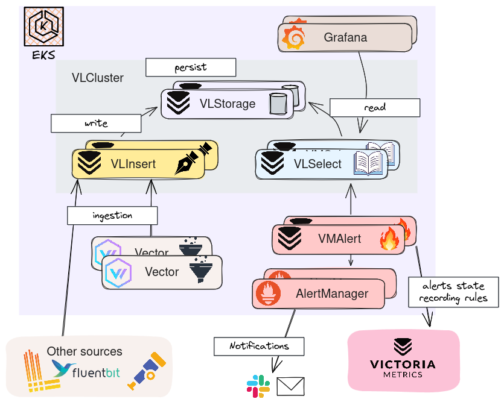
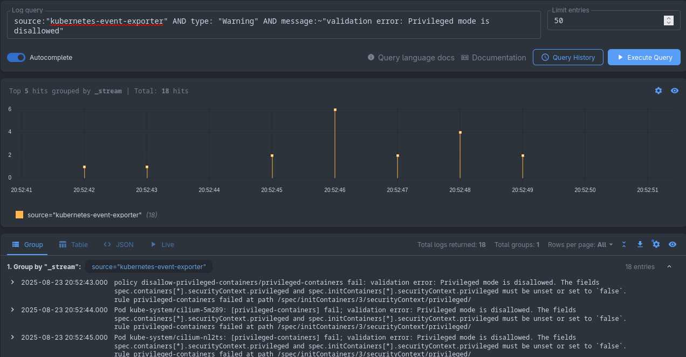
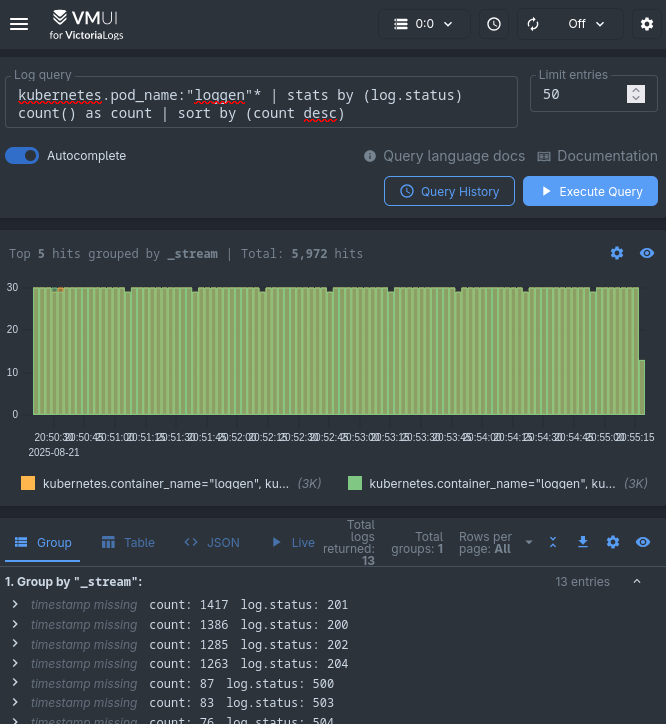
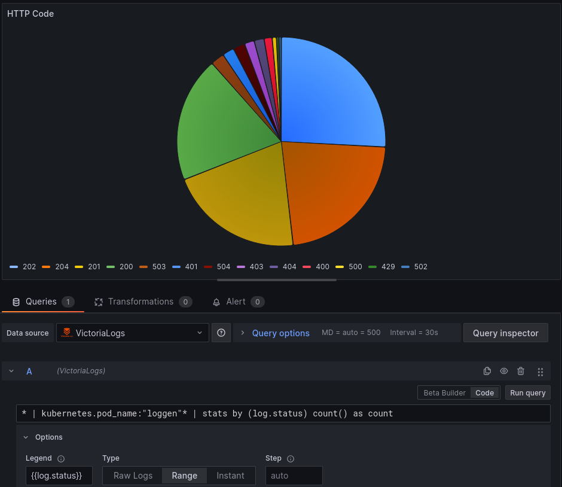
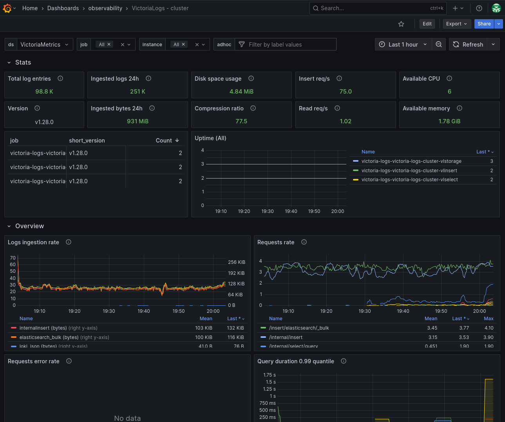
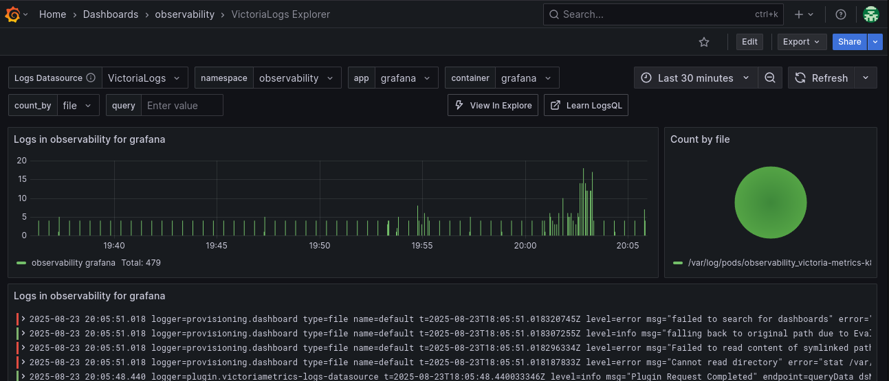

+++
author = "Smaine Kahlouch"
title = "`VictoriaLogs` : Et si la gestion des logs devenait simple et performante?"
date = "2025-08-25"
summary = "À l’ère des architectures distribuées, la recherche de **logs** rapide et efficace reste un **défi**, impliquant des solutions parfois complexes à mettre en œuvre et à opérer. Je vous présente ici un petit nouveau dans l’arène, qui pourrait bien susciter votre intérêt 😉."
featured = true
codeMaxLines = 25
usePageBundles = true
toc = true
series = ["observability"]
tags = ["observability"]
thumbnail= "thumbnail.png"
+++

{}
Une fois notre application déployée, il est primordial de disposer d'indicateurs permettant d'identifier d'éventuels problèmes ainsi que de suivre les évolutions de performance. Parmi ces éléments, les **métriques** et les **logs** jouent un rôle essentiel en fournissant des informations précieuses sur le fonctionnement de l'application. En complément, il est souvent utile de mettre en place un **tracing** détaillé pour suivre précisément toutes les actions réalisées par l'application.

Dans cette [série d'articles](https://blog.ogenki.io/series/observability/), nous allons explorer les différents aspects liés à la supervision applicative. L'objectif étant d'analyser en détail l'état de nos applications, afin d'améliorer leur **disponibilité** et leurs **performances**, tout en garantissant une expérience utilisateur optimale.
{}

Trop souvent, la gestion des logs signifie solutions complexes et requêtes lentes. Pourtant les **logs** sont un pilier incontournable pour comprendre, diagnostiquer et améliorer nos applications.

En effet, si les _métriques_ nous permettent d'observer l'évolution d'indicateurs dans le temps et les _traces_ de suivre le cheminement d'une requête au sein de notre plateforme, les logs nous offrent le **contexte détaillé** indispensable à la compréhension des événements.

## ❓ A quoi servent nos logs?

Les logs ne sont pas de simples messages que l'on accumule dans un coin de notre infra: ils constituent la **mémoire** vivante de nos systèmes. Ils sont essentiels car ils endossent plusieurs rôles critiques dont voici quelques mises en situation concrètes :

- **Diagnostic et Dépannage** : Une application e-commerce rencontre des erreurs 500 lors du paiement, les logs permettent de retracer la séquence exacte des appels, d’identifier qu’une dépendance externe (ex: API de paiement) est en cause, et de corriger rapidement le problème.
- **Sécurité et Conformité** : Les logs révèlent des tentatives de connexion suspectes en dehors des horaires habituels ; ils permettent de détecter une attaque par _brut force_ et de renforcer la sécurité. Ils sont aussi indispensables pour répondre aux exigences réglementaires ([RGPD](https://en.wikipedia.org/wiki/General_Data_Protection_Regulation), [PCI DSS](https://www.pcisecuritystandards.org/standards/pci-dss/), etc.).
- **Monitoring et Alerting Proactif** : Des règles d’alerte détectent automatiquement une augmentation anormale du taux d’erreurs dans les logs d’un service critique, permettant d’intervenir avant que la situation ne s'aggrave.
- **Audit et Traçabilité** : Lors d’un audit RGPD, les logs d’accès permettent de reconstituer précisément l’historique des actions sur les données personnelles.

Mais pour que ces cas d’usage révèlent toute leur valeur, il ne suffit pas de collecter les logs : il faut pouvoir les **rechercher rapidement**, **formuler des requêtes simples**, et garantir leur **conservation à long terme** sans exploser les coûts ni la complexité. </br>
**C'est exactement là que `VictoriaLogs` entre en scène** 🔎

## 🚀 VictoriaLogs : Une nouvelle réponse à la gestion et l'analyse de logs

Avec l'adoption des architectures distribuées, nos plateformes génèrent des logs en quantité toujours plus importante.</br>

Pour exploiter ces volumes croissants, nous nous sommes traditionnellement tournés vers des solutions comme ELK (Elasticsearch, Logstash, Kibana) ou Grafana Loki, souvent synonymes de complexité opérationnelle.

En 2023, `VictoriaLogs` est apparu comme une alternative prometteuse qui pourrait bien changer la donne.

Développé par l'équipe derrière la base de données _time series_ `VictoriaMetrics`, dont la popularité est grandissante, VictoriaLogs hérite des mêmes qualités. Voici ses principales caractéristiques:

-   **Simplicité de déploiement et d'opération** : Son installation et sa configuration sont plutôt simples et nous allons voir ensemble le mode le plus avancé ci-après (cluster).
-   **Haute performance** : Optimisé pour une ingestion massive de logs et des requêtes analytiques rapides, même sur de très grands volumes de données.
-   **Efficacité des ressources** : Faible empreinte CPU et mémoire, et compression efficace des données pour minimiser les coûts de stockage en comparaison avec des solutions similaires.
-   **Intégration à l'écosystème VictoriaMetrics** : S'intègre naturellement avec VictoriaMetrics pour une solution d'observabilité unifiée, et avec VMAlert pour l'alerting et Grafana pour la visualisation.
-   **Recherche Full-Text Rapide et par label** : VictoriaLogs permet des recherches à la fois des recherches full-text sur le contenu des logs et des filtrages précis par labels.

{}

Plusieurs [sources](#-references) permettent d'attester de la **performance** de VictoriaLogs, en comparaison à d'autres solutions de gestion de logs.

Les écarts de performance, en comparaison avec ELK ou Loki, sont assez impressionnants, que ce soit en termes d'**utilisation mémoire** ou de **compression** des données.

Concernant la recherche de logs, VictoriaLogs se distingue en combinant efficacement la recherche full-text d'Elasticsearch et le filtrage par labels de Loki, offrant ainsi le meilleur des **deux approches** tout en conservant une rapidité d'exécution des requêtes.

{}

### 🗃️ L'ingestion et le stockage

Un log dans VictoriaLogs est typiquement un **objet JSON**. Chaque log contient forcément des champs suivants :

-   `_msg`: Le contenu brut du message de log, tel qu'il est produit par l'application.
-   `_time`: Le timestamp du log.
-   `_stream`: Un ensemble de labels (clé-valeur) qui identifient de manière unique la source du log.

💡 En plus de ceux-cis, n'importe quel autre champs peut être ajouté au JSON afin de simplifier et d'optimiser la recherche sur des informations pertinentes selon le contexte (Nous verrons quelques exemples par la suite).

{}
Le champs `_stream` dans VictoriaLogs permet d'optimiser la compression et de garantir une recherche ultra-rapide grâce au stockage contigu des logs partageant les mêmes labels.

L'efficacité dépend d'un **choix précautionneux** : seuls les champs constants, qui identifient de façon unique une instance d'application (container, namespace, pod), doivent faire partie du stream. Les champs dynamiques (IP, user_id, trace_id) doivent rester dans le message afin d'éviter une cardinalité trop élevée.
{}

Il est possible de stocker un log simplement via la commande `curl`, ou en [utilisant différents agents](https://docs.victoriametrics.com/victorialogs/data-ingestion/#log-collectors-and-data-ingestion-formats) de collecte et de transport de logs tels que _Promtail_, _FluentBit_, _OpenTelemetry_ et j'en passe.</br>

J'ai choisi [**Vector**](https://vector.dev/) car il s'agit d'une solution très performante mais aussi car il est proposé par défaut dans le chart Helm que nous allons utiliser 😉.

Parmi les éléments de configuration requis, il faut indiquer la destination mais aussi les champs indispensables dont nous avons parlé précédemment, qui sont ici configurés en utilisant des headers HTTP.

```yaml
    sinks:
      vlogs-0:
        compression: gzip
        endpoints:
        - http://<victorialogs_host>:9428/insert/elasticsearch
        healthcheck:
          enabled: false
        inputs:
        - parser
        mode: bulk
        request:
          headers:
            AccountID: "0"
            ProjectID: "0"
            VL-Msg-Field: message,msg,_msg,log.msg,log.message,log
            VL-Stream-Fields: stream,kubernetes.pod_name,kubernetes.container_name,kubernetes.pod_namespace
            VL-Time-Field: timestamp
        type: elasticsearch
```

Les logs sont collectés sur un cluster Kubernetes, et Vector l'**enrichit** avec de nombreux champs permettant d'identifier de façon précise la source. Voici un exemple concret de log enrichi tel qu'il est stocké dans VictoriaLogs (Ce log a été volontairement tronqué pour le besoin de cet article) :

```json
  {
    "_time": "2025-07-29T07:25:49.870820279Z",
    "_stream_id": "00000000000000006a98e166d58afc9efc6ea35a22d87f1b",
    "_stream": "{kubernetes.container_name=\"loggen\",kubernetes.pod_name=\"loggen-loggen-68dc4f9b8b-6mrqj\",kubernetes.pod_namespace=\"observability\",stream=\"stdout\"}",
    "_msg": "236.161.251.196 - [07/Jul/2025:08:13:41 ] \"GET /homepage HTTP/2\" 204 4367 \"http://localhost/\" \"curl/7.68.0\" \"DE\" 0.83",
    "file": "/var/log/pods/observability_loggen-loggen-68dc4f9b8b-6mrqj_33076791-133a-490f-bd44-97717d242a61/loggen/0.log",
    "kubernetes.container_name": "loggen",
    "kubernetes.node_labels.beta.kubernetes.io/instance-type": "c5.xlarge",
    "kubernetes.node_labels.beta.kubernetes.io/os": "linux",
    "kubernetes.node_labels.eks.amazonaws.com/capacityType": "SPOT",
    "kubernetes.pod_ip": "10.0.33.16",
    "kubernetes.pod_labels.app.kubernetes.io/name": "loggen",
    "kubernetes.pod_name": "loggen-loggen-68dc4f9b8b-6mrqj",
    "kubernetes.pod_namespace": "observability",
    "kubernetes.pod_node_name": "ip-10-0-47-231.eu-west-3.compute.internal",
    "source_type": "kubernetes_logs",
    "stream": "stdout"
    <REDACTED>
  }
```

Maintenant que nous avons une vue d'ensemble du fonctionnement de VictoriaLogs, je vous propose ici une méthode d'installation et de configuration qui peut être envisagé pour de la prodution.

## 🏗️ Installation et configuration

VictoriaLogs peut être installé de 2 façons:

* Un mode `Single` qui a l'avantage d'être très simple car un seul binaire se charge de toutes les opérations. C'est le mode **à privilégier** car il est simple à opérer. Si vous disposez d'une machine puissante, dont les ressources permettent de répondre à votre besoin, ce mode sera toujours plus performant car il ne nécessite pas de transferts réseau entre les différents composants du mode cluster.</br>
💡 Pour assurer une haute disponibilité, nous pouvons aussi déployer 2 instances `Single` comme décrit [ici](https://docs.victoriametrics.com/victorialogs/#high-availability).

* Le mode `Cluster` sera utilisé pour les très fortes charges et un besoin de scaling horizontal (lorsqu'une seule machine n'est pas suffisante pour répondre au besoin). S'agissant du mode qui donnera le plus de flexibilité pour scaler, nous allons l'explorer dans cet article.

<center></center>

Si vous avez parcouru le [précédent article sur VictoriaMetrics](https://blog.ogenki.io/fr/post/series/observability/metrics/), vous remarquerez que l'architecture du mode cluster est très ressemblante:

* **VLStorage**: C'est le composant responsable de la persistence des logs sur disque. Il s'agit donc d'un [Statefulset](https://kubernetes.io/docs/concepts/workloads/controllers/statefulset/) et chaque pod dispose d'un volume dédié ([Persistent Volume](https://kubernetes.io/docs/concepts/storage/persistent-volumes/)).

* **VLInsert**: Ce composant reçoit les logs à partir de différentes sources et différents protocoles et se charge de les répartir sur les VLStorages.

* **Vector**: Déployé en [DaemonSet](https://kubernetes.io/docs/concepts/workloads/controllers/daemonset/) Vector se charge de transferer les logs stockés sur les noeuds Kubernetes vers le service VLInsert.

* **VLSelect**: Il s'agit du service qui expose l'API nous permettant d'exécuter des requêtes. Les données sont extraites à partir des VLStorages.

* **VMAlert**: Afin de pouvoir émettre des alertes basés sur les logs, une instance [VMAlert](https://docs.victoriametrics.com/victoriametrics/vmalert/) dédiée est déployée.


L'installation se fait en utilisant le [chart Helm](https://docs.victoriametrics.com/helm/) fournit par VictoriaMetrics, en paramètrant quelques variables. Voici un exemple approprié pour EKS que nous allons décrire ci-après:

[observability/base/victoria-logs/helmrelease-vlcluster.yaml](https://github.com/Smana/cloud-native-ref/blob/main/observability/base/victoria-logs/helmrelease-vlcluster.yaml)

```yaml
    printNotes: false

    vlselect:
      horizontalPodAutoscaler:
        enabled: true
        maxReplicas: 10
        minReplicas: 2
        metrics:
          - type: Resource
            resource:
              name: cpu
              target:
                type: Utilization
                averageUtilization: 70

      podDisruptionBudget:
        enabled: true
        minAvailable: 1

      affinity:
        podAntiAffinity:
          requiredDuringSchedulingIgnoredDuringExecution:
            - labelSelector:
                matchExpressions:
                  - key: "app"
                    operator: In
                    values:
                      - "vlselect"
              topologyKey: "kubernetes.io/hostname"
      topologySpreadConstraints:
        - labelSelector:
            matchLabels:
              app: vlselect
          maxSkew: 1
          topologyKey: topology.kubernetes.io/zone
          whenUnsatisfiable: ScheduleAnyway

      resources:
        limits:
          cpu: 100m
          memory: 200Mi
        requests:
          cpu: 100m
          memory: 200Mi

      vmServiceScrape:
        enabled: true

    vlinsert:
      horizontalPodAutoscaler:
        enabled: true
        maxReplicas: 10
        minReplicas: 2
        metrics:
          - type: Resource
            resource:
              name: cpu
              target:
                type: Utilization
                averageUtilization: 70

      podDisruptionBudget:
        enabled: true
        minAvailable: 1

      affinity:
        podAntiAffinity:
          requiredDuringSchedulingIgnoredDuringExecution:
            - labelSelector:
                matchExpressions:
                  - key: "app"
                    operator: In
                    values:
                      - "vlinsert"
              topologyKey: "kubernetes.io/hostname"
      topologySpreadConstraints:
        - labelSelector:
            matchLabels:
              app: vlinsert
          maxSkew: 1
          topologyKey: topology.kubernetes.io/zone
          whenUnsatisfiable: ScheduleAnyway

      resources:
        limits:
          cpu: 100m
          memory: 200Mi
        requests:
          cpu: 100m
          memory: 200Mi

      vmServiceScrape:
        enabled: true

    vlstorage:
      # -- Enable deployment of vlstorage component. StatefulSet is used
      enabled: true
      retentionPeriod: 7d
      retentionDiskSpaceUsage: "9GiB"
      replicaCount: 3

      podDisruptionBudget:
        enabled: true
        minAvailable: 1

      affinity:
        podAntiAffinity:
          requiredDuringSchedulingIgnoredDuringExecution:
            - labelSelector:
                matchExpressions:
                  - key: "app"
                    operator: In
                    values:
                      - "vlstorage"
              topologyKey: "kubernetes.io/hostname"
      topologySpreadConstraints:
        - labelSelector:
            matchLabels:
              app: vlstorage
          maxSkew: 1
          topologyKey: topology.kubernetes.io/zone
          whenUnsatisfiable: ScheduleAnyway

      persistentVolume:
        enabled: true
        size: 10Gi

      resources:
        limits:
          cpu: 500m
          memory: 512Mi
        requests:
          cpu: 500m
          memory: 512Mi

      vmServiceScrape:
        enabled: true

    vector:
      enabled: true
```

* **Autoscaling**: Les composants stateless (`VLSelect` et `VLInsert`) sont configurés pour scaler automatiquement au-delà de 70% d'utilisation CPU.

* **Persistence des logs**: Pour cet environnement de démo, chaque instance `VLStorage` dispose d'un volume EBS de 10Gi avec une rétention de 7 jours afin d'éviter la saturation des disques.

* **Haute disponibilité**: La configuration garantit une disponibilité maximale grâce à la répartition sur différentes zones (`topologySpreadConstraints`) et à l'anti-affinité des pods pour chaque composant.

* **Supervision**: Les `vmServiceScrape` exposent automatiquement les métriques de chaque composant pour le monitoring via l'[opérateur VictoriaMetrics](https://blog.ogenki.io/fr/post/series/observability/metrics/#-la-configuration).


Lorsque le chart Helm est installé, nous pouvons vérifier que tous les pods sont bien démarrés

```console
kubectl get po -n observability -l app.kubernetes.io/instance=victoria-logs
NAME                                                            READY   STATUS    RESTARTS   AGE
victoria-logs-vector-9gww4                                      1/1     Running   0          11m
victoria-logs-vector-frj8l                                      1/1     Running   0          10m
victoria-logs-vector-jxm95                                      1/1     Running   0          10m
victoria-logs-vector-kr6q6                                      1/1     Running   0          12m
victoria-logs-vector-pg2fc                                      1/1     Running   0          12m
victoria-logs-victoria-logs-cluster-vlinsert-dbd47c5fd-cmqj9    1/1     Running   0          11m
victoria-logs-victoria-logs-cluster-vlinsert-dbd47c5fd-mbkwx    1/1     Running   0          12m
victoria-logs-victoria-logs-cluster-vlselect-7fbfbd9f8f-nmv8t   1/1     Running   0          11m
victoria-logs-victoria-logs-cluster-vlselect-7fbfbd9f8f-nrhs4   1/1     Running   0          12m
victoria-logs-victoria-logs-cluster-vlstorage-0                 1/1     Running   0          12m
victoria-logs-victoria-logs-cluster-vlstorage-1                 1/1     Running   0          11m
victoria-logs-victoria-logs-cluster-vlstorage-2                 1/1     Running   0          9m39s
```

Et commencer à utiliser l'interface Web qui est exposée en utilisant [Cilium et des ressources Gateway API](https://blog.ogenki.io/fr/post/cilium-gateway-api/) 🎉

<center>
  <video id="VictoriaLogs" controls width="1000" autoplay loop muted>
    <source src="vlog_demo.mp4" type="video/mp4">
    Your browser does not support the video tag.
  </video>
  <script>
    document.addEventListener('DOMContentLoaded', function() {
      const video = document.getElementById('VictoriaLogs');
      video.playbackRate = 1.5;
    });
  </script>
</center>

{}
Toute la configuration utilisée pour l'écriture de cet article se trouve dans le repository <strong><a href="https://github.com/Smana/cloud-native-ref">Cloud Native Ref</a></strong>.</br>

L'ambition de ce projet est de pouvoir <strong>démarrer rapidement une plateforme complète</strong> qui applique les bonnes pratiques en terme d'automatisation, de supervision, de sécurité etc. </br>

Les commentaires et contributions sont les bienvenues 🙏
{}

## 👩‍💻 LogsQL : Un language puissant et facile à apprendre

LogsQL se distingue par sa capacité à effectuer des recherches **full-text** rapides et l'utilisation des **champs** exposés par les logs.

Par exemple, nous pouvons rechercher les logs générés par les pods dont le nom commence par `loggen`, puis filtrer ces résultats en incluant ou excluant (en préfixant par `-`) certaines chaînes de caractères.

```
kubernetes.pod_name: "loggen"* "GET /homepage" -"example.com"
```

Cette requête retournera donc tous les appels à la homepage avec la méthode GET en excluant les logs contenant le domaine "example.com".

💡 **À retenir** : La recherche full-text se fait dans le contenu du champ `_msg`.

Nous allons voir ici quelques exemples de requêtes simples que nous pourrions utiliser dans un environnement Kubernetes.

### ☸ Événements Kubernetes

Les événements Kubernetes constituent une source d'information précieuse car ils révèlent souvent des problèmes liés aux changements d'état des ressources ou des erreurs qui ne sont pas visibles ailleurs. Il est donc conseillé de les analyser régulièrement.

⚠️ **Limitation** : ces événements sont éphémères et si l'on veut explorer l'historique, il faut une solution pour persister ces données. En attendant que Vector prenne en charge cette fonctionnalité, j'utilise [Kubernetes Event Exporter](https://github.com/resmoio/kubernetes-event-exporter) bien que le projet ne semble pas très actif.

Lorsque la solution est déployée nous pouvons rechercher les événements en utilisant le champs `source`

<center></center>


* Utiliser le caractère `~` pour rechercher **une chaîne de caractères dans un champ**. Ici nous pouvons visualiser les notifications d'erreur de validation d'une politique définie par Kyverno.

```
source:"kubernetes-event-exporter" AND type: "Warning" AND message:~"validation error: Privileged mode is disallowed"
```

* La requête suivante fait usage des [opérateurs logiques](https://docs.victoriametrics.com/victorialogs/logsql/#logical-filter) `AND` et `NOT` pour visualiser les événements de type "Warning" tout en filtrant les erreurs Kyverno.

```
source:"kubernetes-event-exporter" AND type: "Warning" AND NOT reason: "PolicyViolation"
```

### 🌐 Logs d'un serveur Web

Pour le besoin de cet article, j'ai créé un [petit générateur](https://github.com/Smana/loggen) de logs tout simple.
Il permet de simuler des logs de type serveur web afin de pouvoir exécuter quelques requêtes.

```console
loggen --sleep 1 --error-rate 0.2 --format json

{
  "remote_addr": "208.175.166.30",
  "remote_user": "-",
  "time_local": "19/Apr/2025:02:11:56 ",
  "request": "PUT /contact HTTP/1.1",
  "status": 202,
  "body_bytes_sent": 3368,
  "http_referer": "https://github.com/",
  "http_user_agent": "Mozilla/5.0 (Macintosh; Intel Mac OS X 10_15_7) AppleWebKit/605.1.15 (KHTML, like Gecko) Version/15.1 Safari/605.1.15",
  "country": "AU",
  "request_time": 0.532
}
```

💡 **À retenir** : Les logs émis par les applications au format JSON permettent d'indexer tous les champs de l'objet JSON. Cela permet de simplifier les recherches et calculs. Cependant, il faut rester attentif à la cardinalité qui peut impacter les performances.

Vector est configuré pour **parser les logs JSON** et extraire leurs champs. S'il ne s'agit pas d'un log JSON, il conserve le message d'origine sans le modifier.

```yaml
    transforms:
      parser:
        inputs:
        - k8s
        source: |
          .log = parse_json(.message) ?? .message
          del(.message)
        type: remap
```

Nous obtenons donc de nouveaux champs préfixés par `log` dans les logs stockés par VictoriaLogs.

```json
{
  "log.body_bytes_sent": "4832",
  "log.country": "AU",
  "log.http_referer": "-",
  "log.http_user_agent": "Mozilla/5.0 (Macintosh; Intel Mac OS X 10_15_7) AppleWebKit/605.1.15 (KHTML, like Gecko) Version/15.1 Safari/605.1.15",
  "log.remote_addr": "84.74.62.151",
  "log.remote_user": "-",
  "log.request": "PUT /products HTTP/1.1",
  "log.request_time": "1.191",
  "log.status": "204",
  "log.time_local": "27/Jul/2025:10:57:48 ",
  <REDACTED>
}
```


Grâce à cela, nous pouvons maintenant ecrire des requêtes directement sur la valeur des champs. Voici quelques exemples concrets :

* **Compter les codes HTTP et les trier par ordre décroissant :**</br>
```
kubernetes.pod_name:"loggen"* | stats by (log.status) count() as count | sort by (count desc)
```

  💡 En utilisant `stats`, il est possible d'effectuer des calculs avancés, de [nombreuses fonctions](https://docs.victoriametrics.com/victorialogs/logsql/#stats-pipe-functions) sont disponibles.

<center></center>

* Nous avons vu précédemment que le caractère `~` permet de rechercher une chaîne de caractères dans un champ. Ce caractère indique que nous utilisons des expressions régulières (`regexp`), comme le montre cet exemple simple pour rechercher uniquement les requêtes provenant du Japon ou de l'Italie.

```
_time:5m kubernetes.pod_name: "loggen"* AND log.country:~"JP|IT"
```

* D'autres opérateurs de comparaison peuvent être utilisés. Ici `>` pour filtrer uniquement les logs dont la durée d'exécution dépasse 1,5 seconde.

```
kubernetes.pod_labels.app.kubernetes.io/instance:"loggen" AND log.request_time:>1.5
```

{}

Il existe aussi un outil en ligne de commande qui permet d'exécuter des requêtes depuis un terminal: [vlogcli](https://docs.victoriametrics.com/victorialogs/querying/vlogscli/).

```console
vlogscli -datasource.url='https://vl.priv.cloud.ogenki.io/select/logsql/query'
sending queries to -datasource.url=https://vl.priv.cloud.ogenki.io/select/logsql/query
type ? and press enter to see available commands
;> kubernetes.pod_labels.app.kubernetes.io/instance:"loggen" | stats quantile(0.5, log.request_time) p50, quantile(0.9, log.request_time) p90, quantile(0.99, log.request_time) p99
executing ["kubernetes.pod_labels.app.kubernetes.io/instance":loggen | stats quantile(0.5, log.request_time) as p50, quantile(0.9, log.request_time) as p90, quantile(0.99, log.request_time) as p99]...; duration: 2.500s
{
  "p50": "1.022",
  "p90": "1.565",
  "p99": "1.686"
}
;>
```
{}

## 📊 Intégration à Grafana

L'intégration avec Grafana se fait avec la [_Datasource_](https://grafana.com/grafana/plugins/victoriametrics-logs-datasource/) prévue à cet effet. Celle-ci permet de construire des graphes à partir des données présentes dans VictoriaLogs.

Nous utilisons ici l'opérateur Kubernetes pour Grafana qui permet de déclarer de la configuration par le biais de ressources personnalisées ([Custom Resources](https://kubernetes.io/docs/concepts/extend-kubernetes/api-extension/custom-resources/#custom-resources)).

Il y a donc une ressource `GrafanaDatasource` pour ajouter la connexion à VictoriaLogs en indiquant l'adresse du service `VLSelect`.


```yaml
apiVersion: grafana.integreatly.org/v1beta1
kind: GrafanaDatasource
metadata:
  name: vl-datasource
  namespace: observability
spec:
  allowCrossNamespaceImport: true
  datasource:
    access: proxy
    type: victoriametrics-logs-datasource
    name: VictoriaLogs
    url: http://victoria-logs-victoria-logs-cluster-vlselect.observability:9471
  instanceSelector:
    matchLabels:
      dashboards: grafana
```
Nous pouvons ensuite utiliser cette Datasource pour exécuter des requêtes et construire des graphes.

<center></center>


Il existe également des [dashboards prêts à l'usage](https://grafana.com/grafana/dashboards/?search=victorialogs).

La configuration d'un nouveau dashboard est tout aussi simple grâce à l'operateur Grafana. Nous indiquons l'adresse du dashboards accessible depuis l'API Grafana.com.

```yaml
apiVersion: grafana.integreatly.org/v1beta1
kind: GrafanaDashboard
metadata:
  name: observability-victoria-logs-cluster
  namespace: observability
spec:
  allowCrossNamespaceImport: true
  datasources:
    - inputName: "DS_VICTORIALOGS"
      datasourceName: "VictoriaLogs"
  instanceSelector:
    matchLabels:
      dashboards: "grafana"
  url: "https://grafana.com/api/dashboards/23274/revisions/2/download"
```

Celui-ci nous perment d'analyser les performances des composants du cluster VictoriaLogs.

<center></center>


Un autre dashboard peut s'avérer utile pour visualiser les logs et donc d'unifier sur une seule adresse métriques et logs.

<center></center>


## 🚨 Envoyer des alertes

Il est possible de **déclencher des alertes basées sur l'analyse des logs**.

L'alerting utilise [VMAlert](https://docs.victoriametrics.com/victoriametrics/vmalert/), le composant d'alerting de l'écosystème VictoriaMetrics.

Une instance supplémentaire **dédiée** à l'analyse des logs a été ajoutée (une autre instance étant déjà déployée pour les métriques) :

```yaml
apiVersion: operator.victoriametrics.com/v1beta1
kind: VMAlert
metadata:
  labels:
    app.kubernetes.io/component: victoria-logs-vmalert
    app.kubernetes.io/instance: victoria-logs
  name: victoria-logs
  namespace: observability
spec:
  ruleSelector:
    matchLabels:
      vmlog: "true"
  datasource:
    url: http://victoria-logs-victoria-logs-cluster-vlselect.observability.svc.cluster.local.:9471
  evaluationInterval: 20s
  image:
    tag: v1.122.0
  notifiers:
    - url: http://vmalertmanager-victoria-metrics-k8s-stack-0.vmalertmanager-victoria-metrics-k8s-stack.observability.svc.cluster.local.:9093
  port: "8080"
  remoteRead:
    url: http://vmselect-victoria-metrics-k8s-stack.observability.svc.cluster.local.:8481
  remoteWrite:
    url: http://vminsert-victoria-metrics-k8s-stack.observability.svc.cluster.local.:8480/api/v1/write
  resources:
    limits:
      cpu: 100m
      memory: 256Mi
    requests:
      cpu: 100m
      memory: 128Mi
```

* **Integration AlertManager** : Utilise l'instance d'AlertManager déployée avec VictoriaMetrics pour la gestion des notifications
* **Sélecteur de règles** : N'évalue que les VMRules avec le label `vmlog: "true"`, permettant de séparer les alertes logs des alertes métriques
* **Stockage des alertes** : Les alertes sont stockées comme métriques dans VictoriaMetrics pour l'historique et l'analyse

Voici un exemple concret d'alerte qui détecte un taux d'erreurs HTTP trop élevé :

```yaml
apiVersion: operator.victoriametrics.com/v1beta1
kind: VMRule
metadata:
  name: loggen
  namespace: observability
  labels:
    vmlog: "true"
spec:
  groups:
    - name: loggen
      type: vlogs
      interval: 10m
      rules:
        - alert: LoggenHTTPError500
          annotations:
            message: "The application Loggen is throwing too many errors in the last 10 minutes"
            description: 'The pod `{{ index $labels "kubernetes.pod_name" }}` has `{{ $value }}` server errors in the last 10 minutes'
          expr: 'kubernetes.pod_labels.app.kubernetes.io/instance:"loggen" AND log.status:"5"* | stats by (kubernetes.pod_name) count() as server_errors | filter server_errors:>100'
          labels:
            severity: warning
```

Si `AlertManager` est configuré pour envoyer sur slack comme expliqué dans [cet article](https://blog.ogenki.io/fr/post/series/observability/alerts/), nous obtenons le résultat suivant:

<center></center>


## 💭 Dernières remarques

Cette exploration de VictoriaLogs me permet d'affirmer que la solution est simple à installer et configurer. Les concepts sont plutôt simples à appréhender, que ce soit l'architecture modulaire du mode cluster ou le langage logsQL.
En effet, ce langage est très intuitif et on s'habitue vite à la syntaxe.

De plus, si l'on se réfère aux tests de performances publiés, les temps d'exécution des requêtes ainsi que la compression efficace des données permettent de se projeter sur des plateformes à large scale.

Vous l'aurez compris, malgré le fait que la solution soit relativement jeune, je recommanderais vivement de l'étudier et d'avoir une approche permettant de comparer avec vos solutions existantes avant d'envisager une bascule 😉

## 🔖 Références

📚 **Documentation et ressources officielles**

-   [Documentation officielle VictoriaLogs](https://docs.victoriametrics.com/victorialogs/)
-   [Blog VictoriaMetrics](https://victoriametrics.com/blog/)
-   [Roadmap VictoriaLogs](https://docs.victoriametrics.com/victorialogs/roadmap/) - Features à venir
-   [Playground LogsQL](https://play-vmlogs.victoriametrics.com) - S'exercer au langage LogsQL

🔍 **Comparaisons et analyses de performance**

-   [VictoriaLogs vs Loki](https://www.truefoundry.com/blog/victorialogs-vs-loki) - Analyse comparative détaillée
-   [VictoriaLogs: The Space-Efficient Alternative to Elasticsearch](https://medium.com/@kienlt.qn/victorialogs-the-space-efficient-alternative-to-elasticsearch-for-log-management-b9948f4ef05c)
-   [ClickBench](https://benchmark.clickhouse.com/) - Benchmarks de performance

🛠️ **Outils et intégrations**

-   [Support des événements Kubernetes dans Vector](https://github.com/vectordotdev/vector/issues/1293) - Issue GitHub en cours
-   [Kubernetes Event Exporter](https://github.com/resmoio/kubernetes-event-exporter) - Persistence des événements K8s

💬 **Communauté et support**

-   [Slack VictoriaMetrics](https://victoriametrics.slack.com/) - Canal #victorialogs
-   [Issues GitHub VictoriaLogs](https://github.com/VictoriaMetrics/VictoriaLogs/issues) - Signaler des bugs ou demander des features
