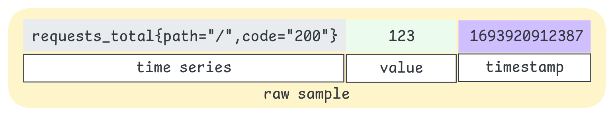
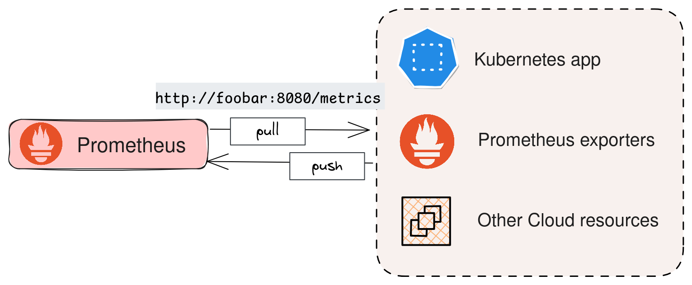
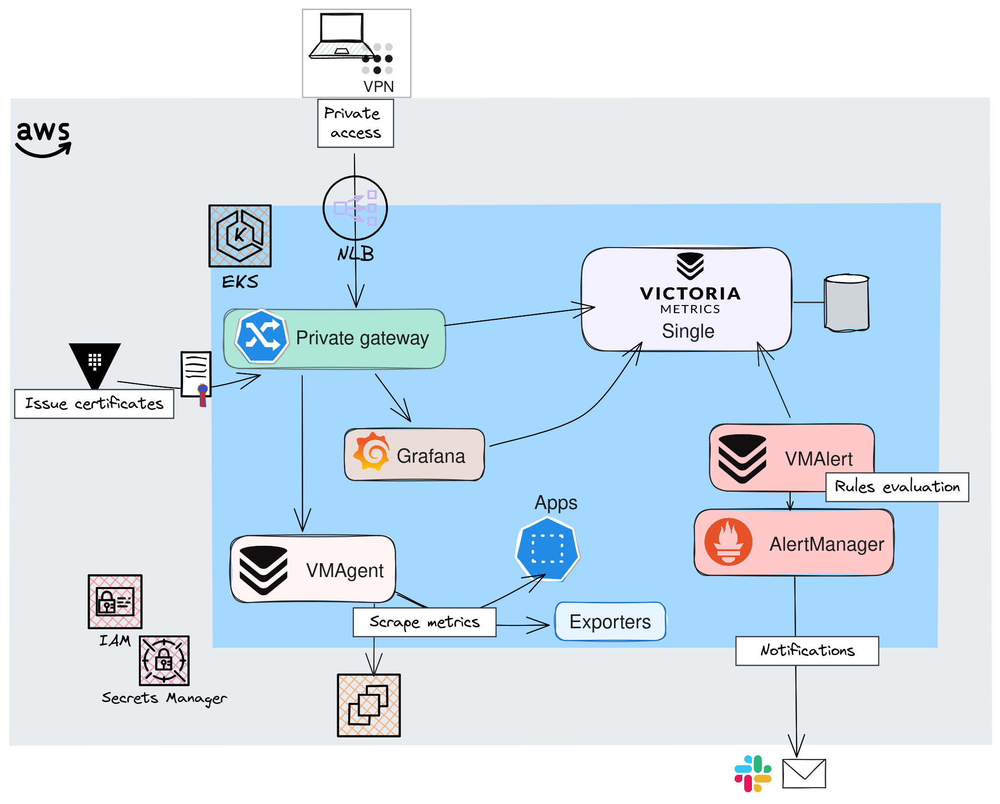
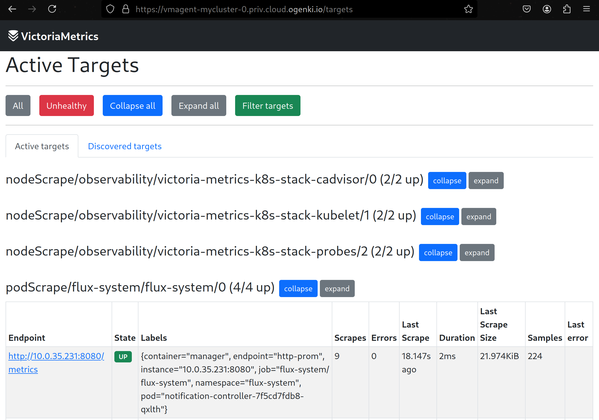
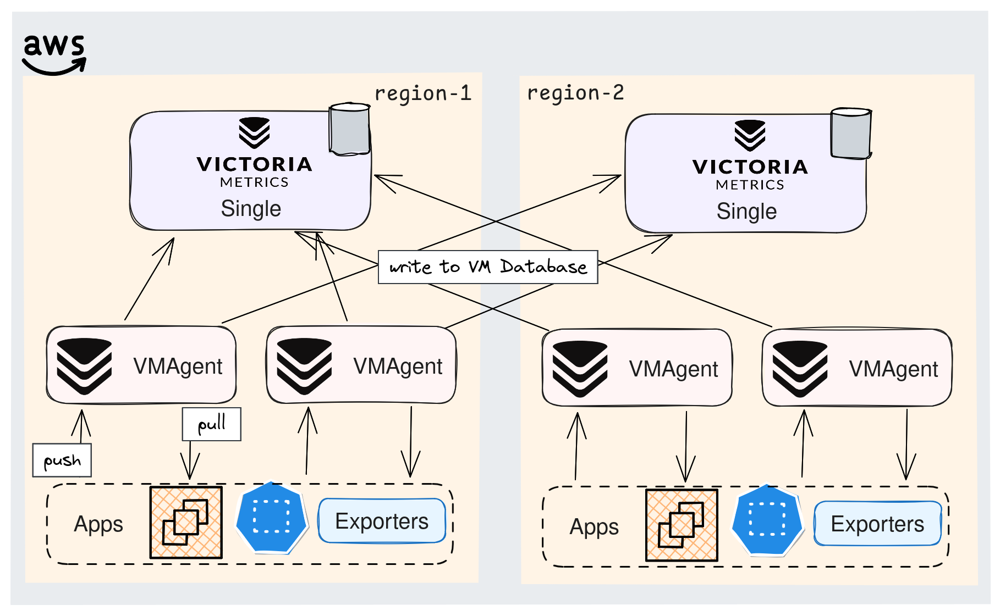
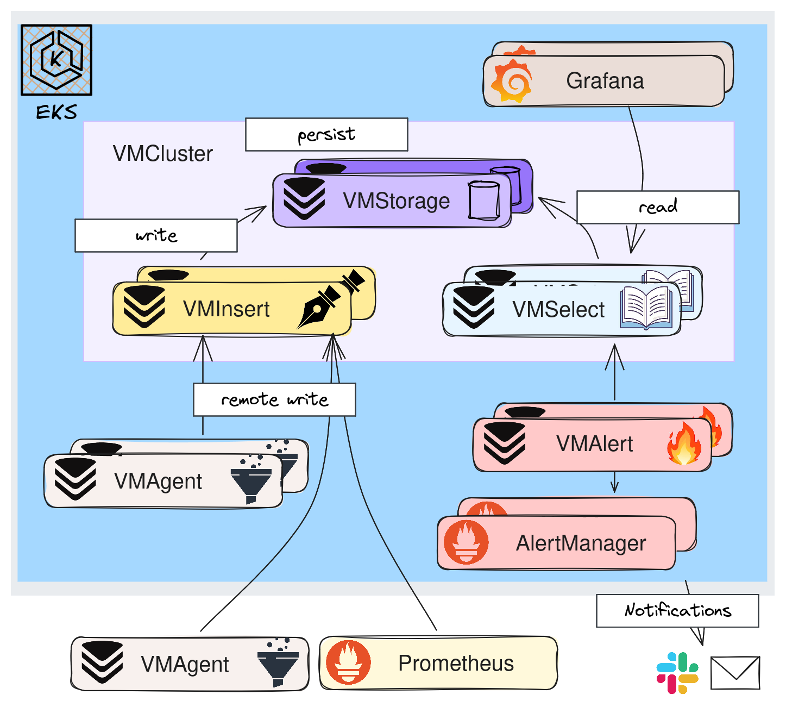

+++
author = "Smaine Kahlouch"
title = "Une solution complète et performante pour gérer vos métriques avec les opérateurs `VictoriaMetrics` et `Grafana`!"
date = "2024-09-11"
summary = "Il existe une multitude de solutions pour **collecter, stocker et visualiser des métriques**. La combinaison la plus courante repose souvent sur Prometheus et Grafana. Dans cet article, nous allons aller plus loin 🚀 en explorant une solution optimisée, performante et scalable basée sur VictoriaMetrics."
featured = false
codeMaxLines = 30
usePageBundles = true
toc = true
series = [
  "observability"
]
tags = [
    "observability"
]
thumbnail= "thumbnail.png"
+++

{}
Une fois que notre application est déployée, il est primordial de disposer d'indicateurs permettant d'identifier d'éventuels problèmes ainsi que suivre les évolutions de performance. Parmi ces éléments, les **métriques** et les **logs** jouent un rôle essentiel en fournissant des informations précieuses sur le fonctionnement de l'application. En complément, il est souvent utile de mettre en place un **tracing** détaillé pour suivre précisément toutes les actions réalisées par l'application.

Dans cette [série d'articles](https://blog.ogenki.io/fr/tags/observability/), nous allons explorer les différents aspects liés à la supervision applicative. L'objectif étant d'analyser en détail l'état de nos applications, afin d'améliorer leur **disponibilité** et leurs **performances**, tout en garantissant une expérience utilisateur optimale.
{}

Ce premier volet est consacré à **la collecte et la visualisation des métriques**. Nous allons déployer une solution performante et évolutive pour acheminer ces métriques vers un système de **stockage fiable et pérenne**. Puis nous allons voir comment les **visualiser** afin de les analyser.

## ❓ Qu'est ce qu'une métrique


### Definition

Avant de collecter cette dite "métrique", penchons-nous d'abord sur sa définition et ses spécificités: </br>
Une métrique est une donnée **mesurable** qui permet de suivre l'état et les performances d'une application. Ces données sont généralement des chiffres collectés à **intervals réguliers**, on peut citer par exemple le nombre de requêtes, la quantité de mémoire ou le taux d'erreurs.

Et quand on s'intéresse au domaine de la supervision, il est difficile de passer à coté de [Prometheus](https://prometheus.io/). Ce projet a notamment permis le l'émergence d'un **standard** qui définit la manière dont on expose des métriques appelé [**OpenMetrics**](https://github.com/OpenObservability/OpenMetrics/blob/main/specification/OpenMetrics.md) dont voici le format.

<center></center>

* **Time Series**: Une `time series` unique est la combinaison du nom de la métrique ainsi que ses labels, par conséquent `request_total{code="200"}` et `request_total{code="500"}` sont bien 2 _time series_ distinctes.

* **Labels**: On peut associer des `labels` à une métrique afin de la caractériser plus précisément. Ils sont ajoutées à la suite du nom de la métrique en utilisant des accolades. Bien qu'ils soient optionnels, nous les retrouverons très souvent, notamment dans sur un cluster Kubernetes (pod, namespace...).

* **Value**: La `value` représente une donnée numérique recueillie à un moment donné pour une time series spécifique. Selon le [**type de métrique**](https://prometheus.io/docs/concepts/metric_types/), il s'agit d'une valeur qui peut être mesurée ou comptée afin de suivre l'évolution d'un indicateur dans le temps.

* **Timestamp**: Indique **quand** la donnée a été collectée (format epoch à la milliseconde). S'il n'est pas présent, Il est ajouté au moment où la métrique est récupérée.

Cette ligne complète représente ce que l'on appelle un `raw sample`.

{}
Plus il y a de labels, plus les combinaisons possibles augmentent, et par conséquent, le nombre de timeseries. Le nombre total de combinaisons est appelé **cardinalité**. Une cardinalité élevée peut avoir un **impact significatif sur les performances**, notamment en termes de consommation de mémoire et de ressources de stockage.

Une cardinalité élevée se produit également lorsque de nouvelles métriques sont créées fréquemment. Ce phénomène, appelé **churn rate**, indique le rythme auquel des métriques apparaissent puis disparaissent dans un système. Dans le contexte de Kubernetes, où des pods sont régulièrement créés et supprimés, ce churn rate peut contribuer à l'augmentation rapide de la cardinalité.
{}

### La collecte en bref

Maintenant que l'on sait ce qu'est une métrique, voyons comment elles sont collectées. La plupart des solutions modernes exposent un endpoint qui permet de **"scraper" les métriques**, c'est-à-dire de les interroger **à intervalle régulier**. Par exemple, grâce au SDK Prometheus, disponible dans la plupart des langages de programmation, il est facile d'intégrer cette collecte dans nos applications.

Il est d'ailleurs important de souligner que Prometheus utilise, en règle générale, un modèle de collecte en mode "**Pull**", où le serveur interroge périodiquement les services pour récupérer les métriques via ces endpoints exposés. Cette approche permet de mieux contrôler la fréquence de collecte des données et d'éviter de surcharger les systèmes. On distinguera donc le mode "**Push**" où ce sont les applications qui envoient directement les informations.

Illustrons cela concrètement avec un serveur web Nginx. Ce serveur est installé à partir du chart Helm en activant le support de Prometheus. Ici le paramètre `metrics.enabled=true` permet d'ajouter un chemin qui expose les métriques.

```console
helm install ogenki-nginx bitnami/nginx --set metrics.enabled=true
```

Ainsi, nous pouvons par exemple récupérer via un simple appel http un nombre de métriques important
```console
kubectl port-forward svc/ogenki-nginx metrics &
Forwarding from 127.0.0.1:9113 -> 9113

curl -s localhost:9113/metrics
...
# TYPE promhttp_metric_handler_requests_total counter
promhttp_metric_handler_requests_total{code="200"} 257
...
```

La commande curl était juste un exemple, La collecte est, en effet réalisée par un système dont la responsabilité est de **stocker ces données** pour pouvoir ensuite les exploiter et les analyser. </br>

<center></center>

ℹ️ Quand on utilise Prometheus, un composant supplémentaire est nécessaire pour pouvoir pousser des métriques depuis les applications: [PushGateway](https://github.com/prometheus/pushgateway).

Dans cet article, j'ai choisi de vous faire découvrir `VictoriaMetrics`.

## ✨ VictoriaMetrics: Un héritier de Prometheus

Tout comme Prometheus, VictoriaMetrics est une **base de données Time Series** ([TSDB](https://en.wikipedia.org/wiki/Time_series_database)). Celles-cis sont conçues pour suivre et stocker des événements qui **évoluent au fil du temps**. Même si VictoriaMetrics est apparue quelques années après Prometheus, elles partagent pas mal de points communs : ce sont toutes deux des bases de données **open-source** sous licence Apache 2.0, dédiées au traitement des time series. VictoriaMetrics reste entièrement compatible avec Prometheus, en utilisant le même format de métriques, `OpenMetrics`, et un support total du langage de requêtes `PromQL`.

Ces deux projets sont d’ailleurs très actifs, avec des communautés dynamiques et des contributions régulières venant de nombreuses entreprises [comme on peut le voir ici](https://ossinsight.io/analyze/prometheus/prometheus?vs=VictoriaMetrics%2FVictoriaMetrics#overview).

Explorons maintenant les principales différences et les raisons qui pourraient pousser à choisir VictoriaMetrics :

* **Stockage et compression efficace** : C'est probablement l'un des arguments majeurs, surtout quand on gère un volume important de données ou qu'on souhaite les conserver à long terme. Avec Prometheus, il faut ajouter un composant supplémentaire, comme [Thanos](https://thanos.io/), pour cela. VictoriaMetrics, en revanche, dispose d'un **moteur de stockage optimisé** qui regroupe et optimise les données avant de les écrire sur disque. De plus, il utilise des **algorithmes de compression très puissants**, offrant une utilisation de l'espace disque bien plus efficace que Prometheus.

* **Empreinte mémoire** : VictoriaMetrics consommerait jusqu'à 7 fois moins de mémoire qu'une solution basée sur Prometheus. Cela dit, les benchmarks disponibles en ligne commencent à dater, et Prometheus a bénéficié de [nombreuses optimisations de mémoire](https://thenewstack.io/30-pull-requests-later-prometheus-memory-use-is-cut-in-half/).

* **MetricsQL** : VictoriaMetrics étend le langage PromQL avec de nouvelles fonctions. Ce language est aussi conçu pour être plus performant, notamment sur un large dataset.

* **Architecture modulaire**: VictoriaMetrics peut être déployé en 2 modes: "Single" ou "Cluster". Selon le besoin on pourra aller bien plus loin: On verra cela dans la suite de l'article.

* **Et bien d'autres...**: Les arguments ci-dessus sont ceux que j'ai retenu mais il y en a d'autres. VictoriaMetrics peut aussi être utilisé en mode **Push**, configuré pour du **multitenant** et d'autres fonctions que l'on retrouvera dans la [**version entreprise**](https://docs.victoriametrics.com/enterprise/#victoriametrics-enterprise-features).

{}
Sur le site de VictoriaMetrics, on trouve de nombreux [témoignages et retours d'expérience](https://docs.victoriametrics.com/casestudies/) d'entreprises ayant migré depuis d'autres systèmes (comme Thanos, InfluxDB, etc.). Certains exemples sont particulièrement instructifs, notamment ceux de [Roblox](https://www.datanami.com/2023/05/30/why-roblox-picked-victoriametrics-for-observability-data-overhaul/), [Razorpay](https://engineering.razorpay.com/scaling-to-trillions-of-metric-data-points-f569a5b654f2) ou [Criteo](https://techblog.criteo.com/victoriametrics-a-prometheus-remote-storage-solution-57081a3d8e61), qui gèrent un volume très important de métriques.
{}


## 🔎 Une architecture modulaire et scalable

{}
<table>
  <tr>
        <td>
          
        </td>
        <td style="vertical-align:middle; padding-left:10px;" width="70%">

Le reste de cet article est issu d'un ensemble de configurations que vous pouvez retrouver dans le repository <strong><a href="https://github.com/Smana/cloud-native-ref">Cloud Native Ref</a></strong>.</br>
Il y est fait usage de nombreux opérateurs et notamment ceux pour [VictoriaMetrics](https://github.com/VictoriaMetrics/operator) et pour [Grafana](https://github.com/grafana/grafana-operator).

L'ambition de ce projet est de pouvoir <strong>démarrer rapidement une plateforme complète</strong> qui applique les bonnes pratiques en terme d'automatisation, de supervision, de sécurité etc. </br>
Les commentaires et contributions sont les bienvenues 🙏
        </td>
  </tr>
</table>
{}

`VictoriaMetrics` peut être déployé de différentes manières: Le mode par défaut est appelé `Single` et, comme son nom l'indique, il s'agit de déployer une **instance unique** qui gère la lecture, l'écriture et le stockage. Il est d'ailleurs recommandé de commencer par celui-ci car il est **optimisé** et répond à la plupart des cas d'usage comme le précise [ce paragraphe](https://docs.victoriametrics.com/#capacity-planning).

### Le mode Single

La méthode de déploiement choisie dans cet article fait usage du chart Helm [**victoria-metrics-k8s-stack**](https://github.com/VictoriaMetrics/helm-charts/tree/master/charts/victoria-metrics-k8s-stack) qui configure de nombreuses ressources (VictoriaMetrics, Grafana, Alertmanager, quelques dashboards...). Voici un extrait de configuration [Flux](https://fluxcd.io/) pour un mode `Single`

[observability/base/victoria-metrics-k8s-stack/helmrelease-vmsingle.yaml](https://github.com/Smana/cloud-native-ref/blob/main/observability/base/victoria-metrics-k8s-stack/helmrelease-vmsingle.yaml)

```yaml
apiVersion: helm.toolkit.fluxcd.io/v2
kind: HelmRelease
metadata:
  name: victoria-metrics-k8s-stack
  namespace: observability
spec:
  releaseName: victoria-metrics-k8s-stack
  chart:
    spec:
      chart: victoria-metrics-k8s-stack
      sourceRef:
        kind: HelmRepository
        name: victoria-metrics
        namespace: observability
      version: "0.25.15"
...
  values:
    vmsingle:
      spec:
        retentionPeriod: "1d" # Minimal retention, for tests only
        replicaCount: 1
        storage:
          accessModes:
            - ReadWriteOnce
          resources:
            requests:
              storage: 10Gi
        extraArgs:
          maxLabelsPerTimeseries: "50"
```

Lorsque l'ensemble des manifests Kubernetes sont appliqués, on obtient l'architecture suivante:

<center></center>

* 🔒 **Accès privé**: Même si cela ne fait pas vraiment partie des composants liés à la collecte des métriques, j'ai souhaité mettre en avant la façon dont on accède aux différentes interfaces. J'ai en effet choisi de capitaliser sur [**Gateway API**](https://gateway-api.sigs.k8s.io/), que j'utilise depuis quelques temps et qui a fait l'objet de [précédents articles](https://blog.ogenki.io/tags/security/). Une alternative serait d'utiliser un composant de VictoriaMetrics, [VMAuth](https://docs.victoriametrics.com/vmauth/?highlight=vmauth), qui peut servir de proxy pour l'autorisation et le routage des accès mais Je n'ai pas retenu cette option pour le moment.


* 👷 **VMAgent**: Un agent très léger, dont la fonction principale est de **récupérer les métriques** et de les acheminer vers une base de données compatible avec Prometheus.  Par ailleurs, cet agent peut appliquer **des filtres ou des transformations** aux métriques avant de les transmettre. En cas d'indisponibilité de la destination ou en cas de manque de ressources, il peut mettre en cache les données sur disque.
VMAgent dispose aussi d'une interface Web permettant de lister les "Targets" (Services qui sont scrapés)

<center></center>


* 🔥 **VMAlert** & **VMAlertManager**: Ce sont les composants chargés de notifier en cas de problèmes, d'anomalies. Je ne vais volontairement pas approfondir le sujet car cela fera l'objet d'un **future acticle**.


* ⚙️ **VMsingle**: Il s'agit de la base de données VictoriaMetrics déployée sous forme d'un pod unique qui prend en charge l'ensemble des opérations (lecture, écriture et persistence des données).

Lorsque tous les pods sont démarrés, on peut accéder à l'interface principale de VictoriaMetrics: `VMUI`. Elle permet de visualiser un grand nombre d'informations: Évidemment nous pourrons parcourir les métriques scrapées, les requêtes les plus utilisées, les statistiques relatives à la cardinalité et [bien d'autres](https://docs.victoriametrics.com/#vmui).

<center>
  <video id="VMUI" controls height="800" autoplay loop muted>
    <source src="vmui.webm" type="video/webm">
    Your browser does not support the video tag.
  </video>
</center>

<script>
  var video = document.getElementById('VMUI');
  video.playbackRate = 1.8;
</script>


### La Haute disponibilité

Pour ne jamais perdre de vue ce qui se passe sur nos applications, la solution de supervision doit toujours rester opérationnelle. Pour cela, tous les composants de VictoriaMetrics peuvent être configurés en haute disponibilité. En fonction du niveau de redondance souhaité, plusieurs options s'offrent à nous.

La plus simple est d'envoyer les données à **deux instances** `Single`, les données sont ainsi dupliquées à 2 endroits. De plus, on peut envisager de déployer ces instances dans deux régions différentes.

Il est aussi recommandé de **redonder les agents** VMAgent qui vont scraper les mêmes services, afin de s'assurer qu'aucune donnée ne soit perdue.

{}
Dans une telle architecture, étant donné que plusieurs VMAgents envoient des données et scrappent les mêmes services, on se retrouve avec des métriques en **double**. La [De-duplication](https://docs.victoriametrics.com/#deduplication) dans VictoriaMetrics permet de ne **conserver qu'une seule version** lorsque deux raw samples sont identiques. </br>
Un paramètre mérite une attention particulière : `-dedup.minScrapeInterval`:  Seule la version la **plus récente** sera conservée lorsque raw samples identiques sont trouvés dans cet intervale de temps.

Il est aussi recommandé de :

* Configurer ce paramètre avec une valeur égale au `scrape_interval` que l'on définit dans la configuration Prometheus.
* Garder une valeur de `scrape_interval` identique pour tous les services scrappés.
{}

Le schéma ci-dessous montre l'une des nombreuses combinaisons possibles pour assurer une disponibilité optimale. </br>
⚠️ Cependant, il faut tenir compte du **surcoût**, non seulement pour le stockage et le calcul, mais aussi pour les transferts réseau entre zones/régions. Il est parfois plus judicieux d'avoir une bonne stratégie de **sauvegarde et restauration** 😅.

<center></center>


### Le mode Cluster

Comme mentionné plus tôt, dans la plupart des cas, le mode `Single` est largement suffisant. Il a l'avantage d'être simple à maintenir et, avec du scaling vertical, il permet de répondre à **quasiment tous les cas d'usage**. Il existe aussi un mode Cluster, qui n'est pertinent que dans deux cas précis :

* Besoin de [multitenant](https://docs.victoriametrics.com/cluster-victoriametrics/#multitenancy). Par exemple pour isoler plusieurs équipes ou clients.
* Si les limites du scaling vertical sont atteintes.

Ma configuration permet de choisir entre l'un ou l'autre des modes:

[observability/base/victoria-metrics-k8s-stack/kustomization.yaml](https://github.com/Smana/cloud-native-ref/blob/main/observability/base/victoria-metrics-k8s-stack/kustomization.yaml)

```yaml
resources:
...

  - vm-common-helm-values-configmap.yaml
  # Choose between single or cluster helm release

  # VM Single
  - helmrelease-vmsingle.yaml
  - httproute-vmsingle.yaml

  # VM Cluster
  # - helmrelease-vmcluster.yaml
  # - httproute-vmcluster.yaml
```

<center></center>


Dans ce mode, on va **séparer les fonctions de lecture, écriture et de stockage** en 3 services bien distincts.

* ✏️ **VMInsert**: Répartit les données sur les instances de VMStorage en utilisant du [consistent hashing](https://en.wikipedia.org/wiki/Consistent_hashing) basé sur la time series (combinaison du nom de la métrique et de ses labels).

* 💾 **VMStorage**: Est chargé d'écrire les données sur disque et de retourner les données demandées par VMSelect.

* 📖 **VMSelect**: Pour chaque requête va récupérer les données sur les VMStorages.

L'intérêt principal de ce mode est évidemment de pouvoir adapter le **scaling** en fonction du besoin. Par exemple, si on a besoin de plus de capacité en écriture on va ajouter des replicas VMInsert.

Le paramètre initial, qui permet d'avoir un niveau de redondance minimum est `replicationFactor` à `2`. Voici un extrait des _values_ Helm pour le mode cluster.

[observability/base/victoria-metrics-k8s-stack/helmrelease-vmcluster.yaml](https://github.com/Smana/cloud-native-ref/blob/main/observability/base/victoria-metrics-k8s-stack/helmrelease-vmcluster.yaml)

```yaml
    vmcluster:
      enabled: true
      spec:
        retentionPeriod: "10d"
        replicationFactor: 2
        vmstorage:
          storage:
            volumeClaimTemplate:
              storageClassName: "gp3"
              spec:
                resources:
                  requests:
                    storage: 10Gi
          resources:
            limits:
              cpu: "1"
              memory: 1500Mi
          affinity:
            podAntiAffinity:
              requiredDuringSchedulingIgnoredDuringExecution:
                - labelSelector:
                    matchExpressions:
                      - key: "app.kubernetes.io/name"
                        operator: In
                        values:
                          - "vmstorage"
                  topologyKey: "kubernetes.io/hostname"
          topologySpreadConstraints:
            - labelSelector:
                matchLabels:
                  app.kubernetes.io/name: vmstorage
              maxSkew: 1
              topologyKey: topology.kubernetes.io/zone
              whenUnsatisfiable: ScheduleAnyway
        vmselect:
          storage:
            volumeClaimTemplate:
              storageClassName: "gp3"
```

:information_source: On notera que certains paramètres font partie des bonnes pratiques Kubernetes, notamment lorsque l'on utilise [Karpenter](https://karpenter.sh/): `topologySpreadConstraints` permet de répartir sur différentes zones, `podAntiAffinity` pour éviter que 2 pods pour le même service se retrouvent sur le même noeud.

## 🛠️ La configuration

Ok, c'est cool, VictoriaMetrics est maintenant déployé 👏. Il est temps de **configurer** la supervision de nos applications, et pour ça, on va s'appuyer sur le pattern opérateur de Kubernetes.
Concrètement, cela signifie que l'on va déclarer des ressources personnalisées ([Custom Resources](https://kubernetes.io/docs/concepts/extend-kubernetes/api-extension/custom-resources/)) qui seront interprétées par [**VictoriaMetrics Operator**](https://github.com/VictoriaMetrics/operator) pour configurer et gérer VictoriaMetrics.

Le Helm chart qu’on a utilisé ne déploie pas directement VictoriaMetrics, mais il installe principalement l’opérateur. Cet opérateur se charge ensuite de créer et de gérer des custom resources comme `VMSingle` ou `VMCluster`, qui déterminent comment VictoriaMetrics est déployé et configuré en fonction des besoins.

Le rôle de `VMServiceScrape` est de définir **où aller chercher les métriques** pour un service donné. On s’appuie sur les labels Kubernetes pour identifier le bon service et le bon port.

[observability/base/victoria-metrics-k8s-stack/vmservicecrapes/karpenter.yaml](https://github.com/Smana/cloud-native-ref/blob/main/observability/base/victoria-metrics-k8s-stack/vmservicecrapes/karpenter.yaml)

```yaml
apiVersion: operator.victoriametrics.com/v1beta1
kind: VMServiceScrape
metadata:
  name: karpenter
  namespace: karpenter
spec:
  selector:
    matchLabels:
      app.kubernetes.io/name: karpenter
  endpoints:
    - port: http-metrics
      path: /metrics
  namespaceSelector:
    matchNames:
      - karpenter
```

Nous pouvons vérifier que les paramètres sont bien configurés grâce à `kubectl`
```console
kubectl get services -n karpenter --selector app.kubernetes.io/name=karpenter -o yaml | grep -A 4 ports
    ports:
    - name: http-metrics
      port: 8000
      protocol: TCP
      targetPort: http-metrics
```

Parfois il n'y pas de service, nous pouvons alors indiquer comment identifier les pods directement avec `VMPodScrape`.

[observability/base/flux-config/observability/vmpodscrape.yaml](https://github.com/Smana/cloud-native-ref/blob/main/observability/base/flux-config/observability/vmpodscrape.yaml)
```yaml
apiVersion: operator.victoriametrics.com/v1beta1
kind: VMPodScrape
metadata:
  name: flux-system
  namespace: flux-system
spec:
  namespaceSelector:
    matchNames:
      - flux-system
  selector:
    matchExpressions:
      - key: app
        operator: In
        values:
          - helm-controller
          - source-controller
          - kustomize-controller
          - notification-controller
          - image-automation-controller
          - image-reflector-controller
  podMetricsEndpoints:
    - targetPort: http-prom
```

Toutes nos applications ne sont pas forcément déployées sur Kubernetes. La ressource `VMScrapeConfig` dans VictoriaMetrics permet d'utiliser plusieurs méthodes de "[Service Discovery](https://docs.victoriametrics.com/sd_configs/index.html)". Cette ressource offre la flexibilité de définir comment scrapper les cibles via différents mécanismes de découverte, tels que les instances EC2 (AWS), les services Cloud ou d'autres systèmes. Dans l'exemple ci-dessous, on utilise le tag personnalisé `observability:node-exporter`, et on applique des transformations de labels. Ce qui nous permet de récupérer les métriques exposées par les [node-exporters](https://github.com/prometheus/node_exporter) installés sur ces instances.

[observability/base/victoria-metrics-k8s-stack/vmscrapeconfigs/ec2.yaml](https://github.com/Smana/cloud-native-ref/blob/main/observability/base/victoria-metrics-k8s-stack/vmscrapeconfigs/ec2.yaml)
```yaml
apiVersion: operator.victoriametrics.com/v1beta1
kind: VMScrapeConfig
metadata:
  name: aws-ec2-node-exporter
  namespace: observability
spec:
  ec2SDConfigs:
    - region: ${region}
      port: 9100
      filters:
        - name: tag:observability:node-exporter
          values: ["true"]
  relabelConfigs:
    - action: replace
      source_labels: [__meta_ec2_tag_Name]
      target_label: ec2_name
    - action: replace
      source_labels: [__meta_ec2_tag_app]
      target_label: ec2_application
    - action: replace
      source_labels: [__meta_ec2_availability_zone]
      target_label: ec2_az
    - action: replace
      source_labels: [__meta_ec2_instance_id]
      target_label: ec2_id
    - action: replace
      source_labels: [__meta_ec2_region]
      target_label: ec2_region
```

ℹ️ Si on utilisait déjà le Prometheus Operator, la migration vers VictoriaMetrics est très simple car il est **compatible** avec les CRDs définies par le Prometheus Operator.

## 📈 Visualiser nos métriques avec l'opérateur Grafana

Il est facile de deviner à quoi sert le Grafana Operator: Utiliser des ressources Kubernetes pour configurer Grafana 😝. Il permet de déployer des instances Grafana, d'ajouter des datasources, d'importer des dashboards de différentes à partir de différentes sources (URL, JSON), de les classer dans des répertoires etc... </br>
Il s'agit d'une alternative au fait de tout définir dans le chart Helm ou d'utiliser des configmaps et, selon moi, offre une meilleure lecture. Dans cet exemple, je regroupe l'ensemble des ressources relatives à la supervision de Cilium

```bash
tree  infrastructure/base/cilium/
infrastructure/base/cilium/
├── grafana-dashboards.yaml
├── grafana-folder.yaml
├── httproute-hubble-ui.yaml
├── kustomization.yaml
├── vmrules.yaml
└── vmservicescrapes.yaml
```

La définition du répertoire est super simple

[observability/base/infrastructure/cilium/grafana-folder.yaml](https://github.com/Smana/cloud-native-ref/blob/main/observability/base/infrastructure/cilium/grafana-folder.yaml)
```yaml
apiVersion: grafana.integreatly.org/v1beta1
kind: GrafanaFolder
metadata:
  name: cilium
spec:
  allowCrossNamespaceImport: true
  instanceSelector:
    matchLabels:
      dashboards: "grafana"
```

Puis voici une ressource `Dashboard` qui va chercher la configuration à partir d'un lien HTTP. Nous pouvons aussi utiliser les dashboards disponibles depuis le [site de Grafana](https://grafana.com/grafana/dashboards/), en indiquant l'ID approprié ou carrément mettre la définition au format JSON.

[observability/base/infrastructure/cilium/grafana-dashboards.yaml](https://github.com/Smana/cloud-native-ref/blob/main/observability/base/infrastructure/cilium/grafana-dashboards.yaml)
```yaml
apiVersion: grafana.integreatly.org/v1beta1
kind: GrafanaDashboard
metadata:
  name: cilium-cilium
spec:
  folderRef: "cilium"
  allowCrossNamespaceImport: true
  datasources:
    - inputName: "DS_PROMETHEUS"
      datasourceName: "VictoriaMetrics"
  instanceSelector:
    matchLabels:
      dashboards: "grafana"
  url: "https://raw.githubusercontent.com/cilium/cilium/main/install/kubernetes/cilium/files/cilium-agent/dashboards/cilium-dashboard.json"
```

Notez que j'ai choisi de **ne pas utiliser l'opérateur Grafana pour déployer l'instance**, mais de garder celle qui a été installée via le Helm chart de VictoriaMetrics. Il faut donc simplement fournir à l'opérateur Grafana les **paramètres d'authentification** pour qu'il puisse appliquer les modifications sur cette instance.

[observability/base/grafana-operator/grafana-victoriametrics.yaml](https://github.com/Smana/cloud-native-ref/blob/main/observability/base/grafana-operator/grafana-victoriametrics.yaml)
```yaml
apiVersion: grafana.integreatly.org/v1beta1
kind: Grafana
metadata:
  name: grafana-victoriametrics
  labels:
    dashboards: "grafana"
spec:
  external:
    url: http://victoria-metrics-k8s-stack-grafana
    adminPassword:
      name: victoria-metrics-k8s-stack-grafana-admin
      key: admin-password
    adminUser:
      name: victoria-metrics-k8s-stack-grafana-admin
      key: admin-user
```

Enfin nous pouvons utiliser Grafana et explorer nos différents dashboards 🎉!

<center>
  <video id="Grafana" controls height="800" autoplay loop muted>
    <source src="grafana.webm" type="video/webm">
    Your browser does not support the video tag.
  </video>
</center>

<script>
  var video = document.getElementById('Grafana');
  video.playbackRate = 1.3;
</script>


## 💭 Dernières remarques

Si l'on se réfère aux différents articles consultés, l'une des principales raisons pour lesquelles migrer ou choisir VictoriaMetrics serait une **meilleure performance** en règle générale. Cependant il est judicieux de rester prudent car les résultats des benchmarks dépendent de plusieurs facteurs, ainsi que de l'objectif recherché. C'est pourquoi il est fortement conseillé de lancer des tests soit même. VictoriaMetrics propose un [jeu de test](https://github.com/VictoriaMetrics/prometheus-benchmark) qui peut être réalisé sur les TSDB compatibles avec Prometheus.

Vous l'aurez compris, aujourd'hui mon choix se porte sur VictoriaMetrics pour la collecte des métriques, car j'apprécie l'architecture modulaire avec une multitude de combinaisons possibles en fonction de l'**évolution du besoin**. Cependant, une solution utilisant l'opérateur Prometheus fonctionne très bien dans la plupart des cas et a l'intérêt d'être gouverné par une fondation.

Par aileurs, il est important de noter que certaines fonctionnalités ne sont disponibles qu'en [**version Entreprise**](https://docs.victoriametrics.com/enterprise/), notamment le downsampling qui est fort utile lorsque l'on veut garder une grosse quantité de données sur du long terme.

Dans cet article nous avons surtout pu mettre en évidence la **facilité de mise en oeuvre** pour obtenir une solution qui permette, d'une part de collecter efficacement les métriques, et de les visualiser. Ceci, toujours en utilisant le pattern operateur Kubernetes qui permet de faire du GitOps, et de déclarer les différents types de ressources au travers de Custom resources. Ainsi Un développeur peut très bien inclure à ses manifests, un `VMServiceScrape` et une `VMRule` et, ainsi, inclure la culture de l'observabilité dans les processes de livraisons applicative.

Disposer de métriques c'est bien bien, mais est-ce suffisant? On va essayer d'y répondre dans les prochains articles ...


## 🔖 References

* [Articles sur VictoriaMetrics](https://docs.victoriametrics.com/articles/)
