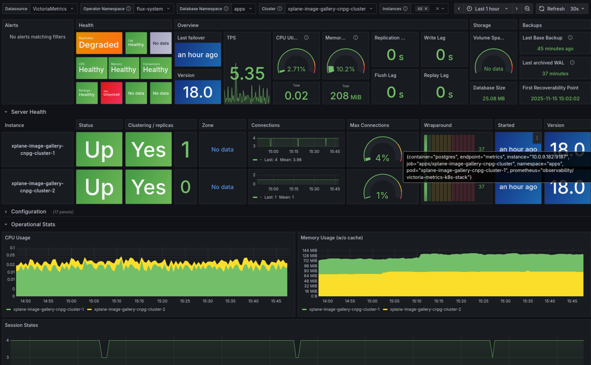
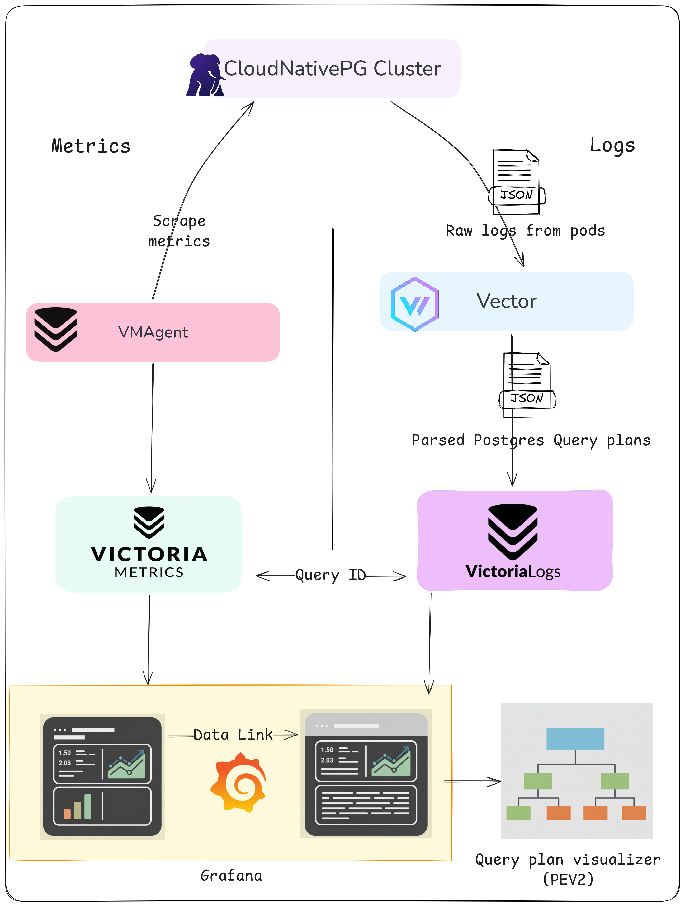
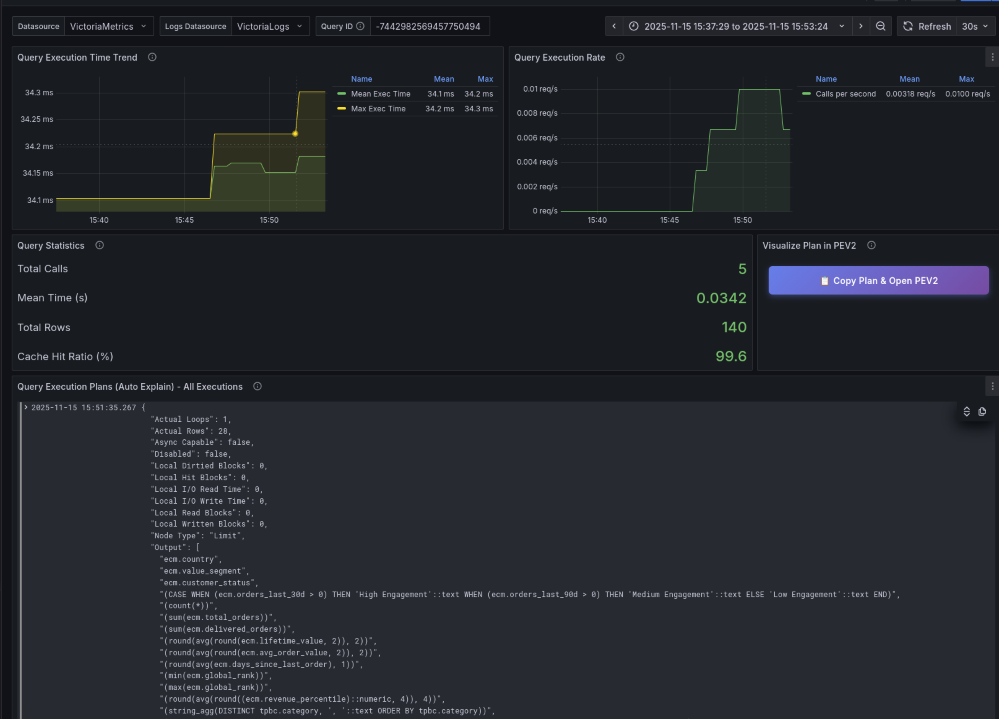

+++
author = "Smaine Kahlouch"
title = "`PostgreSQL`: Des Métriques à l'Analyse des Plans de Requêtes"
date = "2025-11-15"
summary = "**CloudNativePG** offre un monitoring PostgreSQL relativement complet dès l'installation, voyons comment l'améliorer grâce à l'analyse des requêtes SQL et l'**historique des plans d'exécution**."
featured = true
codeMaxLines = 25
usePageBundles = true
toc = true
series = [
  "observability"
]
tags = [
    "observability",
    "data"
]
thumbnail= "thumbnail.png"
+++

Avoir un minimum d'observabilité lorsqu'on a du PostgreSQL en production n'est pas optionnel. Que ce soit pour suivre les [Golden Signals](https://blog.ogenki.io/post/series/observability/alerts/#-the-golden-signals), analyser les requêtes lentes ou les patterns de connexion. Cela nécessite souvent de jongler avec plusieurs outils, configurer divers _exporters_ et extraire manuellement les requêtes pour les analyser.

❓ Et si nous pouvions obtenir **un niveau de supervision complet pour la production avec un minimum de configuration**?

Dans cet article, nous allons explorer comment aller plus loin en ajoutant à une supervision déjà bien fournie par CloudNativePG, une capacité d'analyse des performances de requêtes simple, efficace et facile à utiliser grâce à la puissance des outils que nous avons à disposition: Vector, VictoriaMetrics et VictoriaLogs.

## 📊 Fourni avec CloudNativePG

Lorsque vous déployez un cluster PostgreSQL avec CNPG, une **multitude de métriques ainsi que des dashboards Grafana** très complets sont mis à disposition. L'opérateur expose des métriques via un endpoint dédié sur chaque instance PostgreSQL avec les informations suivantes :

* **Opérations de Base de Données** : Taux de transactions, requêtes par seconde, statistiques des tuples
* **État de Réplication** : Lag, état du streaming, métriques de synchronisation
* **Utilisation des Ressources** : Connexions, taux de hit du cache, statistiques des buffers
* **Santé du Système** : État des instances, événements de failover, états des sauvegardes

{}
<table>
  <tr>
        <td>
          
        </td>
        <td style="vertical-align:middle; padding-left:10px;" width="70%">

Les exemples de cet article proviennent de configurations disponibles dans le dépôt <strong><a href="https://github.com/Smana/cloud-native-ref">Cloud Native Ref</a></strong>.</br>
Il exploite plusieurs opérateurs, notamment [CloudNativePG](https://cloudnative-pg.io/) pour la gestion PostgreSQL, [VictoriaMetrics](https://victoriametrics.com/) pour la collecte de métriques et [VictoriaLogs](https://github.com/VictoriaMetrics/VictoriaLogs) pour la collecte de logs.


Ce projet vise à <strong>démarrer rapidement une plateforme complète</strong> qui suit les meilleures pratiques en termes d'automatisation, de monitoring, de sécurité et plus encore. </br>
Les commentaires et contributions sont les bienvenus 🙏
        </td>
  </tr>
</table>
{}

### Collecter les Métriques avec VictoriaMetrics

CloudNativePG expose automatiquement des métriques sur chaque pod PostgreSQL. Pour activer leur collecte, il suffit de configurer le Helm chart comme suit :

```yaml
# CloudNativePG Helm chart
monitoring:
  podMonitorEnabled: true
```

Cette simple configuration crée un `PodMonitor` (ressource Prometheus Operator) qui est automatiquement converti par l'opérateur VictoriaMetrics en ressource native compatible. Les métriques de tous les pods PostgreSQL (primary et replicas) sont ainsi collectées et disponibles dans VictoriaMetrics.

{}
L'opérateur VictoriaMetrics convertit automatiquement les ressources Prometheus Operator (`PodMonitor`, `ServiceMonitor`, etc.) en leurs équivalents VictoriaMetrics. Cette conversion transparente permet d'utiliser CloudNativePG sans modification, tout en bénéficiant de VictoriaMetrics comme backend de stockage.
{}

### Métriques Essentielles à Surveiller

CloudNativePG expose des métriques qui s'alignent parfaitement avec la méthodologie des [Golden Signals](https://blog.ogenki.io/fr/post/series/observability/alerts/#-les-golden-signals) que nous avons abordée dans les articles précédents :

**Latence** ⏳
```promql
# Durée moyenne des requêtes
rate(cnpg_backends_total_seconds_sum[5m]) / rate(cnpg_backends_total_seconds_count[5m])
```

**Trafic** 📶
```promql
# Transactions par seconde
rate(pg_stat_database_xact_commit[5m]) + rate(pg_stat_database_xact_rollback[5m])
```

**Erreurs** ❌
```promql
# Échecs de connexion et deadlocks
rate(pg_stat_database_deadlocks[5m])
rate(cnpg_pg_postmaster_start_time_seconds[5m])
```

**Saturation** 📈
```promql
# Utilisation du pool de connexions
cnpg_backends_total / cnpg_pg_settings_max_connections

# Taux de hit du cache (devrait être > 95%)
sum(rate(pg_stat_database_blks_hit[5m])) /
  (sum(rate(pg_stat_database_blks_hit[5m])) + sum(rate(pg_stat_database_blks_read[5m])))
```

### Visualisation avec Grafana

En utilisant l'opérateur Grafana que nous avons exploré dans les [articles précédents](https://blog.ogenki.io/fr/post/series/observability/metrics/#-visualiser-les-m%C3%A9triques-avec-lop%C3%A9rateur-grafana), Nous pouvons déployer les dashboards CNPG de manière déclarative :

```yaml
apiVersion: grafana.integreatly.org/v1beta1
kind: GrafanaDashboard
metadata:
  name: databases-cloudnative-pg
spec:
  allowCrossNamespaceImport: true
  folderRef: "databases"
  datasources:
    - inputName: "DS_PROMETHEUS"
      datasourceName: "VictoriaMetrics"
  instanceSelector:
    matchLabels:
      dashboards: "grafana"
  url: "https://grafana.com/api/dashboards/20417/revisions/4/download"
```

Le dashboard fournit des vues complètes de nos clusters PostgreSQL, incluant le lag de réplication, les performances des requêtes et l'utilisation des ressources.

<center></center>


## 🔍 Comprendre les Performances des Requêtes

Les métriques nous donnent le "_quoi_" et le "_quand_". En revanche, elles ne nous disent pas toujours le "_pourquoi_". Savoir que les requêtes sont lentes est utile ; comprendre **pourquoi** elles sont lentes nous oriente souvent vers des axes d'optimisations.

L'analyse traditionnelle des requêtes PostgreSQL nécessite d'exécuter manuellement les commandes `EXPLAIN` et `EXPLAIN ANALYZE`. Cette approche a, cependant, ses limites :

* **Réactive** : Vous n'analysez que les requêtes que vous soupçonnez d'être problématiques
* **Manuelle** : Nécessite une investigation active par les DBAs
* **Ponctuelle** : Capture le plan d'exécution actuel, pas les tendances historiques
* **Incomplète** : Difficile de corréler avec les patterns de charge en production

Idéalement nous aurions besoin d'une **capture automatique et continue des plans de requêtes** qui nous permette de :

1. Identifier automatiquement les requêtes lentes
2. Suivre les changements de plans d'exécution dans le temps
3. Corréler les performances des requêtes avec les métriques système
4. Débugger les problèmes de performance sans avoir à les reproduire manuellement

Certaines solutions de supervision managées offrent celà. Mais peut-on s'approcher de cet objectif sur Kubernetes ?

## ✨ Historique des Plans de Requêtes : Implémentation avec des Outils Open Source

La bonne nouvelle, c'est que nous pouvons construire un système de suivi des performances de requêtes qui rivalise avec les offres commerciales avec un peu de configuration.

### L'Architecture

<center></center>

Notre solution exploite deux extensions PostgreSQL ainsi qu'un paramètre de configuration et les intègre avec l'écosystème VictoriaMetrics :

**Extensions PostgreSQL** :
* **pg_stat_statements** : Agrège les statistiques d'exécution des requêtes
* **auto_explain** : Capture automatiquement les plans d'exécution des requêtes lentes

**Configuration PostgreSQL** :
* **compute_query_id** : Paramètre qui génère des identifiants uniques pour la corrélation des requêtes

**Stack d'Observabilité** :
* **VictoriaMetrics** : Stocke les métriques de requêtes depuis `pg_stat_statements`
* **VictoriaLogs** : Stocke les plans d'exécution qui sont générés grâce à `auto_explain`
* **Vector** : Parse les logs PostgreSQL et extrait les plans d'exécution
* **Grafana** : Visualise les données de performance et permet l'exploration de l'historique des plans

Le lien essentiel entre tous ces éléments est la **corrélation entre métriques et logs utilisant l'identifiant de requête**. Cela nous permet de :
1. Voir qu'une requête est lente (depuis les métriques)
2. Cliquer pour voir son historique de plans d'exécution (depuis les logs)
3. Identifier les changements de plan qui ont causé des régressions de performance

J'ai appelé cette fonctionnalité "**Performance Insights**". Toute ressemblance avec une solution existante serait fortuite 😆.

### Activer Performance Insights

Grâce aux "[Managed Extensions](https://cloudnative-pg.io/documentation/1.27/postgresql_conf/#managed-extensions)" de CloudNativePG (disponible depuis la v1.23), activer la supervision complète des requêtes est hyper simple.

### 🏗️ Platform Engineering : Le Bon Niveau d'Abstraction

L'un des principes clés du _platform engineering_ est de fournir le bon niveau d'abstraction aux développeurs/ses. Ils/Elles ne devraient pas avoir besoin de comprendre les internals de PostgreSQL ni de mémoriser plus de 15 paramètres de configuration spécifiques à PostgreSQL.

C'est ici que les **compositions Crossplane** démontrent leur intérêt. Dans le projet Cloud Native Ref, nous utilisons Crossplane avec [KCL](https://www.kcl-lang.io/) (Kubernetes Configuration Language) pour créer une abstraction de plus haut niveau appelée `SQLInstance`.

**Sans Composition** (Cluster CNPG brut) :
```yaml
apiVersion: postgresql.cnpg.io/v1
kind: Cluster
metadata:
  name: myapp-postgres
spec:
  instances: 3
  postgresql:
    shared_preload_libraries:
      - pg_stat_statements
      - auto_explain
    parameters:
      pg_stat_statements.max: "10000"
      pg_stat_statements.track: all
      pg_stat_statements.track_utility: "on"
      pg_stat_statements.track_planning: "on"
      pg_stat_statements.save: "on"
      auto_explain.log_format: json
      auto_explain.log_min_duration: "1000"
      auto_explain.log_analyze: "on"
      auto_explain.log_buffers: "on"
      auto_explain.log_timing: "off"
      auto_explain.log_triggers: "on"
      auto_explain.log_verbose: "on"
      auto_explain.log_nested_statements: "on"
      auto_explain.sample_rate: "0.2"
      compute_query_id: on
      track_activity_query_size: 2048
      track_io_timing: "on"
      log_min_duration_statement: 1000
      # ... et plus encore
```

**Avec la Composition** et les paramètres que nous jugeons pertinents :
```yaml
apiVersion: cloud.ogenki.io/v1alpha1
kind: App
metadata:
  name: myapp
spec:
  sqlInstance:
    enabled: true
    size: small
    storageSize: 20Gi
    instances: 3
    performanceInsights:
      enabled: true
      explain:
        sampleRate: 0.2       # 20% sampling (default: safe for production)
        minDuration: 1000     # Log queries > 1 second (default)
      logStatement: none      # Optional: none (default) / ddl / mod / all
```

La [composition Crossplane](https://github.com/Smana/cloud-native-ref/tree/main/infrastructure/base/crossplane/configuration/kcl/cloudnativepg) **SQLInstance** gère toute la complexité.

Cette approche par composition offre plusieurs avantages :

1. **Expérience Développeur/ses** : Les développeurs/ses d'applications n'ont pas besoin d'expertise PostgreSQL
2. **Cohérence** : La collecte des données de performances est configuré uniformément sur toutes les bases de données
3. **Maintenabilité** : L'équipe plateforme contrôle la configuration de supervision de manière centralisée
4. **Évolutivité** : Facile de mettre à jour les paramètres pour toutes les instances
5. **Découvrabilité** : Les développeurs/ses peuvent parcourir les options disponibles (`performanceInsights: true`) plutôt que mémoriser les noms de paramètres

{}
Les meilleures abstractions **cachent la complexité sans limiter la puissance**. </br> Les développeurs/ses obtiennent des insights de performance avec quelques paramètres simples, tandis que l'équipe plateforme conserve la possibilité d'affiner la configuration PostgreSQL sous-jacente pour les cas d'usage avancés.
{}

### Comprendre la Configuration

Détaillons ce que fait chaque composant :

**pg_stat_statements** : Cette extension suit les statistiques d'exécution de toutes les instructions SQL exécutées par un serveur. Elle enregistre :
* Le temps d'exécution total et le nombre d'appels
* Les lignes traitées et retournées
* Les hits et lectures de buffer
* Le temps de planification des requêtes

**auto_explain** : Logge automatiquement les plans d'exécution des requêtes dépassant un seuil de durée. Les paramètres clés sont :
* `log_format: json` : Sortie structurée pour le parsing
* `log_min_duration: 1000` : Capturer les requêtes prenant plus d'1 seconde
* `log_analyze: on` : Inclure les comptages de lignes réels (exécute la requête)
* `sample_rate: 0.2` : Échantillonnage de 20% des requêtes lentes pour réduire l'overhead (défaut)

**compute_query_id** : La clé de corrélation qui lie tout ensemble. Cela génère un identifiant unique pour chaque requête qui apparaît à la fois dans les métriques pg_stat_statements et les logs auto_explain.

{}
Par défaut, la composition utilise des valeurs sûres pour la production :
- `sampleRate: 0.2` → 20% d'échantillonnage des requêtes lentes
- `minDuration: 1000ms` → Capture des requêtes prenant plus d'1 seconde

Pour le **debugging**, augmentez ces valeurs :
- `sampleRate: 1.0` → 100% des requêtes lentes
- `minDuration: 0` → Toutes les requêtes, même les plus rapides
{}

### Configuration du Pipeline de Logs Vector

Voici ce que Vector fait concrètement - **transformation d'un log PostgreSQL auto_explain en événement indexable** :

| **Log Brut (CloudNativePG)** | **Après Parsing Vector** |
|------------------------------|--------------------------|
| <pre lang="json" style="font-size: 0.75em;">{<br>  "timestamp": "2025-01-15T14:32:18.456Z",<br>  "message": "{\\"level\\":\\"info\\",<br>    \\"record\\":{\\"query_id\\":\\"8765432109876543210\\",<br>      \\"database_name\\":\\"production\\",<br>      \\"message\\":\\"duration: 245.678 ms plan:\\\\n{...}\\"<br>    }<br>  }",<br>  "kubernetes": {<br>    "pod_labels": {<br>      "cnpg.io/cluster": "myapp-postgres"<br>    }<br>  }<br>}</pre> | <pre lang="json" style="font-size: 0.75em;">{<br>  "_time": "2025-01-15T14:32:18.456Z",<br>  "cluster_name": "myapp-postgres",<br>  "namespace": "apps",<br>  "database": "production",<br>  "query_id": "8765432109876543210",<br>  "duration_ms": 245.678,<br>  "query_text": "SELECT users.email...",<br>  "plan_json": {<br>    "Node Type": "Hash Join",<br>    "..."<br>  }<br>}</pre> |

#### Pipeline en 3 Étapes

Le pipeline Vector se compose de **3 transforms** et **2 sinks** ([configuration complète](https://github.com/Smana/cloud-native-ref/blob/main/observability/base/victoria-logs/helmrelease-vlsingle.yaml#L62-L338)) :

**1. Parser les logs JSON CloudNativePG**
```vrl
if .kubernetes.container_name == "postgres" && exists(.kubernetes.pod_labels."cnpg.io/cluster") {
  .log = parse_json(.message)
}
```

**2. Filtrer les plans d'exécution**
```vrl
exists(.log.record.message) && contains(.log.record.message, "plan:")
```

**3. Extraire les métadonnées et le plan**
```vrl
.query_id = to_string!(.log.record.query_id)  # Clé de corrélation
.cluster_name = .kubernetes.pod_labels."cnpg.io/cluster"
.database = .log.record.database_name
# Parser le JSON du plan depuis "duration: X ms plan: {...}"
.plan_json = parse_json(split(.log.record.message, "plan:")[1])
```

Les événements parsés sont envoyés vers deux sinks :
* **Plans réussis** → VictoriaLogs avec indexation sur `cluster_name,namespace,database,query_id`
* **Échecs de parsing** → Flux séparé pour debugging

#### La Clé : Corrélation via query_id

L'élément critique est **query_id** qui apparaît dans les deux systèmes :
* **VictoriaMetrics** : `pg_stat_statements{queryid="8765432109876543210"}` (métriques)
* **VictoriaLogs** : `{query_id="8765432109876543210"}` (plans)

Cette corrélation permet de sauter instantanément d'une métrique de performance à l'historique des plans d'exécution.

## 🔬 Analyser les Performances des Requêtes en Action

Une fois qu'on a identifié une requête problématique, nous pouvons voir son historique de plans d'exécution dans VictoriaLogs. En utilisant le `query_id` de `pg_stat_statements`, nous pouvons interroger **VictoriaLogs** :

```logsql
# Trouver tous les plans d'exécution pour une requête spécifique
{cluster_name="myapp-postgres", query_id="1234567890"} | limit 50
```

Cela nous montre :
* Tous les plans d'exécution capturés pour cette requête dans le temps
* Les variations de plan (ex : index scans vs. sequential scans)
* Les comptages de lignes réels et temps d'exécution
* L'utilisation des buffers et statistiques I/O

### Comprendre la Sortie d'EXPLAIN

Quand auto_explain capture un plan, il fournit des informations détaillées :

```json
{
  "Query Text": "SELECT * FROM users WHERE email = ?",
  "Query Identifier": 1234567890,
  "Duration": 1567.234,
  "Plan": {
    "Node Type": "Seq Scan",
    "Relation Name": "users",
    "Actual Rows": 1,
    "Actual Loops": 1,
    "Actual Total Time": 1567.123,
    "Shared Hit Blocks": 0,
    "Shared Read Blocks": 54321
  }
}
```

Points clés de ce plan :
* **Sequential Scan** : Scan de toute la table au lieu d'utiliser un index
* **Lectures de blocs élevées** : 54 321 blocs lus depuis le disque (mauvaise utilisation du cache)
* **Une seule ligne retournée** : Malgré le scan de toute la table

Cela suggère immédiatement le besoin d'un index sur la colonne `email`.

### 🎨 Visualiser les Plans d'Exécution avec pev2

Comprendre des plans d'exécution complexes depuis des logs peut être difficile. C'est là que **[pev2](https://github.com/dalibo/pev2)** (PostgreSQL Explain Visualizer 2) devient très utile. C'est un outil web qui transforme les plans d'exécution JSON en diagrammes interactifs et visuels.

```yaml
apiVersion: cloud.ogenki.io/v1alpha1
kind: App
metadata:
  name: xplane-pev2
  namespace: tooling
spec:
  image:
    repository: ghcr.io/smana/pev2
    tag: "v1.17.0"

  resources:
    requests:
      cpu: "10m" # Minimal CPU for static content
      memory: "32Mi" # Small memory footprint
    limits:
      cpu: "300m" # Cap to prevent runaway
      memory: "128Mi" # Limit memory usage

  # Accessible only via Tailscale VPN at: https://pev2.priv.cloud.ogenki.io
  route:
    enabled: true
    hostname: "pev2" # Results in: pev2.priv.cloud.ogenki.io
```

Pour garantir que les données sensibles de requêtes ne quittent jamais le réseau, pev2 est auto-hébergé dans le cluster via la composition [App](https://github.com/Smana/cloud-native-ref/tree/main/infrastructure/base/crossplane/configuration/kcl/app). Cela illustre encore une fois le **niveau d'abstraction de la plateforme** : déployer un outil web statique utilise la même API déclarative qu'une application complète avec base de données.

### Analyser avec Grafana

L'intégration avec Grafana permet d'identifier rapidement les requêtes problématiques et de naviguer jusqu'à leurs plans d'exécution.

**Dashboard Performance Analysis**

<center></center>

Ce dashboard affiche les métriques clés depuis `pg_stat_statements` : top requêtes par durée totale, latence moyenne, nombre d'appels. Chaque `query_id` est cliquable pour explorer les détails.

**Dashboard Correlation**

<center></center>

Ce dashboard corrèle les métriques (VictoriaMetrics) avec les plans d'exécution (VictoriaLogs) pour une requête spécifique. Il permet de voir l'évolution des performances et les changements de plan dans le temps.

### Workflow : De Grafana à pev2

La vidéo ci-dessous montre le workflow complet d'investigation : depuis l'identification d'une requête lente dans Grafana jusqu'à l'analyse visuelle du plan d'exécution avec pev2.

<center>
  <video id="QueryPlan" controls width="1000" autoplay loop muted>
    <source src="workflow.mp4" type="video/mp4">
    Your browser does not support the video tag.
  </video>
  <script>
    document.addEventListener('DOMContentLoaded', function() {
      const video = document.getElementById('QueryPlan');
      video.playbackRate = 1.5;
    });
  </script>
</center>

**Étapes du workflow** :

1. **Identifier la requête lente** dans le dashboard Grafana (métriques `pg_stat_statements`)
2. **Cliquer sur le query_id** pour voir l'historique des plans dans VictoriaLogs
3. **Copier le plan JSON** et ouvrir pev2 (`https://pev2.priv.cloud.ogenki.io`)
4. **Coller le plan** (Ctrl+V) pour visualiser l'exécution

### Exploiter pev2

<center></center>

**pev2** transforme les plans JSON en diagrammes interactifs qui révèlent :

* **Goulots d'étranglement** : Les nœuds les plus gros = temps d'exécution le plus élevé (badges orange/jaunes = warnings)
* **Estimations du planificateur** : Divergences entre lignes estimées et réelles (ex: "under estimated by 443×" visible sur le Hash Join principal)
* **Scans séquentiels inefficaces** : Indicateurs sur de grandes tables suggérant des index manquants
* **Stratégies de jointure** : Hash Join, Nested Loop, Merge Join avec leurs coûts respectifs
* **Patterns I/O** : Ratios de blocs lus depuis le disque vs. cache (buffers hits)

L'interface interactive permet de **cliquer sur chaque nœud** pour voir les détails (coût, timing, nombre de lignes, buffers). Les **badges de warning** signalent immédiatement les problèmes potentiels (estimations erronées, scans inefficaces).

Pour les régressions de performance, VictoriaLogs permet de comparer les plans avant/après en filtrant par période temporelle (`_time:[...]`), révélant les changements de stratégie du planificateur PostgreSQL.

## 💭 Dernières remarques

Nous avons construit dans cet article un système complet d'analyse des performances PostgreSQL qui combine **métriques** (`pg_stat_statements`), **plans d'exécution** (`auto_explain`), et **visualisation** (pev2). La clé de cette approche réside dans la **corrélation via query_id** : depuis un dashboard Grafana montrant une requête lente, quelques clics suffisent pour naviguer jusqu'à son plan d'exécution visualisé dans pev2, permettant ainsi une analyse puis une optimisation des performances.

Il s'agit, encore une fois, d'une démonstration de la **puissance des outils open source disponibles**. CloudNativePG avec l'ajout d'extensions, VictoriaMetrics et VictoriaLogs stockent efficacement métriques et logs, Vector parse et structure les données, et Grafana offre une visualisation unifiée. Cette approche native à Kubernetes est portable, et donne un contrôle total.

L'abstraction apportée par **Crossplane** amplifie encore cette facilité. Grâce aux compositions `App` et `SQLInstance`, activer Performance Insights se résume à `performanceInsights.enabled: true` avec quelques paramètres d'ajustement (`sampleRate`, `minDuration`). Les développeurs/ses n'ont pas besoin de comprendre les internals PostgreSQL ni Vector—la plateforme masque la complexité. Cette même API déclarative déploie aussi bien une base de données complète qu'un outil web statique comme pev2, démontrant la cohérence du niveau d'abstraction.

Le projet [cloud-native-ref](https://github.com/Smana/cloud-native-ref) rassemble toutes ces pièces et montre comment Gateway API, Tailscale, Crossplane/KCL, et l'écosystème VictoriaMetrics s'assemblent pour créer une plateforme d'observabilité complète.

{}
L'activation de Performance Insights implique un overhead mesuré de **3-4% CPU** et **~200-250MB de mémoire** avec les valeurs par défaut :
- `pg_stat_statements` : ~1% CPU, 50-100MB RAM
- `auto_explain` (sample_rate=0.2, log_timing=off) : ~1% CPU, 50-100MB RAM
- `Vector` parsing : <1% CPU, ~128MB RAM

Les valeurs par défaut (`sampleRate: 0.2`, `minDuration: 1000`) sont adaptées à la production. Ajustez selon vos besoins :

* **Production à forte charge** : `sampleRate: 0.1` (10%) + `minDuration: 3000` (>3s) — réduire l'overhead à ~2-3% CPU
* **Debugging/Développement** : `sampleRate: 1.0` (100%) + `minDuration: 0` + `log_timing: on` — overhead ~5-7% CPU pour capture maximale
* **Production standard** : valeurs par défaut (`sampleRate: 0.2`, `minDuration: 1000`) — excellent équilibre à 3-4% CPU

Les paramètres `sampleRate`, `log_timing` et `logStatement` permettent d'affiner l'impact sur les performances.
{}

## 🔖 Références

**Documentation CloudNativePG**
- [Documentation Officielle CloudNativePG](https://cloudnative-pg.io/documentation/)
- [Extensions Auto-Gérées](https://cloudnative-pg.io/documentation/current/managed_extensions/)
- [Monitoring et Observabilité](https://cloudnative-pg.io/documentation/current/monitoring/)

**Extensions et Fonctionnalités PostgreSQL**
- [pg_stat_statements](https://www.postgresql.org/docs/current/pgstatstatements.html) - Extension de statistiques de requêtes
- [auto_explain](https://www.postgresql.org/docs/current/auto-explain.html) - Logging automatique des plans d'exécution
- [compute_query_id](https://www.postgresql.org/docs/14/runtime-config-statistics.html#GUC-COMPUTE-QUERY-ID) - Génération d'identifiant de requête
- [Documentation EXPLAIN](https://www.postgresql.org/docs/current/sql-explain.html) - Comprendre les plans de requêtes

**Écosystème VictoriaMetrics**
- [Documentation VictoriaMetrics](https://docs.victoriametrics.com/)
- [VictoriaLogs LogsQL](https://docs.victoriametrics.com/victorialogs/logsql/)
- [Langage VRL de Vector](https://vector.dev/docs/reference/vrl/)

**Visualisation des Plans de Requêtes**
- [pev2 (PostgreSQL Explain Visualizer 2)](https://github.com/dalibo/pev2) - Visualisation interactive des plans d'exécution
- [Image Docker pev2](https://hub.docker.com/r/dalibo/pev2) - Déploiement auto-hébergé

**Configuration et Implémentation**
- [Configuration Vector VRL](https://github.com/Smana/cloud-native-ref/blob/main/observability/base/victoria-logs/README.md) - Pipeline de parsing des logs PostgreSQL
- [Composition CloudNativePG](https://github.com/Smana/cloud-native-ref/blob/main/infrastructure/base/crossplane/configuration/kcl/cloudnativepg/README.md) - Abstraction SQLInstance avec KCL
- [Architecture de Monitoring PostgreSQL](https://github.com/Smana/cloud-native-ref/blob/main/docs/postgresql-monitoring-architecture.md) - Documentation complète de l'architecture
