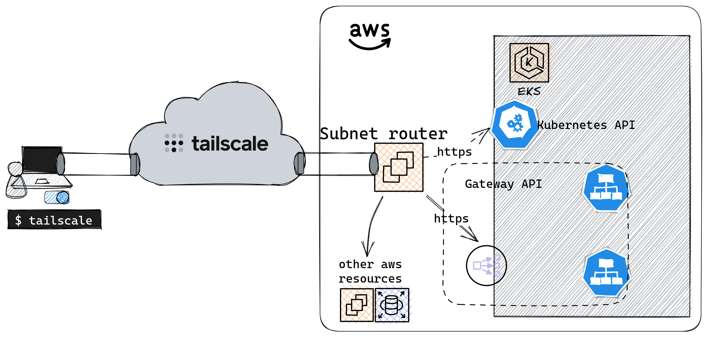
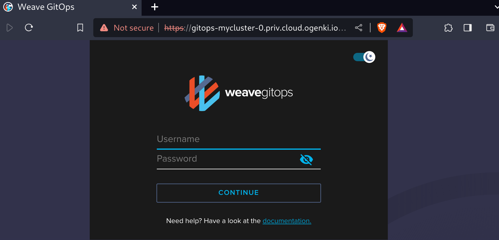

+++
author = "Smaine Kahlouch"
title = "Sécuriser le Cloud avec `Tailscale` : Mise en œuvre d'un VPN simplifiée"
date = "2023-10-16"
summary = "Tailscale est une solution de **VPN** qui permet connecter des appareils ou serveurs de manière sécurisée. Comment en bénéficier pour accéder à une infrastruture Cloud?"
featured = true
codeMaxLines = 21
usePageBundles = true
toc = true
tags = [
    "security",
    "network"
]
thumbnail= "thumbnail.png"
+++

Lorsqu'on parle de sécurisation de l'accès aux ressources Cloud, l'une des règles d'or est d'éviter les expositions directes à Internet. La question qui se pose alors pour les Devs/Ops est : comment, par exemple, accéder à une base de données, un cluster Kubernetes ou un serveur via SSH sans compromettre la sécurité? </br>

Les **réseaux privés virtuels (VPN)** offrent une réponse en établissant un lien sécurisé entre différents éléments d'un réseau, indépendamment de leur localisation géographique. De nombreuses solutions existent, allant de modèles en SaaS aux solutions que l'on peut héberger soi-même, utilisant divers protocoles et étant soit open source, soit propriétaires.

Parmi ces options, je souhaitais vous parler de [**Tailscale**](https://tailscale.com/). Cette solution utilise le protocole `WireGuard`, réputé pour sa simplicité et sa performance.  Avec Tailscale, il est possible de connecter des appareils ou serveurs de manière sécurisée, comme s'ils étaient sur un même réseau local, bien qu'ils soient répartis à travers le monde.

## :bullseye: Nos objectifs

* Comprendre comment fonctionne `Tailscale`
* Mise en oeuvre d'une connexion sécurisée avec AWS en quelques minutes
* Interragir avec l'API d'un cluster EKS via un réseau privé
* Accéder à des services hébergés sur Kubernetes en utilisant le réseau privé

<center></center>

Pour le reste de cet article il faudra évidemment **créer un compte Tailscale**. A noter que l'authentification est déléguée à des fournisseurs d'identité tiers (ex: Okta, Onelogin, Google ...).

Lorsque le compte est crée, on a directement accès à la console de gestion ci-dessus. Elle permet notamment de lister les appareils connectés, de consulter les logs, de modifier la plupart des paramètres...

## 💡 Sous le capot

{}
**Mesh VPN**: Un _mesh VPN_ est un type de réseau VPN où chaque nœud (c'est-à-dire chaque appareil ou machine) est connecté à tous les autres nœuds du réseau, formant ainsi un maillage. À distinguer des configurations VPN traditionnelles qui sont conçues généralement "en étoile", où plusieurs clients se connectent à un serveur central.

**Zero trust**: Signifie que chaque demande d'accès à un réseau est traitée comme si elle venait d'une source non fiable. Une application ou utilisateur doit prouver son identité et être autorisée avant d'accéder à une ressource. On ne fait pas confiance simplement parce qu'une machine ou un utilisateur provient d'un réseau interne ou d'une certaine zone géographique.

**Tailnet**: Dès la première utilisation de Tailscale, un _Tailnet_ est crée pour vous et correspond à votre propre réseau privé. Chaque appareil dans un tailnet reçoit une IP Tailscale unique, permettant une communication directe entre eux. Chacun de ces réseaux possède son propre nom ainsi qu'un label associé à une organisation.
{}

<center></center>

L'architecture de Tailscale est conçue de telle sorte que le _Control plane_ et le _Data plane_ sont clairement séparés:

* D'une part, il y a le **serveur de coordination**. Son rôle est d'échanger des métadonnées et des clés publiques entre tous les participants d'un Tailnet (La clé privée étant gardée en toute sécurité son nœud d'origine).

* D'autre part, les nœuds du Tailnet s'organisent en un **réseau maillé** (_Mesh_). Au lieu de passer par le serveur de coordination pour échanger des données, ces nœuds communiquent directement les uns avec les autres en mode **point à point**. Chaque nœud dispose d'une identité unique pour s'authentifier et rejoindre le Tailnet.

## :inbox_tray: Installation du client

La majorité des plateformes sont supportées et les procédures d'installation sont listées [ici](https://tailscale.com/kb/installation/).
En ce qui me concerne je suis sur Archlinux:

```console
sudo pacman -S tailscale
```

Il est possible de démarrer le service automatiquement au démarrage de la machine.
```console
sudo systemctl enable --now tailscaled
```

Pour enregistrer son ordinateur perso, lancer la commande suivante:
```console
sudo tailscale up --accept-routes

To authenticate, visit:

        https://login.tailscale.com/a/f50...
```

<center></center>


ℹ️ l'option `--accept-routes` est nécessaire sur Linux et permettra d'accepter les routes annoncées par les Subnet routers. On verra cela dans la suite de l'article

Vérifier que vous avez bien obtenu une IP du réseau Tailscale:
```console
tailscale ip -4
100.118.83.67

tailscale status
100.118.83.67   ogenki               smainklh@    linux   -
```

ℹ️ Pour les utilisateurs de Linux, vérifier que Tailscale fonctionne bien avec votre configuration DNS: Suivre [cette documentation](https://tailscale.com/kb/1188/linux-dns/).

{}
Toutes les étapes réalisées dans cet article proviennent de ce [**dépôt git**](https://github.com/Smana/demo-secured-eks)

Il va permettre de créer l'ensemble des composants qui ont pour objectif d'obtenir un cluster EKS de Lab et font suite à un précédent article sur [Cilium et Gateway API](https://blog.ogenki.io/fr/post/cilium-gateway-api/).

{}

## ☁️ Accéder à AWS en privé



Afin de pouvoir accéder de manière sécurisée à l'ensemble des ressources disponibles sur AWS, il est possible de déployer un _**Subnet router**_.

Un _Subnet router_ est une instance Tailscale qui permet d'accéder à des sous-réseaux qui ne sont pas directement liés à Tailscale. Il fait office de **pont** entre le réseau privé virtuel de Tailscale (_Tailnet_) et d'autres réseaux locaux.

Nous pouvons alors **router des sous réseaux du Clouder à travers le VPN de Tailscale**.

⚠️ Pour ce faire, sur AWS, il faudra bien entendu configurer les _security groups_ correctement pour autoriser les Subnet routers.


### 🚀 Déployer un Subnet router

Entrons dans le vif du sujet et deployons un _Subnet router_ sur un réseau AWS!</br>
Tout est fait en utilisant le code **Terraform** présent dans le répertoire [terraform/network](https://github.com/Smana/demo-secured-eks/tree/main/terraform/network). Nous allons analyser la configuration spécifique à Tailscale qui est présente dans le fichier [tailscale.tf](https://github.com/Smana/demo-secured-eks/blob/main/terraform/network/tailscale.tf) avant de procéder au déploiement.

#### Le provider Terraform

Il est possible de configurer certains paramètres au travers de l'**API** Tailscale grâce au [provider Terraform](https://github.com/tailscale/terraform-provider-tailscale).
Pour cela il faut au préalable génerer une clé d'API 🔑 sur la console d'admin:

<center></center>

Il faudra conserver cette clé dans un endroit sécurisé car elle est utilisée pour déployer le Subnet router

```hcl
provider "tailscale" {
  api_key = var.tailscale.api_key
  tailnet = var.tailscale.tailnet
}
```

<ins>**les ACL's**</ins>

Les ACL's permettent de définir qui est autorisé à communiquer avec qui (utilisateur ou appareil). À la création d'un compte, celle-cis sont très permissives et il n'y a aucune restriction (tout le monde peut parler avec tout le monde).

```hcl
resource "tailscale_acl" "this" {
  acl = jsonencode({
    acls = [
      {
        action = "accept"
        src    = ["*"]
        dst    = ["*:*"]
      }
    ]
...
}
```
{}
Pour mon environnement de Lab, j'ai conservé cette configuration par défault car je suis la seule personne à y accéder. De plus les seuls appareils connectés à mon Tailnet sont mon laptop et le Subnet router. En revanche dans un cadre d'entreprise, il faudra bien y réfléchir. Il est alors possible de définir une politique basée sur des groupes d'utilisitateurs ou sur les tags des noeuds.

Consulter cette [doc](https://tailscale.com/kb/1018/acls/) pour plus d'info.
{}

<ins>**Les noms de domaines (DNS)**</ins>

Il y a [différentes façons](https://tailscale.com/kb/1054/dns/) possibles de gérer les noms de domaines avec Tailscale:

**Magic DNS**: Lorsqu'un appareil rejoint le Tailnet, il s'enregistre avec un nom et celui-ci peut-être utilisé directement pour communiquer avec l'appareil.
```console
tailscale status
100.118.83.67   ogenki               smainklh@    linux   -
100.115.31.152  ip-10-0-43-98        smainklh@    linux   active; relay "par", tx 3044 rx 2588

ping ip-10-0-43-98
PING ip-10-0-43-98.tail9c382.ts.net (100.115.31.152) 56(84) bytes of data.
64 bytes from ip-10-0-43-98.tail9c382.ts.net (100.115.31.152): icmp_seq=1 ttl=64 time=11.4 ms
```

**AWS**: Pour utiliser les noms de domaines internes à AWS il est possible d'utiliser la [deuxième IP du VPC](https://docs.aws.amazon.com/vpc/latest/userguide/vpc-dns.html#AmazonDNS) qui correspond toujours au serveur DNS. Cela permet d'utiliser les éventuelles zones privées sur route53 ou de se connecter aux ressources en utilisant les noms de domaines.

La configuration la plus simple est donc de déclarer la liste des serveurs DNS à utiliser et d'y ajouter celui de AWS. Ici un exemple avec le DNS publique de Cloudflare.

```hcl
resource "tailscale_dns_nameservers" "this" {
  nameservers = [
    "1.1.1.1",
    cidrhost(module.vpc.vpc_cidr_block, 2)
  ]
}
```

<ins>**La clé d'authentification ("auth key")**</ins>

Pour qu'un appareil puisse rejoindre le Tailnet au démarrage il faut que Tailscale soit démarré en utilisant une clé d'authentification. Celle-ci est générée comme suit

```hcl
resource "tailscale_tailnet_key" "this" {
  reusable      = true
  ephemeral     = false
  preauthorized = true
}
```

* `reusable`: S'agissant d'un `autoscaling group`, il faut que cette même clé puisse être utilisée plusieurs fois.
* `ephemeral`: Pour cette démo nous créons une clé qui n'expire pas. En production il serait préférable d'activer l'expiration.
* `preauthorized`: Il faut que cette clé soit déjà valide et autorisée pour que l'instance rejoigne automatiquement le Tailscale.

La clé ainsi générée est utilisée pour lancer tailscale avec le paramètre `--auth-key`
```console
sudo tailscale up --authkey=<REDACTED>
```


<ins>**Annoncer les routes pour les réseaux AWS**</ins>

Enfin il faut annoncer le réseau que l'on souhaite faire passer par le _Subnet router_. Dans notre exemple, nous décidons de router tout le réseau du VPC qui a pour CIDR `10.0.0.0/16`.

Afin que cela soit possible de façon automatique, il y a une règle [autoApprovers](https://tailscale.com/kb/1018/acls/#auto-approvers-for-routes-and-exit-nodes) à ajouter. Cela permet d'indiquer que les routes annoncées par l'utilisateur `smainklh@gmail.com` sont autorisées sans que cela requiert une étape d'approbation.

```hcl
    autoApprovers = {
      routes = {
        "10.0.0.0/16" = ["smainklh@gmail.com"]
      }
    }
```

La commande lancée au démarrage de l'instance _Subnet router_ est la suivante:
```console
sudo tailscale up --authkey=<REDACTED> --advertise-routes="10.0.0.0/16"
```

#### Le module Terraform

J'ai créé un [module](https://github.com/Smana/terraform-aws-tailscale-subnet-router) très simple qui permet de déployer un `autoscaling group` sur AWS et de configurer Tailscale. Au démarrage de l'instance, elle s'authentifiera en utilisant une `auth_key` et annoncera les réseaux indiqués. Dans l'exemple ci-dessous l'instance annonce le CIDR du VPC sur AWS.

```hcl
module "tailscale_subnet_router" {
  source  = "Smana/tailscale-subnet-router/aws"
  version = "1.0.4"

  region = var.region
  env    = var.env

  name     = var.tailscale.subnet_router_name
  auth_key = tailscale_tailnet_key.this.key

  vpc_id                = module.vpc.vpc_id
  subnet_ids            = module.vpc.private_subnets
  advertise_routes      = [module.vpc.vpc_cidr_block]
...
}
```

Maintenant que nous avons analysé les différents paramètres, il est temps de **démarrer notre Subnet router** 🚀 !! </br>

Il faut au préalable créer un fichier `variable.tfvars` dans le répertoire [terraform/network](https://github.com/Smana/demo-secured-eks/tree/main/terraform/network).

```hcl
env                 = "dev"
region              = "eu-west-3"
private_domain_name = "priv.cloud.ogenki.io"

tailscale = {
  subnet_router_name = "ogenki"
  tailnet            = "smainklh@gmail.com"
  api_key            = "tskey-api-..."
}

tags = {
  project = "demo-secured-eks"
  owner   = "Smana"
}
```


Puis lancer la commande suivante:
```console
tofu plan --var-file variables.tfvars
```

Après vérification du plan, appliquer les changements

```console
tofu apply --var-file variables.tfvars
```

Quand l'instance est démarrée, elle apparaitra dans la liste des appareils du Tailnet.
```console
tailscale status
100.118.83.67   ogenki               smainklh@    linux   -
100.68.109.138  ip-10-0-26-99        smainklh@    linux   active; relay "par", tx 33868 rx 32292
```

Nous pouvons aussi vérifier que la route est bien annoncée comme suit:
```console
tailscale status --json|jq '.Peer[] | select(.HostName == "ip-10-0-26-99") .PrimaryRoutes'
[
  "10.0.0.0/16"
]
```

⚠️ Pour des raisons de sécurité, pensez à supprimer le fichier `variables.tfvars` car il contient la clé d'API.

👏 Et voilà ! Nous sommes maintenant en mesure d'**accéder au réseau sur AWS**, à condition d'avoir également configuré les règles de filtrage, comme les ACL et les security groups. Nous pouvons par exemple accéder à une base de données depuis le poste de travail

```console
psql -h demo-tailscale.cymnaynfchjt.eu-west-3.rds.amazonaws.com -U postgres
Password for user postgres:
psql (15.4, server 15.3)
SSL connection (protocol: TLSv1.2, cipher: ECDHE-RSA-AES256-GCM-SHA384, compression: off)
Type "help" for help.

postgres=>
```

### 💻 Une autre façon de faire du SSH

Traditionnellement, nous devons parfois nous connecter à des serveurs en utilisant le protocole SSH. Pour ce faire, il faut générer une clé privée et distribuer la clé publique correspondante sur les serveurs distants.

Contrairement à l'utilisation des clés SSH classiques, étant donné que Tailscale utilise `Wireguard` pour l'authentification et le chiffrement des connexions il n'est **pas nécessaire de ré-authentifier le client**. De plus, Tailscale gère également la distribution des clés SSH d'hôtes. Les règles ACL permettent de révoquer l'accès des utilisateurs sans avoir à supprimer les clés SSH. De plus, il est possible d'activer un mode de vérification qui renforce la sécurité en exigeant une ré-authentification périodique. On peut donc affirmer que l'utilisation de `Tailscale SSH` **simplifie** l'authentification, la gestion des connexions SSH et **améliore le niveau de sécurité**.

Les autorisations pour utiliser SSH sont aussi gérées au niveau des ACL's
```hcl
...
    ssh = [
      {
        action = "check"
        src    = ["autogroup:member"]
        dst    = ["autogroup:self"]
        users  = ["autogroup:nonroot"]
      }
    ]
...
```

La règle ci-dessus autorise tous les utilisateurs à accéder à leurs propres appareils en utilisant SSH. Lorsqu'ils essaient de se connecter, ils doivent utiliser un compte utilisateur autre que `root`.
Pour chaque tentative de connexion, une authentification supplémentaire est nécessaire (`action=check`). Cette authentification se fait en visitant un lien web spécifique

```console
ssh ubuntu@ip-10-0-26-99
...
# Tailscale SSH requires an additional check.
# To authenticate, visit: https://login.tailscale.com/a/f1f09a548cc6
...
ubuntu@ip-10-0-26-99:~$
```

Pour que cela soit possible il faut aussi démarrer Tailscale avec l'option `--ssh`

Les logs d'accès à la machine peuvent être consultés en utilisant `journalctl`
```console
ubuntu@ip-10-0-26-99:~$ journalctl -aeu tailscaled|grep ssh
Oct 15 15:51:34 ip-10-0-26-99 tailscaled[1768]: ssh-conn-20231015T155130-00ede660b8: handling conn: 100.118.83.67:55098->ubuntu@100.68.109.138:22
Oct 15 15:51:56 ip-10-0-26-99 tailscaled[1768]: ssh-conn-20231015T155156-b6d1dc28c0: handling conn: 100.118.83.67:44560->ubuntu@100.68.109.138:22
Oct 15 15:52:52 ip-10-0-26-99 tailscaled[1768]: ssh-conn-20231015T155156-b6d1dc28c0: starting session: sess-20231015T155252-5b2acc170e
Oct 15 15:52:52 ip-10-0-26-99 tailscaled[1768]: ssh-session(sess-20231015T155252-5b2acc170e): handling new SSH connection from smainklh@gmail.com (100.118.83.67) to ssh-user "ubuntu"
Oct 15 15:52:52 ip-10-0-26-99 tailscaled[1768]: ssh-session(sess-20231015T155252-5b2acc170e): access granted to smainklh@gmail.com as ssh-user "ubuntu"
Oct 15 15:52:52 ip-10-0-26-99 tailscaled[1768]: ssh-session(sess-20231015T155252-5b2acc170e): starting pty command: [/usr/sbin/tailscaled be-child ssh --uid=1000 --gid=1000 --groups=1000,4,20,24,25,27,29,30,44,46,115,116 --local-user=ubuntu --remote-user=smainklh@gmail.com --remote-ip=100.118.83.67 --has-tty=true --tty-name=pts/0 --shell --login-cmd=/usr/bin/login --cmd=/bin/bash -- -l]
```

ℹ️ Avec Tailscale SSH il est possible de se connecter en SSH peu importe où est situé l'appareil. En revanche dans un contexte 100% AWS, on préferera probablement utiliser [AWS SSM](https://docs.aws.amazon.com/systems-manager/latest/userguide/session-manager.html).

{}
💾 En sécurité il est primordial de pouvoir conserver les logs pour un usage ultérieur. Il existe différents types de logs:

**Logs d'audit**: Ils sont essentiels pour savoir qui a fait quoi. Ils sont accessibles sur la console d'admin et peuvent aussi être envoyés vers un [SIEM](https://tailscale.com/learn/security-information-and-event-management/).

**Logs sur les appareils**: Ceux-cis peuvent être consultés en utilisant les commandes appropriées à l'appareil. (`journalctl -u tailscaled` sur Linux)

**Logs réseau**: Utiles pour visualiser quels appareils sont connectés les uns aux autres.

{}

### ☸ Qu'en est-il de Kubernetes?

Sur Kubernetes il existe [plusieurs options](https://tailscale.com/kb/1185/kubernetes/) pour accéder à un `Service`:

* **Proxy**: Il s'agit d'un pod supplémentaire qui transfert les appels à un Service existant.
* **Sidecar**: Permet de connecter le pod au Tailnet. Donc la connectivité se fait de bout en bout et il est même possible de communiquer dans les 2 sens. (du pod vers les noeuds du Tailnet).
* **Operator**: Permet d'exposer les services et l'API Kubernetes (`ingress`) ainsi que de permettre aux pods d'accéder aux noeuds du Tailnet (`egress`). La configuration se fait en configurant les ressources existantes: Services et Ingresses

Dans notre cas, nous disposons déjà d'un _Subnet router_ qui route tout le réseau du VPC. Il suffit donc que notre service soit exposé sur une IP privée.

#### L'API Kubernetes

Pour accéder à l'API Kubernetes il est nécessaire d'**autoriser le Subnet router**. Cela se fait en définissant la règle suivante pour le _security group_ source.

```hcl
module "eks" {
...
  cluster_security_group_additional_rules = {
    ingress_source_security_group_id = {
      description              = "Ingress from the Tailscale security group to the API server"
      protocol                 = "tcp"
      from_port                = 443
      to_port                  = 443
      type                     = "ingress"
      source_security_group_id = data.aws_security_group.tailscale.id
    }
  }
...
}
```

Nous allons vérifier que l'API est bien accessible sur une IP privée.

```console
CLUSTER_URL=$(TERM=dumb kubectl cluster-info | grep "Kubernetes control plane" | awk '{print $NF}')

curl -s -o /dev/null -w '%{remote_ip}\n' ${CLUSTER_URL}
10.228.244.167

kubectl get ns
NAME                STATUS   AGE
cilium-secrets      Active   5m46s
crossplane-system   Active   4m1s
default             Active   23m
flux-system         Active   5m29s
infrastructure      Active   4m1s
...
```

#### Accéder aux services en privé

Un `Service` Kubernetes exposé est une resource AWS comme une autre 😉. Il faut juste s'assurer que ce service utilise bien une **IP privée**.
Dans mon exemple j'utilise `Gateway API` pour configurer la répartition de charge du Clouder et je vous invite à lire mon [**précédent article**](https://blog.ogenki.io/fr/post/cilium-gateway-api/) sur le sujet.

Il suffirait donc  de créer un NLB interne en s'assurant que le `Service` ait bien l'annotation `service.beta.kubernetes.io/aws-load-balancer-scheme` ayant pour valeur `internal`. Dans le cas de Gateway API, cela se fait via la [clusterPolicy](https://github.com/Smana/demo-secured-eks/blob/main/security/mycluster-0/platform-gw-clusterpolicy.yaml) [Kyverno](https://kyverno.io/).

```yaml
          metadata:
            annotations:
              external-dns.alpha.kubernetes.io/hostname: gitops-${cluster_name}.priv.${domain_name},grafana-${cluster_name}.priv.${domain_name}
              service.beta.kubernetes.io/aws-load-balancer-scheme: "internal"
              service.beta.kubernetes.io/aws-load-balancer-backend-protocol: tcp
          spec:
            loadBalancerClass: service.k8s.aws/nlb
```

Il y a cependant un prérequis supplémentaire car nous ne pouvons pas utiliser Let's Encrypt pour les certificats internes. J'ai donc généré une **PKI interne** qui génère des certificates auto-signés avec [Cert-manager](https://cert-manager.io/).

Ici je ne détaillerai pas le déploiement du cluster EKS, ni la configuration de [Flux](https://fluxcd.io/). Lorsque le cluster est créé et que toutes les ressources Kubernetes ont été réconcilié, nous avons un service qui est exposé via un LoadBalancer interne AWS.

```console
NLB_DOMAIN=$(kubectl get svc -n infrastructure cilium-gateway-platform -o jsonpath={.status.loadBalancer.ingress[0].hostname})
dig +short ${NLB_DOMAIN}
10.0.33.5
10.0.26.228
10.0.9.183
```

Une entrée DNS est également créée automatiquement pour les services exposés et nous pouvons donc accéder en privé grâce à Tailscale.
```console
dig +short gitops-mycluster-0.priv.cloud.ogenki.io
10.0.9.183
10.0.26.228
10.0.33.5
```

<center></center>


## 💭 Dernières remarques

Il y a quelques temps, dans le cadre professionnel, j'ai mis en place [Cloudflare Zero Trust](https://developers.cloudflare.com/cloudflare-one/). Je découvre ici que Tailscale présente de nombreuses similitudes avec cette solution. La décision entre les deux est loin d'être triviale et dépend grandement du contexte. Pour ma part, j'ai été particulièrement **convaincu par la simplicité de mise en œuvre** de Tailscale, répondant parfaitement à mon besoin d'accéder au réseau du Clouder. Bien entendu il existe d'autres solutions comme [Teleport](https://goteleport.com/), qui offre une approche différente pour accéder à des ressources internes.

Cela dit, focalisons-nous sur `Tailscale`.

Une partie du code de Tailscale est **open source**, notamment le client qui est sous license [BSD 3-Clause](https://opensource.org/license/bsd-3-clause/). La partie propriétaire concerne éssentiellement la plateforme de coordination.   À noter qu'il existe une alternative open source nommée [Headscale](https://github.com/juanfont/headscale). Celle-ci est une initiative distincte qui n'a aucun lien avec la société `Tailscale`.

Pour un usage **personnel**, Tailscale est vraiment généreux, offrant un accès gratuit pour jusqu'à **100 appareils et 3 utilisateurs**. Ceci-dit Tailscale est une option sérieuse à considérer en entreprise et il est important, selon moi, d'encourager ce type d'entreprises qui ont une politique open source claire et un produit de qualité.
